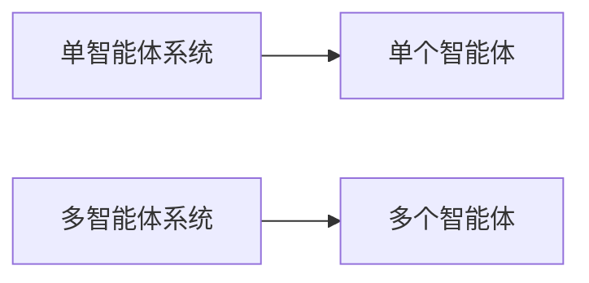

                 


# 利用地缘政治风险分析的多智能体系统

> 关键词：多智能体系统, 地缘政治风险分析, 国际关系模拟, 冲突预测, 资源分配优化

> 摘要：  
地缘政治风险分析是国际关系研究中的重要组成部分，传统的分析方法往往依赖于专家经验和历史数据，存在主观性强、难以量化的问题。而多智能体系统（Multi-Agent System, MAS）作为一种新兴的分布式计算范式，能够模拟复杂系统的动态行为，为地缘政治风险分析提供了新的思路。本文将从多智能体系统的定义、地缘政治风险分析的核心概念出发，详细探讨多智能体系统在地缘政治风险分析中的实现方法，包括系统架构设计、算法实现、案例分析等，最终总结多智能体系统在地缘政治风险分析中的优势与未来发展方向。

---

# 第一部分：多智能体系统与地缘政治风险分析基础

## 第1章：多智能体系统概述

### 1.1 多智能体系统的基本概念

#### 1.1.1 多智能体系统的定义
多智能体系统（Multi-Agent System, MAS）是由多个智能体（Agent）组成的分布式系统，这些智能体能够通过协作完成复杂的任务。智能体是指能够感知环境、自主决策并采取行动的实体。

$$
\text{MAS} = \{A_1, A_2, \dots, A_n\}
$$

其中，$A_i$ 表示第 $i$ 个智能体，具备以下特征：
- **自主性**：智能体能够自主决策。
- **反应性**：智能体能够感知环境并实时响应。
- **协作性**：智能体之间可以通过通信进行协作。
- **社会性**：智能体之间存在复杂的交互关系。

#### 1.1.2 多智能体系统的特征
多智能体系统的特征可以用下表进行对比：

| 特征         | 单智能体系统       | 多智能体系统       |
|--------------|--------------------|--------------------|
| **自主性**    | 高                 | 高                 |
| **协作性**    | 低                 | 高                 |
| **复杂性**    | 低                 | 高                 |
| **动态性**    | 低                 | 高                 |

#### 1.1.3 多智能体系统与单智能体系统的区别
通过以下对比图，可以更直观地理解两者的主要区别：



---

### 1.2 地缘政治风险分析的背景与重要性

#### 1.2.1 地缘政治风险的定义
地缘政治风险是指由于政治、经济、军事等因素的变化，可能导致某一地区或国家发生不稳定或冲突的可能性。地缘政治风险分析的核心目标是预测和评估这些风险，从而为决策者提供支持。

#### 1.2.2 地缘政治风险分析的必要性
地缘政治风险分析的必要性主要体现在以下几个方面：
1. **提前预警**：通过分析潜在风险，提前采取应对措施。
2. **降低不确定性**：地缘政治风险往往具有高度不确定性，通过系统化分析可以减少这种不确定性。
3. **支持决策**：为政策制定者和企业提供科学依据。

#### 1.2.3 多智能体系统在地缘政治风险分析中的作用
多智能体系统在地缘政治风险分析中的作用可以总结为以下几点：
1. **模拟复杂关系**：多智能体系统能够模拟国家、组织、个人等多方利益相关者的互动。
2. **动态预测**：通过模拟各方行为，预测潜在冲突或合作的可能性。
3. **提供决策支持**：为政策制定者提供实时反馈和优化建议。

---

### 1.3 多智能体系统与地缘政治风险分析的结合

#### 1.3.1 多智能体系统在地缘政治中的应用领域
多智能体系统在地缘政治中的应用领域包括：
1. **国际关系模拟**：模拟国家间的外交互动。
2. **冲突预测**：预测潜在的冲突爆发点。
3. **资源分配优化**：优化跨国资源分配。

#### 1.3.2 多智能体系统的优缺点
多智能体系统的优缺点如下表所示：

| 优缺点       | 优点                           | 缺点                           |
|--------------|--------------------------------|--------------------------------|
| **自主性**    | 智能体能够自主决策               | 需要复杂的通信机制             |
| **协作性**    | 智能体之间可以高效协作           | 协作过程中可能出现冲突           |
| **动态性**    | 能够适应环境变化                 | 系统复杂性高，难以调试           |

#### 1.3.3 地缘政治风险分析中多智能体系统的实现思路
实现多智能体系统用于地缘政治风险分析的主要思路如下：
1. **建模**：构建智能体的模型，包括行为模型和协作模型。
2. **模拟**：通过模拟各方智能体的互动，预测潜在风险。
3. **优化**：根据模拟结果优化智能体的行为策略。

---

## 第2章：多智能体系统的数学模型与算法基础

### 2.1 多智能体系统的数学模型

#### 2.1.1 多智能体系统的基本模型
多智能体系统的基本模型可以用以下公式表示：

$$
\text{State} = \{s_1, s_2, \dots, s_n\}
$$

其中，$s_i$ 表示第 $i$ 个智能体的状态。

#### 2.1.2 多智能体系统的行为模型
行为模型描述了智能体如何根据环境信息采取行动。常见的行为模型包括：
1. **反应式模型**：基于当前感知做出反应。
2. **基于规则的模型**：根据预定义的规则采取行动。

#### 2.1.3 多智能体系统的协作模型
协作模型描述了智能体之间如何协作完成任务。常见的协作模型包括：
1. **分布式协作模型**：智能体之间通过分布式计算协作。
2. **集中式协作模型**：通过中央协调者进行协作。

---

### 2.2 多智能体系统的算法基础

#### 2.2.1 分布式计算算法
分布式计算算法是多智能体系统的核心算法之一。常见的分布式计算算法包括：
1. **MapReduce**：用于大规模数据处理。
2. **P2P网络算法**：用于点对点通信。

#### 2.2.2 协作算法
协作算法是多智能体系统中智能体之间协作的核心算法。常见的协作算法包括：
1. **一致性算法**：如Paxos算法，用于确保系统一致性。
2. **共识算法**：如拜占庭容错（Byzantine Fault Tolerance, BFT）。

#### 2.2.3 学习算法
学习算法是多智能体系统中智能体通过学习优化行为的核心算法。常见的学习算法包括：
1. **强化学习**：通过奖励机制优化智能体行为。
2. **监督学习**：通过标记数据训练智能体。

---

## 第3章：地缘政治风险分析的核心概念

### 3.1 地缘政治风险的构成要素

#### 3.1.1 政治因素
政治因素是地缘政治风险的核心要素之一。主要包括：
- **政府稳定性**：政府是否稳定。
- **政策变化**：政策是否频繁变化。

#### 3.1.2 经济因素
经济因素是地缘政治风险的重要组成部分。主要包括：
- **经济状况**：GDP、失业率等经济指标。
- **资源分配**：资源是否公平分配。

#### 3.1.3 军事因素
军事因素是地缘政治风险的关键要素。主要包括：
- **军事力量**：军队规模、装备水平。
- **军事部署**：军事部署是否紧张。

#### 3.1.4 文化因素
文化因素是地缘政治风险的软实力要素。主要包括：
- **文化认同**：不同文化群体的认同感。
- **宗教冲突**：宗教信仰的差异可能导致冲突。

---

### 3.2 多智能体系统在地缘政治风险分析中的角色

#### 3.2.1 智能体的定义与分类
智能体的定义与分类如下：
- **国家智能体**：代表国家的行为。
- **组织智能体**：代表组织的行为。
- **个人智能体**：代表个人的行为。

---

## 第4章：多智能体系统的地缘政治风险分析模型

### 4.1 地缘政治风险分析模型的构建

#### 4.1.1 模型的设计思路
地缘政治风险分析模型的设计思路如下：
1. **需求分析**：明确模型的目标和范围。
2. **模型设计**：设计智能体的行为模型和协作模型。
3. **模型实现**：通过编程实现模型。
4. **模型验证**：验证模型的准确性和有效性。

#### 4.1.2 模型的输入与输出
模型的输入与输出如下：
- **输入**：历史数据、实时数据。
- **输出**：风险评估结果、优化建议。

#### 4.1.3 模型的验证与评估
模型的验证与评估方法包括：
1. **回测验证**：通过历史数据验证模型的准确性。
2. **实时验证**：通过实时数据验证模型的有效性。

---

### 4.2 多智能体系统在地缘政治风险分析中的具体应用

#### 4.2.1 国际关系模拟
国际关系模拟是多智能体系统在地缘政治风险分析中的重要应用。通过模拟国家间的互动，可以预测国际关系的变化。

#### 4.2.2 冲突预测
冲突预测是多智能体系统在地缘政治风险分析中的核心应用。通过分析各方智能体的互动，可以预测潜在的冲突爆发点。

#### 4.2.3 资源分配优化
资源分配优化是多智能体系统在地缘政治风险分析中的另一个重要应用。通过优化资源分配策略，可以降低资源分配的冲突风险。

---

## 第5章：多智能体系统的算法实现与优化

### 5.1 多智能体系统的算法实现

#### 5.1.1 分布式计算的实现
分布式计算的实现可以通过以下步骤：
1. **任务划分**：将任务划分为多个子任务。
2. **任务分配**：将子任务分配给不同的智能体。
3. **任务执行**：智能体并行执行任务。
4. **结果汇总**：汇总各智能体的执行结果。

#### 5.1.2 协作算法的实现
协作算法的实现可以通过以下步骤：
1. **通信协议设计**：设计智能体之间的通信协议。
2. **协作逻辑实现**：实现智能体之间的协作逻辑。
3. **协作结果优化**：优化协作结果。

#### 5.1.3 学习算法的实现
学习算法的实现可以通过以下步骤：
1. **数据采集**：采集历史数据。
2. **数据预处理**：对数据进行预处理。
3. **模型训练**：训练智能体的行为模型。
4. **模型优化**：优化模型的性能。

---

### 5.2 算法优化与性能提升

#### 5.2.1 并行计算优化
并行计算优化可以通过以下方式实现：
1. **任务并行化**：将任务分解为多个并行任务。
2. **负载均衡**：确保各智能体的负载均衡。

#### 5.2.2 智能体行为优化
智能体行为优化可以通过以下方式实现：
1. **行为规则优化**：优化智能体的行为规则。
2. **学习算法优化**：优化智能体的学习算法。

#### 5.2.3 算法的可扩展性优化
算法的可扩展性优化可以通过以下方式实现：
1. **模块化设计**：采用模块化设计，便于扩展。
2. **分层架构**：采用分层架构，便于维护。

---

## 第6章：系统架构与设计

### 6.1 系统架构设计

#### 6.1.1 系统功能模块划分
系统功能模块划分如下：
1. **数据采集模块**：负责采集地缘政治相关数据。
2. **数据处理模块**：负责对数据进行预处理。
3. **模型构建模块**：负责构建地缘政治风险分析模型。
4. **模拟与优化模块**：负责模拟各方智能体的互动并优化策略。
5. **结果展示模块**：负责展示分析结果。

#### 6.1.2 系统架构图
以下是一个典型的系统架构图：


---

## 第7章：项目实战

### 7.1 环境安装与配置

#### 7.1.1 安装Python
```bash
# 安装Python
sudo apt-get install python3
```

#### 7.1.2 安装依赖库
```bash
# 安装依赖库
pip install numpy matplotlib networkx
```

---

### 7.2 系统核心实现

#### 7.2.1 智能体类实现
```python
class Agent:
    def __init__(self, id):
        self.id = id
        self.state = None
        self.behavior = None

    def perceive(self, environment):
        self.state = self.compute_state(environment)

    def compute_state(self, environment):
        # 具体实现根据环境信息计算状态
        pass

    def act(self):
        # 根据当前状态采取行动
        pass
```

#### 7.2.2 模型构建与模拟
```python
import networkx as nx

class MultiAgentSystem:
    def __init__(self, num_agents):
        self.agents = [Agent(i) for i in range(num_agents)]
        self.graph = nx.empty_graph(num_agents)

    def simulate(self, steps):
        for step in range(steps):
            for agent in self.agents:
                agent.perceive(self.graph)
            for agent in self.agents:
                agent.act()
```

---

## 第8章：总结与展望

### 8.1 总结
通过本文的介绍，我们可以看到，多智能体系统在地缘政治风险分析中具有重要的应用价值。通过模拟各方智能体的互动，可以预测潜在风险并提供优化建议。

### 8.2 展望
未来，随着人工智能技术的不断发展，多智能体系统在地缘政治风险分析中的应用将更加广泛。以下是一些可能的发展方向：
1. **强化学习的深度应用**：通过强化学习优化智能体的行为策略。
2. **多模态数据融合**：结合文本、图像等多种数据源进行分析。
3. **实时分析能力提升**：进一步提升系统的实时分析能力。

---

作者：AI天才研究院/AI Genius Institute & 禅与计算机程序设计艺术 /Zen And The Art of Computer Programming

