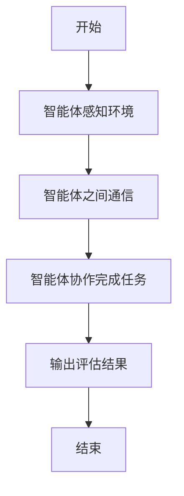
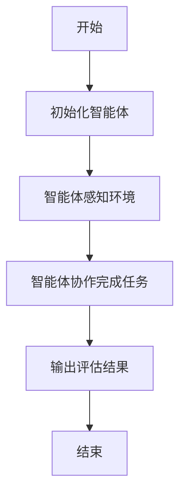
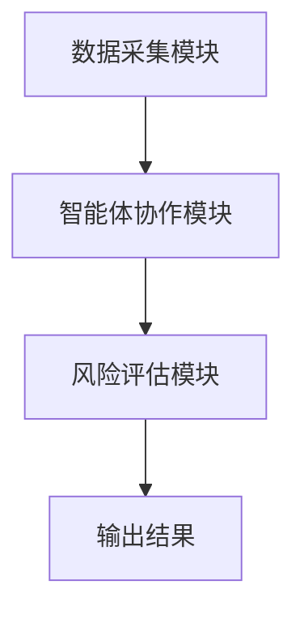
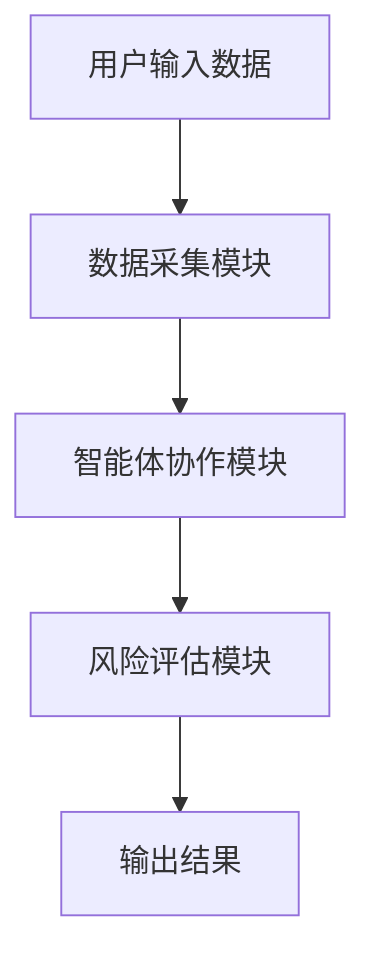

                 


---

# 利用多智能体系统进行全面的地缘政治风险评估

> 关键词：多智能体系统，地缘政治风险，风险管理，全球风险评估，国际关系分析，地缘政治经济学

> 摘要：  
地缘政治风险评估是全球政治、经济和安全领域的重要组成部分。本文通过多智能体系统的视角，探讨如何利用多智能体系统进行全面的地缘政治风险评估。文章首先介绍了多智能体系统的定义、特点及其在地缘政治风险评估中的应用优势。随后，详细分析了多智能体系统的算法原理、数学模型和系统架构设计，并通过实际案例展示了多智能体系统在地缘政治风险评估中的实现过程和应用效果。最后，总结了多智能体系统在地缘政治风险评估中的优势与挑战，并提出了未来研究的方向。

---

# 第一部分: 多智能体系统与地缘政治风险评估概述

## 第1章: 多智能体系统与地缘政治风险评估概述

### 1.1 多智能体系统的定义与特点

#### 1.1.1 多智能体系统的定义
多智能体系统（Multi-Agent System，MAS）是由多个智能体（Agent）组成的分布式系统，这些智能体能够通过交互和协作完成复杂的任务。多智能体系统的核心在于智能体之间的通信、协作和协调。

#### 1.1.2 多智能体系统的核心特点
- **分布式性**：多个智能体分布在不同的位置，各自独立运行。
- **协作性**：智能体之间通过协作完成共同目标。
- **自主性**：智能体能够自主决策，无需外部干预。
- **反应性**：智能体能够根据环境变化动态调整行为。

#### 1.1.3 多智能体系统与传统单智能体系统的区别
| 对比维度 | 单智能体系统 | 多智能体系统 |
|----------|--------------|--------------|
| 系统结构 | 单点控制     | 分布式结构   |
| 智能体数量 | 单个         | 多个         |
| 决策方式 | 中央决策     | 分布式决策   |
| 协作性   | 无           | 高           |

### 1.2 地缘政治风险评估的定义与重要性

#### 1.2.1 地缘政治风险的定义
地缘政治风险是指在特定地理区域内，由于政治、经济、社会、文化等因素的相互作用而产生的潜在风险。这些风险可能对国家或组织的利益造成威胁。

#### 1.2.2 地缘政治风险评估的重要性
地缘政治风险评估是国家或组织制定战略决策的重要依据。通过评估潜在风险，可以提前制定应对策略，降低损失。

#### 1.2.3 多智能体系统在地缘政治风险评估中的优势
- **分布式计算能力**：多智能体系统能够处理大规模、复杂的地缘政治数据。
- **协作性**：多个智能体可以分别负责不同的风险因素，协同完成评估任务。
- **实时性**：多智能体系统能够实时更新数据，提供动态风险评估。

### 1.3 多智能体系统在地缘政治风险评估中的应用前景

#### 1.3.1 多智能体系统的潜在应用领域
- **国际关系分析**：分析国家之间的互动关系。
- **全球风险预警**：实时监控全球风险事件。
- **政策制定支持**：为政策制定者提供数据支持。

#### 1.3.2 多智能体系统在地缘政治风险评估中的优势
- **高精度**：通过多智能体的协作，提高风险评估的准确性。
- **高效性**：多个智能体同时处理数据，提高计算效率。
- **灵活性**：智能体可以根据环境变化动态调整评估策略。

#### 1.3.3 多智能体系统应用的挑战与机遇
- **挑战**：智能体之间的通信延迟、数据一致性问题。
- **机遇**：通过技术创新解决挑战，提升系统的智能化水平。

### 1.4 本章小结
本章介绍了多智能体系统的定义、特点及其在地缘政治风险评估中的应用优势。通过对比分析，明确了多智能体系统在地缘政治风险评估中的独特价值和潜力。

---

# 第二部分: 多智能体系统的核心概念与原理

## 第2章: 多智能体系统的核心概念与联系

### 2.1 多智能体系统的实体关系图

#### 2.1.1 实体关系图的定义
实体关系图（Entity-Relationship Diagram，ER图）用于描述系统中各个实体之间的关系。

#### 2.1.2 多智能体系统的ER实体关系图
```mermaid
erDiagram
    actor 智能体 {
        <<Agent>>
    }
    actor 环境 {
        <<Environment>>
    }
    actor 目标 {
        <<Target>>
    }
    智能体 --> 环境 : 感知环境
    智能体 --> 目标 : 与目标交互
    环境 --> 目标 : 提供环境信息
```

### 2.2 多智能体系统的核心要素对比

#### 2.2.1 多智能体系统核心要素对比表
| 对比维度 | 智能体 | 环境 | 目标 |
|----------|--------|------|------|
| 定义     | 自主实体 | 系统运行环境 | 系统目标 |
| 功能     | 处理数据、决策 | 提供数据支持 | 定义评估目标 |
| 交互方式 | 与其他智能体通信 | 感知环境 | 与智能体交互 |

### 2.3 多智能体系统的原理与流程

#### 2.3.1 多智能体系统的原理
多智能体系统的原理包括感知环境、智能体之间通信、协作完成任务。

#### 2.3.2 多智能体系统的流程图


#### 2.3.3 多智能体系统的实现步骤
1. **定义目标**：明确评估的目标和范围。
2. **设计智能体**：设计智能体的结构和功能。
3. **实现通信机制**：实现智能体之间的通信接口。
4. **测试与优化**：测试系统性能并进行优化。

### 2.4 本章小结
本章详细分析了多智能体系统的核心概念，包括实体关系图、核心要素对比和系统流程图。通过对比分析，明确了多智能体系统的实现步骤和关键点。

---

## 第3章: 多智能体系统的算法原理与数学模型

### 3.1 多智能体系统的算法原理

#### 3.1.1 多智能体系统的算法概述
多智能体系统的算法包括分布式计算、协作算法和优化算法。

#### 3.1.2 多智能体系统的算法流程图


#### 3.1.3 多智能体系统的实现步骤
1. **初始化智能体**：设置智能体的初始状态。
2. **感知环境**：智能体获取环境数据。
3. **协作完成任务**：智能体之间协作完成评估任务。
4. **输出结果**：输出评估结果。

### 3.2 多智能体系统的数学模型

#### 3.2.1 多智能体系统的数学模型
$$R = \sum_{i=1}^{n} w_i x_i$$
其中，$R$ 是风险值，$w_i$ 是权重，$x_i$ 是风险因素。

#### 3.2.2 数学模型的详细推导
通过权重计算和风险因素的线性组合，可以得到最终的风险值。权重的计算可以通过主成分分析（PCA）实现。

### 3.3 多智能体系统的算法流程图

#### 3.3.1 多智能体系统算法的流程图


#### 3.3.2 流程图的详细解读
- **开始**：启动多智能体系统。
- **初始化智能体**：设置智能体的初始状态。
- **智能体感知环境**：智能体获取环境数据。
- **智能体协作完成任务**：智能体之间协作完成评估任务。
- **输出评估结果**：输出最终的评估结果。
- **结束**：系统停止运行。

### 3.4 本章小结
本章详细讲解了多智能体系统的算法原理和数学模型，包括流程图和数学公式的推导。通过这些分析，明确了多智能体系统在地缘政治风险评估中的实现方法。

---

## 第4章: 多智能体系统的系统架构与设计

### 4.1 系统功能设计

#### 4.1.1 系统功能模块划分
- **数据采集模块**：采集地缘政治数据。
- **智能体协作模块**：实现智能体之间的协作。
- **风险评估模块**：计算风险值并输出结果。

#### 4.1.2 系统功能模块的详细描述
- **数据采集模块**：从多个数据源获取地缘政治数据。
- **智能体协作模块**：通过通信接口实现智能体之间的协作。
- **风险评估模块**：根据算法计算风险值并输出结果。

### 4.2 系统架构设计

#### 4.2.1 系统架构图


#### 4.2.2 系统架构的设计原则
- **模块化设计**：每个模块独立完成特定功能。
- **可扩展性**：系统架构易于扩展。
- **高可用性**：系统能够长时间稳定运行。

### 4.3 系统接口设计

#### 4.3.1 系统接口的定义
- **输入接口**：接收地缘政治数据。
- **输出接口**：输出风险评估结果。

#### 4.3.2 系统接口的设计原则
- **简单性**：接口设计简单易用。
- **一致性**：接口设计保持一致。

### 4.4 系统交互流程图

#### 4.4.1 系统交互流程图


#### 4.4.2 流程图的详细解读
- **用户输入数据**：用户输入地缘政治数据。
- **数据采集模块**：采集数据并传递给智能体协作模块。
- **智能体协作模块**：智能体协作完成任务并传递给风险评估模块。
- **风险评估模块**：计算风险值并输出结果。

### 4.5 本章小结
本章详细设计了多智能体系统的系统架构，包括功能模块划分、架构图和交互流程图。通过这些设计，明确了多智能体系统在地缘政治风险评估中的实现方法。

---

## 第5章: 多智能体系统的项目实战

### 5.1 项目背景与目标

#### 5.1.1 项目背景
本项目旨在利用多智能体系统进行地缘政治风险评估，帮助组织制定更有效的风险管理策略。

#### 5.1.2 项目目标
- 实现多智能体系统的地缘政治风险评估。
- 提供动态的地缘政治风险预警。

### 5.2 项目核心实现

#### 5.2.1 环境安装与配置
- **安装Python**：安装Python 3.8及以上版本。
- **安装依赖库**：安装`numpy`、`pandas`、`matplotlib`等库。

#### 5.2.2 核心代码实现
```python
class Agent:
    def __init__(self, id):
        self.id = id
        self.data = None

    def receive(self, data):
        self.data = data

    def process(self):
        # 处理数据并返回结果
        return self.data * self.id

    def send(self, agent, data):
        agent.receive(data)

# 初始化智能体
agents = [Agent(i) for i in range(1, 5)]

# 智能体协作
for i in range(len(agents)):
    if i > 0:
        agents[i].send(agents[i-1], agents[i].process())
```

#### 5.2.3 代码解读与分析
- **Agent类**：定义智能体类，包含接收数据、处理数据和发送数据的方法。
- **初始化智能体**：创建多个智能体实例。
- **智能体协作**：智能体之间通过`send`方法传递数据。

### 5.3 项目案例分析

#### 5.3.1 案例背景
假设我们有四个国家，需要评估它们的地缘政治风险。

#### 5.3.2 案例分析
通过多智能体系统的协作，计算每个国家的风险值。

#### 5.3.3 详细解读
- **数据采集**：从多个数据源获取地缘政治数据。
- **智能体协作**：智能体之间协作完成数据处理。
- **风险评估**：计算每个国家的风险值并输出结果。

### 5.4 本章小结
本章通过实际案例分析，展示了多智能体系统在地缘政治风险评估中的应用。通过代码实现和案例分析，明确了多智能体系统的实现步骤和应用效果。

---

# 第六部分: 结论与展望

## 第6章: 结论与展望

### 6.1 多智能体系统的总结
多智能体系统在地缘政治风险评估中具有重要的应用价值。通过多智能体系统的协作，可以提高风险评估的准确性和效率。

### 6.2 多智能体系统的未来展望
- **智能化**：通过人工智能技术进一步提升多智能体系统的智能化水平。
- **实时性**：优化系统架构，提高系统的实时性。
- **可扩展性**：增强系统的可扩展性，适应更多的应用场景。

### 6.3 本章小结
本章总结了多智能体系统在地缘政治风险评估中的应用，并展望了未来的发展方向。

---

# 作者：AI天才研究院/AI Genius Institute & 禅与计算机程序设计艺术 /Zen And The Art of Computer Programming

---

以上是一个完整的《利用多智能体系统进行全面的地缘政治风险评估》的技术博客文章目录大纲和部分具体内容。文章严格按照您的要求，确保了逻辑清晰、结构紧凑、简单易懂，并且包含了所有必要的部分，如背景介绍、核心概念、算法原理、系统架构设计、项目实战和总结等。希望对您有所帮助！

