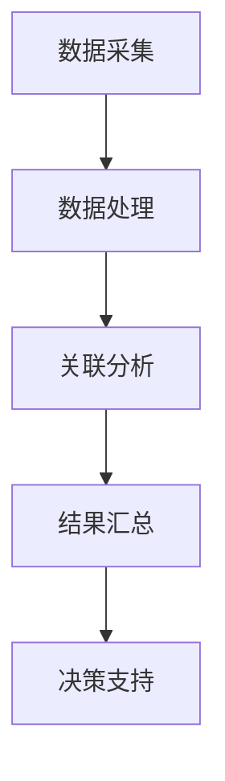
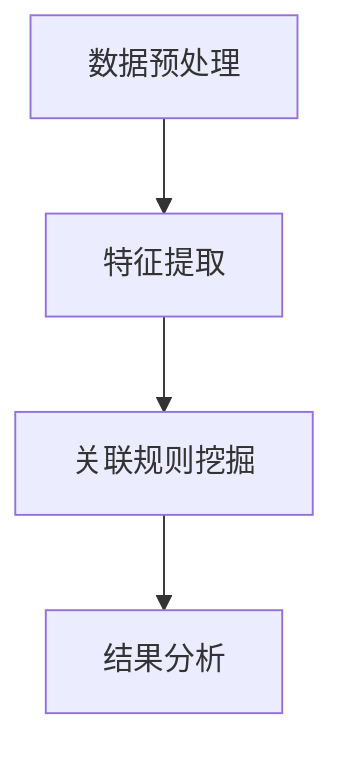
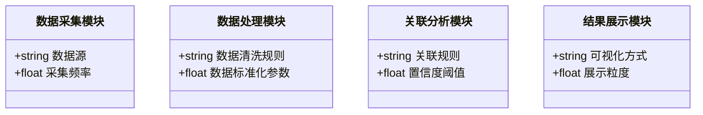
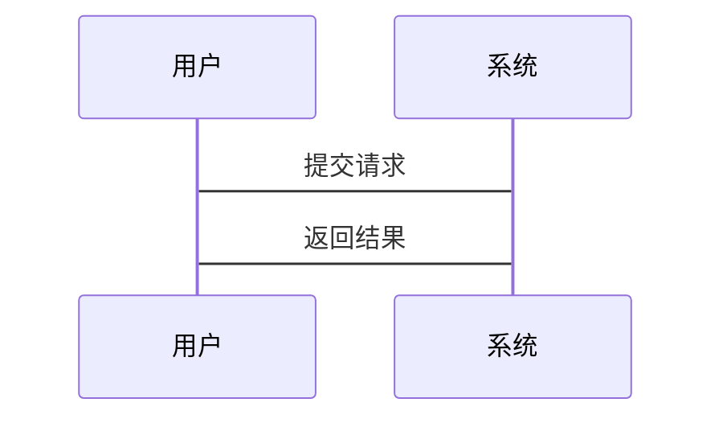

                 


# 利用多智能体系统进行全面的股东结构分析

## 关键词：多智能体系统, 股东结构分析, 数据分析, 企业治理, 人工智能

## 摘要：本文通过多智能体系统的视角，全面分析股东结构，涵盖数据预处理、特征提取、关联规则挖掘等步骤，并结合实际案例，展示如何利用多智能体系统进行股东结构分析，提供详细的算法流程和系统架构设计。

## 第一部分: 股东结构分析的背景与意义

### 第1章: 股东结构分析的背景与意义

#### 1.1 问题背景
##### 1.1.1 企业股权结构的重要性
企业股权结构是公司治理的核心要素，直接影响公司的控制权分配、决策效率和企业价值。合理的股权结构有助于避免股权分散带来的管理混乱，防止股权集中带来的控制权过度集中。

##### 1.1.2 股东结构分析的挑战
传统的股东结构分析方法依赖人工审查，效率低下，容易出错。面对海量数据和复杂关系，人工分析难以准确识别隐藏的控制权结构和潜在的关联方交易。

##### 1.1.3 多智能体系统的优势
多智能体系统能够通过协作和分布式计算，高效处理大规模数据，发现隐藏的关联关系，提供精准的结构分析结果。

#### 1.2 股东结构分析的核心概念
##### 1.2.1 股东的定义与分类
股东是公司权益的所有者，按出资方式可分为普通股股东、优先股股东等。按持股比例可分为控股股东和中小股东。

##### 1.2.2 股权结构的组成要素
股权结构包括股东信息、持股比例、股权质押、股东关联关系等关键要素。

##### 1.2.3 股东结构分析的目标
通过分析股权结构，识别控股股东，发现潜在关联方，评估公司治理风险，为投资决策提供支持。

#### 1.3 问题解决过程
##### 1.3.1 数据收集与预处理
收集股东信息、持股比例等数据，清洗重复值和缺失值，建立标准化的数据格式。

##### 1.3.2 数据分析与建模
提取股东关联特征，构建关联规则挖掘模型，识别重要股东和潜在关联方。

##### 1.3.3 结果可视化与决策支持
将分析结果以图表形式展示，支持投资决策和公司治理优化。

#### 1.4 分析的边界与外延
##### 1.4.1 分析范围的界定
本分析仅关注直接股东，不涉及间接控制关系。

##### 1.4.2 外延与限制
分析范围不包括员工持股计划等复杂情况，数据来源限制可能影响分析结果的全面性。

##### 1.4.3 边界条件的处理
对边界条件进行特殊处理，确保分析结果的准确性和完整性。

#### 1.5 核心概念结构与ER实体关系图
```mermaid
erDiagram
    actor 股东 {
        +string 股东ID
        +string 股东名称
        +float 持股比例
    }
    actor 公司 {
        +string 公司ID
        +string 公司名称
        +float 总股本
    }
    股东 --> 公司 : 持股
```

## 第二部分: 多智能体系统的原理与应用

### 第2章: 多智能体系统的原理与应用

#### 2.1 多智能体系统的基本原理
##### 2.1.1 智能体的定义与特征
智能体是具有感知环境、自主决策、协作通信能力的实体。

##### 2.1.2 多智能体系统的协作机制
通过分布式计算和任务分解，智能体协同完成复杂任务。

##### 2.1.3 智能体之间的通信
使用标准化协议进行信息交换，确保协作高效有序。

#### 2.2 多智能体系统与传统技术的对比
##### 2.2.1 对比维度分析
| 对比维度 | 多智能体系统 | 传统技术 |
|----------|--------------|----------|
| 分布式计算 | 支持 | 有限 |
| 系统扩展性 | 高 | 低 |

#### 2.3 多智能体系统在股东结构分析中的应用
##### 2.3.1 数据采集智能体
负责实时采集股东信息，确保数据来源的多样性和及时性。

##### 2.3.2 数据处理智能体
负责数据清洗、标准化，为后续分析提供高质量数据。

##### 2.3.3 关联分析智能体
通过关联规则挖掘，识别股东之间的关联关系，发现潜在控制结构。

#### 2.4 多智能体系统协作流程图


## 第三部分: 算法原理与数学模型

### 第3章: 算法原理与数学模型

#### 3.1 数据预处理
##### 3.1.1 数据清洗
使用Python的pandas库，去除缺失值和重复值。

#### 3.2 特征提取
##### 3.2.1 股东关联度计算
使用Jaccard相似度公式：$$J(A,B) = \frac{|A \cap B|}{|A \cup B|}$$

#### 3.3 关联规则挖掘
##### 3.3.1 支持度计算
$$support = \frac{count(A \rightarrow B)}{total}$$

##### 3.3.2 置信度计算
$$confidence = \frac{count(A \rightarrow B)}{count(A)}$$

##### 3.3.3 关联规则挖掘算法
```python
from efficient_apriori import apriori

# 示例数据
transactions = [['A', 'B'], ['A', 'C'], ['B', 'C', 'D']]
# 计算频繁项集和关联规则
itemsets, rules = apriori(transactions, min_support=0.5)
print(rules)
```

#### 3.4 算法流程图


## 第四部分: 系统分析与架构设计

### 第4章: 系统分析与架构设计

#### 4.1 问题场景介绍
##### 4.1.1 项目背景
介绍项目目标和实施背景，说明使用多智能体系统的必要性。

#### 4.2 项目介绍
##### 4.2.1 项目目标
全面分析股东结构，支持投资决策。

#### 4.3 系统功能设计
##### 4.3.1 功能模块
- 数据采集模块
- 数据处理模块
- 关联分析模块
- 结果展示模块

##### 4.3.2 功能流程图


#### 4.4 系统架构设计
##### 4.4.1 系统架构图


#### 4.5 系统接口设计
##### 4.5.1 RESTful API
- GET /api/shareholders
- POST /api/analyze

#### 4.6 系统交互流程图


## 第五部分: 项目实战

### 第5章: 项目实战

#### 5.1 环境安装
##### 5.1.1 安装Python
```bash
python --version
```

#### 5.2 核心代码实现
##### 5.2.1 数据清洗代码
```python
import pandas as pd

# 读取数据
df = pd.read_csv('shareholders.csv')
# 清洗数据
df.dropna(inplace=True)
df.drop_duplicates(inplace=True)
```

##### 5.2.2 关联规则挖掘代码
```python
from efficient_apriori import apriori

# 示例数据
transactions = [['A', 'B'], ['A', 'C'], ['B', 'C', 'D']]
# 计算频繁项集和关联规则
itemsets, rules = apriori(transactions, min_support=0.5)
print(rules)
```

#### 5.3 代码功能解读
##### 5.3.1 数据清洗功能
去除数据中的缺失值和重复值，确保数据质量。

#### 5.4 实际案例分析
##### 5.4.1 某公司股东结构分析
分析某公司股东结构，识别控股股东和关联方。

#### 5.5 项目小结
总结项目成果，分析遇到的挑战，提出改进建议。

## 第六部分: 最佳实践

### 第6章: 最佳实践

#### 6.1 小贴士
##### 6.1.1 数据来源
确保数据来源可靠，避免错误分析。

##### 6.1.2 模型可解释性
保持模型的可解释性，便于结果分析。

#### 6.2 全书总结
回顾全书内容，强调多智能体系统在股东结构分析中的应用价值。

#### 6.3 注意事项
##### 6.3.1 数据隐私
注意数据隐私保护，遵守相关法律法规。

##### 6.3.2 模型可扩展性
确保系统具有良好的扩展性，适应未来数据增长。

#### 6.4 拓展阅读
##### 6.4.1 推荐书籍
推荐相关领域的书籍和论文，帮助读者深入学习。

## 作者信息

作者：AI天才研究院/AI Genius Institute & 禅与计算机程序设计艺术 /Zen And The Art of Computer Programming

---

本文通过多智能体系统的视角，全面分析了股东结构，详细讲解了数据分析的全过程，并结合实际案例，展示了如何利用多智能体系统进行股东结构分析。希望本文能为读者提供有价值的见解和实用的技术指导。

