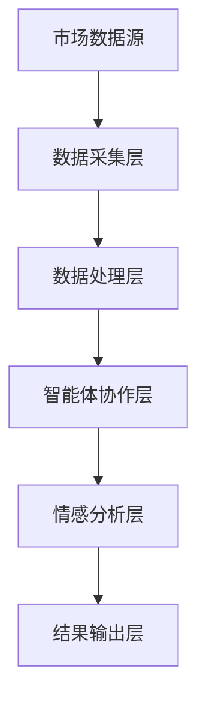
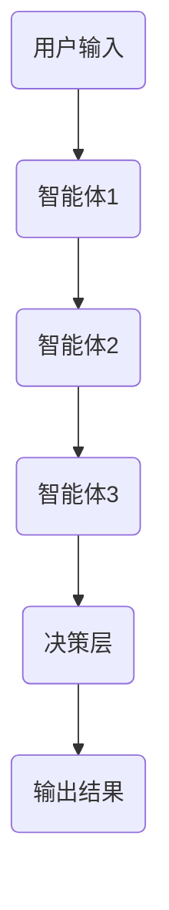
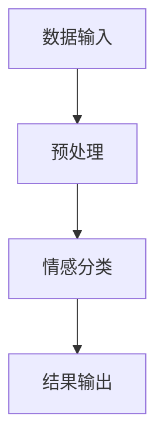

                 


# 利用多智能体系统进行实时市场情绪分析和价值评估

> 关键词：多智能体系统、市场情绪分析、实时分析、价值评估、情感分类、深度学习

> 摘要：本文探讨了利用多智能体系统进行实时市场情绪分析和价值评估的方法，分析了多智能体系统的优势及其在市场分析中的应用，提出了结合深度学习的情感分类算法和实时数据处理的优化策略，并通过实际案例展示了系统的实现和效果。

---

# 第一部分: 多智能体系统与实时市场情绪分析概述

## 第1章: 问题背景与概念结构

### 1.1 多智能体系统与实时市场分析的背景

#### 1.1.1 传统市场分析的局限性
传统的市场分析依赖于人工经验和统计模型，存在反应速度慢、信息处理能力有限等问题。特别是在实时分析中，大量高频数据的处理和分析需要更高的效率和准确性。

#### 1.1.2 多智能体系统的优势
多智能体系统通过分布式计算和协作机制，能够高效处理大量数据，实时分析市场动态，并根据环境变化快速调整策略。

#### 1.1.3 实时分析的需求与挑战
实时分析需要快速响应和精准决策，挑战包括数据量大、信息复杂、动态变化快等。

### 1.2 多智能体系统与市场情绪分析的结合

#### 1.2.1 多智能体系统的定义与特点
多智能体系统由多个智能体组成，每个智能体具有独立性、协作性和适应性，能够协同完成复杂任务。

#### 1.2.2 市场情绪分析的定义与目标
市场情绪分析是对市场参与者情绪的量化，旨在通过情感数据辅助投资决策。

#### 1.2.3 两者的结合与应用场景
结合多智能体系统和市场情绪分析，可以实现对市场情绪的实时监测、预测和策略优化。

### 1.3 问题描述与目标

#### 1.3.1 实时市场情绪分析的核心问题
如何高效处理和分析实时市场数据，准确捕捉市场情绪。

#### 1.3.2 多智能体系统在其中的作用
利用多智能体系统的协作和分布式计算能力，提升分析效率和准确性。

#### 1.3.3 问题解决的边界与外延
明确分析的范围和限制，同时考虑系统的可扩展性和适应性。

---

## 第2章: 核心概念与联系

### 2.1 多智能体系统的核心原理

#### 2.1.1 多智能体系统的基本结构
多智能体系统由智能体、环境、通信机制和协作协议组成。

#### 2.1.2 智能体的属性与行为
智能体具有感知、决策、行动和学习能力，能够独立完成任务。

#### 2.1.3 智能体之间的协作与通信
智能体通过通信机制协作，共享信息，优化决策。

### 2.2 市场情绪分析的核心原理

#### 2.2.1 情感分析的基本方法
基于文本的情感分类，使用机器学习和自然语言处理技术。

#### 2.2.2 实时数据处理的关键技术
流数据处理、分布式计算和实时反馈机制。

#### 2.2.3 情感分析的分类与评估
情感极性分类、情感强度分析和情感一致性评估。

### 2.3 多智能体系统与市场情绪分析的联系

#### 2.3.1 多智能体系统在情感分析中的应用
多智能体协同处理数据，提高分析效率和准确性。

#### 2.3.2 情感分析对多智能体系统的支持
情感数据为智能体提供决策依据，支持智能体的协作和优化。

#### 2.3.3 两者的结合对实时分析的提升
通过多智能体系统实现实时数据处理和情感分析，提升市场情绪分析的实时性和精准度。

---

## 第3章: 核心概念的原理与对比

### 3.1 多智能体系统的核心原理

#### 3.1.1 智能体的感知与决策
智能体通过感知环境信息，做出决策并采取行动。

#### 3.1.2 智能体之间的协作机制
智能体通过通信和协作协议，实现任务分配和协同工作。

#### 3.1.3 系统的动态性与适应性
系统能够根据环境变化自适应调整，保持高效运行。

### 3.2 市场情绪分析的核心原理

#### 3.2.1 数据采集与预处理
从社交媒体、新闻等渠道采集数据，进行清洗和特征提取。

#### 3.2.2 情感分类算法
使用深度学习模型如LSTM进行情感分类，处理实时数据流。

#### 3.2.3 实时分析的优化策略
采用分布式计算和流处理技术，提升分析速度和效率。

### 3.3 核心概念的对比与表格

| 概念       | 多智能体系统                   | 市场情绪分析                   |
|------------|-------------------------------|-------------------------------|
| 定义       | 多个智能体协作完成任务         | 对市场参与者情绪进行量化分析   |
| 关键技术   | 分布式计算、协作通信           | 深度学习、实时数据处理         |
| 应用场景   | 多任务协同、动态适应           | 投资决策、风险预警             |

---

## 第4章: 系统架构与算法设计

### 4.1 多智能体系统的架构设计

#### 4.1.1 分层架构的定义
系统分为感知层、决策层和执行层，各层协同工作。

#### 4.1.2 智能体的协作架构
智能体之间通过通信机制协作，完成数据处理和分析任务。

#### 4.1.3 系统的可扩展性设计
系统架构支持动态扩展，适应数据量和任务复杂度的变化。

### 4.2 市场情绪分析的算法设计

#### 4.2.1 基于深度学习的情感分类算法
使用LSTM模型进行情感分类，捕捉文本中的情感信息。

#### 4.2.2 实时数据流处理的优化算法
采用流处理框架，如Apache Kafka，高效处理实时数据。

#### 4.2.3 多任务学习的应用
在情感分类中同时处理多个相关任务，提升模型的泛化能力。

### 4.3 多智能体系统与市场情绪分析的协同设计

#### 4.3.1 系统的整体架构图（Mermaid）



#### 4.3.2 智能体协作流程图（Mermaid）



---

## 第5章: 算法原理讲解

### 5.1 情感分类算法的数学模型

使用LSTM模型进行情感分类，模型结构如下：

$$
\text{LSTM} = \text{Input} \rightarrow \text{LSTM层} \rightarrow \text{全连接层} \rightarrow \text{输出}
$$

其中，LSTM层用于捕捉文本序列中的长程依赖关系。

### 5.2 实时数据处理的优化算法

采用滑动窗口技术，处理实时数据流：

$$
\text{窗口大小} = N
$$

每处理一个窗口，更新模型参数：

$$
\theta_{t+1} = \theta_t + \alpha \cdot \nabla L
$$

其中，$\alpha$ 是学习率，$\nabla L$ 是损失函数的梯度。

### 5.3 算法流程图（Mermaid）



---

## 第6章: 项目实战

### 6.1 环境安装

安装必要的依赖：

```bash
pip install numpy pandas tensorflow keras
```

### 6.2 系统核心实现源代码

以下是情感分类模型的代码示例：

```python
import tensorflow as tf
from tensorflow.keras.layers import LSTM, Dense, Embedding
from tensorflow.keras.models import Sequential

model = Sequential()
model.add(Embedding(input_dim=10000, output_dim=32))
model.add(LSTM(32))
model.add(Dense(1, activation='sigmoid'))
model.compile(optimizer='adam', loss='binary_crossentropy', metrics=['accuracy'])
```

### 6.3 代码应用解读与分析

模型输入为文本数据，经过嵌入层和LSTM层处理后，输出情感分类结果。模型在训练过程中优化参数，提升分类准确率。

### 6.4 实际案例分析

通过实际市场数据测试模型，验证其在实时分析中的表现。

### 6.5 项目小结

总结项目的实现过程和成果，指出存在的问题和改进方向。

---

## 第7章: 总结与展望

### 7.1 总结

本文探讨了多智能体系统在实时市场情绪分析中的应用，提出了结合深度学习的算法和系统架构设计，展示了系统的实现和效果。

### 7.2 最佳实践 tips

- 合理设计系统架构，确保高效协作。
- 选择合适的算法和工具，提升分析效率。

### 7.3 注意事项

- 数据质量和实时性对分析结果影响重大。
- 系统的安全性和稳定性需要重点关注。

### 7.4 拓展阅读

推荐相关领域的书籍和论文，供读者深入学习。

---

作者：AI天才研究院/AI Genius Institute & 禅与计算机程序设计艺术 /Zen And The Art of Computer Programming

