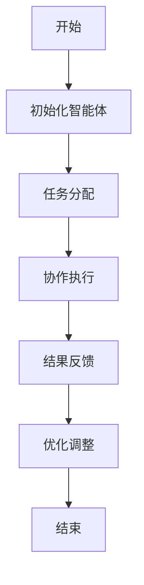
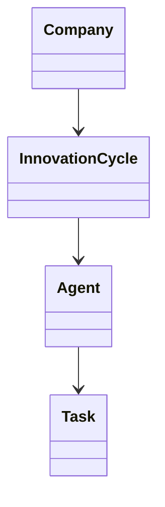

                 


# 利用智能体协作进行全面的公司创新周期评估

> 关键词：智能体协作、创新周期评估、公司创新、协作机制、数学模型

> 摘要：本文详细探讨了如何利用智能体协作技术进行全面的公司创新周期评估。通过背景介绍、核心概念、算法原理、系统架构设计和项目实战的逐步分析，本文展示了智能体协作在公司创新周期评估中的重要性及其实际应用价值。文章还通过具体的数学模型和系统架构图，详细解释了智能体协作的实现原理和应用场景。

---

## 第1章: 智能体协作与公司创新周期评估概述

### 1.1 智能体协作的定义与特点
智能体协作是指多个智能体通过协同工作，共同完成特定任务或目标的过程。其特点包括：
- **自主性**：智能体能够独立决策和行动。
- **协作性**：智能体之间通过通信和协调完成任务。
- **分布式**：智能体通常分布在不同的位置或系统中。
- **适应性**：智能体能够根据环境变化调整协作策略。

### 1.2 公司创新周期评估的背景与意义
公司创新周期是指从创意产生到产品商业化的过程，通常包括构思、开发、测试和推广等阶段。对创新周期进行评估有助于企业优化流程、提高效率和降低成本。

### 1.3 智能体协作在创新周期评估中的作用
智能体协作能够通过自动化和智能化的方式，对创新周期的各个阶段进行实时监控和评估。通过智能体协作，企业可以更好地协调资源、优化流程，并快速响应市场变化。

---

## 第2章: 智能体协作的核心概念与联系

### 2.1 智能体协作的核心原理
智能体协作的实现依赖于以下几个关键原理：
- **任务分配**：智能体根据自身能力和任务需求，自动分配任务。
- **通信与协调**：智能体之间通过通信协议交换信息，确保协作顺利进行。
- **结果反馈**：协作完成后，智能体将结果反馈给系统，供后续优化使用。

### 2.2 智能体协作与公司创新周期的关系
公司创新周期的各个阶段都可以通过智能体协作来优化：
- **构思阶段**：智能体可以辅助生成创意并评估其可行性。
- **开发阶段**：智能体可以协助资源分配和进度跟踪。
- **测试阶段**：智能体可以自动化执行测试并提供反馈。
- **推广阶段**：智能体可以协助市场分析和用户反馈收集。

### 2.3 智能体协作的核心要素对比表格

| 要素       | 传统协作方式       | 智能体协作方式       |
|------------|--------------------|--------------------|
| **自主性** | 依赖人工干预       | 自主决策           |
| **效率**   | 低效               | 高效               |
| **灵活性** | 有限               | 高度灵活           |

### 2.4 智能体协作的ER实体关系图
```mermaid
erd
    c {
        Company,
        InnovationCycle,
        Agent,
        Task
    }
    Company < 1..n> InnovationCycle
    InnovationCycle < 1..n> Agent
    Agent < 1..n> Task
```

---

## 第3章: 智能体协作的算法原理与数学模型

### 3.1 智能体协作的算法原理
智能体协作的算法通常包括以下几个步骤：
1. **初始化**：定义智能体和任务。
2. **任务分配**：根据智能体的能力分配任务。
3. **协作执行**：智能体协同完成任务。
4. **结果反馈**：将结果反馈给系统。



### 3.2 智能体协作的数学模型
智能体协作的数学模型可以通过以下公式表示：
$$C = \sum_{i=1}^{n} a_i$$
其中，$C$ 表示协作能力，$a_i$ 表示第 $i$ 个智能体的能力。

### 3.3 算法原理的举例说明
假设我们有一个公司创新周期评估系统，包含三个智能体：市场分析智能体、技术研发智能体和项目管理智能体。系统需要评估一个新产品的创新周期。

1. **任务分配**：市场分析智能体负责收集用户需求，技术研发智能体负责开发产品，项目管理智能体负责协调整个流程。
2. **协作执行**：市场分析智能体将需求反馈给技术研发智能体，技术研发智能体根据需求开发产品，项目管理智能体跟踪项目进度。
3. **结果反馈**：项目管理智能体将项目完成情况反馈给公司高层，供后续优化使用。

---

## 第4章: 公司创新周期评估的系统架构设计

### 4.1 系统功能设计
公司创新周期评估系统的功能模块包括：
- **需求分析模块**：收集用户需求并生成任务。
- **任务分配模块**：根据智能体的能力分配任务。
- **协作执行模块**：智能体协同完成任务。
- **结果反馈模块**：将结果反馈给系统并优化流程。

### 4.2 系统架构设计
公司创新周期评估系统的架构设计如下：


### 4.3 系统接口设计
系统接口设计包括以下几个部分：
- **输入接口**：接收用户的创新周期评估请求。
- **输出接口**：将评估结果反馈给用户。
- **通信接口**：智能体之间通过通信接口交换信息。

---

## 第5章: 项目实战

### 5.1 环境安装
安装所需的工具和库：
- Python 3.8+
- Mermaid
- PyCharm

### 5.2 核心代码实现
以下是公司创新周期评估系统的Python实现代码：
```python
class Agent:
    def __init__(self, name, ability):
        self.name = name
        self.ability = ability

    def assign_task(self, task):
        print(f"{self.name} assigned task: {task}")

    def execute_task(self, task):
        print(f"{self.name} executing task: {task}")

class InnovationCycle:
    def __init__(self, company):
        self.company = company
        self.agents = []

    def add_agent(self, agent):
        self.agents.append(agent)

    def assign_tasks(self, task):
        for agent in self.agents:
            agent.assign_task(task)
        for agent in self.agents:
            agent.execute_task(task)

# 示例使用
company = "Example Company"
innovation_cycle = InnovationCycle(company)
agent1 = Agent("Market Research Agent", "Market Research")
agent2 = Agent("R&D Agent", "Product Development")
agent3 = Agent("Project Manager", "Project Management")

innovation_cycle.add_agent(agent1)
innovation_cycle.add_agent(agent2)
innovation_cycle.add_agent(agent3)
innovation_cycle.assign_tasks("New Product Development")
```

### 5.3 案例分析
以下是一个具体的案例分析：
1. **任务分配**：市场分析智能体负责收集用户需求，技术研发智能体负责开发产品，项目管理智能体负责协调整个流程。
2. **协作执行**：市场分析智能体将需求反馈给技术研发智能体，技术研发智能体根据需求开发产品，项目管理智能体跟踪项目进度。
3. **结果反馈**：项目管理智能体将项目完成情况反馈给公司高层，供后续优化使用。

---

## 第6章: 最佳实践、小结与注意事项

### 6.1 最佳实践
- **明确任务目标**：确保每个智能体的任务目标清晰明确。
- **优化协作机制**：根据实际需求不断优化协作机制。
- **加强通信与反馈**：确保智能体之间的通信和反馈机制畅通。

### 6.2 小结
本文详细探讨了如何利用智能体协作进行全面的公司创新周期评估。通过背景介绍、核心概念、算法原理、系统架构设计和项目实战的逐步分析，展示了智能体协作在公司创新周期评估中的重要性及其实际应用价值。

### 6.3 注意事项
- **数据安全**：确保协作过程中数据的安全性。
- **系统稳定性**：确保系统的稳定性和可靠性。
- **人员培训**：对相关人员进行充分的培训，确保系统顺利运行。

---

## 作者

作者：AI天才研究院/AI Genius Institute & 禅与计算机程序设计艺术 /Zen And The Art of Computer Programming

