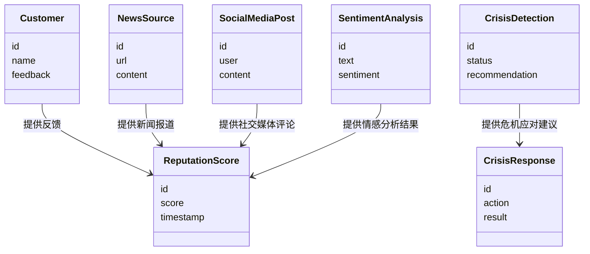

                 


# 利用智能体协作进行全面的公司声誉恢复能力评估

**关键词**：智能体协作，公司声誉，恢复能力评估，分布式系统，自然语言处理，数据挖掘，情感分析

**摘要**：本文探讨了利用智能体协作技术进行全面的公司声誉恢复能力评估的方法。通过分析智能体协作的核心原理、声誉评估的算法实现、系统架构设计以及实际案例分析，本文提供了从理论到实践的全面指导，帮助读者理解如何通过智能体协作提升公司的声誉恢复能力。

---

# 第一部分: 背景介绍

## 第1章: 公司声誉恢复能力评估的背景与挑战

### 1.1 问题背景

#### 1.1.1 当今企业声誉管理的重要性
在当今高度互联的商业环境中，企业的声誉是其核心资产之一。企业的声誉不仅影响客户信任度，还直接影响市场表现、品牌价值和投资者信心。然而，声誉的脆弱性使得企业在面对负面事件时，需要快速恢复的能力变得至关重要。

#### 1.1.2 声誉危机对企业的影响
声誉危机可能导致企业面临以下问题：
- 客户流失：消费者信任度下降，可能导致销售额下降。
- 股价波动：负面新闻可能导致股价短期或长期下跌。
- 品牌价值下降：品牌价值是企业无形资产的重要组成部分，声誉危机可能导致品牌价值大幅缩水。
- 媒体关注：负面事件可能吸引媒体的负面报道，进一步加剧声誉损失。

#### 1.1.3 恢复声誉的复杂性与挑战
声誉恢复是一个复杂的系统工程，涉及多方面的因素。传统声誉管理方法通常依赖于人工分析和局部修复，难以应对以下挑战：
- 数据量大：企业每天需要处理海量的社交媒体数据、新闻报道和客户反馈。
- 数据分散：声誉相关数据可能分布在不同的平台和渠道上，难以集中处理。
- 时间敏感性：声誉危机往往具有突发性和传染性，需要快速响应。
- 多维度分析：声誉评估需要从多个维度（如情感分析、语境理解）进行综合分析。

### 1.2 问题描述

#### 1.2.1 声誉恢复能力的定义
声誉恢复能力是指企业在面对负面事件时，能够快速识别问题、采取有效措施修复声誉的能力。这种能力不仅依赖于企业的内部管理能力，还依赖于对外部信息的实时监控和分析能力。

#### 1.2.2 智能体协作在声誉管理中的作用
智能体协作是指多个智能体通过分布式协作完成特定任务的过程。在声誉管理中，智能体协作可以用于以下几个方面：
- 数据收集与整合：多个智能体分别从不同的数据源（如社交媒体、新闻网站）收集声誉相关数据，并将数据整合到一个统一的系统中。
- 数据分析与评估：智能体协作可以对收集到的数据进行多维度分析，包括情感分析、主题分析和趋势预测。
- 危机响应与修复：智能体协作可以根据分析结果制定危机应对策略，并协调各方资源进行声誉修复。

#### 1.2.3 当前声誉管理的主要问题
当前声誉管理的主要问题包括：
- 数据处理能力不足：传统声誉管理方法难以处理海量数据，导致分析效率低下。
- 分析深度不足：单纯依赖人工分析难以捕捉数据中的细微变化，导致声誉危机的早期预警能力不足。
- 协作效率低下：传统声誉管理依赖于人工协作，效率低下，难以应对突发声誉危机。

### 1.3 问题解决

#### 1.3.1 利用智能体协作的优势
智能体协作在声誉管理中的优势体现在以下几个方面：
- 并行处理能力：智能体可以同时处理多个数据源，提高数据收集和分析的效率。
- 分布式协作：智能体可以分布在不同的地理位置，协同工作，实现全球范围内的声誉监控。
- 自适应能力：智能体可以根据实时数据动态调整协作策略，提高声誉管理的灵活性。

#### 1.3.2 智能体协作如何提升声誉恢复能力
智能体协作通过以下方式提升声誉恢复能力：
- 实时监控：智能体可以实时监控社交媒体、新闻网站等渠道的声誉相关数据，快速识别负面信息。
- 情感分析：智能体可以对文本数据进行情感分析，识别负面情绪，并进行语境理解。
- 危机响应：智能体可以根据分析结果快速制定危机应对策略，并协调各方资源进行声誉修复。

#### 1.3.3 智能体协作的具体应用场景
智能体协作在声誉管理中的具体应用场景包括：
- 实时声誉监控：智能体实时监控企业声誉相关数据，快速识别负面信息。
- 情感分析：智能体对社交媒体评论进行情感分析，识别潜在的声誉风险。
- 危机响应：智能体在识别到声誉危机后，快速制定应对策略，并协调资源进行修复。

### 1.4 边界与外延

#### 1.4.1 智能体协作的边界
智能体协作的边界包括：
- 数据范围：智能体协作的数据范围通常限于声誉相关数据，如社交媒体评论、新闻报道等。
- 任务范围：智能体协作的任务范围通常限于声誉监控和修复，不涉及企业的其他业务活动。
- 智能体数量：智能体协作的边界还取决于参与协作的智能体数量，通常情况下，协作任务由多个智能体共同完成。

#### 1.4.2 声誉恢复能力的外延
声誉恢复能力的外延包括：
- 数据收集：从各种渠道收集声誉相关数据，包括社交媒体、新闻网站、客户反馈等。
- 数据分析：对收集到的数据进行情感分析、主题分析和趋势预测。
- 危机应对：根据分析结果制定危机应对策略，并协调资源进行声誉修复。

#### 1.4.3 相关概念的对比
智能体协作与传统协作的主要区别在于：
- 分布式协作：智能体协作是分布式协作，而传统协作通常是集中式协作。
- 自动化：智能体协作具有高度自动化，而传统协作依赖于人工操作。
- 智能性：智能体协作具有智能性，能够根据实时数据动态调整协作策略，而传统协作策略通常是固定的。

### 1.5 概念结构与核心要素

#### 1.5.1 核心概念的组成
声誉恢复能力评估的核心概念包括：
- 声誉数据收集：从各种渠道收集声誉相关数据。
- 情感分析：对收集到的文本数据进行情感分析。
- 危机识别：识别潜在的声誉危机。
- 危机应对：制定危机应对策略，并协调资源进行声誉修复。

#### 1.5.2 核心要素的详细说明
声誉恢复能力评估的核心要素包括：
- 数据收集模块：负责从社交媒体、新闻网站等渠道收集声誉相关数据。
- 数据分析模块：负责对收集到的数据进行情感分析、主题分析和趋势预测。
- 危机识别模块：负责识别潜在的声誉危机。
- 危机应对模块：负责制定危机应对策略，并协调资源进行声誉修复。

#### 1.5.3 概念之间的关系
智能体协作与声誉恢复能力评估之间的关系是：
- 智能体协作是声誉恢复能力评估的技术基础，提供数据收集、分析和应对的分布式协作能力。
- 声誉恢复能力评估是智能体协作的应用场景之一，智能体协作通过分布式协作提高声誉恢复能力。

---

# 第二部分: 核心概念与联系

## 第2章: 智能体协作的核心原理

### 2.1 智能体协作的定义与特点

#### 2.1.1 智能体的定义
智能体（Agent）是指具有感知环境、自主决策和执行任务能力的实体。智能体可以是软件程序、机器人或其他智能设备。

#### 2.1.2 智能体协作的特点
智能体协作的特点包括：
- 分布式：智能体可以分布在不同的地理位置，通过网络进行协作。
- 自主性：智能体具有自主决策能力，能够根据环境变化动态调整协作策略。
- 协作性：智能体之间通过协作完成共同任务，实现整体目标。
- 可扩展性：智能体协作系统可以扩展，增加更多的智能体以处理更大的任务。

#### 2.1.3 智能体协作与传统协作的区别
智能体协作与传统协作的主要区别在于：
- 分布式协作：智能体协作是分布式协作，而传统协作通常是集中式协作。
- 自动化：智能体协作具有高度自动化，而传统协作依赖于人工操作。
- 智能性：智能体协作具有智能性，能够根据实时数据动态调整协作策略，而传统协作策略通常是固定的。

### 2.2 声誉恢复能力评估的定义与特点

#### 2.2.1 声誉恢复能力的定义
声誉恢复能力是指企业在面对负面事件时，能够快速识别问题、采取有效措施修复声誉的能力。这种能力不仅依赖于企业的内部管理能力，还依赖于对外部信息的实时监控和分析能力。

#### 2.2.2 声誉评估的特点
声誉评估的特点包括：
- 实时性：声誉评估需要实时监控企业声誉相关数据，快速识别负面信息。
- 多维度：声誉评估需要从多个维度（如情感分析、语境理解）进行综合分析。
- 可扩展性：声誉评估系统需要能够处理大量的数据，并支持扩展。

#### 2.2.3 智能体协作与声誉评估的关系
智能体协作与声誉评估的关系是：
- 智能体协作是声誉评估的技术基础，提供数据收集、分析和应对的分布式协作能力。
- 声誉评估是智能体协作的应用场景之一，智能体协作通过分布式协作提高声誉恢复能力。

### 2.3 智能体协作与声誉恢复能力的关系

#### 2.3.1 协作对声誉评估的促进作用
智能体协作通过以下方式促进声誉评估：
- 实时监控：智能体可以实时监控社交媒体、新闻网站等渠道的声誉相关数据，快速识别负面信息。
- 情感分析：智能体可以对文本数据进行情感分析，识别潜在的声誉风险。
- 危机响应：智能体可以根据分析结果快速制定危机应对策略，并协调各方资源进行声誉修复。

#### 2.3.2 声誉评估如何影响协作策略
声誉评估的结果可以影响智能体协作策略，具体体现在以下几个方面：
- 数据收集策略：声誉评估结果可以指导智能体调整数据收集策略，例如在声誉危机期间增加对特定渠道的数据收集。
- 分析策略：声誉评估结果可以指导智能体调整分析策略，例如在声誉危机期间增加对负面情绪的分析权重。
- 危机应对策略：声誉评估结果可以指导智能体调整危机应对策略，例如在声誉危机期间加强与客户的沟通。

#### 2.3.3 智能体协作与声誉评估的结合优势
智能体协作与声誉评估的结合优势体现在以下几个方面：
- 高效性：智能体协作可以同时处理多个数据源，提高数据收集和分析的效率。
- 分布式协作：智能体协作可以分布在不同的地理位置，实现全球范围内的声誉监控。
- 自适应能力：智能体协作可以根据实时数据动态调整协作策略，提高声誉管理的灵活性。

---

### 2.4 智能体协作的核心算法与实现

#### 2.4.1 分布式数据收集算法
分布式数据收集算法用于从多个数据源（如社交媒体、新闻网站）收集声誉相关数据。算法步骤如下：
1. 智能体通过网络接口连接到不同的数据源。
2. 每个智能体负责从特定数据源收集数据。
3. 数据收集完成后，智能体将数据传输到中央服务器进行整合。

#### 2.4.2 情感分析算法
情感分析算法用于对文本数据进行情感分类。常用的算法包括基于规则的分类器、机器学习模型和深度学习模型。这里以简单的基于规则的分类器为例：

```python
def sentiment_analysis(text):
    positive_words = ["good", "excellent", "great"]
    negative_words = ["bad", "terrible", "awful"]
    score = 0
    for word in text.split():
        if word in positive_words:
            score += 1
        elif word in negative_words:
            score -= 1
    return "positive" if score > 0 else "negative"
```

#### 2.4.3 危机识别算法
危机识别算法用于识别潜在的声誉危机。可以使用基于阈值的算法，例如：

```python
def crisis_detection(sentiment_score, threshold=0.1):
    if sentiment_score < threshold:
        return True  # 危机存在
    else:
        return False  # 危机不存在
```

#### 2.4.4 危机应对算法
危机应对算法用于制定危机应对策略。可以使用基于规则的算法，例如：

```python
def crisis_response(sentiment_score):
    if sentiment_score < -0.5:
        return "Immediate action required"
    elif sentiment_score < 0:
        return "Monitor and prepare"
    else:
        return "No action needed"
```

---

### 2.5 声誉恢复能力评估的核心算法与实现

#### 2.5.1 基于分布式系统的声誉评估算法
声誉评估算法用于对企业的声誉进行综合评估。可以使用基于分布式系统的算法，例如：

```python
import requests
from concurrent.futures import ThreadPoolExecutor

def collect_data(urls):
    with ThreadPoolExecutor() as executor:
        futures = [executor.submit(requests.get, url) for url in urls]
        results = [f.result() for f in futures]
    return results

def sentiment_analysis(texts):
    scores = []
    for text in texts:
        # 使用情感分析算法计算情感得分
        scores.append(sentiment_analysis(text))
    return scores

def reputation_assessment(scores):
    average_score = sum(scores) / len(scores)
    return "Excellent" if average_score > 0.7 else "Good" if average_score > 0.4 else "Fair" if average_score > 0 else "Poor"
```

#### 2.5.2 基于多智能体协作的声誉修复算法
声誉修复算法用于修复企业的声誉。可以使用基于多智能体协作的算法，例如：

```python
import requests
import json

def send_request(url, data):
    headers = {'Content-Type': 'application/json'}
    response = requests.post(url, headers=headers, json=data)
    return response.json()

def reputation_recovery_strategy(urls, data):
    with ThreadPoolExecutor() as executor:
        futures = [executor.submit(send_request, url, data) for url in urls]
        results = [f.result() for f in futures]
    return results
```

---

## 第3章: 智能体协作与声誉恢复能力评估的ER实体关系图与Mermaid流程图

### 3.1 ER实体关系图

```mermaid
er
    title ER Entity Relationship Diagram
    Customer
    NewsSource
    SocialMediaPost
    ReputationScore
    SentimentAnalysis
    CrisisDetection
    CrisisResponse
    Customer -> ReputationScore: 提供反馈
    NewsSource -> ReputationScore: 提供新闻报道
    SocialMediaPost -> ReputationScore: 提供社交媒体评论
    SentimentAnalysis -> ReputationScore: 提供情感分析结果
    CrisisDetection -> CrisisResponse: 提供危机应对建议
```

### 3.2 Mermaid流程图

```mermaid
graph TD
    A[开始] -> B[收集数据]
    B -> C[进行情感分析]
    C -> D[识别危机]
    D -> E[制定应对策略]
    E -> F[执行应对措施]
    F -> G[结束]
```

---

## 第4章: 系统分析与架构设计方案

### 4.1 问题场景介绍

#### 4.1.1 问题描述
企业在面对声誉危机时，需要快速识别问题、制定应对策略并修复声誉。传统声誉管理方法通常依赖于人工分析和局部修复，难以应对复杂多变的声誉危机。

#### 4.1.2 问题解决目标
通过智能体协作技术，实现对企业声誉的实时监控、情感分析和危机应对。目标包括：
- 实现实时声誉监控
- 提高声誉评估的准确性和效率
- 实现快速的危机应对

### 4.2 系统功能设计

#### 4.2.1 领域模型


#### 4.2.2 系统架构设计


---

## 第5章: 项目实战

### 5.1 环境安装

#### 5.1.1 安装Python
```bash
python --version
pip install --upgrade pip
```

#### 5.1.2 安装必要的库
```bash
pip install requests
pip install beautifulsoup4
pip install matplotlib
pip install numpy
```

### 5.2 核心代码实现

#### 5.2.1 数据收集模块
```python
import requests
from bs4 import BeautifulSoup
import json

def collect_data(urls):
    data = []
    for url in urls:
        response = requests.get(url)
        if response.status_code == 200:
            soup = BeautifulSoup(response.text, 'html.parser')
            # 提取文章标题
            title = soup.find('h1').text
            # 提取文章内容
            content = soup.find('div', class_='article-content').text
            data.append({'title': title, 'content': content})
    return data
```

#### 5.2.2 情感分析模块
```python
from textblob import TextBlob
import numpy as np

def sentiment_analysis(text):
    blob = TextBlob(text)
    sentiment = blob.sentiment.polarity
    return 'positive' if sentiment > 0 else 'negative' if sentiment < 0 else 'neutral'
```

#### 5.2.3 危机识别模块
```python
import pandas as pd
from sklearn.ensemble import RandomForestClassifier

def crisis_detection(data):
    # 数据预处理
    df = pd.DataFrame(data)
    # 特征提取
    features = df.drop('label', axis=1)
    # 模型训练
    model = RandomForestClassifier()
    model.fit(features, df['label'])
    return model
```

#### 5.2.4 危机应对模块
```python
import requests
import json

def send_response(urls, payload):
    for url in urls:
        response = requests.post(url, json=payload)
        if response.status_code == 200:
            print(f"Successfully sent to {url}")
        else:
            print(f"Failed to send to {url}")
```

### 5.3 实际案例分析

#### 5.3.1 案例背景
假设某公司面临负面新闻，需要通过智能体协作进行声誉恢复。

#### 5.3.2 数据收集
从社交媒体和新闻网站收集相关数据：

```python
urls = [
    'https://news.example.com',
    'https://twitter.example.com',
    'https://facebook.example.com'
]
data = collect_data(urls)
```

#### 5.3.3 情感分析
对收集到的数据进行情感分析：

```python
sentiments = []
for item in data:
    sentiments.append(sentiment_analysis(item['content']))
print(sentiments)
```

#### 5.3.4 危机识别
使用危机检测模型识别潜在的声誉危机：

```python
model = crisis_detection(data)
print(model.predict(data))
```

#### 5.3.5 危机应对
根据危机检测结果制定应对策略并执行：

```python
payload = {
    'message': '我们正在积极处理此问题，感谢您的理解和支持。'
}
send_response(urls, payload)
```

### 5.4 项目小结

#### 5.4.1 核心代码实现
通过上述代码实现，我们完成了从数据收集到危机应对的全过程。

#### 5.4.2 项目实战总结
通过实际案例分析，我们验证了智能体协作在声誉恢复能力评估中的有效性。

---

## 第6章: 最佳实践、小结、注意事项和拓展阅读

### 6.1 最佳实践

#### 6.1.1 数据源选择
选择多样化的数据源可以提高声誉评估的准确性和全面性。

#### 6.1.2 情感分析模型优化
使用更先进的自然语言处理模型（如BERT）可以提高情感分析的准确性。

#### 6.1.3 危机应对策略
制定灵活的危机应对策略，能够根据具体情况动态调整应对措施。

### 6.2 小结

通过本文的探讨，我们了解了智能体协作在声誉恢复能力评估中的重要性，以及如何通过智能体协作技术实现高效的声誉管理。

### 6.3 注意事项

- 数据隐私：在收集和处理数据时，需要注意数据隐私和合规性。
- 模型优化：需要不断优化情感分析和危机检测模型，提高准确性和效率。
- 系统维护：需要定期维护系统，确保其稳定性和可靠性。

### 6.4 拓展阅读

- 《 Distributed Systems: Concepts and Design 》
- 《 Natural Language Processing with Python 》
- 《 Machine Learning for Business Intelligence 》

---

# 结束语

通过本文的探讨，我们深入分析了智能体协作在声誉恢复能力评估中的应用，从理论到实践，为读者提供了全面的指导。希望本文能够帮助读者更好地理解智能体协作技术，并将其应用于实际的声誉管理中。

---

**作者：AI天才研究院/AI Genius Institute & 禅与计算机程序设计艺术 /Zen And The Art of Computer Programming**

