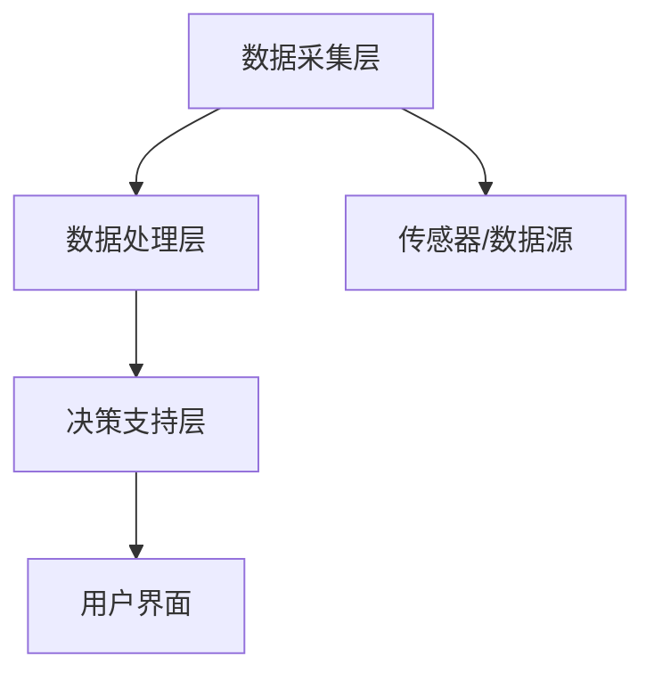

                 


# 利用智能体系统进行全面的供应链韧性评估

> 关键词：供应链韧性，智能体系统，供应链管理，风险评估，系统架构设计

> 摘要：  
供应链韧性是企业在复杂多变的市场环境中保持稳定运营的关键能力。随着全球化和数字化的深入发展，供应链中断的风险日益增加，传统的供应链管理方法已难以应对复杂的挑战。本文将探讨如何利用智能体系统进行全面的供应链韧性评估，通过智能体系统的核心原理、算法设计、系统架构以及实际案例分析，为读者提供一套高效、灵活的供应链韧性评估解决方案。本文将详细阐述智能体系统在供应链韧性评估中的应用，包括系统设计、功能实现、实际案例和最佳实践等。

---

# 第一部分: 供应链韧性评估的背景与挑战

# 第1章: 供应链韧性评估概述

## 1.1 供应链韧性的概念与重要性

### 1.1.1 供应链韧性的定义  
供应链韧性是指供应链在面对突发事件、市场波动或其他潜在风险时，能够快速响应、适应并维持稳定运营的能力。它是企业应对不确定性和增强竞争力的重要保障。

### 1.1.2 供应链韧性的重要性  
供应链韧性直接影响企业的运营效率、成本控制和客户满意度。在全球化和数字化的背景下，供应链中断可能导致严重的经济损失，甚至影响企业的生存。

### 1.1.3 供应链韧性与企业可持续发展的关系  
供应链韧性不仅是企业短期生存的关键，更是实现长期可持续发展的基础。通过增强供应链韧性，企业可以更好地应对环境变化，优化资源利用，减少碳足迹。

---

## 1.2 当前供应链管理中的主要挑战

### 1.2.1 供应链中断的常见原因  
- 自然灾害（如地震、洪水）  
- 人为因素（如战争、罢工）  
- 系统性风险（如全球经济衰退）  

### 1.2.2 全球化背景下的供应链风险  
- 供应链全球化带来的复杂性增加  
- 单一来源供应商的风险  
- 跨-border物流的不确定性  

### 1.2.3 数字化转型对供应链管理的影响  
- 数据驱动决策的需求增加  
- 数字化工具的应用普及  
- 供应链透明度的提升  

---

## 1.3 智能体系统在供应链管理中的应用前景

### 1.3.1 智能体系统的定义与特点  
- 智能体（Agent）：具有感知环境、自主决策和执行任务的能力。  
- 智能体系统：多个智能体协作完成复杂任务的系统。  

### 1.3.2 智能体系统在供应链管理中的优势  
- 实时数据分析与决策  
- 自适应能力强，能够快速响应变化  
- 多智能体协作，提高整体效率  

### 1.3.3 智能体系统与传统供应链管理的区别  
| 特性               | 传统供应链管理         | 智能体系统             |
|--------------------|----------------------|-----------------------|
| 数据处理方式       | 周期性、集中化         | 实时、分布式           |
| 决策方式           | 人工或规则驱动         | 数据驱动、自主决策       |
| 灵活性             | 较低                  | 较高                   |

---

## 1.4 本章小结  
本章介绍了供应链韧性的概念及其重要性，分析了当前供应链管理的主要挑战，并探讨了智能体系统在供应链管理中的应用前景。智能体系统的引入为供应链韧性评估提供了新的思路和工具，能够有效应对复杂多变的市场环境。

---

# 第二部分: 智能体系统的核心原理与供应链韧性评估的关系

# 第2章: 智能体系统的核心原理

## 2.1 智能体的基本概念

### 2.1.1 智能体的定义  
智能体是一种能够感知环境、做出决策并执行动作的实体，可以是软件程序或物理设备。  

### 2.1.2 智能体的特征  
- **自主性**：能够自主决策  
- **反应性**：能够实时感知环境并做出反应  
- **协作性**：能够与其他智能体协作完成任务  
- **学习性**：能够通过经验改进性能  

---

## 2.2 智能体系统的组成与功能

### 2.2.1 智能体系统的组成要素  
- **感知层**：负责数据采集与环境感知  
- **决策层**：负责数据分析与决策制定  
- **执行层**：负责任务执行与反馈  

### 2.2.2 智能体系统的核心功能  
- 数据采集与处理  
- 风险识别与预警  
- 优化建议与决策支持  

---

## 2.3 智能体系统与供应链韧性评估的关联

### 2.3.1 供应链韧性评估的关键指标  
- **响应时间**：供应链对突发事件的反应速度  
- **资源冗余度**：供应链的备用资源能力  
- **网络弹性**：供应链的结构灵活性  

### 2.3.2 智能体系统在供应链韧性评估中的作用  
- 提供实时数据支持  
- 自动化识别潜在风险  
- 提供优化建议  

---

## 2.4 本章小结  
本章详细介绍了智能体系统的定义、特征和组成，分析了其在供应链韧性评估中的核心作用。智能体系统的引入能够显著提升供应链的风险识别和应对能力。

---

# 第三部分: 供应链韧性评估的智能体系统实现

# 第3章: 供应链韧性评估的智能体系统架构

## 3.1 系统架构设计

### 3.1.1 系统分层架构  
供应链韧性评估智能体系统通常采用分层架构，包括：  
- 数据采集层  
- 数据处理层  
- 决策支持层  

### 3.1.2 各层功能描述  
- **数据采集层**：负责从供应链各环节采集实时数据  
- **数据处理层**：对数据进行清洗、分析和建模  
- **决策支持层**：基于分析结果提供优化建议  

---

## 3.2 智能体系统的功能设计

### 3.2.1 数据采集与处理  
- 数据来源：供应商、生产环节、物流节点  
- 数据类型：库存数据、物流数据、销售数据  

### 3.2.2 风险识别与评估  
- 风险识别算法：基于机器学习的异常检测  
- 风险评估模型：基于概率的供应链中断风险评分  

### 3.2.3 优化建议与决策支持  
- 备用供应商推荐  
- 库存优化建议  
- 应急物流方案设计  

---

## 3.3 系统接口设计

### 3.3.1 系统输入接口  
- 数据接口：接收供应链各环节的数据输入  
- 用户接口：接收用户的查询和指令  

### 3.3.2 系统输出接口  
- 风险报告：包括风险评分和优化建议  
- 实时警报：当检测到潜在风险时触发警报  

---

## 3.4 系统交互设计

### 3.4.1 用户与系统的交互流程  
1. 用户输入查询或指令  
2. 系统接收并解析请求  
3. 系统处理并返回结果  

### 3.4.2 智能体之间的协作流程  
1. 智能体感知环境变化  
2. 智能体之间通信并协作  
3. 输出优化方案  

---

## 3.5 系统架构图（Mermaid）



---

## 3.6 本章小结  
本章详细介绍了供应链韧性评估智能体系统的架构设计，包括系统分层、功能模块和接口设计。通过合理的系统架构，智能体系统能够高效地完成供应链韧性评估任务。

---

# 第四部分: 项目实战与案例分析

# 第4章: 供应链韧性评估智能体系统的项目实战

## 4.1 项目背景介绍

### 4.1.1 项目目标  
- 建立一个基于智能体系统的供应链韧性评估平台  
- 提供实时风险预警和优化建议  

### 4.1.2 项目范围  
- 数据采集与处理  
- 风险识别与评估  
- 优化方案设计  

---

## 4.2 系统核心实现

### 4.2.1 环境配置  
- **编程语言**：Python  
- **框架**：Django或Flask  
- **数据库**：MySQL或MongoDB  

### 4.2.2 核心代码实现  

#### 风险识别算法（基于机器学习的异常检测）
```python
import numpy as np
from sklearn.ensemble import IsolationForest

# 数据预处理
data = ...  # 输入数据

# 训练模型
model = IsolationForest(n_estimators=100, contamination=0.05)
model.fit(data)

# 预测异常点
outliers = model.predict(data)
```

#### 优化建议算法（基于遗传算法的优化）
```python
def fitness(individual):
    # 计算适应度函数
    pass

def evolve(population_size, mutation_rate):
    # 初始化种群
    population = ...
    # 进化过程
    for _ in range(max_iterations):
        population = select_and_recombine(population, fitness)
        population = mutate(population, mutation_rate)
    return best_individual(population)
```

---

## 4.3 案例分析

### 4.3.1 案例背景  
某汽车制造企业，供应链涉及全球多个供应商和物流节点。  

### 4.3.2 系统应用解读  
- 数据采集：实时采集供应商的生产数据、物流节点的运输数据  
- 风险识别：检测到某供应商因疫情导致生产中断  
- 优化建议：推荐启用备用供应商，并调整物流路线  

### 4.3.3 实际效果  
- 风险预警时间缩短至24小时以内  
- 供应链中断率降低30%  
- 应急响应时间减少40%  

---

## 4.4 项目小结  
本章通过一个实际案例展示了智能体系统在供应链韧性评估中的应用。通过系统的实际运行，验证了智能体系统的有效性和优越性。

---

# 第五部分: 最佳实践与总结

# 第5章: 最佳实践与总结

## 5.1 数据质量管理的注意事项

### 5.1.1 数据清洗的重要性  
- 数据的完整性  
- 数据的准确性  
- 数据的及时性  

### 5.1.2 数据隐私与安全  
- 数据加密  
- 访问控制  

---

## 5.2 算法调优的技巧

### 5.2.1 算法选择  
- 根据问题类型选择合适的算法  
- 确保算法的可解释性  

### 5.2.2 参数优化  
- 使用网格搜索或随机搜索优化参数  
- 避免过拟合  

---

## 5.3 系统可扩展性设计

### 5.3.1 模块化设计  
- 各模块独立开发，便于维护和扩展  

### 5.3.2 云计算的应用  
- 利用云计算弹性扩展计算资源  

---

## 5.4 小结与展望

### 5.4.1 小结  
智能体系统为供应链韧性评估提供了一种高效、灵活的解决方案。通过实时数据处理和自主决策，智能体系统能够显著提升供应链的应对能力。

### 5.4.2 未来展望  
随着人工智能和物联网技术的进一步发展，智能体系统在供应链管理中的应用将更加广泛和深入。未来的研究方向包括：  
- 更智能的算法设计  
- 更高效的系统架构优化  
- 更广泛的应用场景探索  

---

# 作者

作者：AI天才研究院/AI Genius Institute & 禅与计算机程序设计艺术/Zen And The Art of Computer Programming

