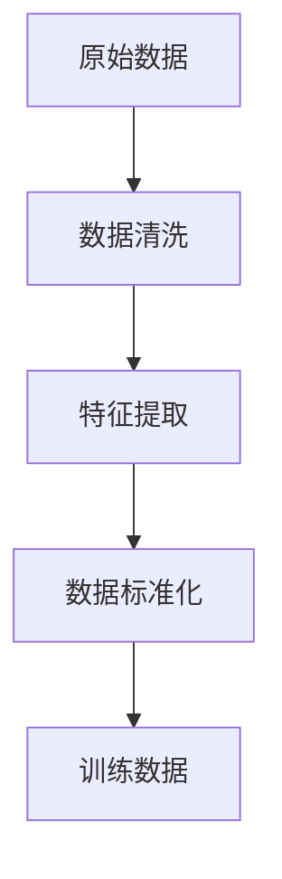
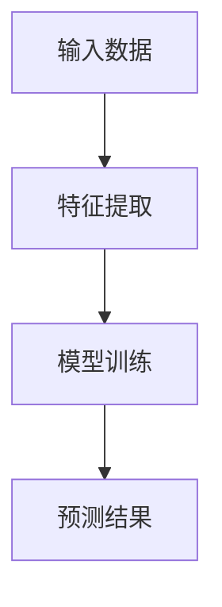
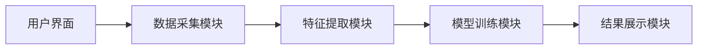

                 


# 利用智能体系统进行全面的公司创新效率横向比较

## 关键词：智能体系统、创新效率、横向比较、企业创新、人工智能、效率优化

## 摘要：  
随着企业竞争的日益激烈，创新效率成为决定企业生存和发展的重要因素。本文将深入探讨如何利用智能体系统（Intelligent Agent System）这一先进的人工智能技术，对企业创新效率进行横向比较，从而帮助企业发现自身优势与不足，优化创新流程，提升整体竞争力。通过系统化的分析与实践，本文将为企业创新效率的提升提供切实可行的方法和建议。

---

## 第1章: 背景介绍

### 1.1 智能体系统的基本概念  
智能体系统（Intelligent Agent System，IAS）是一种基于人工智能技术的系统，通过模拟人类智能的思维方式和行为模式，实现对复杂问题的自主分析和决策。智能体系统具有以下核心特征：  
- **自主性**：智能体能够独立感知环境并自主决策。  
- **反应性**：智能体能够实时响应环境变化并调整行为策略。  
- **学习能力**：智能体能够通过数据反馈不断优化自身的决策模型。  

### 1.2 创新效率的定义与问题背景  
创新效率是指企业在创新过程中，将资源（如时间、资金、人力）转化为创新成果的能力。在现代商业环境中，创新效率的高低直接关系到企业的市场竞争力和可持续发展能力。然而，传统的企业创新效率评估方法往往依赖于主观指标（如专利数量、新产品发布频率）或单一维度的分析，难以全面反映企业的创新能力。  

### 1.3 横向比较的意义  
横向比较是指在多个企业之间，基于相同的评估标准，对其创新效率进行对比分析。通过横向比较，企业可以：  
1. 发现自身创新效率的优势与不足。  
2. 了解行业标杆企业的创新模式和最佳实践。  
3. 为制定改进策略提供数据支持。  

---

## 第2章: 智能体系统的核心概念与联系

### 2.1 多智能体系统原理  
多智能体系统（Multi-Agent System，MAS）由多个相互协作或竞争的智能体组成，通过智能体之间的信息交互和协同工作，实现复杂任务的完成。  

#### 2.1.1 多智能体系统的组成  
- **智能体**：具有感知、决策和执行能力的个体。  
- **环境**：智能体所处的外部世界，包括任务目标和约束条件。  
- **通信机制**：智能体之间交换信息的渠道。  

#### 2.1.2 多智能体系统的通信机制  
- **直接通信**：智能体之间通过共享数据库或消息传递进行信息交换。  
- **间接通信**：智能体通过中间媒介（如代理或中间件）进行信息传递。  

#### 2.1.3 协作与竞争关系  
- **协作**：多个智能体共同完成同一任务。  
- **竞争**：多个智能体在资源有限的情况下争夺目标。  

### 2.2 创新效率的度量指标  

#### 2.2.1 创新效率的度量维度  
- **时间效率**：创新周期的长短。  
- **资源效率**：单位资源投入所产生的创新成果。  
- **成果效率**：创新成果的数量、质量和市场影响力。  

#### 2.2.2 创新效率横向比较的指标体系  
以下表格对比了不同创新效率指标的特征：  

| 指标类型 | 定义 | 特征 | 适用场景 |
|----------|------|------|----------|
| 时间效率 | 创新周期的长短 | 反应企业创新速度 | 新产品开发周期 |
| 资源效率 | 单位资源的创新产出 | 反应企业创新效率 | R&D投入与成果 |
| 成果效率 | 创新成果的数量与质量 | 反应企业创新能力 | 专利数量与质量 |

### 2.3 横向比较的核心要素  

#### 2.3.1 创新过程模型  
创新过程可以分为以下阶段：  
1. **需求识别**：发现市场机会或技术趋势。  
2. **构思与设计**：提出创新方案并进行可行性分析。  
3. **开发与测试**：实现创新方案并进行验证。  
4. **推广与反馈**：将创新成果推向市场并收集反馈。  

#### 2.3.2 智能体系统在创新效率比较中的应用  
智能体系统能够通过以下方式实现创新效率的横向比较：  
1. **数据采集**：从企业内部系统和外部市场中获取创新相关数据。  
2. **特征提取**：基于多智能体系统，提取创新效率的核心指标。  
3. **模型构建**：利用机器学习算法，建立创新效率预测模型。  

---

## 第3章: 智能体系统算法原理

### 3.1 数据预处理与特征提取  
#### 3.1.1 数据预处理流程  
以下是数据预处理的流程图：  



#### 3.1.2 特征提取方法  
- **统计特征**：均值、方差、最大值等。  
- **文本特征**：TF-IDF、词袋模型等。  
- **时间特征**：创新周期、时间序列分析。  

### 3.2 模型训练与创新效率预测  
#### 3.2.1 模型选择  
常用的机器学习模型包括：  
- **线性回归**：适用于线性关系的预测。  
- **随机森林**：适用于非线性关系的预测。  
- **神经网络**：适用于复杂的非线性关系。  

#### 3.2.2 创新效率预测模型  
以下是一个简单的创新效率预测模型：  



### 3.3 模型优化与评估  
#### 3.3.1 模型优化  
- **参数调优**：通过交叉验证优化模型参数。  
- **特征选择**：使用特征重要性分析选择关键特征。  

#### 3.3.2 模型评估  
- **准确率**：预测结果与实际结果的匹配程度。  
- **召回率**：预测结果中正例的召回情况。  
- **F1分数**：准确率和召回率的调和平均数。  

---

## 第4章: 智能体系统架构设计

### 4.1 系统功能模块  
- **数据采集模块**：从企业内部系统和外部市场中获取数据。  
- **特征提取模块**：对数据进行特征提取和处理。  
- **模型训练模块**：基于特征数据训练创新效率预测模型。  
- **结果展示模块**：将模型预测结果可视化展示。  

### 4.2 系统架构设计  
以下是系统的整体架构图：  



### 4.3 接口设计与交互流程  
- **接口设计**：通过REST API实现模块之间的通信。  
- **交互流程**：用户输入数据，系统进行处理并返回结果。  

---

## 第5章: 项目实战与案例分析

### 5.1 环境配置  
- **工具安装**：安装Python、TensorFlow、Scikit-learn等工具。  
- **数据准备**：收集企业创新相关数据。  

### 5.2 核心代码实现  
以下是一个创新效率预测模型的Python代码示例：  

```python
import pandas as pd
from sklearn.ensemble import RandomForestRegressor
from sklearn.metrics import mean_absolute_error

# 数据加载
data = pd.read_csv('innovation_data.csv')

# 特征提取
features = data.drop('efficiency', axis=1)
target = data['efficiency']

# 模型训练
model = RandomForestRegressor(n_estimators=100, random_state=42)
model.fit(features, target)

# 预测结果
predictions = model.predict(features)

# 模型评估
mae = mean_absolute_error(target, predictions)
print(f"均绝对误差: {mae}")
```

### 5.3 案例分析  
以某科技公司为例，分析其创新效率与行业标杆的差距，并提出改进建议。  

---

## 第6章: 最佳实践与总结

### 6.1 最佳实践  
- **数据质量**：确保数据的完整性和准确性。  
- **模型调优**：通过交叉验证和参数优化提高模型性能。  
- **持续改进**：定期更新模型并重新评估创新效率。  

### 6.2 小结  
本文通过智能体系统对企业创新效率进行了横向比较，提出了一套完整的解决方案，包括数据采集、特征提取、模型训练和结果展示。通过实际案例分析，验证了该方法的有效性和实用性。  

---

## 作者：AI天才研究院 & 禅与计算机程序设计艺术

---

以上是《利用智能体系统进行全面的公司创新效率横向比较》的技术博客文章的完整思考过程和撰写结构。

