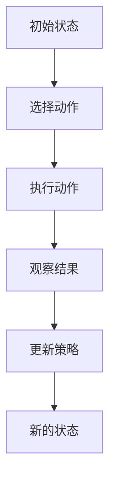
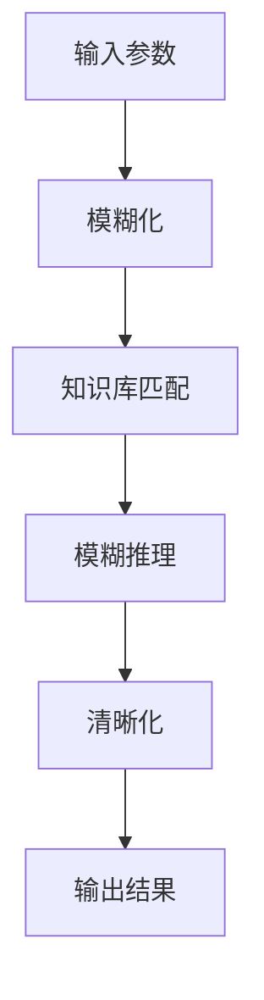
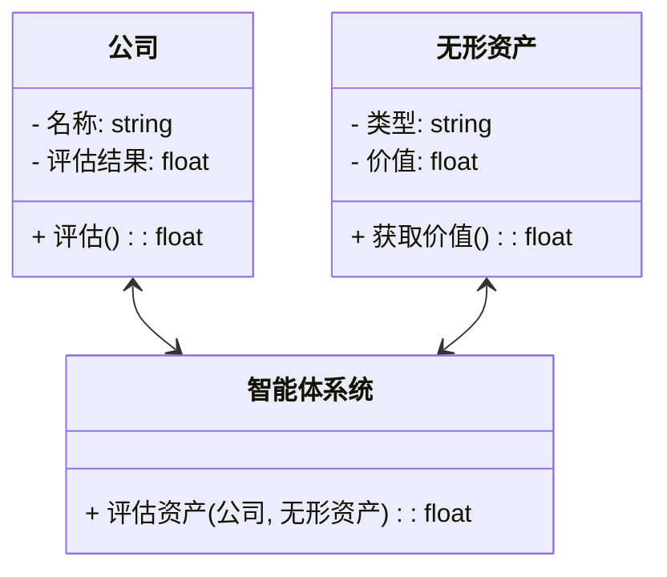
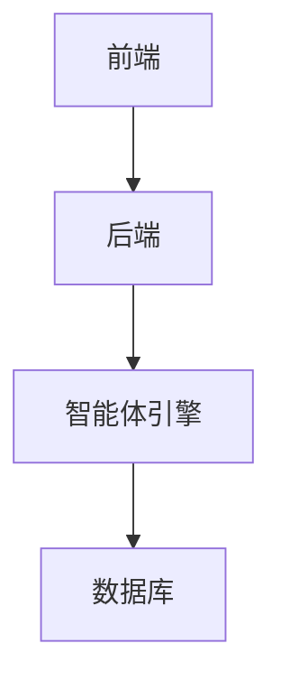
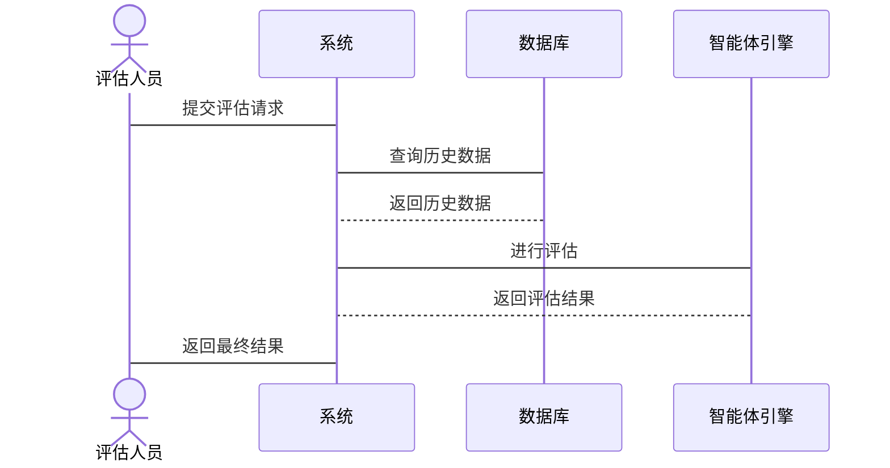

                 


# 《利用智能体系统进行全面的公司无形资产价值量化》

---

## 关键词：智能体系统, 无形资产价值量化, 资产评估, 多智能体系统, 人工智能, 企业价值

---

## 摘要：

随着企业竞争的加剧，无形资产在企业价值中的占比越来越高。传统的无形资产评估方法存在评估结果不准确、动态性差等问题。智能体系统作为一种新兴的智能化技术，可以通过其强大的数据处理能力和动态调整能力，为企业提供更准确的无形资产价值评估。本文将从智能体系统的原理出发，结合具体的评估案例，详细分析智能体系统在无形资产评估中的应用，探讨其在企业价值管理中的潜在价值和应用前景。

---

## 第3章: 无形资产价值量化的核心概念与联系

### 3.1 核心概念原理

在智能体系统中，无形资产价值量化的核心概念主要体现在以下几个方面：

#### 3.1.1 无形资产的动态性

无形资产的价值并非固定不变，而是受到市场环境、企业经营状况等多种因素的影响。智能体系统能够实时感知这些变化，并动态调整评估结果。

#### 3.1.2 智能体系统的自适应性

智能体系统通过学习和推理能力，能够根据新的数据和信息，自动调整评估模型和参数，确保评估结果的准确性。

#### 3.1.3 核心概念的数学模型

无形资产的价值量化可以通过以下数学模型进行描述：

$$ V = \sum_{i=1}^{n} w_i \cdot f_i $$

其中，\( V \) 表示无形资产的总价值，\( w_i \) 表示第 \( i \) 个特征的权重，\( f_i \) 表示第 \( i \) 个特征的评估值。

### 3.2 核心概念属性特征对比

以下是一个对比表格，展示了无形资产和有形资产在评估过程中的主要区别：

| 特征维度 | 无形资产 | 有形资产 |
|----------|-----------|----------|
| 存在形式 | 知识、技术、品牌等 | 实物资产 |
| 评估难度 | 高 | 较低 |
| 变化频率 | 高 | 较低 |
| 评估方法 | 多智能体系统、机器学习 | 市场法、成本法 |

### 3.3 实体关系图架构

以下是用 Mermaid 绘制的实体关系图：

```mermaid
erd
actor 公司, 评估人员
company 被评估公司
asset 无形资产
model 智能体评估模型

被评估公司 --> 无形资产: 拥有
评估人员 --> 智能体评估模型: 输入数据
智能体评估模型 --> 无形资产: 评估价值
```

---

## 第4章: 基于智能体系统的无形资产价值量化算法

### 4.1 强化学习算法

强化学习是一种通过试错机制来优化决策的算法。以下是强化学习的基本流程：



以下是强化学习在无形资产评估中的应用示例：

```python
class State:
    def __init__(self, market_value, company_performance):
        self.market_value = market_value
        self.company_performance = company_performance

class Action:
    def __init__(self, weight_adjustment):
        self.weight_adjustment = weight_adjustment

class Agent:
    def __init__(self):
        self.value = 0

    def evaluate(self, state):
        return state.market_value * 0.5 + state.company_performance * 0.5

    def choose_action(self, state):
        value = self.evaluate(state)
        return Action(value)

# 示例用法
state = State(100, 80)
agent = Agent()
action = agent.choose_action(state)
print(action.weight_adjustment)  # 输出：50
```

### 4.2 模糊逻辑算法

模糊逻辑适用于处理模糊性和不确定性较高的评估场景。以下是模糊逻辑的评估流程：



### 4.3 数学模型与公式

以下是模糊逻辑的数学模型示例：

$$ f(x) = \sum_{i=1}^{n} \mu_i(x) \cdot f_i $$

其中，\( \mu_i(x) \) 表示第 \( i \) 个模糊规则的隶属度，\( f_i \) 表示第 \( i \) 个模糊规则的输出。

---

## 第5章: 基于智能体系统的无形资产价值量化系统架构设计

### 5.1 系统功能设计

以下是系统功能设计的类图：



### 5.2 系统架构设计

以下是系统架构设计的架构图：



### 5.3 系统接口设计

以下是系统接口设计的序列图：



---

## 第6章: 项目实战

### 6.1 环境安装

以下是安装环境的示例代码：

```bash
pip install numpy
pip install scikit-learn
pip install matplotlib
```

### 6.2 核心代码实现

以下是核心代码实现的示例：

```python
import numpy as np
from sklearn.metrics import accuracy_score

class In

