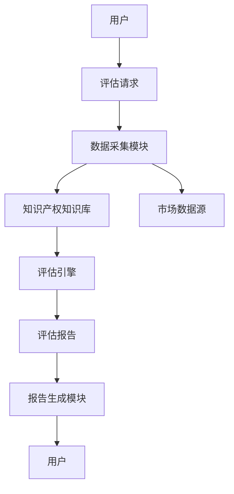

                 


# 利用智能体系统进行全面的公司知识产权价值评估

> 关键词：智能体系统、知识产权评估、知识图谱、价值评估、人工智能

> 摘要：本文探讨了如何利用智能体系统进行公司知识产权的全面价值评估，通过分析智能体的核心概念、算法原理和系统架构，结合实际案例，展示了如何利用智能体技术提升知识产权评估的效率和准确性。文章还提供了详细的系统设计和代码实现，为读者提供了从理论到实践的完整指导。

---

## 第1章: 知识产权价值评估的背景与现状

### 1.1 知识产权的重要性

#### 1.1.1 知识产权的定义与范围
知识产权是指依法保护的智力成果和标记，包括专利、商标、版权、商业秘密等。它们是企业的核心资产，决定了企业的市场竞争力和技术优势。

#### 1.1.2 知识产权在公司中的价值体现
知识产权不仅是企业的无形资产，还直接影响企业的财务状况、市场地位和创新能力。例如，一项专利技术可以带来巨大的商业价值和竞争优势。

#### 1.1.3 知识产权评估的必要性
随着市场竞争的加剧，知识产权的价值评估变得尤为重要。准确评估知识产权的价值，有助于企业制定合理的定价策略、优化资产配置和提升投资回报。

### 1.2 知识产权评估的现状与挑战

#### 1.2.1 当前知识产权评估的主要方法
传统知识产权评估方法包括市场法、成本法和收益法。这些方法依赖于人工分析，耗时且容易受到主观因素的影响。

#### 1.2.2 传统评估方法的局限性
传统方法通常只考虑单一因素，无法全面评估知识产权的多维度价值，且难以应对动态变化的市场环境。

#### 1.2.3 智能化评估的需求与优势
智能化评估可以利用大数据和人工智能技术，全面分析知识产权的法律、技术、市场和经济因素，提供更准确和高效的评估结果。

---

## 第2章: 智能体系统在知识产权评估中的优势

### 2.1 智能体系统的定义与特点

#### 2.1.1 智能体的定义
智能体是指能够感知环境、自主决策并采取行动的实体。在知识产权评估中，智能体系统可以实时收集和分析数据，自动调整评估策略。

#### 2.1.2 智能体的核心特征
- **自主性**：能够独立执行任务。
- **反应性**：能根据环境变化做出实时反应。
- **社会性**：能够与其他智能体或系统进行协作。

#### 2.1.3 智能体与传统评估系统的主要区别
智能体系统具有更高的灵活性和适应性，能够处理复杂和动态的环境，提供更精准的评估结果。

### 2.2 智能体系统在知识产权评估中的应用潜力

#### 2.2.1 数据处理与分析能力
智能体系统能够高效处理大量数据，利用机器学习算法识别潜在的知识产权价值。

#### 2.2.2 自动化评估流程
智能体系统可以自动化执行从数据收集到评估报告生成的整个流程，显著提高评估效率。

#### 2.2.3 实时监控与反馈机制
智能体系统能够实时监控知识产权的价值变化，及时提供反馈，帮助企业在市场变化中调整策略。

---

## 第3章: 智能体系统的核心概念与原理

### 3.1 智能体系统的基本原理

#### 3.1.1 知识表示与推理
知识表示是将知识产权相关信息转化为计算机可处理的形式，推理则是通过逻辑规则或机器学习模型对这些信息进行分析和判断。

#### 3.1.2 多智能体协同
通过多个智能体的协同工作，可以实现对知识产权的多维度评估，提高评估的全面性和准确性。

#### 3.1.3 动态环境适应性
智能体系统能够根据市场环境的变化，动态调整评估策略，确保评估结果的实时性和准确性。

### 3.2 知识产权评估的关键要素

#### 3.2.1 知识产权的法律属性
包括专利的法律保护、商标的注册情况等，是评估知识产权价值的重要因素。

#### 3.2.2 技术创新的评估维度
包括技术的先进性、实用性和市场应用前景，是评估技术类知识产权价值的核心因素。

#### 3.2.3 市场价值的评估方法
通过市场交易数据和竞争分析，评估知识产权的市场价值。

---

## 第4章: 智能体系统的知识表示与推理

### 4.1 知识表示方法

#### 4.1.1 知识图谱
知识图谱是一种结构化的知识表示方法，能够将知识产权相关信息组织成图结构，便于智能体系统进行推理和分析。

#### 4.1.2 规则表示
通过制定一系列逻辑规则，智能体系统可以对知识产权信息进行分类和判断。

#### 4.1.3 语义网络
语义网络通过节点和边表示知识的语义关系，帮助智能体系统理解复杂的知识产权信息。

### 4.2 知识推理过程

#### 4.2.1 基于规则的推理
通过预定义的逻辑规则，智能体系统可以对知识产权信息进行推理和判断。

#### 4.2.2 基于机器学习的推理
利用深度学习模型，智能体系统可以从大量数据中学习知识表示和推理规则。

#### 4.2.3 组合推理
结合规则推理和机器学习推理，智能体系统可以实现更全面和准确的知识推理。

---

## 第5章: 智能体系统的算法原理

### 5.1 基于规则的知识产权评估算法

#### 5.1.1 算法流程
1. 收集知识产权相关信息。
2. 根据预定义规则对信息进行分类。
3. 计算知识产权的综合评分。

#### 5.1.2 Python代码实现
```python
def assess IntellectualProperty(ip_info):
    score = 0
    # 根据规则对每个属性进行评分
    for attribute in ip_info:
        score += attribute_score[attribute]
    return score
```

#### 5.1.3 数学模型
$$ \text{总评分} = \sum_{i=1}^{n} w_i \times x_i $$
其中，\( w_i \) 是第 \( i \) 个属性的权重，\( x_i \) 是第 \( i \) 个属性的评分。

### 5.2 基于机器学习的知识产权评估算法

#### 5.2.1 数据预处理
对知识产权数据进行清洗、特征提取和归一化处理。

#### 5.2.2 模型训练
使用深度学习模型（如LSTM或BERT）对数据进行训练，学习知识产权的评估特征。

#### 5.2.3 模型评估
通过交叉验证和ROC曲线评估模型的性能。

---

## 第6章: 系统架构设计

### 6.1 问题场景介绍
企业需要对大量知识产权进行自动化评估，要求系统具备高效的数据处理和智能分析能力。

### 6.2 系统功能设计

#### 6.2.1 知识库构建
使用知识图谱技术构建知识产权知识库，包含专利、商标、版权等信息。

#### 6.2.2 数据采集
通过API接口获取知识产权相关的市场数据和法律信息。

#### 6.2.3 评估引擎
利用智能体系统对知识产权进行多维度评估，生成评估报告。

### 6.3 系统架构设计

#### 6.3.1 系统模块划分
- 数据采集模块
- 知识库模块
- 评估引擎模块
- 报告生成模块

#### 6.3.2 系统交互流程
1. 用户提交评估请求。
2. 数据采集模块获取相关信息。
3. 评估引擎模块进行评估计算。
4. 报告生成模块输出评估报告。

#### 6.3.3 系统架构图（Mermaid）


---

## 第7章: 项目实战

### 7.1 环境安装与配置

#### 7.1.1 安装Python和相关库
安装Python 3.8及以上版本，以及所需的库如Pandas、Scikit-learn和Networkx。

#### 7.1.2 安装Jupyter Notebook
用于数据处理和模型训练。

### 7.2 核心代码实现

#### 7.2.1 数据预处理代码
```python
import pandas as pd

def preprocess_data(data):
    # 假设data是一个Pandas DataFrame
    # 删除缺失值
    data = data.dropna()
    # 标准化处理
    from sklearn.preprocessing import StandardScaler
    scaler = StandardScaler()
    scaled_data = scaler.fit_transform(data)
    return scaled_data
```

#### 7.2.2 模型训练代码
```python
from sklearn.model_selection import train_test_split
from sklearn.linear_model import LinearRegression

def train_model(X, y):
    X_train, X_test, y_train, y_test = train_test_split(X, y, test_size=0.2)
    model = LinearRegression()
    model.fit(X_train, y_train)
    return model
```

### 7.3 实际案例分析

#### 7.3.1 案例背景
假设某公司拥有一项专利技术，需要评估其市场价值。

#### 7.3.2 数据分析
通过对市场数据和竞争分析，计算该专利技术的市场占有率和盈利能力。

#### 7.3.3 模型评估
利用训练好的模型对该专利技术进行价值评估，生成评估报告。

### 7.4 项目小结

#### 7.4.1 经验总结
智能体系统的引入显著提高了知识产权评估的效率和准确性。

#### 7.4.2 需要注意的问题
数据质量和模型选择对评估结果有重要影响，需要谨慎处理。

---

## 第8章: 总结与展望

### 8.1 全文总结
本文详细介绍了如何利用智能体系统进行公司知识产权的价值评估，涵盖了系统设计、算法原理和项目实战等方面。

### 8.2 展望未来
未来，随着人工智能技术的不断发展，智能体系统在知识产权评估中的应用将更加广泛和深入，评估方法也将更加智能化和个性化。

### 8.3 最佳实践Tips
- 数据准备是关键，确保数据的准确性和完整性。
- 选择合适的算法模型，根据具体需求进行调整和优化。
- 定期更新知识库和模型，保持系统的实时性和准确性。

---

## 作者：AI天才研究院/AI Genius Institute & 禅与计算机程序设计艺术 /Zen And The Art of Computer Programming

