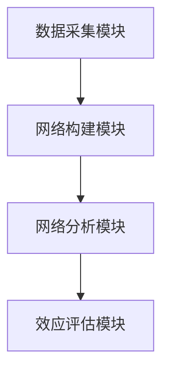
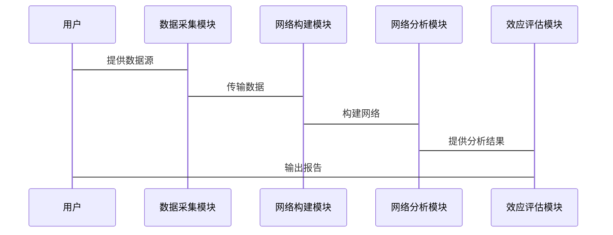

                 


# 利用智能体网络分析产业集群效应对公司价值的影响

> **关键词**：智能体网络、产业集群效应、公司价值、网络分析、产业竞争力  
> 
> **摘要**：本文通过智能体网络分析方法，探讨产业集群效应对公司价值的影响。文章从智能体网络的定义、构建方法出发，结合产业集群效应的理论基础，详细分析智能体网络在产业集群研究中的应用，提出了一种基于智能体网络的产业集群效应分析模型，并通过实际案例验证了该模型的有效性。本文还讨论了智能体网络分析在公司价值评估中的应用，为企业的战略决策提供了新的思路和方法。

---

# 第1章: 智能体网络与产业集群的背景介绍

## 1.1 智能体网络的定义与特点

### 1.1.1 智能体的基本概念
智能体（Agent）是指具有感知环境、做出决策、执行动作能力的实体。智能体可以是软件程序、机器人或其他具备自主行为能力的系统。智能体的核心特征包括主动性、反应性、社会性和目标性。

### 1.1.2 智能体网络的构建原理
智能体网络是由多个智能体通过某种规则或协议连接而成的网络。其构建原理包括：
1. **节点定义**：确定网络中的每个智能体（节点）的属性和行为规则。
2. **边的定义**：通过某种权重或关系描述节点之间的连接。
3. **网络演化**：通过智能体之间的交互和协作，动态调整网络结构。

### 1.1.3 智能体网络与传统网络的对比
| 特性 | 智能体网络 | 传统网络 |
|------|------------|----------|
| 节点属性 | 具有行为规则和决策能力 | 仅具有连接关系 |
| 边权重 | 反映智能体之间的互动强度 | 反映连接强度 |
| 网络演化 | 动态调整 | 静态或缓慢变化 |

---

## 1.2 产业集群的定义与特征

### 1.2.1 产业集群的定义
产业集群是指在地理上相对集中、具有相似或互补特征的企业和组织的集合。产业集群的核心特征包括专业化分工、资源共享和协同合作。

### 1.2.2 产业集群的主要特征
| 特性 | 描述 |
|------|------|
| 专业化分工 | 产业集群内的企业专注于特定环节或产品 |
| 资源共享 | 共享技术、人才、基础设施等资源 |
| 协同合作 | 企业之间通过合作提升整体竞争力 |

### 1.2.3 产业集群的分类与典型案例
产业集群可以分为区域产业集群和行业产业集群。典型案例包括意大利的纺织产业集群和硅谷的科技产业集群。

---

## 1.3 产业集群效应的理论基础

### 1.3.1 产业集群的形成机制
产业集群的形成通常由市场、资源和制度三方面因素驱动。市场因素包括专业化分工和规模经济，资源因素包括技术共享和人才流动，制度因素包括政策支持和行业标准。

### 1.3.2 产业集群与区域经济发展的关系
产业集群通过促进就业、增加税收和推动技术创新，对区域经济发展具有重要意义。

### 1.3.3 产业集群对产业竞争力的影响
产业集群通过提高生产效率、降低生产成本和增强技术创新能力，显著提升产业竞争力。

---

## 1.4 智能体网络在产业集群分析中的应用

### 1.4.1 智能体网络的优势
智能体网络能够通过动态调整网络结构，捕捉产业集群中的复杂关系和互动机制。

### 1.4.2 智能体网络在产业集群研究中的创新点
智能体网络将企业视为具有自主行为能力的智能体，能够更好地模拟产业集群的动态演化过程。

### 1.4.3 智能体网络与产业集群效应的关系
智能体网络通过分析企业之间的互动关系，揭示产业集群效应的形成机制和作用路径。

---

## 1.5 本章小结
本章介绍了智能体网络的定义、构建原理及其与传统网络的对比，分析了产业集群的定义、特征和形成机制，并探讨了智能体网络在产业集群研究中的应用。

---

# 第2章: 智能体网络的理论基础

## 2.1 智能体的基本属性与行为规则

### 2.1.1 智能体的属性
智能体的属性包括：
1. **状态**：智能体当前的内部状态。
2. **目标**：智能体追求的目标或任务。
3. **知识**：智能体掌握的知识和信息。

### 2.1.2 智能体的行为规则
智能体的行为规则包括：
1. **感知环境**：通过传感器或数据输入获取外部信息。
2. **决策制定**：基于感知信息和内部知识做出决策。
3. **执行动作**：根据决策结果执行具体动作。

### 2.1.3 智能体的决策机制
智能体的决策机制通常基于以下两种模式：
1. **基于规则的决策**：根据预设规则做出决策。
2. **基于模型的决策**：通过构建数学模型进行决策。

---

## 2.2 智能体网络的构建方法

### 2.2.1 网络节点的定义与选择
网络节点的选择需要考虑产业集群的特征和研究目标。例如，可以选择企业、供应商和客户作为网络节点。

### 2.2.2 网络边的定义与权重计算
网络边的权重通常基于以下因素：
1. **互动频率**：节点之间的互动次数。
2. **互动强度**：节点之间互动的紧密程度。
3. **信任程度**：节点之间信任关系的强弱。

### 2.2.3 网络构建的算法与工具
常用的网络构建算法包括：
1. **社会网络分析（SNA）**：用于分析人际关系和社会结构。
2. **社区发现算法**：用于识别网络中的社区结构。

---

## 2.3 智能体网络的分析方法

### 2.3.1 网络中心性分析
网络中心性分析用于识别网络中的关键节点。常用指标包括：
1. **度中心性**：节点的度数越高，中心性越强。
2. **接近中心性**：节点到达其他节点的最短路径长度越短，中心性越强。

### 2.3.2 网络聚类分析
网络聚类分析用于识别网络中的社区结构。常用算法包括：
1. **K-means聚类**：基于距离的聚类算法。
2. **层次聚类**：基于层次结构的聚类算法。

### 2.3.3 网络演化分析
网络演化分析用于研究网络随时间的变化趋势。常用方法包括：
1. **网络流分析**：分析网络中的信息流动方向。
2. **网络动力学模型**：模拟网络的演化过程。

---

## 2.4 智能体网络在产业集群研究中的应用案例

### 2.4.1 案例一: 某产业集群的智能体网络构建
以某地区的纺织产业集群为例，构建智能体网络，分析企业的互动关系和网络结构。

### 2.4.2 案例二: 智能体网络在产业集群竞争力分析中的应用
通过智能体网络分析，识别产业集群中的关键企业和关键关系，评估产业集群的竞争力。

---

## 2.5 本章小结
本章详细介绍了智能体的基本属性与行为规则，分析了智能体网络的构建方法，并通过案例展示了智能体网络在产业集群研究中的应用。

---

# 第3章: 产业集群效应与公司价值的关系

## 3.1 产业集群效应的内涵与外延

### 3.1.1 产业集群效应的定义
产业集群效应是指产业集群内部企业之间的互动关系对公司竞争力和区域经济发展的促进作用。

### 3.1.2 产业集群效应的主要表现形式
产业集群效应的表现形式包括专业化分工、资源共享和协同合作。

### 3.1.3 产业集群效应的边界与外延
产业集群效应的边界包括地理范围、行业范围和企业规模。其外延包括产业集群对区域经济、社会就业和技术创新的促进作用。

---

## 3.2 产业集群效应与公司价值的关系

### 3.2.1 产业集群效应对公司价值的直接影响
产业集群效应通过提高生产效率、降低生产成本和增强技术创新能力，直接影响公司价值。

### 3.2.2 产业集群效应对公司价值的间接影响
产业集群效应通过提升区域经济竞争力和企业品牌价值，间接影响公司价值。

### 3.2.3 产业集群效应与公司价值的互动关系
产业集群效应与公司价值之间存在双向互动关系。公司价值的提升会进一步增强产业集群效应。

---

## 3.3 智能体网络在产业集群效应分析中的应用

### 3.3.1 智能体网络的构建
通过构建智能体网络，分析产业集群内部企业的互动关系和网络结构。

### 3.3.2 网络分析方法
使用社会网络分析和博弈论模型，分析产业集群效应对公司价值的影响路径。

### 3.3.3 实证分析
通过具体案例，验证智能体网络分析方法的有效性。

---

## 3.4 本章小结
本章分析了产业集群效应的内涵与外延，探讨了产业集群效应与公司价值的关系，并提出了基于智能体网络的产业集群效应分析方法。

---

# 第4章: 基于智能体网络的产业集群效应分析模型

## 4.1 模型构建思路
基于智能体网络的产业集群效应分析模型包括以下几个步骤：
1. **数据收集**：收集产业集群内部企业的互动数据。
2. **网络构建**：根据互动数据构建智能体网络。
3. **网络分析**：通过网络分析方法，识别关键节点和网络结构。
4. **效应评估**：评估产业集群效应对公司价值的影响。

---

## 4.2 模型的数学表达

### 4.2.1 引言
产业集群效应（CE）与公司价值（CV）之间的关系可以通过以下公式表示：

$$ CV = f(CE) $$

其中，$f$ 表示效应评估函数。

### 4.2.2 效应评估函数
效应评估函数可以通过以下公式表示：

$$ f(CE) = \alpha \cdot CE + \beta \cdot CV $$

其中，$\alpha$ 和 $\beta$ 是模型参数，$CE$ 是产业集群效应，$CV$ 是公司价值。

---

## 4.3 模型的实现步骤

### 4.3.1 数据预处理
对收集到的互动数据进行清洗和标准化处理。

### 4.3.2 网络构建
使用社会网络分析工具（如Gephi）构建智能体网络。

### 4.3.3 网络分析
通过网络中心性分析和聚类分析，识别网络中的关键节点和社区结构。

### 4.3.4 效应评估
基于网络分析结果，评估产业集群效应对公司价值的影响。

---

## 4.4 模型的验证与优化

### 4.4.1 模型验证
通过实证分析验证模型的有效性。

### 4.4.2 模型优化
根据验证结果，优化模型参数和分析方法。

---

## 4.5 本章小结
本章提出了基于智能体网络的产业集群效应分析模型，并详细介绍了模型的构建思路、数学表达和实现步骤。

---

# 第5章: 智能体网络分析在公司价值评估中的应用

## 5.1 公司价值评估的理论基础
公司价值评估通常基于财务指标和市场指标。财务指标包括净利润率和资产负债率，市场指标包括市盈率和市净率。

---

## 5.2 智能体网络分析在公司价值评估中的应用

### 5.2.1 数据收集与网络构建
收集公司与其合作伙伴的互动数据，构建智能体网络。

### 5.2.2 网络分析
通过网络中心性分析和聚类分析，识别公司在网络中的地位和影响力。

### 5.2.3 效应评估
基于网络分析结果，评估公司价值的影响因素。

---

## 5.3 实际案例分析

### 5.3.1 案例背景
以某高科技产业集群为例，分析某公司在产业集群中的价值。

### 5.3.2 数据分析
通过智能体网络分析，识别该公司在网络中的关键地位和影响力。

### 5.3.3 结果解读
分析该公司在产业集群中的竞争优势和潜在风险。

---

## 5.4 本章小结
本章通过智能体网络分析方法，探讨了产业集群效应对公司价值的影响，并通过实际案例验证了分析方法的有效性。

---

# 第6章: 智能体网络分析的系统架构设计

## 6.1 系统功能设计

### 6.1.1 数据采集模块
负责采集产业集群内部企业的互动数据。

### 6.1.2 网络构建模块
根据互动数据构建智能体网络。

### 6.1.3 网络分析模块
通过网络分析方法，识别关键节点和社区结构。

### 6.1.4 效应评估模块
基于网络分析结果，评估产业集群效应对公司价值的影响。

---

## 6.2 系统架构设计

### 6.2.1 系统架构图


### 6.2.2 系统接口设计
系统接口包括：
1. 数据接口：与数据源对接。
2. 用户接口：供用户输入参数和查看结果。
3. 输出接口：输出网络分析结果和效应评估报告。

---

## 6.3 系统交互流程

### 6.3.1 交互流程图


---

## 6.4 本章小结
本章设计了基于智能体网络分析的系统架构，包括功能设计、架构图和交互流程。

---

# 第7章: 项目实战——智能体网络分析的实现

## 7.1 环境安装

### 7.1.1 安装Python
安装Python 3.x版本，推荐使用Anaconda。

### 7.1.2 安装依赖库
安装以下依赖库：
- `networkx`：用于网络分析。
- `matplotlib`：用于可视化。
- `gephi`：用于网络可视化。

---

## 7.2 系统核心实现源代码

### 7.2.1 数据预处理
```python
import networkx as nx

# 创建空图
G = nx.Graph()

# 添加节点
G.add_nodes_from(["企业1", "企业2", "企业3"])

# 添加边
G.add_edges_from([("企业1", "企业2"), ("企业2", "企业3")])
```

### 7.2.2 网络分析
```python
# 计算度中心性
degree_cent = nx.degree_centrality(G)

# 计算接近中心性
between_cent = nx.betweenness_centrality(G)

# 可视化网络
nx.draw(G, node_size=1000, node_color="red", edge_color="blue")
plt.show()
```

---

## 7.3 代码应用解读与分析
通过上述代码，我们可以构建一个简单的智能体网络，并计算网络中心性指标。网络可视化结果可以帮助我们更好地理解网络结构。

---

## 7.4 实际案例分析

### 7.4.1 案例背景
以某产业集群为例，分析企业之间的互动关系。

### 7.4.2 数据分析
通过Python代码进行网络构建和分析。

### 7.4.3 结果解读
解读分析结果，识别关键企业并评估产业集群效应。

---

## 7.5 项目小结
本章通过项目实战，详细讲解了智能体网络分析的实现过程，并通过案例展示了分析方法的实际应用。

---

# 第8章: 智能体网络分析的局限性与未来研究方向

## 8.1 智能体网络分析的局限性

### 8.1.1 数据依赖性
智能体网络分析依赖于高质量的数据，数据缺失或不准确会影响分析结果。

### 8.1.2 模型复杂性
智能体网络分析模型较为复杂，需要较高的计算资源和专业技能。

---

## 8.2 未来研究方向

### 8.2.1 智能体网络的动态演化研究
研究智能体网络的动态演化规律，提升模型的实时性。

### 8.2.2 多智能体协同优化
研究多智能体协同优化算法，提升产业集群效应分析的准确性。

### 8.2.3 智能体网络与大数据结合
将智能体网络分析与大数据技术结合，提升分析效率和精度。

---

## 8.3 本章小结
本章总结了智能体网络分析的局限性，并提出了未来研究方向。

---

# 结语

智能体网络分析为产业集群效应研究提供了新的方法和工具。通过构建智能体网络，分析产业集群内部的互动关系，可以更好地理解产业集群效应对公司价值的影响。未来，随着人工智能和大数据技术的发展，智能体网络分析将在产业集群研究中发挥更大的作用。

---

**作者：AI天才研究院/AI Genius Institute & 禅与计算机程序设计艺术 /Zen And The Art of Computer Programming**

