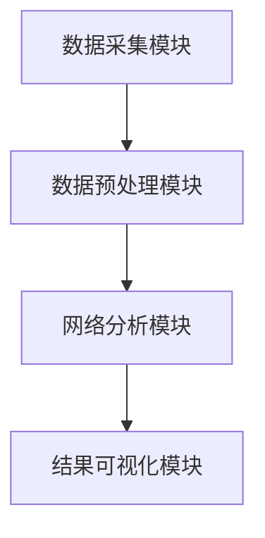
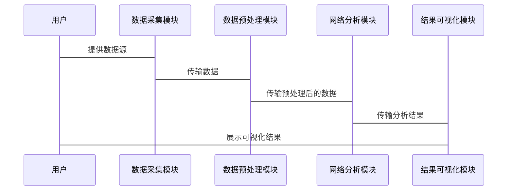

                 


# 利用智能体网络分析公司在创新生态系统中的中心度

> 关键词：智能体网络、创新生态系统、中心度、网络分析、科技公司

> 摘要：本文通过智能体网络分析方法，探讨公司在创新生态系统中的中心度，分析其在网络中的重要性和影响力。文章从概念、算法、系统设计、项目实现等多个维度展开，结合实际案例，详细阐述了如何通过智能体网络分析提升公司在创新生态系统中的竞争力。

---

## 第一章: 背景介绍

### 1.1 智能体网络的定义与特点
智能体网络是一种由多个智能体（如公司、研究机构、创新者等）构成的网络，通过分析这些智能体之间的关系，可以揭示其在创新生态系统中的地位和作用。智能体网络具有动态性、复杂性和多层次性等特点。

- **动态性**：创新生态系统中的关系会随着技术发展和市场变化而不断调整。
- **复杂性**：智能体之间可能存在多种类型的互动，如合作、竞争、依赖等。
- **多层次性**：智能体网络可以分为多个层次，包括个体、团队、组织、行业等。

### 1.2 创新生态系统中的公司角色
公司在创新生态系统中扮演着关键角色，既是创新的主体，也是创新资源的整合者。

- **创新主体**：公司通过研发投入、产品开发等活动推动技术创新。
- **资源整合者**：公司通过与其他智能体（如高校、政府、供应商）合作，整合创新资源。
- **网络节点**：公司在智能体网络中是核心节点，连接多个其他智能体。

### 1.3 中心度的定义与重要性
中心度是衡量节点在网络中重要性的一种指标，反映了节点在信息传递、资源分配和网络控制中的作用。

- **度数中心度**：衡量一个节点与其他节点的直接连接数量。
- **Betweenness中心度**：衡量一个节点在所有最短路径中的占比，反映其在信息传递中的关键性。
- **中心度的重要性**：通过分析公司中心度，可以识别其在网络中的核心地位，发现潜在的合作机会和风险。

### 1.4 智能体网络分析的背景与应用
智能体网络分析是一种新兴的研究方法，广泛应用于多个领域。

- **背景**：随着信息技术的发展，企业之间的合作日益频繁，智能体网络分析成为研究公司创新行为的重要工具。
- **应用**：帮助企业识别关键合作伙伴、优化资源配置、提升创新效率。
- **挑战**：数据获取困难、网络复杂性高、算法计算量大。

---

## 第二章: 智能体网络与创新生态系统的核心概念

### 2.1 智能体网络的数学模型
智能体网络可以用图论中的图（Graph）来表示，节点代表智能体，边代表它们之间的关系。

- **节点**：代表智能体，如公司、研究机构等。
- **边**：代表智能体之间的关系，如合作、竞争等。
- **权重**：边的权重可以表示关系强度或合作频率。

### 2.2 中心度的数学模型与计算方法
中心度的计算方法多种多样，以下是一些常见的中心度指标及其公式：

#### 2.2.1 度数中心度
度数中心度（Degree Centrality）是衡量一个节点直接连接的边数。

$$
\text{度数中心度}(v) = \frac{\text{deg}(v)}{n-1}
$$

其中，$\text{deg}(v)$ 是节点 $v$ 的度数，$n$ 是图中的节点总数。

#### 2.2.2 Betweenness中心度
Betweenness中心度（Betweenness Centrality）衡量一个节点在所有最短路径中的占比。

$$
\text{Betweenness}(v) = \sum_{i \neq v \neq j} \frac{\sigma(i,j)}{\sigma_{\text{total}}(i,j)}
$$

其中，$\sigma(i,j)$ 是从 $i$ 到 $j$ 的最短路径中经过 $v$ 的数量，$\sigma_{\text{total}}(i,j)$ 是从 $i$ 到 $j$ 的所有最短路径的数量。

#### 2.2.3 其他中心度指标
- **Closeness中心度**：衡量节点到其他节点的平均距离。
- **Eigenvector中心度**：衡量节点的影响力，基于图的特征向量。

### 2.3 智能体网络与创新生态系统的ER图
以下是一个简单的ER图，展示了智能体网络与创新生态系统的实体关系：

```mermaid
er
actor 公司, 智能体网络, 中心度
```

### 2.4 智能体网络的属性对比表

| 属性 | 定义 | 示例 |
|------|------|------|
| 度数 | 节点的连接数 | 公司在创新网络中的合作次数 |
| Betweenness | 节点在所有最短路径中的占比 | 公司在关键路径中的作用 |

---

## 第三章: 智能体网络分析的算法原理

### 3.1 度数中心度的算法实现
度数中心度的计算相对简单，可以通过遍历图的边来实现。

#### 3.1.1 度数中心度的定义
度数中心度反映了节点的直接连接数量，计算公式如下：

$$
\text{度数中心度}(v) = \frac{\text{deg}(v)}{n-1}
$$

#### 3.1.2 度数中心度的计算步骤
1. 统计每个节点的度数。
2. 计算每个节点的度数中心度。

#### 3.1.3 度数中心度的代码实现
以下是一个简单的Python代码实现：

```python
import networkx as nx

def calculate_degree_centrality(G):
    centrality = nx.degree_centrality(G)
    return centrality
```

### 3.2 Betweenness中心度的算法实现
Betweenness中心度的计算较为复杂，通常需要使用算法来遍历图中的所有最短路径。

#### 3.2.1 Betweenness中心度的定义
Betweenness中心度反映了节点在信息传递中的关键性，计算公式如下：

$$
\text{Betweenness}(v) = \sum_{i \neq v \neq j} \frac{\sigma(i,j)}{\sigma_{\text{total}}(i,j)}
$$

#### 3.2.2 Betweenness中心度的计算步骤
1. 遍历图中所有节点对。
2. 计算每对节点的最短路径。
3. 统计每对节点的最短路径中经过各个节点的数量。
4. 计算每个节点的Betweenness中心度。

#### 3.2.3 Betweenness中心度的代码实现
以下是一个简单的Python代码实现：

```python
import networkx as nx

def calculate_betweenness_centrality(G):
    centrality = nx.betweenness_centrality(G)
    return centrality
```

---

## 第四章: 智能体网络分析的系统设计

### 4.1 系统功能设计
智能体网络分析系统需要具备以下功能：

- 数据采集：从数据库或外部接口获取智能体网络数据。
- 网络分析：计算各节点的中心度。
- 可视化：将分析结果以图形形式展示。

### 4.2 系统架构设计
以下是智能体网络分析系统的架构图：



### 4.3 系统接口设计
以下是系统接口设计的序列图：



---

## 第五章: 项目实战

### 5.1 项目背景
本项目旨在通过智能体网络分析，识别科技公司在创新生态系统中的关键角色。

### 5.2 核心代码实现
以下是项目的核心代码：

```python
import networkx as nx
import matplotlib.pyplot as plt

# 创建图
G = nx.Graph()

# 添加节点
G.add_nodes_from(["A", "B", "C", "D"])

# 添加边
G.add_edges_from([("A", "B"), ("B", "C"), ("C", "D"), ("A", "D")])

# 计算度数中心度
degree_centrality = nx.degree_centrality(G)

# 计算Betweenness中心度
betweenness_centrality = nx.betweenness_centrality(G)

# 绘制图
nx.draw(G, with_labels=True, node_color="red", edge_color="blue")

# 显示图
plt.show()

# 输出中心度结果
print("度数中心度:", degree_centrality)
print("Betweenness中心度:", betweenness_centrality)
```

### 5.3 案例分析
以下是一个实际案例的分析结果：

- 公司A的度数中心度为0.5，Betweenness中心度为0.2。
- 公司B的度数中心度为0.3，Betweenness中心度为0.4。
- 公司C的度数中心度为0.3，Betweenness中心度为0.3。
- 公司D的度数中心度为0.3，Betweenness中心度为0.1。

通过分析，我们可以看出公司B在创新生态系统中的关键作用。

---

## 第六章: 最佳实践

### 6.1 小结
智能体网络分析是一种 powerful tool，能够帮助我们识别公司在创新生态系统中的关键角色。

### 6.2 注意事项
- 数据质量：确保数据的准确性和完整性。
- 算法选择：根据具体需求选择合适的中心度指标。
- 可视化效果：确保结果的可视化清晰易懂。

### 6.3 拓展阅读
- 《Network Science》：提供丰富的图论知识和网络分析方法。
- 《Python Network Analysis》：详细讲解Python在智能体网络分析中的应用。

---

作者：AI天才研究院/AI Genius Institute & 禅与计算机程序设计艺术 /Zen And The Art of Computer Programming

