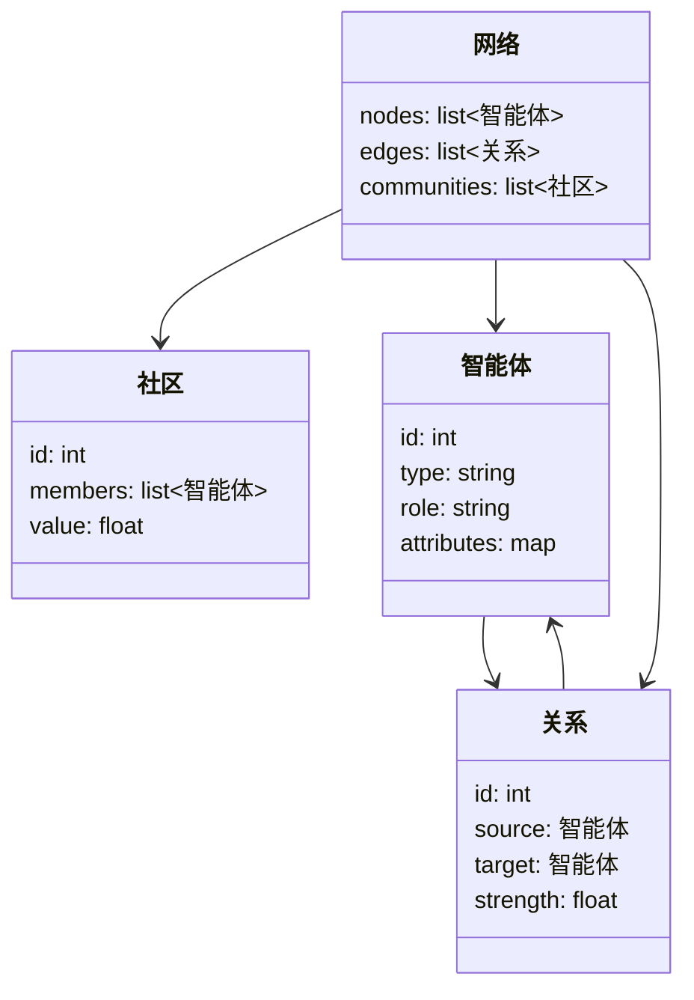
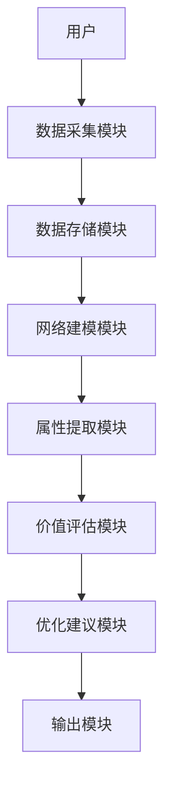
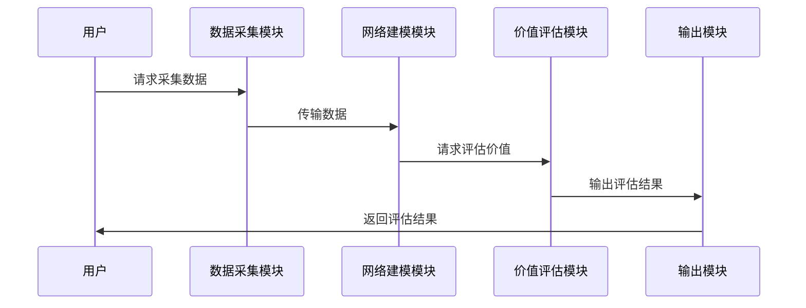

                 


# 利用智能体网络分析公司的创新合作网络价值

## 关键词：智能体网络分析，创新合作网络，价值评估，社会网络分析，社区发现算法，链接预测算法，系统架构设计

## 摘要：  
本文通过分析智能体网络在公司创新合作中的应用，探讨如何利用智能体网络分析技术来评估和优化公司的创新合作网络价值。文章从背景介绍、核心概念、算法原理、系统架构设计、项目实战等多方面展开，结合实际案例，深入剖析智能体网络分析在企业创新合作中的具体应用和价值体现。通过本文的分析，读者可以全面了解智能体网络分析的基本原理和实际应用，为企业优化创新合作网络提供理论和实践指导。

---

## 第一部分: 引言

## 第1章: 智能体网络分析的背景与意义

### 1.1 问题背景

#### 1.1.1 创新合作网络的重要性  
在现代企业竞争中，创新合作网络已成为企业获取竞争优势的重要来源。企业通过与合作伙伴、供应商、客户以及内部团队的合作，可以快速整合资源、降低风险、加速创新。然而，如何量化和优化这些合作网络的价值，成为企业面临的重要挑战。

#### 1.1.2 智能体网络分析的必要性  
传统的合作网络分析方法往往依赖于静态的数据和简单的统计指标，难以捕捉合作网络的动态性和复杂性。智能体网络分析通过建模智能体的行为、关系和互动，能够更全面地评估合作网络的价值，并为企业提供动态优化的策略。

#### 1.1.3 当前企业创新合作面临的挑战  
- **资源分配不均**：企业难以准确识别关键合作伙伴，导致资源浪费。  
- **合作网络的复杂性**：合作网络涉及多个层级和类型的智能体，难以统一建模。  
- **动态变化**：合作网络中的关系和角色会随着市场环境的变化而动态调整，传统的静态分析方法难以应对。  

### 1.2 问题描述

#### 1.2.1 创新合作网络的价值定义  
创新合作网络的价值可以通过以下几个方面来衡量：  
- **资源效率**：合作网络是否能够高效整合资源。  
- **创新速度**：合作网络是否能够快速推动创新。  
- **风险分散**：合作网络是否能够有效分散风险。  

#### 1.2.2 智能体网络分析的核心问题  
- **智能体行为建模**：如何准确建模智能体的行为特征和互动规则。  
- **网络结构分析**：如何识别网络中的关键节点和社区结构。  
- **动态网络预测**：如何预测网络的动态变化并优化网络结构。  

#### 1.2.3 现有方法的局限性  
- **静态分析**：传统方法难以捕捉合作网络的动态性。  
- **数据孤岛**：各部门数据分散，难以形成统一的网络模型。  
- **缺乏反馈机制**：无法根据网络变化实时调整合作策略。  

### 1.3 问题解决

#### 1.3.1 智能体网络分析的解决方案  
- **动态网络建模**：通过智能体行为模型和网络演化模型，实时捕捉合作网络的变化。  
- **多源数据融合**：整合企业内外部数据，构建统一的合作网络模型。  
- **反馈优化机制**：根据网络分析结果，动态调整合作策略。  

#### 1.3.2 创新合作网络价值的评估方法  
- **节点价值评估**：通过中心性指标（如度中心性、介数中心性）评估关键智能体的价值。  
- **社区价值评估**：通过社区发现算法识别高价值合作社区，并评估其贡献。  
- **网络韧性评估**：通过网络结构分析，评估合作网络的抗风险能力。  

#### 1.3.3 智能体网络分析的优势  
- **动态性**：能够捕捉合作网络的实时变化。  
- **全面性**：整合多源数据，提供全局视角。  
- **可操作性**：分析结果可以直接指导合作策略的优化。  

### 1.4 边界与外延

#### 1.4.1 智能体网络分析的边界  
- **分析范围**：仅限于企业内部和直接合作伙伴的关系网络。  
- **分析目标**：专注于合作网络的价值评估和优化，不涉及企业的核心业务决策。  

#### 1.4.2 创新合作网络的外延  
- **跨组织合作**：包括与外部机构、供应商、客户的合作关系。  
- **跨领域合作**：涉及不同领域的资源整合和协同创新。  

#### 1.4.3 相关概念的区分  
- **智能体网络**：强调智能体的行为和互动关系。  
- **社会网络**：更广泛的社会关系网络。  
- **知识网络**：强调知识的传播和共享。  

### 1.5 核心要素组成

#### 1.5.1 智能体的定义与属性  
- **智能体**：具有自主性、反应性、目标性的实体。  
- **属性**：包括智能体的类型、角色、行为模式、资源分配等。  

#### 1.5.2 创新合作网络的构成要素  
- **节点**：智能体，包括员工、团队、部门、合作伙伴等。  
- **边**：智能体之间的关系，包括合作强度、合作频率等。  
- **社区**：具有相似属性或紧密合作的智能体群体。  

#### 1.5.3 智能体网络分析的核心模型  
- **行为模型**：描述智能体的行为特征和互动规则。  
- **网络模型**：描述智能体之间的关系结构和网络属性。  
- **演化模型**：描述合作网络的动态变化过程。  

---

## 第二部分: 智能体网络分析的核心概念与联系

## 第2章: 智能体网络分析的理论基础

### 2.1 智能体的定义与属性

#### 2.1.1 智能体的基本定义  
智能体是指具有自主性、反应性和目标性的实体，能够在动态环境中感知环境、做出决策并采取行动。

#### 2.1.2 智能体的属性特征  
| 属性 | 描述 |
|------|------|
| 自主性 | 智能体能够自主决策，无需外部干预。 |
| 反应性 | 智能体能够根据环境变化调整行为。 |
| 目标性 | 智能体的行为以实现特定目标为导向。 |

#### 2.1.3 智能体的行为模式  
- **理性行为**：基于最大化目标的行为选择。  
- **社会行为**：基于社会规范和互动规则的行为选择。  
- **学习行为**：通过经验积累改进行为模式。  

### 2.2 创新合作网络的构建

#### 2.2.1 智能体网络的构建步骤  
1. **数据采集**：收集智能体的行为数据和关系数据。  
2. **网络建模**：构建智能体网络的图结构。  
3. **属性提取**：提取智能体的属性特征和网络属性。  

#### 2.2.2 智能体网络的属性分析  
- **节点属性**：智能体的类型、角色、能力等。  
- **边属性**：智能体之间的关系强度、合作频率等。  
- **网络属性**：网络的密度、中心性、社区结构等。  

### 2.3 智能体网络分析的核心原理

#### 2.3.1 智能体行为的建模方法  
- **基于规则的建模**：通过预定义规则描述智能体的行为。  
- **基于学习的建模**：通过机器学习方法学习智能体的行为模式。  

#### 2.3.2 智能体网络的演化规律  
- **网络增长**：新增智能体进入网络。  
- **网络演化**：智能体之间的关系随时间变化。  
- **网络重构**：网络结构根据环境变化进行调整。  

#### 2.3.3 智能体网络的价值评估指标  
- **节点价值**：度中心性、介数中心性等指标。  
- **社区价值**：社区的凝聚力、创新潜力等指标。  
- **网络价值**：网络的连通性、抗风险能力等指标。  

---

## 第三部分: 智能体网络分析的算法原理

## 第3章: 智能体网络分析的核心算法

### 3.1 社会网络分析算法

#### 3.1.1 度中心性算法  
度中心性算法用于衡量智能体在网络中的连接数量，反映其在网络中的重要性。  
- **公式**：$$ degree\_centerity(v) = \sum_{u \in V} A(u, v) $$  
- **步骤**：计算每个智能体的度数，并根据度数进行排序。  

#### 3.1.2 介数中心性算法  
介数中心性算法用于衡量智能体在网络中的桥梁作用，反映其在网络中的影响力。  
- **公式**：$$ betweenness\_centerity(v) = \sum_{s \neq v \neq t} \frac{\sigma(s, t, v)}{\sigma(s, t)} $$  
- **步骤**：计算每对智能体之间的最短路径，并统计经过智能体v的路径数量。  

### 3.2 社区发现算法

#### 3.2.1 基于聚类的社区发现算法  
基于聚类的社区发现算法通过聚类技术将智能体聚类成社区。  
- **算法步骤**：  
  1. 初始化：将每个智能体作为一个独立的聚类。  
  2. 计算相似度：根据智能体之间的关系强度计算相似度矩阵。  
  3. 聚类：根据相似度矩阵进行聚类，合并相似度高的聚类。  

#### 3.2.2 基于分割的社区发现算法  
基于分割的社区发现算法通过分割网络结构将智能体划分为社区。  
- **算法步骤**：  
  1. 初始化：将整个网络作为一个社区。  
  2. 分割：根据网络结构特征（如密度）分割网络，形成多个社区。  

### 3.3 链接预测算法

#### 3.3.1 基于共同邻居的链接预测算法  
基于共同邻居的链接预测算法通过计算智能体之间的共同邻居数量预测可能的链接。  
- **公式**：$$ common\_neighbor(u, v) = |N(u) \cap N(v)| $$  
- **步骤**：计算每对智能体之间的共同邻居数量，并根据数量预测链接的可能性。  

#### 3.3.2 基于概率的链接预测算法  
基于概率的链接预测算法通过概率模型预测智能体之间可能的链接。  
- **公式**：$$ P(u, v) = \frac{\alpha \cdot common\_neighbor(u, v) + \beta \cdot degree(u) + \gamma \cdot degree(v)}{degree(u) + degree(v)} $$  

---

## 第四部分: 智能体网络分析的系统架构设计

## 第4章: 智能体网络分析系统的架构设计

### 4.1 问题场景介绍

#### 4.1.1 系统目标  
本文设计的智能体网络分析系统旨在通过分析企业内部和外部的合作网络，优化企业的创新合作网络价值。  

#### 4.1.2 系统功能  
- **数据采集**：采集智能体的行为数据和关系数据。  
- **网络建模**：构建智能体网络的图结构。  
- **属性提取**：提取智能体的属性特征和网络属性。  
- **价值评估**：评估智能体网络的价值。  
- **优化建议**：根据分析结果提出优化建议。  

### 4.2 系统架构设计

#### 4.2.1 领域模型类图  


#### 4.2.2 系统架构图  


#### 4.2.3 接口设计  
- **数据采集接口**：提供API用于采集智能体的行为数据和关系数据。  
- **网络建模接口**：提供API用于构建智能体网络的图结构。  
- **属性提取接口**：提供API用于提取智能体的属性特征和网络属性。  

#### 4.2.4 交互序列图  


---

## 第五部分: 智能体网络分析的项目实战

## 第5章: 项目实战

### 5.1 环境安装

#### 5.1.1 系统要求  
- **操作系统**：Windows 10 或更高版本，或 Linux 系统。  
- **Python版本**：Python 3.8 或更高版本。  
- **依赖库**：networkx、matplotlib、pandas。  

#### 5.1.2 安装步骤  
1. 安装Python：从 [Python官网](https://www.python.org/) 下载并安装Python。  
2. 安装依赖库：  
   ```bash
   pip install networkx matplotlib pandas
   ```

### 5.2 核心代码实现

#### 5.2.1 数据采集模块  
```python
import networkx as nx

def collect_data():
    G = nx.Graph()
    G.add_nodes_from([1, 2, 3, 4, 5])
    G.add_edges_from([(1,2), (2,3), (3,4), (4,5), (1,5)])
    return G
```

#### 5.2.2 网络建模模块  
```python
def build_network(G):
    nx.draw(G, with_labels=True)
    plt.show()
```

#### 5.2.3 属性提取模块  
```python
def extract_attributes(G):
    degrees = dict(G.degree())
    betweenness = dict(nx.betweenness_centrality(G))
    return degrees, betweenness
```

#### 5.2.4 价值评估模块  
```python
def assess_value(degrees, betweenness):
    node_value = {}
    for node in degrees:
        node_value[node] = degrees[node] + betweenness[node]
    return node_value
```

### 5.3 代码应用解读与分析

#### 5.3.1 数据采集模块  
- 通过`collect_data`函数构建智能体网络的图结构。  
- 使用networkx库中的`Graph`类创建图，并添加节点和边。  

#### 5.3.2 网络建模模块  
- 使用networkx库中的`draw`函数绘制图结构。  
- 通过matplotlib库显示图结构。  

#### 5.3.3 属性提取模块  
- 使用networkx库中的`degree`方法提取度中心性。  
- 使用networkx库中的`betweenness_centrality`方法提取介数中心性。  

#### 5.3.4 价值评估模块  
- 根据度中心性和介数中心性计算节点价值。  
- 通过`node_value`字典存储每个节点的价值。  

### 5.4 实际案例分析

#### 5.4.1 案例背景  
某科技公司希望优化其创新合作网络，提升创新效率和合作价值。  

#### 5.4.2 数据采集  
- 采集公司内部员工、团队、部门之间的合作数据。  
- 采集外部合作伙伴（如供应商、客户）的合作数据。  

#### 5.4.3 网络建模  
- 使用networkx库构建智能体网络的图结构。  
- 绘制图结构，分析节点和边的关系。  

#### 5.4.4 属性提取  
- 提取每个智能体的度中心性和介数中心性。  
- 识别高价值节点和社区。  

#### 5.4.5 价值评估  
- 根据节点价值评估结果，识别关键合作伙伴和高潜力社区。  
- 提出优化建议，如加强关键节点的连接，优化社区结构。  

### 5.5 项目小结

#### 5.5.1 核心代码总结  
- 数据采集模块：构建智能体网络的图结构。  
- 网络建模模块：绘制并分析图结构。  
- 属性提取模块：提取智能体的度中心性和介数中心性。  
- 价值评估模块：根据属性计算节点价值。  

#### 5.5.2 项目成果  
- 成功构建智能体网络的图结构。  
- 识别高价值节点和社区。  
- 提出优化创新合作网络的具体建议。  

---

## 第六部分: 智能体网络分析的最佳实践

## 第6章: 最佳实践

### 6.1 小结

#### 6.1.1 核心内容回顾  
- 智能体网络分析的基本概念和理论基础。  
- 算法原理和系统架构设计。  
- 项目实战和实际案例分析。  

#### 6.1.2 关键点总结  
- 理解智能体网络分析的核心概念和方法。  
- 掌握算法原理和系统架构设计。  
- 熟悉项目实战和实际应用。  

### 6.2 注意事项

#### 6.2.1 数据质量  
- 数据的准确性和完整性直接影响分析结果。  
- 需要注意数据隐私和安全问题。  

#### 6.2.2 模型选择  
- 根据具体场景选择合适的算法和模型。  
- 需要考虑模型的计算复杂度和实际应用效果。  

#### 6.2.3 反馈机制  
- 需要建立反馈机制，根据网络变化实时调整合作策略。  
- 需要定期更新模型和数据，保持分析结果的准确性。  

### 6.3 拓展阅读

#### 6.3.1 推荐书籍  
- 《网络科学导论》（Introduction to Network Science）  
- 《智能体建模与仿真》（Agent-Based Modeling and Simulation）  

#### 6.3.2 推荐资源  
- [networkx官方文档](https://networkx.github.io/)  
- [Python官方文档](https://docs.python.org/)  

---

## 结论

智能体网络分析为企业优化创新合作网络提供了强大的工具和方法。通过本文的分析，读者可以全面了解智能体网络分析的基本原理和实际应用，为企业优化创新合作网络提供理论和实践指导。未来，随着人工智能和大数据技术的不断发展，智能体网络分析将在企业创新合作中发挥越来越重要的作用。

---

## 作者：AI天才研究院/AI Genius Institute & 禅与计算机程序设计艺术 /Zen And The Art of Computer Programming

