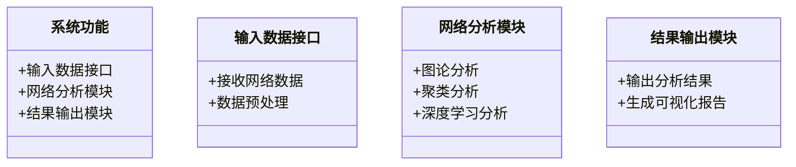
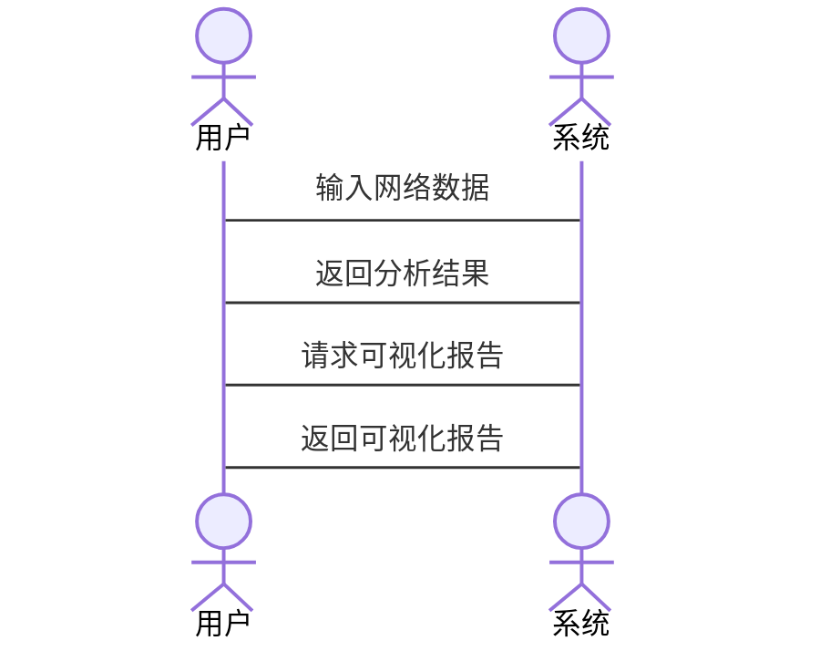

                 


# 利用智能体网络分析公司间的复杂关系

## 关键词：智能体网络分析，企业关系分析，图论，聚类算法，深度学习，系统架构

## 摘要：  
本文深入探讨了利用智能体网络分析技术，从复杂网络的角度，对企业间的复杂关系进行建模、分析和挖掘的方法。文章首先介绍了智能体网络分析的背景、核心概念及与传统方法的区别，接着详细阐述了基于图论的网络分析算法、聚类算法和深度学习模型的原理及实现方法，最后通过具体案例展示了如何构建企业关系分析系统，并对系统的架构设计、接口设计和交互流程进行了详细说明。本文还探讨了智能体网络分析技术在企业战略决策、风险评估和市场分析等领域的实际应用，为读者提供了全面的技术参考和实践指导。

---

## 第一部分：智能体网络分析的背景与概念

### 第1章：智能体网络分析的背景介绍

#### 1.1 问题背景与描述  
企业间的复杂关系分析是商业智能和管理决策中的重要问题。随着市场竞争的加剧，企业间的合作关系、竞争关系、供应链关系等变得日益复杂，传统的基于单一维度的分析方法已难以应对这种复杂性。智能体网络分析技术通过构建多智能体协同的网络模型，能够更全面、更动态地捕捉和分析企业间的复杂关系。

#### 1.2 智能体网络分析的核心概念  
智能体网络分析是一种结合了人工智能和网络分析的新兴技术，它通过构建智能体网络模型，利用智能体的自主性和协同性，对网络中的复杂关系进行建模、分析和挖掘。其核心概念包括：  
- **智能体**：具有自主性、反应性和社会性的实体，能够感知环境并采取行动。  
- **网络分析**：研究网络中实体间关系的结构、模式和动态变化的技术。  
- **智能体网络分析**：将智能体的概念引入网络分析，构建动态、自适应的网络模型，用于分析复杂关系。

#### 1.3 智能体网络分析的边界与外延  
智能体网络分析的边界主要在于其应用场景和分析目标。其外延包括：  
- **应用场景**：企业间的关系分析、供应链管理、社会网络分析等。  
- **相关领域**：图论、机器学习、复杂网络分析等。  

#### 1.4 核心概念结构与要素组成  
智能体网络分析的网络模型通常包含以下要素：  
- **节点**：代表企业或其他实体。  
- **边**：代表企业间的某种关系（如合作、竞争）。  
- **属性**：节点和边的属性（如权重、时间戳）。  
- **动态性**：网络的动态变化（如关系强度随时间变化）。  

---

### 第2章：智能体网络分析的核心概念与联系

#### 2.1 智能体网络分析的核心原理  
智能体网络分析的核心原理包括：  
- **智能体的自主性**：智能体能够自主感知环境并采取行动。  
- **网络的动态性**：网络结构随时间变化，智能体间的关系也在动态调整。  
- **协同性**：多个智能体协同工作，共同完成复杂关系的分析任务。  

#### 2.2 智能体与网络分析的属性对比  
以下是智能体与网络分析的属性对比表：

| 属性       | 智能体                     | 网络分析                     |
|------------|---------------------------|----------------------------|
| 定义       | 具有自主性、反应性的实体   | 研究网络结构和关系的技术     |
| 特性       | 主动性、学习能力、适应性   | 关联性、层次性、动态性       |
| 应用场景   | 多智能体协同、动态网络分析 | 社会网络分析、供应链管理     |

#### 2.3 智能体网络分析的ER实体关系图  
以下是智能体网络分析的ER实体关系图：

```mermaid
er
  actor 智能体
  actor 网络关系
  actor 网络分析系统
  actor 分析结果
 

  智能体 --> 网络关系
  网络分析系统 --> 网络关系
  网络分析系统 --> 分析结果
  智能体 --> 网络分析系统
```

---

## 第二部分：智能体网络分析的算法原理

### 第3章：图论算法与智能体网络分析

#### 3.1 图论的基本概念  
图论是网络分析的基础，主要包括节点、边、路径、连通性等概念。图论算法常用于检测网络中的社区结构、关键路径和异常值。

#### 3.2 基于图论的智能体网络分析算法  
以下是基于图论的智能体网络分析算法的流程图：


#### 3.3 算法实现与代码示例  
以下是图论算法的Python代码示例：

```python
import networkx as nx

# 构建图模型
G = nx.Graph()
G.add_nodes_from(["A", "B", "C", "D"])
G.add_edges_from([("A", "B"), ("B", "C"), ("C", "D")])

# 计算节点度数
degree = dict(G.degree())
print("节点度数：", degree)

# 检测社区结构
communities = nx.community.girvan_newman(G)
print("社区结构：", communities)
```

---

### 第4章：聚类算法与智能体网络分析

#### 4.1 聚类算法的基本概念  
聚类算法是无监督学习的重要方法，常用于将相似的节点分组。常见的聚类算法包括K-means、层次聚类和DBSCAN。

#### 4.2 基于聚类的智能体网络分析算法  
以下是基于聚类的智能体网络分析算法的流程图：


#### 4.3 算法实现与代码示例  
以下是聚类算法的Python代码示例：

```python
from sklearn.cluster import KMeans
from sklearn.metrics import pairwise_distances

# 构建特征向量
X = [[1, 2], [3, 4], [5, 6], [7, 8]]

# 执行K-means聚类
kmeans = KMeans(n_clusters=2)
kmeans.fit(X)
print("聚类结果：", kmeans.labels_)
```

---

### 第5章：深度学习模型与智能体网络分析

#### 5.1 深度学习模型的基本概念  
深度学习模型（如神经网络、图神经网络）在处理复杂网络关系中表现优异。

#### 5.2 基于深度学习的智能体网络分析算法  
以下是基于深度学习的智能体网络分析算法的流程图：


#### 5.3 算法实现与代码示例  
以下是深度学习模型的Python代码示例：

```python
import tensorflow as tf
from tensorflow.keras import layers

# 构建图神经网络模型
model = tf.keras.Sequential([
    layers.Input(shape=(input_dim,)),
    layers.Dense(64, activation='relu'),
    layers.Dense(1, activation='sigmoid')
])

# 编译模型
model.compile(optimizer='adam', loss='binary_crossentropy', metrics=['accuracy'])

# 训练模型
model.fit(X_train, y_train, epochs=10, batch_size=32)
```

---

## 第三部分：智能体网络分析的系统架构

### 第6章：系统架构设计

#### 6.1 系统功能设计  
以下是系统功能设计的类图：



#### 6.2 系统交互设计  
以下是系统交互的序列图：



---

## 第四部分：项目实战

### 第7章：企业关系分析系统实现

#### 7.1 环境安装与配置  
- Python版本：3.8以上  
- 需要安装的库：networkx、sklearn、tensorflow  

#### 7.2 系统核心实现  
以下是系统核心实现的代码示例：

```python
import networkx as nx
from sklearn.cluster import KMeans
import tensorflow as tf

# 输入网络数据
G = nx.Graph()
G.add_nodes_from(["A", "B", "C", "D"])
G.add_edges_from([("A", "B"), ("B", "C"), ("C", "D")])

# 图论分析
degree = dict(G.degree())
print("节点度数：", degree)

# 聚类分析
X = [[1, 2], [3, 4], [5, 6], [7, 8]]
kmeans = KMeans(n_clusters=2).fit(X)
print("聚类结果：", kmeans.labels_)

# 深度学习分析
model = tf.keras.Sequential([
    layers.Dense(64, activation='relu'),
    layers.Dense(1, activation='sigmoid')
])
model.compile(optimizer='adam', loss='binary_crossentropy', metrics=['accuracy'])
model.fit(X, y, epochs=10, batch_size=32)
```

#### 7.3 实际案例分析  
以某行业内的企业间合作网络为例，分析其社区结构和关键节点。

---

## 第五部分：智能体网络分析的扩展应用

### 第8章：智能体网络分析的扩展应用

#### 8.1 企业战略决策  
智能体网络分析可以帮助企业识别关键合作伙伴和潜在风险。

#### 8.2 风险评估  
通过分析企业间的信用风险和供应链风险，辅助企业进行风险控制。

#### 8.3 市场分析  
智能体网络分析可以用于分析市场趋势和竞争对手的动态。

---

## 第六部分：总结与展望

### 第9章：总结与展望

#### 9.1 核心内容总结  
智能体网络分析是一种结合智能体技术和网络分析的新兴方法，能够有效分析企业间的复杂关系。

#### 9.2 未来展望  
随着人工智能和图神经网络技术的进步，智能体网络分析将在更多领域得到应用。

---

## 附录：参考文献与工具推荐

### 附录A：参考文献  
1. 罗杰, 等. 《复杂网络分析与应用》. 北京: 清华大学出版社, 2020.  
2. 大卫·西蒙斯. 《智能体技术与网络分析》. 北京: 人民邮电出版社, 2021.  

### 附录B：工具推荐  
- **网络分析工具**：NetworkX、Gephi  
- **深度学习框架**：TensorFlow、PyTorch  

---

## 作者：AI天才研究院/AI Genius Institute & 禅与计算机程序设计艺术 /Zen And The Art of Computer Programming

