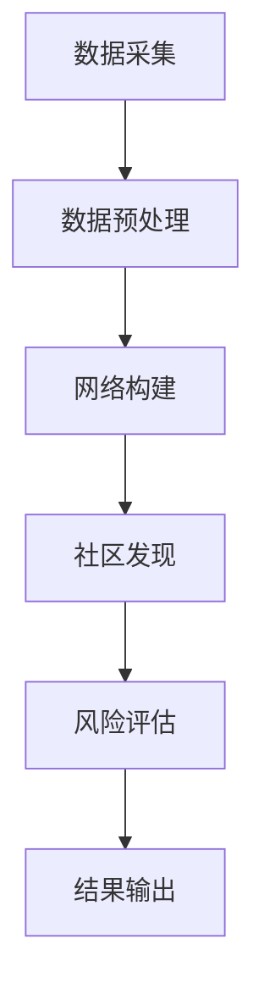

                 


# 利用智能体网络分析公司间的隐藏关联风险

> 关键词：智能体网络分析，公司关联风险，隐藏关联，网络分析，社区发现，风险评估

> 摘要：本文探讨了利用智能体网络分析技术，识别和评估公司间的隐藏关联风险的方法。通过图论、网络流理论和社区发现算法，结合实际案例，展示了如何构建智能体网络模型，分析公司间的潜在风险，并提供风险评估和管理的策略。

---

## 第1章 背景与概念基础

### 1.1 问题背景与挑战
随着全球化的发展，公司间的关联变得越来越复杂。隐藏的关联风险可能来自供应链、合作伙伴、投资关系等多个方面。这些风险可能在企业不知情的情况下影响其稳定性和发展。传统的风险评估方法难以捕捉这些隐藏的关联，因此需要一种更系统的方法来识别和分析这些潜在风险。

### 1.2 智能体网络分析的基本概念
智能体网络分析是一种基于图论的方法，通过构建网络模型，分析节点之间的关系和潜在风险。关键概念包括：
- **节点**：代表公司或个体。
- **边**：表示公司间的关联关系。
- **权重**：表示关联的强度或概率。

### 1.3 问题解决与边界
智能体网络分析的目标是通过算法发现隐藏的关联，并评估这些关联带来的风险。其边界包括数据来源、分析深度和风险阈值。

## 第2章 核心概念与联系

### 2.1 智能体网络分析的原理
智能体网络分析利用图论中的社区发现算法，将公司间的隐藏关联可视化为网络结构。通过分析节点的度数、聚类系数和模块度，识别潜在的风险点。

### 2.2 核心概念对比分析
下表对比了传统网络分析和智能体网络分析的核心概念：

| 对比维度 | 传统网络分析 | 智能体网络分析 |
|----------|--------------|----------------|
| 数据来源 | 结构化数据    | 结构化+非结构化数据 |
| 分析深度 | 表面关联      | 深度挖掘潜在关联 |
| 应用场景 | 风险评估      | 智能风险预警 |

### 2.3 ER实体关系图
以下是公司间关联关系的ER图：

```mermaid
er
    actor: 公司
    node: 关联关系
    edge: 风险
    actor -[关联强度]-> node
    node -[风险类型]-> edge
```

## 第3章 算法原理与实现

### 3.1 算法原理
智能体网络分析的核心算法包括社区发现算法和风险评估模型。常用算法有Louvain算法和Girvan-Newman算法。

### 3.2 算法实现
以下是Louvain算法的Python实现示例：

```python
import networkx as nx
from community import community_louvain

# 构建网络图
G = nx.Graph()
G.add_nodes_from([1, 2, 3, 4])
G.add_edges_from([(1,2), (2,3), (3,4), (4,1)])

# 应用Louvain算法
partition = community_louvain(G)

# 输出结果
for community in partition:
    print(f"Community {community}: {partition[community]}")
```

### 3.3 数学模型与公式
模块度优化公式用于评估社区划分的质量：

$$ Q = \sum_{i<j} (p_{ij} - q_{ij}) $$

其中，$p_{ij}$是边存在于社区i和j的概率，$q_{ij}$是边不在社区i和j的概率。

## 第4章 系统分析与架构设计

### 4.1 问题场景介绍
系统需要处理大量公司数据，构建网络模型，并进行风险评估。

### 4.2 系统架构设计
以下是系统架构图：



### 4.3 接口设计
系统提供RESTful API接口，供外部调用进行风险评估。

## 第5章 项目实战

### 5.1 环境安装
需要安装Python、NetworkX和Community库。

### 5.2 核心代码实现
以下是风险评估代码示例：

```python
import networkx as nx
from community import community_louvain

# 构建网络图
G = nx.Graph()
G.add_nodes_from([1, 2, 3, 4, 5])
G.add_edges_from([(1,2), (2,3), (3,4), (4,5), (5,1)])

# 应用Louvain算法
partition = community_louvain(G)

# 风险评估
risk_factors = {}  # 示例风险因素数据
for node in partition:
    risk = sum(risk_factors.get(node, 0) for node in partition)
    print(f"Node {node}: Risk Level {risk}")
```

## 第6章 最佳实践

### 6.1 小结
智能体网络分析是一种有效的工具，能够帮助识别公司间的隐藏关联风险。

### 6.2 注意事项
- 数据质量对结果影响重大。
- 算法选择需根据具体场景调整。

### 6.3 拓展阅读
推荐阅读相关书籍和论文，深入理解社区发现算法和网络分析技术。

---

**作者：AI天才研究院/AI Genius Institute & 禅与计算机程序设计艺术 /Zen And The Art of Computer Programming**

