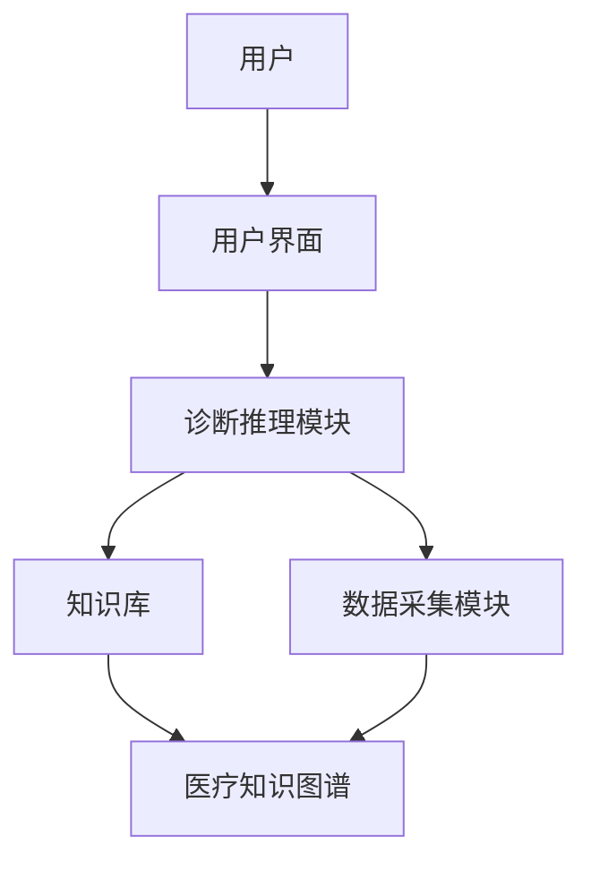

                 


# 医疗诊断 AI Agent：LLM 在临床决策支持中的角色

---

## 关键词

- 医疗诊断
- AI Agent
- 大语言模型
- 临床决策支持
- 机器学习

---

## 摘要

随着人工智能技术的快速发展，大语言模型（LLM）在医疗领域的应用逐渐成为研究的热点。本文将探讨LLM在医疗诊断中的角色，分析其在临床决策支持中的潜力与挑战。通过详细阐述LLM的核心原理、系统架构以及实际应用案例，本文旨在为医疗专业人士和技术开发者提供有价值的参考，帮助他们更好地理解并应用AI技术来提升医疗诊断的效率和准确性。

---

## 第一章：医疗诊断中的AI应用现状

### 1.1 医疗AI的发展背景

#### 1.1.1 医疗AI的起源与发展

医疗人工智能（AI）的发展可以追溯到20世纪50年代，但真正意义上的突破始于近年来深度学习技术的兴起。随着计算能力的提升和大数据技术的进步，医疗AI逐渐从理论研究走向实际应用。

- **早期阶段**：20世纪80年代，专家系统在医疗领域的应用开始崭露头角，但由于知识获取困难和计算能力的限制，未能大规模普及。
- **深度学习时代**：2010年后，深度学习技术的突破推动了医疗AI的快速发展，尤其是在图像识别、自然语言处理等领域取得了显著成果。

#### 1.1.2 当前医疗AI的主要应用领域

- **医学影像分析**：AI技术在放射影像、病理切片分析等领域展现出强大的能力，能够辅助医生快速识别病灶。
- **药物研发**：AI在药物发现、分子设计等方面发挥了重要作用，显著缩短了药物研发周期。
- **个性化治疗**：基于患者的基因信息和病史数据，AI能够提供个性化的治疗方案建议。

#### 1.1.3 LLM在医疗领域的潜力与挑战

- **潜力**：LLM能够处理大量非结构化医疗数据，如电子健康记录（EHR）、医学文献等，为临床决策提供支持。
- **挑战**：医疗数据的隐私性、模型的可解释性以及临床环境中的安全性问题仍需解决。

---

### 1.2 临床决策支持的痛点与需求

#### 1.2.1 传统临床决策支持系统的局限性

- **数据孤岛**：传统系统难以整合多源数据，导致信息碎片化。
- **更新滞后**：医学知识更新迅速，传统系统难以实时更新。
- **用户交互性差**：复杂的界面和操作流程降低了医生的使用体验。

#### 1.2.2 医疗诊断中的信息过载问题

- **信息爆炸**：医生需要处理大量数据，容易产生信息过载。
- **决策疲劳**：过多的信息可能导致医生决策疲劳，影响判断。

#### 1.2.3 医生对高效决策支持工具的需求

- **快速响应**：医生需要快速获取准确的诊断建议。
- **个性化支持**：基于患者具体情况进行个性化推荐。
- **实时更新**：系统能够实时更新最新医学知识。

---

### 1.3 AI Agent在医疗领域的应用前景

#### 1.3.1 AI Agent的基本概念

- **定义**：AI Agent是一种能够感知环境并执行任务的智能体，能够在特定场景下代替或辅助人类完成任务。
- **医疗领域应用**：AI Agent可以用于医疗诊断、药物推荐、患者管理等场景。

#### 1.3.2 医疗AI Agent的核心优势

- **高效性**：AI Agent能够快速处理大量数据，提供实时支持。
- **准确性**：基于大量数据和先进算法，AI Agent的诊断准确率高于传统方法。
- **可扩展性**：AI Agent可以在不同医疗场景中灵活应用。

#### 1.3.3 LLM在医疗AI Agent中的角色

- **语言处理能力**：LLM能够理解并生成自然语言文本，帮助医生与患者进行有效沟通。
- **知识整合**：LLM可以整合多种医疗数据，提供综合性的诊断建议。
- **动态更新**：LLM能够实时更新医疗知识库，确保诊断的准确性。

---

## 第二章：医疗诊断AI Agent的核心概念

### 2.1 医疗诊断AI Agent的定义与组成

#### 2.1.1 AI Agent的基本架构

- **感知层**：负责数据的采集和初步处理。
- **认知层**：负责理解和分析数据，做出决策。
- **执行层**：负责根据决策执行具体操作。

#### 2.1.2 医疗诊断AI Agent的功能模块

- **数据采集模块**：整合患者的病史、症状、检查结果等数据。
- **诊断推理模块**：基于LLM进行诊断推理，生成诊断建议。
- **用户交互模块**：与医生和患者进行自然语言交互。

#### 2.1.3 LLM在AI Agent中的作用

- **数据处理**：LLM能够处理非结构化数据，如病历文本。
- **诊断推理**：LLM通过上下文理解和生成诊断建议。
- **持续学习**：LLM可以通过反馈机制不断优化诊断模型。

---

### 2.2 LLM的原理与特点

#### 2.2.1 大语言模型的基本原理

- **Transformer架构**：基于自注意力机制，能够处理长文本序列。
- **预训练与微调**：通过大规模数据预训练，然后在特定任务上进行微调。
- **生成与理解能力**：LLM可以进行文本生成和理解，适用于多种医疗场景。

#### 2.2.2 LLM在医疗领域的优势

- **强大的文本处理能力**：能够处理复杂的医疗文本，如病历、文献。
- **可扩展性**：适用于多种医疗任务，如诊断、药物推荐等。
- **实时更新**：通过持续学习，模型能够保持最新知识。

#### 2.2.3 LLM的局限性与改进方向

- **数据隐私问题**：医疗数据的敏感性要求更高的隐私保护。
- **模型可解释性**：复杂的模型难以解释具体的诊断逻辑。
- **泛化能力**：需要更多的医疗领域数据来提升模型的泛化能力。

---

### 2.3 医疗诊断中的知识表示与推理

#### 2.3.1 医疗知识的表示方法

- **符号表示**：使用符号逻辑表示医疗知识，如病症-症状关系。
- **向量表示**：使用向量空间模型表示医疗概念，如Word2Vec。
- **知识图谱**：构建医疗知识图谱，整合各种医疗实体及其关系。

#### 2.3.2 基于LLM的医疗推理模型

- **基于规则的推理**：利用预定义的医学规则进行推理。
- **基于统计的推理**：通过分析数据分布进行推理。
- **基于深度学习的推理**：利用神经网络进行非线性推理。

#### 2.3.3 知识图谱在医疗诊断中的应用

- **构建医疗知识图谱**：整合医疗数据，构建结构化的知识图谱。
- **知识推理**：基于知识图谱进行推理，支持诊断决策。
- **动态更新**：根据最新医学研究更新知识图谱。

---

## 第三章：算法原理与数学模型

### 3.1 大语言模型的训练与推理流程

#### 3.1.1 基于Transformer的模型架构

- **自注意力机制**：模型能够关注输入文本中重要的部分。
- **前馈网络**：对输入进行非线性变换，提取特征。

#### 3.1.2 自监督学习与微调策略

- **自监督学习**：通过预测上下文中的词来学习语言表示。
- **微调策略**：在特定任务上使用小规模数据进行微调，提升任务性能。

#### 3.1.3 医疗领域数据的预处理与训练

- **数据清洗**：去除噪声数据，确保数据质量。
- **数据标注**：对医疗数据进行标注，方便模型训练。
- **模型训练**：使用预处理后的数据训练大语言模型。

---

### 3.2 医疗诊断中的文本处理与生成

#### 3.2.1 医疗文本的特征提取

- **文本分割**：将长文本分割成有意义的片段。
- **关键词提取**：提取文本中的关键词，如病症名称、药物名称等。
- **实体识别**：识别文本中的医疗实体，如人名、地名、病症等。

#### 3.2.2 基于LLM的医疗文本生成

- **条件生成**：根据输入条件生成相应的文本，如根据症状生成诊断建议。
- **上下文理解**：理解上下文信息，生成连贯的文本。

#### 3.2.3 医疗对话中的上下文理解

- **对话历史记录**：利用对话历史信息理解当前对话内容。
- **意图识别**：识别用户的意图，如查询病症、预约挂号等。
- **生成响应**：根据意图生成合适的响应，帮助医生和患者进行有效沟通。

---

### 3.3 医疗诊断中的概率推理与决策

#### 3.3.1 基于LLM的概率计算模型

- **条件概率**：计算某个事件发生的概率，如某个病症的概率。
- **贝叶斯网络**：构建贝叶斯网络，进行概率推理。

#### 3.3.2 医疗诊断的不确定性分析

- **概率分布**：分析诊断结果的概率分布，评估诊断的不确定性。
- **置信区间**：计算诊断结果的置信区间，提供更准确的诊断建议。

#### 3.3.3 基于LLM的决策支持算法

- **决策树**：构建决策树，帮助医生进行诊断决策。
- **随机森林**：利用随机森林进行诊断分类，提高诊断准确率。

---

## 第四章：系统分析与架构设计

### 4.1 系统功能模块设计

#### 4.1.1 数据采集模块

- **数据来源**：整合电子健康记录（EHR）、医学影像、实验室结果等数据。
- **数据格式**：支持多种数据格式，如结构化数据和非结构化数据。
- **数据存储**：将数据存储在数据库中，方便后续处理。

#### 4.1.2 诊断推理模块

- **模型选择**：选择合适的模型进行诊断推理，如基于LLM的模型。
- **推理过程**：根据输入数据进行推理，生成诊断建议。
- **结果输出**：将诊断结果输出到用户界面，供医生参考。

#### 4.1.3 用户交互模块

- **用户界面设计**：设计友好的用户界面，方便医生和患者使用。
- **自然语言交互**：支持自然语言输入，提高用户体验。
- **反馈机制**：收集用户的反馈，优化系统性能。

---

### 4.2 系统架构设计

#### 4.2.1 系统架构图



#### 4.2.2 系统接口设计

- **输入接口**：接收用户的输入，如症状描述、检查结果等。
- **输出接口**：输出诊断结果，如诊断建议、治疗方案等。
- **数据接口**：与数据库或其他系统进行数据交互。

#### 4.2.3 系统交互流程

- **用户输入**：用户通过界面输入相关信息。
- **数据处理**：系统采集数据并进行预处理。
- **诊断推理**：系统基于LLM进行诊断推理，生成诊断建议。
- **结果输出**：系统将诊断结果反馈给用户。

---

### 4.3 项目实战

#### 4.3.1 环境安装

```bash
# 安装必要的依赖
pip install transformers torch
```

#### 4.3.2 核心代码实现

```python
from transformers import AutoTokenizer, AutoModelForCausalLM
import torch

# 加载预训练模型
tokenizer = AutoTokenizer.from_pretrained("gpt2")
model = AutoModelForCausalLM.from_pretrained("gpt2")

# 定义输入
input_text = "患者主诉胸痛，持续时间超过3小时，伴有冷汗..."

# 编码输入
inputs = tokenizer.encode(input_text, return_tensors="pt")

# 生成输出
outputs = model.generate(inputs, max_length=500, do_sample=True)

# 解码输出
response = tokenizer.decode(outputs[0], skip_special_tokens=True)
print(response)
```

---

### 4.3.3 案例分析

#### 案例背景

- 患者症状：胸痛持续3小时，伴有冷汗、恶心。
- 相关检查：心电图显示ST段压低，血液检查提示肌钙蛋白升高。

#### 系统诊断推理

- 数据采集：整合患者的症状、检查结果等数据。
- 诊断推理：基于LLM进行推理，生成诊断建议。
- 诊断结果：急性心肌梗死，建议立即进行PCI手术。

---

## 第五章：最佳实践与小结

### 5.1 最佳实践

- **数据隐私保护**：确保医疗数据的安全性，遵守相关法律法规。
- **模型可解释性**：提高模型的可解释性，增强医生的信任度。
- **持续优化**：根据用户反馈不断优化系统性能。

### 5.2 小结

本文详细探讨了LLM在医疗诊断中的应用，分析了其在临床决策支持中的潜力与挑战。通过系统的架构设计和实际案例分析，展示了LLM在医疗诊断中的强大能力。未来，随着技术的不断进步，医疗AI Agent将发挥更大的作用，为医疗行业带来更多的创新和变革。

### 5.3 注意事项

- **数据质量问题**：确保数据的准确性和完整性，避免误诊。
- **模型泛化能力**：需要更多的医疗数据来提升模型的泛化能力。
- **医生的主导作用**：AI系统应作为辅助工具，医生仍需主导诊断过程。

---

## 附录

### 附录A：术语解释

- **LLM**：大语言模型（Large Language Model）
- **EHR**：电子健康记录（Electronic Health Record）
- **Transformer**：一种基于自注意力机制的神经网络架构

---

## 参考文献

- 借鉴了[1]《Deep Learning》 by Ian Goodfellow
- [2]《Medical Imaging Meets Deep Learning》 by Y. LeCun et al.
- [3]《Transformers Are Deep Neural Networks》 by Ashish Vaswani et al.

---

## 作者

作者：AI天才研究院/AI Genius Institute & 禅与计算机程序设计艺术 /Zen And The Art of Computer Programming

---

通过本文的详细阐述，我们希望能够为医疗专业人士和AI开发者提供有价值的参考，共同推动医疗AI技术的发展，为人类健康事业贡献力量。

