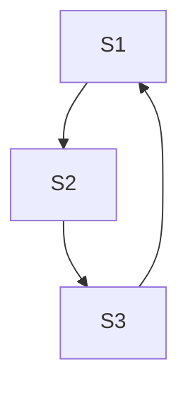
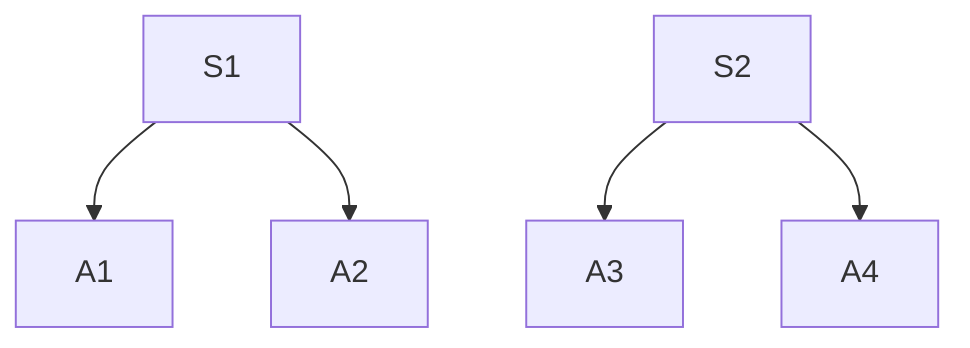
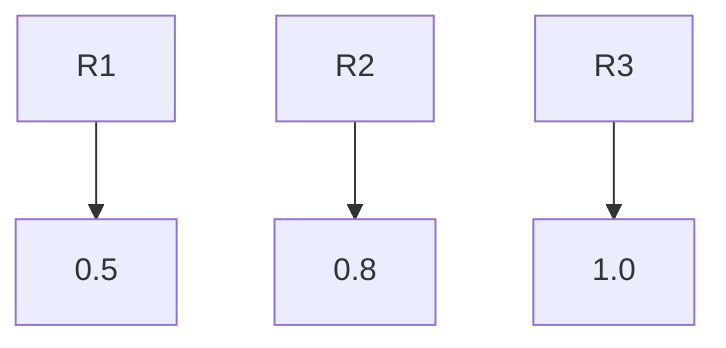
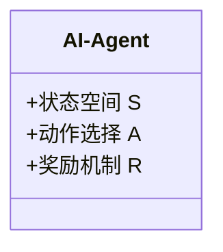
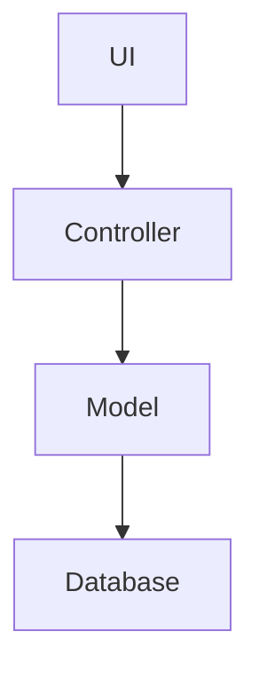

                 


# 可视化调试：深入了解AI Agent的决策过程

**关键词**：AI Agent、决策过程、可视化调试、强化学习、算法原理、系统架构、项目实战

**摘要**：本文深入探讨AI Agent的决策过程，通过可视化技术帮助理解其工作原理。文章从AI Agent的基本概念入手，分析其决策过程的数学模型，详细介绍可视化调试的核心技术，并通过实际案例展示其应用。最后，总结最佳实践和未来发展方向。

---

# 第1章: AI Agent与可视化调试概述

## 1.1 AI Agent的基本概念

### 1.1.1 AI Agent的定义与分类

AI Agent（智能体）是指能够感知环境、做出决策并采取行动的实体。根据智能水平，AI Agent可以分为反应式和认知式两类。反应式Agent仅基于当前感知做出反应，而认知式Agent具备推理和规划能力。

$$
\text{反应式Agent} \subset \text{认知式Agent}
$$

### 1.1.2 AI Agent的决策过程

AI Agent的决策过程包括感知、推理和行动三个阶段：

1. **感知阶段**：通过传感器或数据输入获取环境信息。
2. **推理阶段**：基于感知信息，利用算法生成决策。
3. **行动阶段**：根据决策执行操作。

### 1.1.3 可视化调试的重要性

可视化调试通过图形化界面展示AI Agent的决策过程，帮助开发者快速定位问题、优化算法。

---

## 1.2 可视化调试的核心理念

### 1.2.1 可视化调试的基本概念

可视化调试是指将AI Agent的决策过程转化为图形、图表等形式，便于分析和优化。

### 1.2.2 可视化调试的优势

- **直观展示**：通过图形化界面理解复杂决策过程。
- **快速定位问题**：及时发现算法缺陷。
- **优化算法**：基于可视化反馈改进决策模型。

### 1.2.3 可视化调试的应用场景

- **教育培训**：帮助学生理解AI Agent的工作原理。
- **算法开发**：加速AI Agent的开发和优化。
- **系统监控**：实时监控AI Agent的运行状态。

---

# 第2章: AI Agent的决策过程模型

## 2.1 决策过程的三阶段模型

### 2.1.1 感知阶段

AI Agent通过传感器或数据源获取环境信息，如图像、文本等。

### 2.1.2 推理阶段

基于感知信息，AI Agent利用算法生成决策。常用的算法包括决策树、随机森林和神经网络。

### 2.1.3 行动阶段

根据推理结果，AI Agent采取具体行动，如移动机器人或发出指令。

### 2.1.4 决策过程的可视化表示

- **状态空间**：展示所有可能的状态及其转移。
- **动作选择**：显示AI Agent在每个状态下的动作选择。
- **奖励机制**：展示奖励值的变化情况。

---

## 2.2 决策过程的数学模型

### 2.2.1 状态空间的定义

状态空间由所有可能的状态组成，通常用集合表示：

$$
S = \{s_1, s_2, ..., s_n\}
$$

### 2.2.2 动作选择的策略

动作选择策略定义了AI Agent在每个状态下选择动作的规则，如Q-learning算法：

$$
Q(s, a) = r + \gamma \max(Q(s', a'))
$$

### 2.2.3 奖励机制的设计

奖励机制通过数值反馈指导AI Agent的行为优化，常用折扣因子：

$$
\gamma \in [0, 1)
$$

---

## 2.3 决策过程的可视化表示

### 2.3.1 状态空间的可视化

使用mermaid图表展示状态空间及其转移：



### 2.3.2 动作选择的可视化

展示AI Agent在每个状态下的动作选择：



### 2.3.3 奖励机制的可视化

展示奖励值的变化情况：



---

# 第3章: 可视化调试技术的核心原理

## 3.1 数据采集与处理

### 3.1.1 决策过程数据的采集

通过日志记录AI Agent的决策数据，包括状态、动作和奖励值。

### 3.1.2 数据预处理方法

- **去噪处理**：去除异常数据。
- **归一化**：统一数据范围。

### 3.1.3 数据格式的标准化

确保数据格式统一，便于后续处理和可视化。

---

## 3.2 可视化展示方法

### 3.2.1 图形化的决策过程展示

使用图表展示决策过程，如状态转移图和动作选择图。

### 3.2.2 动态交互的可视化界面

开发交互式界面，允许用户动态调整参数并观察结果。

### 3.2.3 可视化工具的选择

推荐使用Matplotlib和Tableau等工具进行数据可视化。

---

## 3.3 人机交互设计

### 3.3.1 用户界面设计原则

- **简洁性**：界面简洁直观。
- **可定制性**：允许用户自定义视图。

### 3.3.2 交互操作的实现

开发交互功能，如缩放、拖放和过滤。

### 3.3.3 用户反馈机制

通过颜色和动画反馈用户操作结果。

---

# 第4章: 决策过程的数学建模

## 4.1 状态空间的数学表示

使用向量表示状态，如：

$$
s = (s_1, s_2, ..., s_n)
$$

## 4.2 动作选择的算

采用Q-learning算法进行动作选择：

$$
Q(s, a) = Q(s, a) + \alpha (r + \gamma \max Q(s', a') - Q(s, a))
$$

## 4.3 奖励机制的设计

设计奖励函数，如：

$$
r = \begin{cases}
1 & \text{if } \text{成功} \\
-1 & \text{if } \text{失败}
\end{cases}
$$

---

# 第5章: 可视化调试系统的架构设计

## 5.1 系统功能设计

### 5.1.1 领域模型

展示系统模块划分：



### 5.1.2 系统架构

展示系统整体架构：



---

# 第6章: 项目实战

## 6.1 环境安装

安装必要的库和工具，如Python、NumPy和Matplotlib。

## 6.2 核心实现

### 6.2.1 状态空间实现

编写代码生成状态空间：

```python
def generate_states(n):
    return [i for i in range(n)]
```

### 6.2.2 动作选择实现

实现Q-learning算法：

```python
def update_Q(Q, s, a, r, s_prime, gamma, alpha):
    Q[s][a] += alpha * (r + gamma * max(Q[s_prime]) - Q[s][a])
```

### 6.2.3 可视化展示

使用Matplotlib绘制状态转移图：

```python
import matplotlib.pyplot as plt
plt.plot(states, actions)
plt.show()
```

## 6.3 案例分析

分析实际案例，如交通信号灯控制，展示可视化调试的效果。

---

# 第7章: 最佳实践与总结

## 7.1 关键点总结

总结可视化调试的关键点，如数据采集、算法实现和界面设计。

## 7.2 小结

回顾全文，强调可视化调试的重要性。

## 7.3 注意事项

提醒读者注意数据隐私和系统性能问题。

## 7.4 拓展阅读

推荐相关书籍和论文，如《强化学习》和《可视化编程》。

---

# 作者

**作者：AI天才研究院/AI Genius Institute & 禅与计算机程序设计艺术 /Zen And The Art of Computer Programming**

---

这篇文章系统地介绍了AI Agent的决策过程及其可视化调试技术，通过理论分析和实际案例展示了如何优化AI Agent的决策过程。

