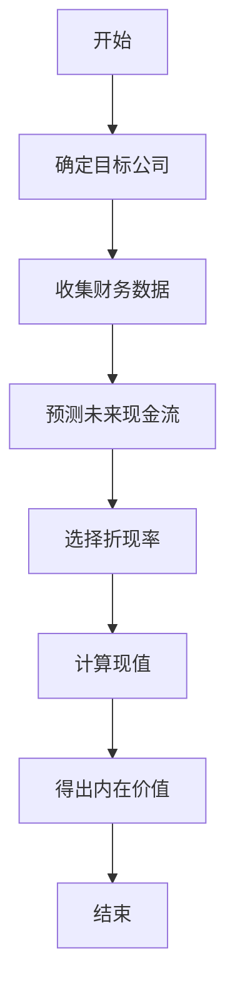
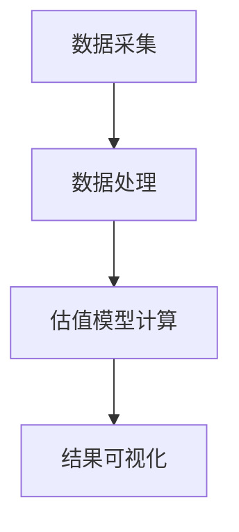

                 


# 唐纳德·约斯的深度价值投资：寻找被市场遗忘的公司

---

## 关键词  
深度价值投资、唐纳德·约斯、被低估公司、DCF模型、市场遗忘现象、投资策略  

---

## 摘要  
深度价值投资是一种以寻找市场中被低估的公司为核心策略的投资方法。本文将从唐纳德·约斯的视角出发，详细探讨深度价值投资的核心概念、数学模型、系统设计以及实战案例。通过分析现金流折现模型（DCF）、财务指标和市场情绪等关键因素，揭示如何识别被市场遗忘的公司，并构建一套完整的投资系统。本文旨在为投资者提供一套科学、系统的方法，帮助他们在复杂的市场中找到潜在的价值洼地。

---

# 第一章: 深度价值投资的背景与核心概念

## 1.1 价值投资的定义与核心理念  
深度价值投资是一种以**内在价值**为核心的投资策略，旨在通过分析公司基本面，寻找市场价格低于其内在价值的投资标的。其核心理念是：市场短期是投票器，长期是称重机。  

### 1.1.1 价值投资与其他投资策略的对比  
| 投资策略 | 核心理念 | 适用场景 |  
|----------|----------|----------|  
| 短期交易 | 抓住市场波动 | 市场波动频繁，适合高频交易者 |  
| 股票投资 | 依赖市场趋势 | 适用于趋势明确的市场环境 |  
| 深度价值投资 | 寻找被低估的公司 | 适用于市场波动较大，部分公司被市场忽视的情况 |  

## 1.2 唐纳德·约斯的贡献与影响力  
唐纳德·约斯通过其独特的视角，提出了深度价值投资的核心理念：**安全边际**。他强调，在投资中，不仅要评估公司的内在价值，还要确保买入价格与内在价值之间存在足够的安全边际，以应对市场的不确定性。  

---

# 第二章: 深度价值投资的数学模型

## 2.1 现金流折现模型（DCF）  
现金流折现模型是深度价值投资中最重要的数学工具之一。其基本原理是将公司未来现金流折现到现值，以评估其内在价值。  

### 2.1.1 DCF模型的数学公式  
未来现金流的现值计算公式如下：  
$$ PV = \frac{CF}{(1 + r)^n} $$  
其中：  
- $CF$ 表示未来现金流  
- $r$ 表示折现率  
- $n$ 表示现金流的时间跨度  

### 2.1.2 DCF模型的流程图  


## 2.2 深度价值投资的其他估值方法  
除了DCF模型，深度价值投资还常用以下几种估值方法：  

### 2.2.1 市盈率（P/E）分析  
市盈率 = 股价 / 每股净利润  

### 2.2.2 市净率（P/B）分析  
市净率 = 股价 / 每股净资产  

### 2.2.3 企业价值倍数（EV/EBITDA）  
企业价值倍数 = 企业价值 / 息税折旧及摊销前利润  

---

# 第三章: 寻找被市场遗忘的公司

## 3.1 财务指标分析  
### 3.1.1 财务健康状况评估  
通过分析公司财务报表，重点关注以下指标：  
- 净利润  
- 营业收入增长率  
- 净利率  

### 3.1.2 异常值分析  
识别财务数据中的异常值，例如：  
- 过高的库存周转率  
- 过低的应收账款周转率  

### 3.1.3 数据对比分析  
将公司财务数据与行业平均水平进行对比，找出潜在的低估公司。  

## 3.2 市场情绪分析  
### 3.2.1 市场情绪的波动周期  
市场情绪通常呈现周期性波动，深度价值投资往往在市场恐慌时出现机会。  

### 3.2.2 如何识别被市场遗忘的公司  
通过分析市场情绪指标（如VIX指数），结合公司基本面，识别被市场忽视的公司。  

---

# 第四章: 深度价值投资的系统设计

## 4.1 系统功能模块划分  
### 4.1.1 数据采集模块  
从多种数据源（如财经网站、数据库）获取公司财务数据和市场数据。  

### 4.1.2 数据处理模块  
对获取的数据进行清洗、转换和标准化处理。  

### 4.1.3 估值模型计算模块  
使用DCF模型等方法计算公司内在价值。  

### 4.1.4 结果可视化模块  
将计算结果以图表形式展示，便于投资者理解。  

## 4.2 系统架构图  


---

# 第五章: 深度价值投资的实战案例

## 5.1 项目实战  
### 5.1.1 环境配置  
安装必要的工具和库，例如Python、Pandas、Matplotlib。  

### 5.1.2 代码实现  
以下是一个简单的DCF模型代码示例：  

```python
import pandas as pd
import numpy as np

# 假设未来现金流数据
CF = [100, 150, 200, 250]
r = 0.08

# 计算现值
PV = []
for i in range(len(CF)):
    pv = CF[i] / (1 + r) ** i
    PV.append(pv)

print("现值计算结果：", PV)
print("总现值：", sum(PV))
```

### 5.1.3 案例分析  
以某公司为例，分析其财务数据和市场情绪，计算其内在价值，并判断是否被市场低估。  

---

# 第六章: 深度价值投资的注意事项与未来展望

## 6.1 风险管理  
深度价值投资需要严格控制风险，特别是在市场波动较大的情况下。  

## 6.2 技术进步对投资的影响  
随着人工智能和大数据技术的发展，深度价值投资将更加依赖于数据驱动的决策。  

## 6.3 持续学习与优化  
投资策略需要不断优化和调整，以适应市场变化。  

---

# 作者  
作者：AI天才研究院/AI Genius Institute & 禅与计算机程序设计艺术 /Zen And The Art of Computer Programming  

---

# 小结  
通过本文的分析，读者可以深入了解深度价值投资的核心理念、数学模型和实战方法。无论是从理论还是实践角度，深度价值投资都为投资者提供了一种寻找被市场遗忘公司的有效策略。希望本文能为投资者在复杂多变的市场中提供有价值的指导。

