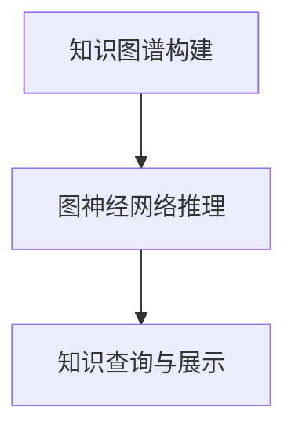

                 


# 图神经网络在AI Agent知识表示中的应用

**关键词**：图神经网络，AI Agent，知识表示，知识图谱，图嵌入，节点表示

**摘要**：本文探讨图神经网络（Graph Neural Networks, GNN）在AI Agent知识表示中的应用。首先介绍GNN的基本概念和模型，接着分析AI Agent的知识表示需求，然后详细阐述GNN如何通过图结构数据处理能力提升知识表示的效果，最后通过实际案例展示GNN在知识图谱构建和推理中的应用，并总结相关挑战和未来研究方向。

---

# 1. 图神经网络概述

## 1.1 图神经网络的基本概念

### 1.1.1 图的基本概念与表示
图（Graph）由节点（Vertex）和边（Edge）组成，用于表示实体及其关系。节点可以代表人、地点、事件等，边表示实体之间的关系。图可以是无向图（边无方向）或有向图（边有方向）。

### 1.1.2 图神经网络的定义与特点
图神经网络是一种处理图结构数据的深度学习模型。与传统的神经网络不同，GNN能够直接处理图数据，捕捉节点之间的关系和结构信息。

### 1.1.3 图神经网络的核心要素与属性
- **节点表示**：将节点嵌入到低维空间，捕捉节点特征。
- **边权重**：表示节点之间关系的强度或类型。
- **图结构**：图的拓扑结构决定了节点之间的关系。

---

## 1.2 图神经网络的模型与算法

### 1.2.1 基于邻居聚合的图神经网络
GNN通过聚合节点的邻居信息来更新节点表示。例如，GCN（Graph Convolutional Network）通过聚合相邻节点的特征来更新当前节点的表示。

### 1.2.2 图注意力机制
图注意力机制（Graph Attention Network, GAT）通过计算节点之间的注意力权重，动态调整信息聚合的权重。这使得模型能够关注更重要的邻居节点。

### 1.2.3 图嵌入与节点表示
图嵌入（Graph Embedding）将图中的节点映射到低维空间，用于表示学习。节点表示可以用于分类、聚类等任务。

---

## 1.3 图神经网络的应用场景

### 1.3.1 社交网络分析
GNN可以用于社交网络中的用户行为分析、影响力传播等任务。

### 1.3.2 知识图谱构建
GNN可以用于构建知识图谱，将实体及其关系表示为图结构。

### 1.3.3 实体关系推理
GNN能够通过图结构捕捉实体之间的复杂关系，用于推理任务。

---

# 2. AI Agent知识表示概述

## 2.1 AI Agent的基本概念

### 2.1.1 AI Agent的定义与分类
AI Agent是一个智能实体，能够感知环境、自主决策并执行任务。根据智能水平，AI Agent可以分为反应式、基于模型的和混合型Agent。

### 2.1.2 知识表示在AI Agent中的作用
知识表示是AI Agent的核心能力，决定了Agent如何理解和处理信息。有效的知识表示能够提升Agent的推理能力和决策能力。

### 2.1.3 知识表示的核心要素与挑战
- **核心要素**：知识的表示形式、表示的可扩展性、表示的可推理性。
- **挑战**：知识的动态性、复杂性、不确定性。

---

## 2.2 知识表示的主要方法

### 2.2.1 符号表示法
符号表示法使用符号和规则表示知识，例如逻辑规则、语义网络等。这种方法具有可解释性，但难以处理复杂关系。

### 2.2.2 向量表示法
向量表示法（如Word2Vec、BERT）将知识表示为向量，捕捉语义信息。这种方法适用于大规模数据，但缺乏语义可解释性。

### 2.2.3 图结构表示法
图结构表示法将知识表示为图结构，通过节点和边表示实体及其关系。这种方法能够捕捉复杂关系，适合知识图谱的构建。

---

## 2.3 知识图谱与知识库

### 2.3.1 知识图谱的构建与管理
知识图谱是一种大规模的知识表示形式，由节点和边组成。构建知识图谱需要数据抽取、实体识别、关系抽取等步骤。

### 2.3.2 知识库的组织与查询
知识库是一个结构化的知识存储系统，支持高效的查询和推理。

### 2.3.3 知识图谱的应用案例
例如，Google的Knowledge Graph用于搜索引擎优化，提供更准确的结果。

---

## 2.4 本章小结

---

# 3. 图神经网络在AI Agent知识表示中的结合

## 3.1 知识图谱与图神经网络的结合

### 3.1.1 知识图谱的图结构表示
知识图谱可以表示为图结构，其中节点是实体，边是关系。

### 3.1.2 图神经网络在知识图谱中的应用
GNN可以用于知识图谱的节点分类、链路预测、实体识别等任务。

### 3.1.3 知识图谱与图神经网络的优缺点对比

| 特性          | 知识图谱        | 图神经网络      |
|---------------|----------------|----------------|
| 数据结构      | 图结构          | 图结构          |
| 处理能力      | 适用于大规模    | 适用于复杂关系  |
| 可扩展性      | 高             | 高             |
| 可解释性      | 高             | 低             |

---

## 3.2 图神经网络的知识表示模型

### 3.2.1 基于图神经网络的知识表示方法
GNN通过聚合节点的邻居信息，生成节点的表示向量。

### 3.2.2 知识图谱中的节点表示
节点表示是GNN的核心任务，通过聚合邻居特征生成节点的低维表示。

### 3.2.3 知识图谱中的关系建模
GNN可以建模节点之间的关系，例如使用边权重表示关系强度。

---

## 3.3 图神经网络在AI Agent中的应用案例

### 3.3.1 智能问答系统
通过GNN构建的知识图谱，可以回答复杂的问题，例如“谁是某公司的创始人？”

### 3.3.2 实体链接
GNN可以用于实体链接，将文本中的实体映射到知识图谱中的节点。

---

## 3.4 本章小结

---

# 4. 图神经网络在AI Agent知识表示中的算法实现

## 4.1 图神经网络的数学模型

### 4.1.1 图的邻接矩阵表示
邻接矩阵（Adjacency Matrix）是一个方阵，表示节点之间的连接关系。

### 4.1.2 图的节点表示公式
节点表示公式如下：
$$
h_i^{(l+1)} = \sigma\left(\sum_{j \in N(i)} W_{ij} h_j^{(l)} + b_i\right)
$$
其中，$h_i^{(l)}$表示第$l$层的节点表示，$N(i)$表示节点$i$的邻居节点集合。

### 4.1.3 图注意力机制公式
注意力权重计算公式如下：
$$
\alpha_{ij} = \frac{\exp(e_i^T e_j)}{\sum_{k \neq i} \exp(e_i^T e_k)}
$$
其中，$e_i$表示节点$i$的嵌入向量。

---

## 4.2 图神经网络的实现步骤

### 4.2.1 数据预处理
将知识图谱转换为邻接矩阵或边列表。

### 4.2.2 模型训练
使用GNN模型对图数据进行训练，生成节点表示。

### 4.2.3 模型推理
使用训练好的模型进行知识推理任务，例如实体识别、关系推理。

---

## 4.3 图神经网络的代码实现

### 4.3.1 环境安装
安装必要的库，例如PyTorch、NetworkX、Scikit-learn等。

### 4.3.2 核心代码实现
```python
import torch
import torch.nn as nn
import torch.nn.functional as F

class GNNModel(nn.Module):
    def __init__(self, input_dim, hidden_dim):
        super(GNNModel, self).__init__()
        self.W = nn.Parameter(torch.randn(input_dim, hidden_dim))
        self.U = nn.Parameter(torch.randn(hidden_dim, hidden_dim))

    def forward(self, inputs, adj_matrix):
        h = torch.matmul(inputs, self.W)
        h = F.relu(torch.matmul(adj_matrix, h))
        return h
```

---

## 4.4 本章小结

---

# 5. 图神经网络在AI Agent知识表示中的系统架构设计

## 5.1 系统功能设计

### 5.1.1 知识图谱构建模块
负责将知识表示为图结构，包括数据抽取、实体识别、关系抽取。

### 5.1.2 图神经网络推理模块
负责基于GNN模型进行知识推理，例如实体识别、关系推理。

### 5.1.3 知识查询与展示模块
负责接收用户查询，从知识图谱中获取结果并展示。

---

## 5.2 系统架构设计

### 5.2.1 系统架构图


### 5.2.2 系统接口设计
- 输入接口：知识图谱数据、用户查询。
- 输出接口：推理结果、查询结果。

---

## 5.3 系统交互流程

### 5.3.1 知识图谱构建流程
1. 数据抽取：从文本、数据库中抽取数据。
2. 实体识别：识别文本中的实体。
3. 关系抽取：识别实体之间的关系。
4. 知识图谱存储：将实体和关系存储为图结构。

### 5.3.2 图神经网络推理流程
1. 输入图数据：知识图谱的邻接矩阵和节点特征。
2. 模型训练：训练GNN模型，生成节点表示。
3. 模型推理：基于节点表示进行知识推理。

---

## 5.4 本章小结

---

# 6. 图神经网络在AI Agent知识表示中的项目实战

## 6.1 项目背景

### 6.1.1 项目目标
构建一个基于GNN的智能问答系统，能够回答复杂问题。

### 6.1.2 项目需求
- 支持知识图谱的构建。
- 支持基于GNN的知识推理。

---

## 6.2 项目实现

### 6.2.1 环境安装
安装必要的库，例如PyTorch、NetworkX、Scikit-learn等。

### 6.2.2 核心代码实现
```python
import torch
import torch.nn as nn
import torch.nn.functional as F
import networkx as nx

# 定义图神经网络模型
class GNNModel(nn.Module):
    def __init__(self, input_dim, hidden_dim):
        super(GNNModel, self).__init__()
        self.W = nn.Parameter(torch.randn(input_dim, hidden_dim))
        self.U = nn.Parameter(torch.randn(hidden_dim, hidden_dim))

    def forward(self, inputs, adj_matrix):
        h = torch.matmul(inputs, self.W)
        h = F.relu(torch.matmul(adj_matrix, h))
        return h

# 构建知识图谱
G = nx.Graph()
G.add_nodes_from(['A', 'B', 'C'])
G.add_edges_from([('A', 'B'), ('B', 'C')])
```

### 6.2.3 实验结果与分析
通过实验验证模型的性能，例如准确率、召回率等。

---

## 6.3 项目小结

---

# 7. 图神经网络在AI Agent知识表示中的最佳实践

## 7.1 小结

### 7.1.1 核心观点总结
图神经网络在AI Agent的知识表示中具有重要作用，能够处理复杂的关系数据。

### 7.1.2 本章总结
通过本文的探讨，我们了解了GNN在AI Agent中的应用，包括知识图谱的构建、模型的实现、系统的设计等。

---

## 7.2 注意事项

### 7.2.1 数据质量的重要性
知识图谱的质量直接影响模型的性能。

### 7.2.2 模型训练的挑战
GNN的训练需要大量的数据和计算资源。

### 7.2.3 模型的可解释性
GNN的可解释性较差，需要进一步研究。

---

## 7.3 拓展阅读

### 7.3.1 图神经网络的最新研究
关注图神经网络的最新研究，例如GAT、GraphSAGE等。

### 7.3.2 AI Agent的知识表示的未来方向
研究更高效、更智能的知识表示方法。

---

# 8. 作者信息

**作者：AI天才研究院/AI Genius Institute & 禅与计算机程序设计艺术 /Zen And The Art of Computer Programming**

---

通过以上结构，您可以系统地撰写一篇关于图神经网络在AI Agent知识表示中的应用的技术博客文章。

