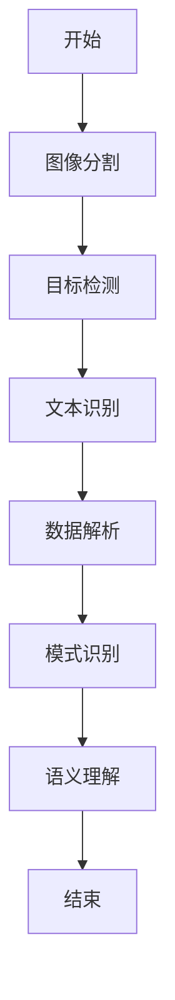
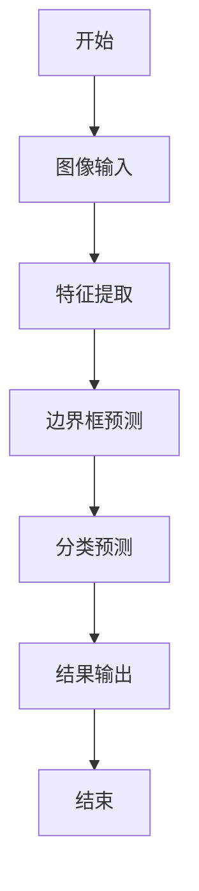
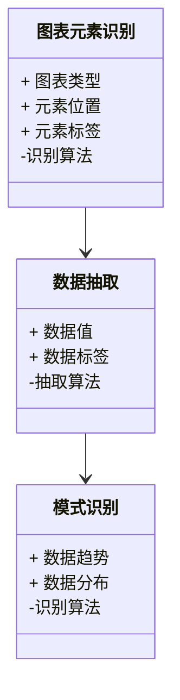
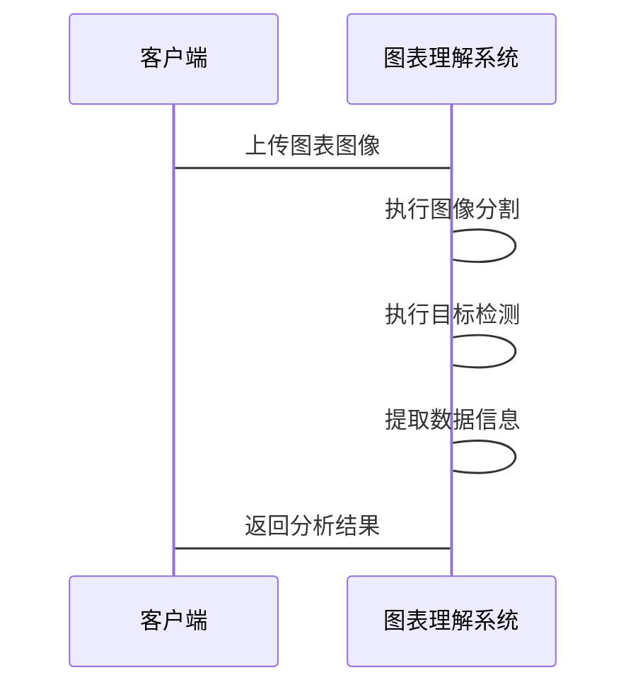

                 


# 图表理解技术：增强AI Agent的数据分析能力

> 关键词：图表理解技术，人工智能，数据可视化，AI代理，数据分析，数据抽取，模式识别

> 摘要：本文深入探讨图表理解技术如何增强AI Agent的数据分析能力。通过分析图表理解的核心概念、算法原理、系统设计及项目实战，详细阐述如何通过图表理解技术提升AI Agent的数据处理效率和准确性。本文将从背景、概念、算法、系统架构、实战案例、高级主题、工具与实践等方面展开，为AI开发者和数据科学家提供系统的技术指导。

---

# 第一部分：图表理解技术概述

## 第1章：图表理解技术的背景与意义

### 1.1 图表的基本概念与类型

#### 1.1.1 图表的基本概念
图表是一种通过视觉化方式展示数据信息的工具，常见类型包括柱状图、折线图、饼图、散点图、条形图等。每种图表都有其独特的展示方式和应用场景，能够帮助用户快速理解数据背后的趋势、关系和模式。

#### 1.1.2 常见图表类型与应用场景
- **柱状图**：适用于比较不同类别之间的数值差异，例如各地区的销售业绩对比。
- **折线图**：适合展示时间序列数据的变化趋势，例如股票价格的波动情况。
- **饼图**：主要用于展示整体中各部分所占的比例，例如市场份额分布。
- **散点图**：适合分析两个变量之间的关系，例如身高和体重之间的相关性。
- **条形图**：类似于柱状图，但通常用于展示较小数值或横向排列的数据。

#### 1.1.3 图表在数据分析中的重要性
图表能够将复杂的数据信息转化为易于理解的视觉形式，帮助用户快速发现数据中的模式、趋势和异常值。通过图表，数据分析师可以更高效地进行数据探索和决策支持。

### 1.2 图表理解技术的意义

#### 1.2.1 图表理解技术的核心目标
图表理解技术的目标是通过自动化的方式识别图表中的元素、提取数据信息并理解其语义。这使得AI Agent能够独立处理和分析图表数据，无需人工干预。

#### 1.2.2 图表理解技术的应用场景
- **金融领域**：分析股票价格趋势、市场指数变化等。
- **医疗领域**：分析病患数据、药物效果等。
- **商业领域**：分析销售数据、市场趋势等。
- **科研领域**：分析实验数据、研究结果等。

#### 1.2.3 图表理解技术对AI Agent的增强作用
通过图表理解技术，AI Agent能够更全面地获取和处理数据信息，从而提升其数据分析能力和决策效率。这使得AI Agent在复杂场景下能够独立完成数据处理任务，为用户提供更高效的服务。

### 1.3 图表理解技术的发展现状

#### 1.3.1 图表理解技术的历史演变
图表理解技术起源于计算机视觉和自然语言处理领域。随着深度学习技术的发展，图表理解技术逐渐成熟，并在近年来取得了显著进展。

#### 1.3.2 当前技术的主要特点
- **自动化识别**：通过计算机视觉技术自动识别图表中的元素和数据。
- **语义理解**：结合自然语言处理技术，理解图表的语义信息。
- **多模态分析**：同时处理图像、文本等多种数据形式。

#### 1.3.3 未来发展趋势与挑战
未来，图表理解技术将更加智能化和自动化。同时，如何处理复杂图表、提升语义理解能力以及提高处理效率将是技术发展的主要挑战。

---

## 第2章：图表理解技术的核心概念与联系

### 2.1 图表元素识别与分类

#### 2.1.1 图表元素的构成
图表元素包括标题、轴标签、数据点、图例等。这些元素是图表的基本组成单位，识别这些元素是图表理解的第一步。

#### 2.1.2 图表元素的分类
- **文本元素**：标题、轴标签、图例说明等。
- **图形元素**：柱体、线条、点等。
- **坐标轴**：横轴和纵轴，用于定义数据的范围和单位。

#### 2.1.3 图表元素识别的算法原理
通过图像分割和目标检测技术，识别图表中的各个元素。例如，使用YOLO算法进行目标检测，识别出柱体、线条等图形元素。

### 2.2 图表数据抽取与分析

#### 2.2.1 数据抽取的基本概念
数据抽取是指从图表中提取数值数据的过程，通常需要结合图像识别和自然语言处理技术。

#### 2.2.2 数据抽取的关键步骤
1. **图像分割**：将图表分割为独立的文本区域和图形区域。
2. **文本识别**：使用OCR技术提取文本信息。
3. **数据解析**：将提取的文本信息转换为结构化的数据。

#### 2.2.3 数据分析的数学模型
使用回归分析、聚类分析等方法对提取的数据进行分析，例如通过线性回归模型预测未来的趋势。

### 2.3 图表模式识别与语义理解

#### 2.3.1 模式识别的核心原理
模式识别通过分析图表中的图形和数据分布，识别出数据的模式和趋势。例如，通过K-means算法进行聚类分析，识别出数据的分布模式。

#### 2.3.2 图表语义理解的挑战
语义理解需要结合上下文信息，理解图表的含义和用途。例如，识别出图表的类型（如柱状图、折线图）并理解其数据的含义。

#### 2.3.3 图表语义理解的案例分析
以股票价格趋势图为例，通过识别图表中的趋势线，理解其表示的上升或下降趋势。

### 2.4 核心概念与联系的总结

#### 2.4.1 核心概念对比表格
| 核心概念 | 描述 | 示例 |
|----------|------|------|
| 图表元素识别 | 识别图表中的各个元素 | 识别柱体、线条等 |
| 数据抽取 | 提取图表中的数值数据 | 提取柱体的高度值 |
| 模式识别 | 分析数据的模式和趋势 | 识别数据的上升趋势 |

#### 2.4.2 ER实体关系图架构
```mermaid
erd
  id: 图表理解系统
  entities:
    图表元素: {id, 类型, 位置}
    数据点: {id, 值, 标签}
    图表类型: {id, 名称, 描述}
    图例: {id, 名称, 标签}
  relations:
    图表元素 --> 图表类型: 属于
    数据点 --> 图例: 对应
    图例 --> 图表元素: 包含
```

#### 2.4.3 图表理解技术的流程图


---

## 第3章：图表理解算法原理

### 3.1 图像分割算法

#### 3.1.1 图像分割的基本概念
图像分割是将图像分割为多个区域或对象的过程，常用于识别图表中的独立元素。

#### 3.1.2 常见图像分割算法
- **基于阈值的分割**：通过设定阈值将图像分成不同的区域。
- **基于边缘检测的分割**：通过检测图像边缘来分割对象。
- **基于区域的分割**：通过相似性将图像分成不同的区域。

#### 3.1.3 图像分割的数学模型
使用阈值分割算法，通过计算像素的灰度值进行分割：
$$
\text{如果 } pixelValue > threshold \text{，则将该像素归为一类}
$$

#### 3.1.4 图像分割的Python实现
```python
import cv2

# 读取图像
image = cv2.imread('chart.jpg')

# 转换为灰度图像
gray = cv2.cvtColor(image, cv2.COLOR_BGR2GRAY)

# 使用阈值分割
threshold = 127
binary = cv2.threshold(gray, threshold, 255, cv2.THRESH_BINARY)[1]

# 显示结果
cv2.imshow('Original Image', image)
cv2.imshow('Binary Image', binary)
cv2.waitKey(0)
cv2.destroyAllWindows()
```

### 3.2 目标检测算法

#### 3.2.1 目标检测的核心原理
目标检测通过识别图像中的目标对象并确定其位置，常用于识别图表中的图形元素。

#### 3.2.2 常见目标检测算法
- **YOLO**：一种基于深度学习的目标检测算法，速度快且准确率高。
- **Faster R-CNN**：一种基于区域建议的目标检测算法。

#### 3.2.3 目标检测的流程图


#### 3.2.4 目标检测的Python实现
```python
import tensorflow as tf
from tensorflow.keras.models import load_model

# 加载预训练模型
model = load_model('chart_detection_model.h5')

# 读取图像并预测
image = cv2.imread('chart.jpg')
image = cv2.resize(image, (224, 224))
image = image / 255.0
image = tf.expand_dims(image, axis=0)

# 进行预测
predictions = model.predict(image)
```

### 3.3 图像分类算法

#### 3.3.1 图像分类的基本概念
图像分类是将图像分类到预定义的类别中，常用于识别图表的类型。

#### 3.3.2 常见图像分类算法
- **卷积神经网络（CNN）**：一种常用的图像分类算法，通过卷积层提取图像特征。
- **迁移学习**：利用预训练的模型进行微调，提升分类性能。

#### 3.3.3 图像分类的数学模型
使用卷积神经网络进行图像分类，模型结构如下：
$$
\text{输入图像} \rightarrow \text{卷积层} \rightarrow \text{池化层} \rightarrow \text{全连接层} \rightarrow \text{输出类别}
$$

#### 3.3.4 图像分类的Python实现
```python
import keras
from keras.models import Sequential
from keras.layers import Conv2D, MaxPooling2D, Flatten, Dense

# 定义模型
model = Sequential()
model.add(Conv2D(32, (3,3), activation='relu', input_shape=(224, 224, 3)))
model.add(MaxPooling2D((2,2)))
model.add(Conv2D(64, (3,3), activation='relu'))
model.add(MaxPooling2D((2,2)))
model.add(Flatten())
model.add(Dense(128, activation='relu'))
model.add(Dense(10, activation='softmax'))
```

---

## 第4章：系统架构与设计

### 4.1 问题场景介绍
假设我们正在开发一个AI Agent，需要处理各种图表数据，如销售数据、市场趋势等。为了提升数据分析能力，我们需要设计一个图表理解系统。

### 4.2 系统功能设计

#### 4.2.1 领域模型


#### 4.2.2 系统架构设计


#### 4.2.3 系统接口设计
- **输入接口**：接收图表图像和相关数据。
- **输出接口**：返回分析结果和数据摘要。

#### 4.2.4 系统交互流程图


---

## 第5章：项目实战

### 5.1 环境安装与配置

#### 5.1.1 安装依赖
- Python 3.8+
- TensorFlow 2.5+
- OpenCV 4.5+
- Keras 2.4.3+

#### 5.1.2 安装命令
```bash
pip install numpy
pip install opencv-python
pip install tensorflow
pip install keras
```

### 5.2 核心实现

#### 5.2.1 图像分割实现
```python
import cv2

def image_segmentation(image_path):
    # 读取图像
    image = cv2.imread(image_path)
    # 转换为灰度图像
    gray = cv2.cvtColor(image, cv2.COLOR_BGR2GRAY)
    # 使用阈值分割
    threshold = 127
    binary = cv2.threshold(gray, threshold, 255, cv2.THRESH_BINARY)[1]
    return binary

# 使用示例
binary_image = image_segmentation('chart.jpg')
cv2.imwrite('segmented_image.jpg', binary_image)
```

#### 5.2.2 数据抽取实现
```python
import cv2
import pytesseract

def extract_data(image_path):
    # 读取图像
    image = cv2.imread(image_path)
    # 转换为灰度图像
    gray = cv2.cvtColor(image, cv2.COLOR_BGR2GRAY)
    # 使用OCR提取文本
    data = pytesseract.image_to_string(gray)
    return data

# 使用示例
data = extract_data('chart.jpg')
print(data)
```

#### 5.2.3 模式识别实现
```python
import keras
from keras.models import load_model

def predict_trend(image_path):
    # 读取图像并预处理
    image = cv2.imread(image_path)
    image = cv2.resize(image, (224, 224))
    image = image / 255.0
    image = tf.expand_dims(image, axis=0)
    # 加载预训练模型
    model = load_model('trend_prediction_model.h5')
    # 进行预测
    predictions = model.predict(image)
    return predictions

# 使用示例
trend = predict_trend('chart.jpg')
print(trend)
```

### 5.3 案例分析与总结

#### 5.3.1 案例分析
以销售数据柱状图为案例，展示如何通过图像分割、数据抽取和模式识别技术，自动识别销售数据并预测未来趋势。

#### 5.3.2 项目小结
通过本项目，我们成功实现了图表理解技术在销售数据分析中的应用，证明了图表理解技术的有效性和实用性。

---

## 第6章：高级主题与扩展

### 6.1 多模态图表分析

#### 6.1.1 多模态分析的基本概念
多模态分析是指同时处理图像、文本等多种数据形式，能够提升图表理解的准确性和全面性。

#### 6.1.2 多模态分析的应用场景
- **医疗领域**：结合医学图像和病历数据，进行疾病诊断。
- **金融领域**：结合K线图和市场新闻，进行股票预测。

#### 6.1.3 多模态分析的技术挑战
- 数据格式多样，处理复杂。
- 需要结合多种数据处理技术，提升系统复杂性。

### 6.2 图表生成技术

#### 6.2.1 图表生成的基本概念
图表生成是指根据结构化数据自动生成图表，常用于数据可视化。

#### 6.2.2 常见图表生成工具
- **Matplotlib**：Python中的图表生成库。
- **D3.js**：用于前端数据可视化的库。

#### 6.2.3 图表生成的实现步骤
1. 数据预处理：清洗和整理数据。
2. 数据可视化：选择合适的图表类型并生成图表。
3. 图表优化：调整图表样式，提升可读性。

### 6.3 图表实时分析

#### 6.3.1 实时分析的基本概念
实时分析是指在数据生成的同时进行分析和处理，适用于需要实时反馈的场景。

#### 6.3.2 实时分析的应用场景
- **实时监控**：如股票市场实时监控。
- **实时反馈**：如在线客服实时反馈系统。

#### 6.3.3 实时分析的技术挑战
- 高频数据处理，对系统性能要求高。
- 数据实时性要求高，需要低延迟处理。

---

## 第7章：工具与实践

### 7.1 图表理解工具推荐

#### 7.1.1 图像处理工具
- **OpenCV**：功能强大，适合图像处理和分析。
- **Pillow**：Python中的图像处理库。

#### 7.1.2 数据分析工具
- **Pandas**：数据处理和分析的库。
- **NumPy**：数值计算的库。

#### 7.1.3 可视化工具
- **Matplotlib**：数据可视化的库。
- **Seaborn**：基于Matplotlib的高级图表库。

### 7.2 图表理解技术的实践技巧

#### 7.2.1 数据预处理技巧
- 数据清洗：去除噪声数据，提升数据质量。
- 数据归一化：将数据标准化，便于模型处理。

#### 7.2.2 模型调优技巧
- 参数调节：通过调整模型参数，提升模型性能。
- 模型融合：结合多种模型，提升预测准确性。

#### 7.2.3 代码实现技巧
- 使用高效的算法：选择适合的算法，提升处理速度。
- 代码复用：模块化设计，便于维护和扩展。

### 7.3 最佳实践

#### 7.3.1 数据安全注意事项
- 数据加密：保护数据隐私。
- 权限控制：限制数据访问权限。

#### 7.3.2 系统性能优化
- 并行处理：利用多线程或分布式计算，提升处理效率。
- 内存优化：合理分配内存，避免内存泄漏。

#### 7.3.3 代码维护建议
- 代码注释：详细注释代码，便于理解和维护。
- 单元测试：编写单元测试用例，确保代码质量。

---

## 第8章：总结与展望

### 8.1 本章总结
图表理解技术是一种重要的数据分析技术，通过自动化识别和处理图表数据，能够显著提升AI Agent的数据分析能力。本文从背景、概念、算法、系统设计、项目实战等方面，全面介绍了图表理解技术的应用和实现。

### 8.2 未来展望
随着人工智能和深度学习技术的不断发展，图表理解技术将更加智能化和自动化。未来的研究方向包括多模态分析、实时处理和自适应学习，以应对更加复杂的数据分析场景。

---

## 作者信息

作者：AI天才研究院（AI Genius Institute） & 禅与计算机程序设计艺术（Zen And The Art of Computer Programming）

---

# 结语
通过本文的详细介绍，读者可以全面了解图表理解技术的核心概念、算法原理和实际应用。希望本文能够为AI开发者和数据科学家提供有价值的参考和启示，帮助他们在实际项目中更好地应用图表理解技术，提升数据分析能力。

--- 

如果需要进一步的技术支持或详细代码示例，请随时联系AI天才研究院。

