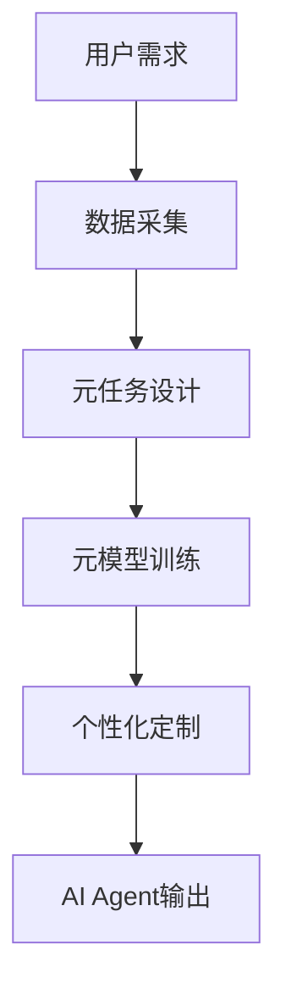
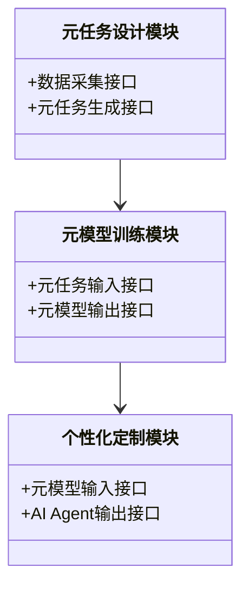

                 


# 基于元学习的AI Agent个性化定制技术

## 关键词：元学习、AI Agent、个性化定制、机器学习、深度学习

## 摘要：本文深入探讨了基于元学习的AI Agent个性化定制技术。通过分析元学习的核心概念、算法原理以及其在AI Agent中的应用，本文提出了基于元学习的个性化定制方法，并通过实际案例展示了如何利用该技术实现高效、灵活的AI Agent定制。文章内容涵盖元学习的基本理论、AI Agent的核心功能、元学习算法的数学模型、系统架构设计以及项目实战，旨在为读者提供全面的技术指导和实践参考。

---

# 第一部分: 基于元学习的AI Agent个性化定制技术基础

## 第1章: 元学习与AI Agent概述

### 1.1 元学习的基本概念

#### 1.1.1 元学习的定义与特点
元学习（Meta-Learning）是一种机器学习方法，旨在通过在多个任务（称为元任务）上进行训练，使得模型能够快速适应新任务。与传统机器学习不同，元学习关注的是模型的“学习能力”，而不是直接解决具体任务。其特点包括：
- **快速适应性**：元学习模型能够快速适应新任务，通常只需少量数据即可完成任务。
- **泛化能力**：元学习模型在新任务上的表现优于传统模型，尤其是在任务之间存在相似性时。
- **元任务驱动**：元学习通过在多个相关任务上训练模型，使其具备跨任务的通用性。

#### 1.1.2 元学习的核心思想与优势
元学习的核心思想是通过学习如何学习来提高模型的泛化能力。其优势包括：
- **减少数据需求**：元学习模型可以在新任务上表现良好，即使新任务的数据量很小。
- **提升适应性**：元学习模型能够快速调整以适应新的环境或任务。
- **灵活性**：元学习适用于多种任务和场景，尤其是在任务之间存在共享特征的情况下。

#### 1.1.3 元学习与传统机器学习的对比
传统机器学习算法专注于解决特定任务，通常需要大量数据进行训练。而元学习则关注模型的学习能力，能够在多个任务之间共享知识，从而减少对新任务数据的需求。以下是两者的对比：

| 特性                | 传统机器学习                | 元学习                     |
|---------------------|-----------------------------|-----------------------------|
| 数据需求            | 需要大量数据                | 需要少量数据               |
| 适应性              | 适应性较差                 | 适应性较强                |
| 任务多样性          | 适用于单一任务             | 适用于多个相关任务        |

### 1.2 AI Agent的基本概念

#### 1.2.1 AI Agent的定义与分类
AI Agent（人工智能代理）是指能够感知环境并采取行动以实现目标的智能实体。AI Agent可以分为以下几类：
- **简单反射式Agent**：基于当前感知做出反应，没有内部状态。
- **基于模型的反射式Agent**：具有内部状态和环境模型，能够进行推理。
- **目标驱动式Agent**：基于目标进行决策和行动。
- **效用驱动式Agent**：通过最大化效用函数来做出决策。

#### 1.2.2 AI Agent的核心功能与应用场景
AI Agent的核心功能包括：
- **感知环境**：通过传感器或数据输入感知环境状态。
- **决策与行动**：基于感知信息做出决策并执行行动。
- **学习与适应**：通过学习提升自身的决策能力。

AI Agent的应用场景广泛，包括智能助手、自动驾驶、机器人控制、推荐系统等。

#### 1.2.3 AI Agent的个性化定制需求
个性化定制是AI Agent应用中的重要需求。不同用户或场景下的AI Agent需要根据具体需求进行定制，以提供最佳的用户体验和性能。

### 1.3 元学习在AI Agent中的应用

#### 1.3.1 元学习如何提升AI Agent的适应性
元学习通过在多个任务上训练模型，使得AI Agent能够快速适应新任务。例如，一个AI Agent可以在多个类似任务（如不同的用户偏好）上进行训练，从而能够快速调整以适应新用户的需求。

#### 1.3.2 元学习在AI Agent个性化定制中的作用
元学习可以用于AI Agent的个性化定制，通过在多个用户或场景的任务上进行训练，使得AI Agent能够快速适应特定用户的偏好或场景需求。

#### 1.3.3 元学习与AI Agent结合的典型场景
- **个性化推荐**：AI Agent可以根据用户的偏好快速调整推荐策略。
- **动态环境适应**：AI Agent可以在动态变化的环境中快速调整行为。
- **多任务学习**：AI Agent可以在多个任务之间共享知识，提升整体性能。

### 1.4 本章小结
本章介绍了元学习的基本概念、AI Agent的核心功能以及元学习在AI Agent个性化定制中的作用。通过对比元学习与传统机器学习，读者可以理解元学习的优势和适用场景。

---

## 第2章: 元学习的核心概念与数学模型

### 2.1 元学习的核心概念

#### 2.1.1 元任务与目标函数
元任务（Meta-Task）是元学习中的基本单位，通常指一个具体的任务或问题。目标函数（Objective Function）定义了模型在每个任务上的优化目标。

#### 2.1.2 元模型的构建与训练
元模型（Meta-Model）是元学习的核心，用于生成适用于特定任务的模型。元模型通常通过在多个任务上进行训练，学习如何快速适应新任务。

#### 2.1.3 元学习的优化策略
元学习的优化策略包括：
- **梯度下降**：通过计算元任务的梯度更新元模型参数。
- **任务间优化**：通过在多个任务之间优化参数，使得元模型能够快速适应新任务。

### 2.2 元学习的数学模型

#### 2.2.1 元学习的通用公式表示
元学习的通用公式可以表示为：
$$
\theta = \arg\min_{\theta} \sum_{i=1}^{N} \mathbb{E}_{(x_i,y_i)}[\mathcal{L}(f_\theta(x_i), y_i)]
$$
其中，$\theta$是元模型的参数，$N$是元任务的数量，$\mathcal{L}$是损失函数。

#### 2.2.2 元学习的梯度计算方法
元学习的梯度计算通常涉及两步：首先计算每个任务的梯度，然后对这些梯度进行加权求和。

#### 2.2.3 元学习的损失函数设计
元学习的损失函数通常包括两部分：任务损失和元损失。任务损失用于优化每个任务的性能，元损失用于优化元模型的泛化能力。

### 2.3 元学习与传统机器学习的对比分析

#### 2.3.1 元学习的灵活性与适应性
元学习的灵活性体现在其能够快速适应新任务，尤其是在任务之间存在相似性时。其适应性主要来源于元模型的学习能力。

#### 2.3.2 传统机器学习的局限性
传统机器学习在处理新任务时通常需要重新训练整个模型，且对数据的需求量较大。这在任务多样性和数据稀疏性较高的场景下表现不佳。

#### 2.3.3 元学习在实际应用中的优势
元学习在实际应用中的优势包括：
- **减少数据需求**：元学习模型可以在新任务上表现良好，即使数据量很小。
- **提升适应性**：元学习模型能够快速调整以适应新的环境或任务。
- **灵活性**：元学习适用于多种任务和场景。

### 2.4 本章小结
本章详细介绍了元学习的核心概念和数学模型，分析了元学习与传统机器学习的对比，强调了元学习在实际应用中的优势。

---

## 第3章: AI Agent的个性化定制技术

### 3.1 AI Agent个性化定制的需求分析

#### 3.1.1 用户需求的多样性
不同的用户可能有不同的需求和偏好，AI Agent需要能够根据用户的个性化需求进行定制。

#### 3.1.2 场景需求的动态变化
AI Agent的应用场景可能动态变化，需要能够快速适应新的环境和任务。

#### 3.1.3 个性化定制的重要性
个性化定制能够提升用户体验，增强AI Agent的性能和适用性。

### 3.2 基于元学习的AI Agent个性化定制方法

#### 3.2.1 方法概述
基于元学习的AI Agent个性化定制方法通过在多个用户或场景的任务上进行训练，使得AI Agent能够快速适应特定用户的偏好或场景需求。

#### 3.2.2 方法实现步骤
1. **数据收集**：收集多个用户或场景的任务数据。
2. **元任务设计**：设计多个元任务，每个元任务对应一个特定的用户或场景。
3. **元模型训练**：在多个元任务上训练元模型，使其能够快速适应新任务。
4. **个性化定制**：根据具体需求，利用元模型生成适用于特定任务的AI Agent。

### 3.3 基于元学习的AI Agent个性化定制的数学模型

#### 3.3.1 元模型的参数更新
元模型的参数更新通常涉及计算每个任务的梯度，并对这些梯度进行加权求和。

#### 3.3.2 个性化定制的优化策略
个性化定制的优化策略包括：
- **任务特定优化**：根据具体任务需求调整元模型的参数。
- **动态优化**：在动态变化的环境中，实时优化元模型的参数。

### 3.4 本章小结
本章提出了基于元学习的AI Agent个性化定制方法，并详细介绍了其实现步骤和数学模型。通过这种方法，AI Agent可以快速适应新任务，满足用户的个性化需求。

---

## 第4章: 基于元学习的AI Agent个性化定制技术的实现

### 4.1 项目介绍

#### 4.1.1 项目背景
本项目旨在通过元学习技术实现AI Agent的个性化定制，提升其在不同场景下的适应性和性能。

#### 4.1.2 项目目标
项目的最终目标是开发一个能够快速适应新任务的AI Agent，满足用户的个性化需求。

### 4.2 系统功能设计

#### 4.2.1 功能模块划分
系统功能模块包括：
- **数据采集模块**：负责收集多个用户或场景的任务数据。
- **元任务设计模块**：设计多个元任务，每个元任务对应一个特定的用户或场景。
- **元模型训练模块**：在多个元任务上训练元模型，使其能够快速适应新任务。
- **个性化定制模块**：根据具体需求，利用元模型生成适用于特定任务的AI Agent。

#### 4.2.2 功能流程图
以下是系统功能流程图的Mermaid表示：


### 4.3 系统架构设计

#### 4.3.1 系统架构图
以下是系统架构图的Mermaid表示：


### 4.4 项目实战

#### 4.4.1 环境安装
需要安装以下依赖：
- Python 3.x
- TensorFlow或PyTorch
- Mermaid工具

#### 4.4.2 核心代码实现
以下是元模型训练的Python代码示例：
```python
import tensorflow as tf
from tensorflow.keras import layers

# 定义元模型
class MetaModel(tf.keras.Model):
    def __init__(self, input_shape):
        super(MetaModel, self).__init__()
        self.fc1 = layers.Dense(64, activation='relu', input_shape=input_shape)
        self.fc2 = layers.Dense(10, activation='softmax')

    def call(self, inputs):
        x = self.fc1(inputs)
        return self.fc2(x)

# 定义元任务训练函数
def meta_train(meta_model, optimizer, tasks):
    total_loss = 0
    for task in tasks:
        with tf.GradientTape() as tape:
            outputs = meta_model(tf.convert_to_tensor(task['inputs']))
            loss = task['loss'](outputs, tf.convert_to_tensor(task['labels']))
        gradients = tape.gradient(loss, meta_model.trainable_weights)
        optimizer.apply_gradients(zip(gradients, meta_model.trainable_weights))
        total_loss += loss.numpy()
    return total_loss / len(tasks)

# 初始化元模型
meta_model = MetaModel(input_shape=(input_dim,))
# 定义优化器
optimizer = tf.keras.optimizers.Adam(learning_rate=0.001)
# 元任务训练
meta_train(meta_model, optimizer, tasks)
```

#### 4.4.3 案例分析
以下是一个基于元学习的AI Agent个性化定制案例：
- **任务描述**：训练一个AI Agent，使其能够在不同的用户偏好下推荐电影。
- **数据准备**：收集多个用户的电影评分数据，每个用户对应一个元任务。
- **元模型训练**：在多个用户的电影评分数据上训练元模型，使其能够快速适应新用户的偏好。
- **个性化定制**：根据具体用户的偏好，利用元模型生成适用于该用户的电影推荐系统。

### 4.5 本章小结
本章通过实际项目展示了基于元学习的AI Agent个性化定制技术的实现过程，包括系统功能设计、架构设计以及代码实现。通过案例分析，读者可以理解如何将元学习应用于实际场景。

---

## 第5章: 基于元学习的AI Agent个性化定制技术的扩展

### 5.1 最佳实践 Tips

#### 5.1.1 数据预处理
在元模型训练之前，需要对数据进行预处理，确保数据的干净和一致性。

#### 5.1.2 模型调优
通过调整元模型的超参数（如学习率、批量大小等），可以提升模型的性能和收敛速度。

#### 5.1.3 任务相似性分析
在设计元任务时，需要分析任务之间的相似性，以确保元模型能够有效共享知识。

### 5.2 小结

#### 5.2.1 元学习的优势
- **快速适应性**：元学习模型能够快速适应新任务。
- **灵活性**：元学习适用于多种任务和场景。
- **数据效率**：元学习在数据稀疏性较高的场景下表现优异。

#### 5.2.2 AI Agent个性化定制的关键点
- **任务设计**：合理设计元任务，确保任务之间的相似性和多样性。
- **模型训练**：通过优化元模型的参数，提升模型的泛化能力。
- **个性化需求**：根据具体需求，灵活调整AI Agent的行为和策略。

### 5.3 注意事项

#### 5.3.1 数据质量
数据质量直接影响元模型的性能，需要确保数据的干净和一致性。

#### 5.3.2 任务设计
任务设计需要考虑任务之间的相似性和多样性，以确保元模型能够有效共享知识。

#### 5.3.3 模型收敛
在元模型训练过程中，需要注意模型的收敛性，避免过拟合或欠拟合。

### 5.4 拓展阅读

#### 5.4.1 元学习的经典论文
- "Meta-Learning with梯度下降"（esser et al.）
- "学习如何学习"（Vicarious 撰写）

#### 5.4.2 AI Agent领域的最新研究
- "基于元学习的自适应AI Agent设计"（最新研究论文）
- "个性化推荐系统的最新进展"（综述论文）

### 5.5 本章小结
本章总结了基于元学习的AI Agent个性化定制技术的注意事项和拓展阅读内容，为读者提供了进一步学习和实践的指导。

---

# 第六章: 结论与展望

## 6.1 研究总结
本文深入探讨了基于元学习的AI Agent个性化定制技术，从元学习的基本概念、AI Agent的核心功能到元学习在AI Agent个性化定制中的应用进行了全面分析。通过实际案例展示了如何利用元学习技术实现AI Agent的快速适应和个性化定制。

## 6.2 技术展望
未来，基于元学习的AI Agent个性化定制技术将在以下几个方面继续发展：
- **更高效的元学习算法**：研究更高效的元学习算法，提升模型的收敛速度和性能。
- **更灵活的任务设计**：探索更灵活的任务设计方法，以适应更多的应用场景。
- **更强大的模型架构**：研究更强大的模型架构，提升元模型的泛化能力和适应性。

## 6.3 作者展望
作为AI天才研究院的一员，我们将继续致力于元学习与AI Agent结合的研究，探索更多创新性的技术，为AI Agent的个性化定制提供更强大的技术支持。

---

# 作者：AI天才研究院/AI Genius Institute & 禅与计算机程序设计艺术 /Zen And The Art of Computer Programming

