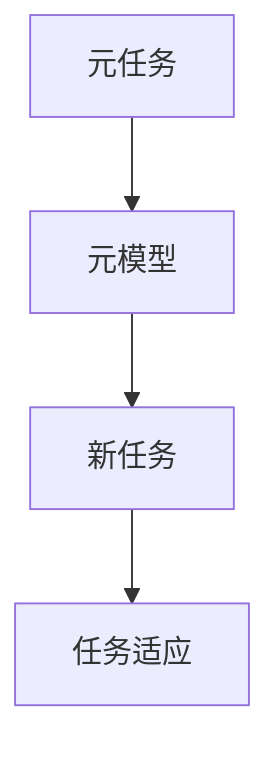
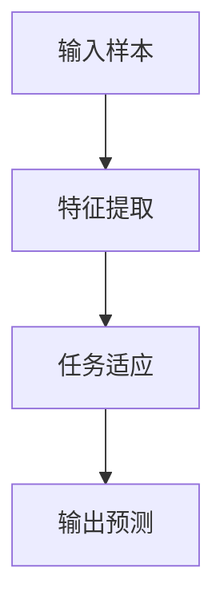
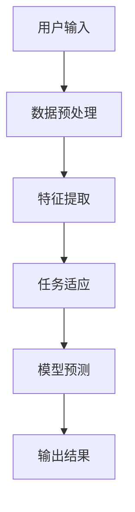
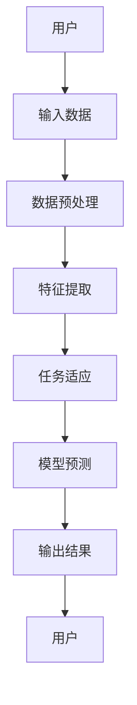

                 


# 基于元学习的AI Agent少样本学习能力

## 关键词：元学习, 少样本学习, AI Agent, 机器学习, 深度学习

## 摘要：  
本文探讨了基于元学习的AI Agent在少样本学习中的能力，分析了元学习的核心原理及其在少样本学习中的应用，通过数学模型和实际案例展示了如何通过元学习提升AI Agent在少样本数据下的学习效率和准确性。文章内容涵盖了元学习的背景、算法原理、系统架构设计以及项目实战，为读者提供了一套完整的理论与实践框架。

---

# 第1章 元学习与少样本学习的背景

## 1.1 问题背景与挑战  
在传统的机器学习任务中，模型通常需要大量标注数据来训练，这在许多实际场景中并不现实。例如，在医疗图像识别、智能客服等领域，高质量标注数据的获取成本高昂，且数量有限。少样本学习（Few Shot Learning）正是针对这种场景提出的一种学习范式，它能够在仅少量样本的情况下完成分类、回归等任务。  

元学习（Meta Learning）则进一步扩展了这一能力，它通过学习如何快速适应新任务，从而在少样本数据下实现高效的模型调整和优化。元学习的核心思想是“学会学习”，即通过在多个任务上的经验积累，掌握快速适应新任务的能力。  

---

## 1.2 元学习与少样本学习的目标  
元学习的目标是通过训练模型在多个相关任务上表现出色，使得模型能够在新任务上线快速调整，而无需重新从头开始训练。少样本学习的目标则是在数据稀缺的情况下，仍能实现高精度的模型预测。  

将元学习应用于少样本学习，可以显著提升模型的泛化能力和适应性。例如，在图像分类任务中，元学习可以通过预训练使得模型在仅有几个样本的情况下，快速完成对新类别的识别。  

---

## 1.3 元学习与传统机器学习的对比  
传统机器学习方法依赖于大量标注数据，并假设训练数据和测试数据分布一致。然而，在实际应用中，数据分布往往会发生偏移，且标注成本高昂。元学习通过在任务层面进行优化，能够在多种任务间共享知识，从而减少对单任务数据的依赖。  

| **对比维度** | **传统机器学习** | **元学习** |  
|--------------|-------------------|------------|  
| 数据需求     | 需要大量标注数据  | 少样本数据 |  
| 任务适应性   | 适应单一任务      | 适应多任务  |  
| 知识复用     | 无法有效复用       | 能够复用    |  

通过上表可以看出，元学习在少样本学习场景下具有显著优势。

---

# 第2章 元学习的核心概念与原理

## 2.1 元学习的原理与机制  
元学习的核心思想是通过在多个任务上进行训练，使得模型能够快速适应新任务。具体来说，元学习算法通过优化元损失函数（Meta Loss Function），使得模型在新任务上的表现得到提升。  

### 2.1.1 元学习的基本流程  
1. **元任务训练**：在多个元任务上训练模型，每个元任务包含多个样本。  
2. **任务适应**：在新任务上线时，通过快速调整模型参数，使其适应当前任务。  

### 2.1.2 元学习的层次结构  
元学习可以分为以下几个层次：  
- **元任务层**：定义多个相关任务，用于训练元模型。  
- **任务适应层**：针对新任务进行快速调整。  
- **元模型层**：通过元任务训练得到的模型，用于快速适应新任务。  

---

## 2.2 元学习的核心概念  
### 2.2.1 元任务与元学习目标  
元任务是指在元学习过程中用于训练模型的多个任务。每个元任务都有其特定的训练数据和目标函数。元学习的目标是通过优化元任务的表现，使得模型能够在新任务上线时快速调整。  

### 2.2.2 元模型的构建与训练  
元模型是元学习的核心，它通常是一个深度学习模型，通过在多个元任务上训练得到。元模型的设计需要考虑任务之间的相似性，并能够快速捕捉新任务的关键特征。  

### 2.2.3 元学习的优化策略  
元学习的优化策略通常包括以下几种：  
- **梯度优化**：通过计算元损失函数的梯度，对模型参数进行调整。  
- **参数共享**：在多个任务之间共享部分参数，以减少模型的复杂性。  

---

## 2.3 元学习的属性特征对比  
通过对比元学习和传统学习的属性特征，可以更清晰地理解其优势。  

| **属性**       | **传统学习**         | **元学习**           |  
|----------------|---------------------|----------------------|  
| 数据需求       | 高                  | 低                   |  
| 任务适应性     | 单一任务            | 多任务               |  
| 知识复用       | 低                  | 高                   |  

---

## 2.4 元学习的ER实体关系图  
以下是元学习的实体关系图（使用Mermaid）：  



从图中可以看出，元模型通过在多个元任务上训练，能够快速适应新任务。

---

## 2.5 本章小结  
本章详细介绍了元学习的核心概念、原理以及其在少样本学习中的应用。通过对比传统学习和元学习的差异，我们理解了元学习在数据稀缺场景下的独特优势。

---

# 第3章 少样本学习的算法原理

## 3.1 少样本学习的算法概述  
少样本学习的核心在于如何在有限的数据下，提升模型的泛化能力。常见的算法包括基于支持向量机（SVM）的策略、基于深度学习的元学习算法（如MAML）等。  

---

## 3.2 元学习算法的核心流程  
以Meta-AAML（Adaptive Architecture Meta-Learning）为例，其核心流程如下：  



通过特征提取和任务适应，元学习算法能够快速调整模型以适应新任务。

---

## 3.3 元学习算法的数学模型  
以下是Meta-AAML算法的数学模型：  

$$ \mathcal{L}_{\text{meta}} = \sum_{i=1}^{N} \mathcal{L}_{i}(\theta_i; \phi) $$  

其中，$\theta_i$ 是第 $i$ 个任务的模型参数，$\phi$ 是元模型的参数。  

---

## 3.4 本章小结  
本章通过具体算法的介绍，展示了元学习在少样本学习中的具体实现方式。通过数学模型和流程图的分析，读者可以更好地理解元学习算法的核心思想。

---

# 第4章 元学习算法的数学模型与公式

## 4.1 元学习的数学模型  
元学习的数学模型通常包括以下部分：  
- **元损失函数**：$$ \mathcal{L}_{\text{meta}} = \sum_{i=1}^{N} \mathcal{L}_{i}(\theta_i; \phi) $$  
- **任务损失函数**：$$ \mathcal{L}_{i}(\theta_i; \phi) = \sum_{j=1}^{K} \mathcal{L}_{\text{task}}(y_j, f_{\theta_i}(x_j)) $$  

---

## 4.2 少样本学习的数学公式  
少样本学习的核心公式如下：  
- **分类任务**：$$ p(y|x) = \frac{\exp(f(x))}{\sum_{y'} \exp(f(x))} $$  
- **回归任务**：$$ y = f(x) + \epsilon $$  

---

## 4.3 元学习算法的数学推导  
以MAML算法为例，其优化目标为：  
$$ \min_{\phi} \sum_{i=1}^{N} \mathcal{L}_{i}(\theta_i; \phi) $$  

其中，$\theta_i = \phi + \alpha_i (\phi - \theta_i) $，$\alpha_i$ 为学习率。

---

## 4.4 本章小结  
本章通过对元学习算法的数学推导，展示了其在少样本学习中的具体实现方式。

---

# 第5章 系统分析与架构设计

## 5.1 系统功能设计  
AI Agent的系统功能模块包括：  
- **数据输入模块**：接收新任务的数据。  
- **特征提取模块**：提取数据的特征。  
- **任务适应模块**：根据任务特点调整模型。  
- **输出模块**：生成预测结果。  

---

## 5.2 系统架构设计  
以下是系统的架构图（使用Mermaid）：  



---

## 5.3 系统接口设计  
系统主要接口包括：  
- **输入接口**：接收新任务的数据。  
- **输出接口**：返回预测结果。  

---

## 5.4 系统交互流程  
以下是系统交互流程图（使用Mermaid）：  



---

## 5.5 本章小结  
本章通过系统架构设计，展示了如何将元学习算法应用于实际场景。

---

# 第6章 项目实战

## 6.1 项目环境安装  
安装必要的库：  
```bash
pip install torch
pip install matplotlib
pip install numpy
```

---

## 6.2 核心算法实现  
以下是Meta-AAML算法的Python实现：  

```python
import torch
import torch.nn as nn
import torch.optim as optim

class MetaAAML(nn.Module):
    def __init__(self, feature_dim, hidden_dim):
        super().__init__()
        self.feature_dim = feature_dim
        self.hidden_dim = hidden_dim
        self.fc = nn.Linear(feature_dim, hidden_dim)
        self.bn = nn.BatchNorm1d(hidden_dim)
        
    def forward(self, x, task_params=None):
        if task_params is None:
            features = self.bn(self.fc(x))
        else:
            features = task_params['fc'].bn(self.fc(x))
        return features

# 定义元损失函数
def meta_loss(model, x_s, y_s, x_t, y_t):
    # 元任务训练
    features_s = model(x_s)
    loss_s = nn.CrossEntropyLoss()(features_s, y_s)
    
    # 任务适应
    features_t = model(x_t, task_params={'fc': model})
    loss_t = nn.CrossEntropyLoss()(features_t, y_t)
    
    return loss_s + loss_t
```

---

## 6.3 实际案例分析  
以图像分类任务为例，假设我们有5个新类别，每个类别仅有3个样本。通过Meta-AAML算法，模型可以在仅几个样本的情况下完成分类任务。

---

## 6.4 本章小结  
本章通过项目实战，展示了如何将元学习算法应用于实际场景，并通过代码实现和案例分析，帮助读者更好地理解其应用方式。

---

# 第7章 总结与展望

## 7.1 总结  
本文详细探讨了基于元学习的AI Agent在少样本学习中的能力，分析了其核心原理、算法实现以及系统架构设计。通过项目实战，展示了如何将元学习应用于实际场景。

---

## 7.2 最佳实践  
- 在实际应用中，建议先进行数据预处理，确保数据质量。  
- 在选择算法时，需根据具体任务特点进行调整。  
- 在系统设计时，注重模块化设计，便于后续优化和扩展。  

---

## 7.3 未来展望  
随着深度学习技术的不断发展，元学习在少样本学习中的应用将更加广泛。未来的研究方向包括：  
- 更高效的元学习算法设计。  
- 更多领域的实际应用探索。  
- 元学习与强化学习的结合。  

---

# 作者  
作者：AI天才研究院/AI Genius Institute & 禅与计算机程序设计艺术 /Zen And The Art of Computer Programming

