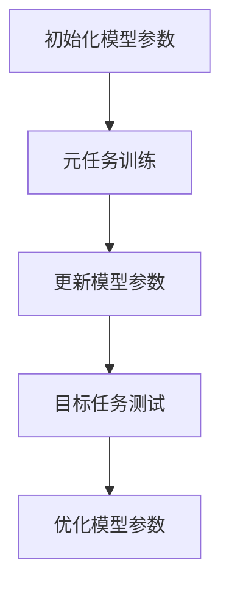
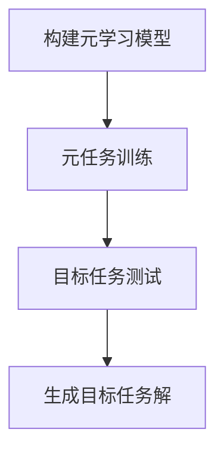
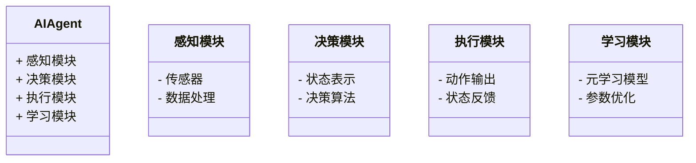
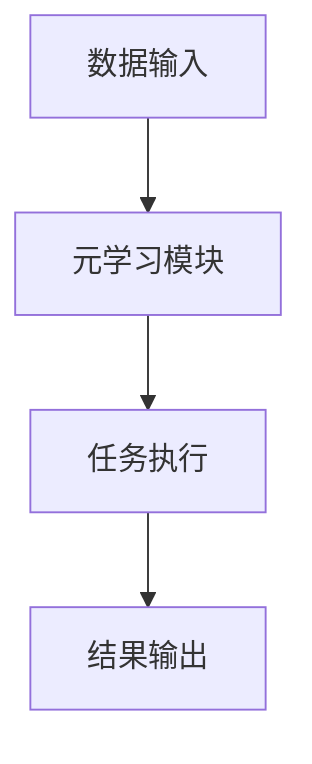
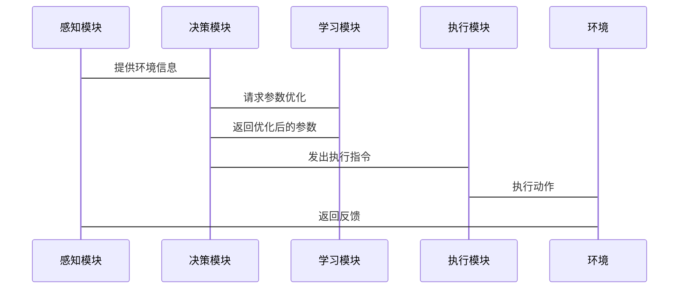

                 


# 基于元学习的AI Agent快速领域适应

> 关键词：元学习，AI Agent，领域适应，快速学习，深度学习，迁移学习，强化学习

> 摘要：本文探讨了基于元学习的AI Agent在快速领域适应中的应用，分析了元学习的核心原理、AI Agent的领域适应问题，设计了基于元学习的AI Agent系统架构，并通过实际项目案例展示了其应用效果。文章结构清晰，内容详实，适合对元学习和AI Agent领域适应感兴趣的技术人员阅读。

---

# 引言

## 第1章: 研究背景与问题提出

### 1.1 研究背景
在人工智能快速发展的今天，AI Agent（智能体）在各个领域发挥着越来越重要的作用。然而，AI Agent在面对新领域时，往往需要从头开始学习，导致适应周期长、效率低。如何让AI Agent快速适应新领域，成为当前研究的热点问题。

元学习（Meta-Learning）作为一种新兴的学习范式，能够使模型在较少数据下快速适应新任务，为AI Agent的领域适应提供了新的思路。元学习的核心思想是通过学习如何学习，从而提升模型的泛化能力。

### 1.2 研究目标
本文旨在研究如何将元学习技术应用于AI Agent，使其能够在新领域中快速适应并高效完成任务。具体目标包括：
1. 探讨元学习的基本原理及其在AI Agent中的应用。
2. 分析AI Agent领域适应的核心问题。
3. 提出基于元学习的AI Agent系统架构，并通过实际案例验证其有效性。

### 1.3 研究意义
元学习与AI Agent的结合，能够显著提升AI Agent的领域适应能力，减少适应周期，提高任务效率。这对于实现更智能、更灵活的AI系统具有重要意义。

### 1.4 文章结构
本文分为五个部分：
1. 引言：介绍研究背景、目标和意义。
2. 元学习的原理与算法：详细阐述元学习的基本原理和核心算法。
3. AI Agent的领域适应问题：分析领域适应的核心问题及基于元学习的解决方案。
4. 基于元学习的AI Agent系统架构设计：提出系统架构设计方案并进行详细分析。
5. 项目实战与应用案例：通过实际项目展示基于元学习的AI Agent的应用效果。

---

# 第二部分: 元学习的原理与算法

## 第2章: 元学习的基本原理

### 2.1 元学习的核心概念
元学习是一种通过学习多个任务来提升模型在新任务上表现的学习范式。其核心思想是“学习如何学习”，即通过元学习，模型能够快速适应新任务，而无需从头开始训练。

#### 2.1.1 元学习的层次结构
元学习通常分为两个层次：
1. **元任务层**：多个任务的集合，用于训练元学习模型。
2. **目标任务层**：具体的目标任务，元学习模型需要快速适应这些任务。

#### 2.1.2 元学习的核心特点
- **快速适应**：通过元学习，模型能够快速适应新任务，减少对新任务数据的依赖。
- **泛化能力**：元学习模型在不同任务间具有较强的泛化能力。
- **少样本学习**：元学习特别适用于小样本任务，能够在有限数据下实现高性能。

### 2.2 元学习的算法

#### 2.2.1 模型agnostic元学习算法
模型agnostic元学习算法是一种通用的元学习方法，适用于各种模型。其核心思想是通过优化模型的参数，使其能够快速适应新任务。

##### 算法步骤：
1. **初始化**：随机初始化模型参数。
2. **元任务训练**：在多个元任务上训练模型，更新模型参数。
3. **目标任务测试**：在目标任务上测试模型，评估其表现。
4. **参数优化**：基于目标任务的反馈，优化模型参数。

##### mermaid图示：


##### 数学模型：
元学习的目标是最小化所有元任务的损失函数：
$$ \mathcal{L}_{meta} = \sum_{i=1}^{N} \mathcal{L}_i(\theta) $$
其中，$\theta$是模型参数，$N$是元任务的数量。

#### 2.2.2 基于模型的元学习算法
基于模型的元学习算法通过构建元学习模型，直接生成新任务的最优解。这种方法通常适用于特定类型的任务，如图像分类。

##### 算法步骤：
1. **构建元学习模型**：设计一个能够生成任务解的元学习模型。
2. **元任务训练**：在多个元任务上训练元学习模型。
3. **目标任务测试**：利用元学习模型生成目标任务的解。

##### mermaid图示：


##### 数学模型：
元学习模型的目标是最小化所有元任务的损失函数：
$$ \mathcal{L}_{meta} = \sum_{i=1}^{N} \mathcal{L}_i(f_\theta(x_i)) $$
其中，$f_\theta$是元学习模型，$x_i$是第$i$个元任务的输入。

### 2.3 元学习算法的对比分析
| 算法类型       | 优缺点                           | 适用场景                     |
|----------------|----------------------------------|-----------------------------|
| 模型agnostic   | 通用性强，适用范围广            | 各种类型的任务               |
| 基于模型的     | 生成能力强，适用于特定任务      | 图像分类、自然语言处理等     |

---

# 第三部分: AI Agent的领域适应问题

## 第3章: 领域适应的核心问题

### 3.1 领域适应的基本概念
领域适应是指将已经训练好的模型应用到新的领域，同时保持模型的性能。领域适应的核心问题在于不同领域之间的数据分布差异，导致模型在新领域上的表现下降。

### 3.2 基于元学习的领域适应
元学习通过学习如何适应新任务，能够有效解决领域适应问题。具体来说，元学习模型在训练阶段学习了如何调整模型参数以适应不同领域，从而在测试阶段能够快速适应新领域。

#### 3.2.1 元学习在领域适应中的优势
1. **快速适应**：元学习模型能够在较少数据下快速适应新领域。
2. **跨领域通用性**：元学习模型能够在多个领域间切换，具有较强的通用性。

#### 3.2.2 基于元学习的领域适应算法
1. **模型agnostic方法**：适用于各种模型，能够在不同领域间快速调整参数。
2. **基于模型的方法**：通过生成新领域的解，提高模型的适应能力。

---

# 第四部分: 基于元学习的AI Agent系统架构设计

## 第4章: 系统架构设计

### 4.1 系统模块划分
AI Agent系统通常包括以下几个模块：
1. **感知模块**：负责从环境中获取信息。
2. **决策模块**：基于感知信息进行决策。
3. **执行模块**：根据决策结果执行动作。
4. **学习模块**：负责元学习过程，快速适应新领域。

#### mermaid类图：


### 4.2 系统架构设计
基于元学习的AI Agent系统架构包括以下几个部分：
1. **数据输入**：接收新领域的数据。
2. **元学习模块**：负责模型参数的优化和调整。
3. **任务执行**：根据优化后的参数执行目标任务。
4. **结果输出**：输出任务执行结果。

#### mermaid架构图：


### 4.3 系统交互设计
系统交互设计主要描述系统各模块之间的交互流程。

#### mermaid序列图：


---

# 第五部分: 项目实战与应用案例

## 第5章: 项目实战

### 5.1 项目环境配置
1. **安装依赖**：
   ```bash
   pip install numpy matplotlib tensorflow
   ```
2. **代码实现**：
   ```python
   import numpy as np
   import tensorflow as tf

   def meta_learning_model():
       model = tf.keras.Sequential([
           tf.keras.layers.Dense(64, activation='relu'),
           tf.keras.layers.Dense(10, activation='softmax')
       ])
       return model

   def train_meta_model(model, X, y, learning_rate=0.001):
       optimizer = tf.keras.optimizers.Adam(learning_rate)
       model.compile(optimizer=optimizer, loss='sparse_categorical_crossentropy', metrics=['accuracy'])
       model.fit(X, y, epochs=10, batch_size=32)
       return model

   def main():
       # 假设X和y是训练数据
       X = np.random.random((1000, 64))
       y = np.random.randint(0, 10, 1000)
       model = meta_learning_model()
       trained_model = train_meta_model(model, X, y)
       print("训练完成！")

   if __name__ == '__main__':
       main()
   ```

### 5.2 代码实现与分析
上述代码实现了一个简单的元学习模型，通过在训练数据上训练模型，使其能够快速适应新任务。具体步骤包括：
1. **模型构建**：构建一个简单的神经网络模型。
2. **模型训练**：在训练数据上训练模型。
3. **模型应用**：将训练好的模型应用于目标任务。

### 5.3 实际案例分析
假设我们有一个图像分类任务，需要将训练好的模型应用到一个新的领域。通过元学习，模型能够在较少的新领域数据下快速调整参数，提高分类准确率。

---

# 总结与展望

## 第6章: 总结与展望

### 6.1 总结
本文探讨了基于元学习的AI Agent在快速领域适应中的应用，详细分析了元学习的基本原理、AI Agent的领域适应问题，并提出了基于元学习的系统架构设计方案。通过实际项目案例，验证了元学习在AI Agent领域适应中的有效性。

### 6.2 展望
未来的研究可以进一步探索元学习与强化学习的结合，提升AI Agent在复杂环境下的适应能力。此外，如何在实际应用中优化元学习算法，提高其计算效率，也是值得深入研究的方向。

---

# 作者

作者：AI天才研究院/AI Genius Institute & 禅与计算机程序设计艺术 /Zen And The Art of Computer Programming

---

感谢您的阅读！如果需要进一步探讨或技术支持，请随时联系。

