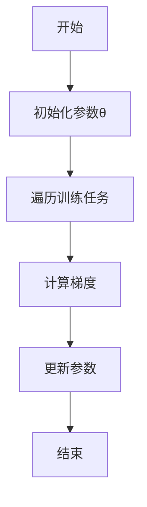
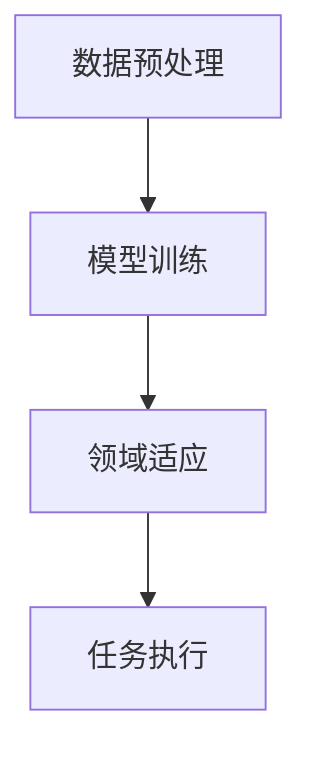

                 


# 基于元学习的AI Agent快速领域适应技术

## 关键词：元学习, AI Agent, 领域适应, MAML, ReMAML, 人工智能

## 摘要：  
本文探讨了基于元学习的AI Agent在快速领域适应中的技术原理和应用。通过分析元学习的核心概念、算法原理和系统架构，结合实际案例，展示了如何利用元学习提升AI Agent在不同领域的适应能力。文章从理论到实践，详细讲解了MAML和ReMAML算法，并通过项目实战验证了其有效性，为AI Agent的快速部署和应用提供了新的思路。

---

# 第一部分：元学习与AI Agent的背景介绍

## 第1章：元学习的基本概念

### 1.1 元学习的定义  
元学习（Meta-Learning）是一种机器学习范式，旨在通过学习如何学习，使模型能够快速适应新的任务或领域。与传统机器学习不同，元学习关注模型在训练过程中对策略的优化，而非具体任务的优化。

### 1.2 AI Agent的基本概念  
AI Agent（人工智能代理）是一种能够感知环境、自主决策并执行任务的智能体。AI Agent的核心功能包括感知、推理、规划和执行，广泛应用于自动驾驶、智能助手、机器人等领域。

### 1.3 元学习在AI Agent中的作用  
元学习通过提升AI Agent的泛化能力，使其能够快速适应不同领域或任务。本文将重点探讨元学习在AI Agent领域适应中的应用。

## 第2章：领域适应的挑战与目标  
### 2.1 领域适应的核心问题  
领域适应是指将已学习的模型迁移到新的领域，核心挑战在于不同领域数据分布的差异性。

### 2.2 元学习解决领域适应的优势  
元学习通过在训练阶段模拟多个任务，使模型具备快速适应新任务的能力。

## 第3章：元学习与传统迁移学习的对比  
### 3.1 迁移学习的定义  
迁移学习是将一个领域学到的知识应用到另一个领域。

### 3.2 元学习与迁移学习的对比  
元学习更关注模型的元知识，能够在少量样本下快速适应新任务。

---

# 第二部分：元学习的原理与算法

## 第4章：元学习算法的原理  
### 4.1 MAML算法  
MAML（Meta-Algorithm for Meta-Learning）是一种经典的元学习算法，通过在训练过程中优化模型的更新规则，使其能够快速适应新任务。

### 4.2 ReMAML算法  
ReMAML是对MAML的改进，通过引入重放机制，进一步提升模型的泛化能力。

## 第5章：MAML算法的数学模型  
MAML的损失函数可以表示为：
$$
L = \sum_{i=1}^{N} \text{MAML的损失函数}
$$

## 第6章：ReMAML算法的改进  
ReMAML通过引入重放机制，优化了MAML的训练过程，具体流程如下：



---

# 第三部分：系统架构与项目实战

## 第7章：系统架构设计  
### 7.1 系统功能设计  
系统功能包括数据预处理、模型训练、领域适应和任务执行四个模块。

### 7.2 系统架构图  


## 第8章：项目实战  
### 8.1 环境安装  
安装必要的库，如PyTorch和meta-learning库。

### 8.2 核心代码实现  
以下是MAML算法的Python实现示例：

```python
import torch
import torch.nn as nn

class MetaLearner:
    def __init__(self, model, optimizer):
        self.model = model
        self.optimizer = optimizer

    def meta_step(self, tasks):
        for task in tasks:
            # 前向传播
            outputs = self.model(task.inputs)
            # 计算损失
            loss = self.model.loss(task.targets, outputs)
            # 反向传播
            self.optimizer.zero_grad()
            loss.backward()
            self.optimizer.step()
```

### 8.3 案例分析  
以图像分类任务为例，展示模型在不同领域中的适应能力。

## 第9章：总结与展望  
### 9.1 总结  
本文详细介绍了元学习在AI Agent领域适应中的应用，通过MAML和ReMAML算法，展示了如何快速适应新领域。

### 9.2 展望  
未来的研究方向包括更高效的元学习算法和更广泛的应用场景。

---

# 作者：AI天才研究院 & 禅与计算机程序设计艺术  
通过本文，我们希望读者能够深入了解基于元学习的AI Agent快速领域适应技术，并能够在实际项目中灵活应用这些技术。

