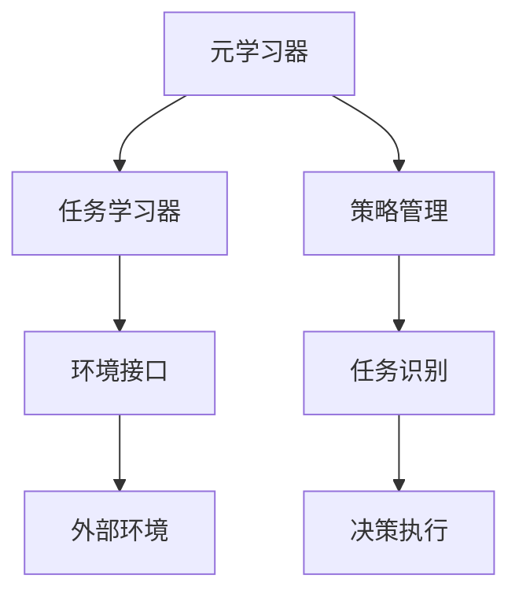

                 


# 基于元强化学习的AI Agent策略泛化

## 关键词：元强化学习，AI Agent，策略泛化，深度强化学习，多任务学习，迁移学习，强化学习

## 摘要：本文深入探讨了基于元强化学习的AI Agent策略泛化问题。通过分析元强化学习的核心原理和算法框架，结合实际案例，展示了如何利用元强化学习提升AI Agent在复杂环境中的适应能力和策略泛化能力。文章从背景介绍、核心概念、算法原理、系统架构设计到项目实战，全面解析了基于元强化学习的AI Agent策略泛化的实现与应用。

---

## 第一部分：元强化学习与AI Agent策略泛化的背景与基础

### 第1章：元强化学习与AI Agent概述

#### 1.1 元强化学习的基本概念

元强化学习（Meta Reinforcement Learning）是一种通过学习如何快速适应新任务的强化学习方法。与传统强化学习不同，元强化学习的目标是让AI Agent能够在多个任务之间快速切换，并在每个任务中迅速找到最优策略。

- **传统强化学习**：在单一任务环境中通过试错学习，逐步优化策略。
- **元强化学习**：在多个任务环境中学习如何快速适应每个任务，形成通用策略。

**特点：**

- **快速适应**：在新任务中快速找到最优策略。
- **多任务学习**：能够在多个任务之间共享知识，减少学习新任务所需的时间。
- **泛化能力**：在未见过的任务中也能表现良好。

#### 1.2 AI Agent的基本概念

AI Agent是一种智能体，能够感知环境、做出决策并执行动作。AI Agent的核心目标是通过与环境的交互，实现特定任务目标。

- **感知**：通过传感器或接口获取环境信息。
- **决策**：基于感知信息，选择最优动作。
- **执行**：将决策转化为具体动作，与环境互动。

**AI Agent的类型：**

- **反应式Agent**：基于当前感知做出反应，没有内部状态。
- **认知式Agent**：具有复杂内部状态，能够推理和规划。
- **学习型Agent**：通过经验改进策略，适应新环境。

#### 1.3 策略泛化的概念

策略泛化是指AI Agent能够在不同环境中灵活应用其策略的能力。当AI Agent接触到新的、未见过的任务或环境时，能够快速调整策略，适应新场景。

**意义：**

- **减少训练时间**：通过泛化，AI Agent可以在新任务中更快找到最优策略。
- **增强适应性**：能够应对动态变化的环境，提高任务成功率。
- **提升效率**：减少针对每个新任务单独训练的需求。

#### 1.4 元强化学习与策略泛化的联系

元强化学习通过学习如何快速调整策略，帮助AI Agent实现策略泛化。元强化学习的核心思想是：在训练阶段，AI Agent学习如何在多个任务中调整策略；在推理阶段，当遇到新任务时，能够快速调整策略，适应新任务。

---

## 第二部分：元强化学习的核心概念与联系

### 第2章：元强化学习的核心原理

#### 2.1 元强化学习的模型结构

元强化学习的模型通常包括两个部分：元学习器（Meta Learner）和任务学习器（Task Learner）。

- **元学习器**：负责学习如何调整任务学习器的参数。
- **任务学习器**：在特定任务中，通过调整参数快速找到最优策略。

**模型结构：**

1. **元学习器**：接收多个任务的信息，学习如何调整任务学习器的参数。
2. **任务学习器**：针对具体任务，通过参数调整，找到最优策略。

#### 2.2 元强化学习的算法框架

元强化学习的算法框架主要分为基于模型和基于无模型的两种类型。

- **基于模型的元强化学习**：任务学习器通过环境模型进行策略优化。
- **基于无模型的元强化学习**：任务学习器直接与环境交互，通过经验回放进行策略优化。

**统一框架：**

元强化学习的目标是通过训练，使得任务学习器能够在新任务中快速找到最优策略。元学习器的作用是加速这个过程。

#### 2.3 元强化学习与传统强化学习的对比

| 概念         | 传统强化学习               | 元强化学习                 |
|--------------|---------------------------|---------------------------|
| 学习目标     | 单一任务的最优策略         | 多任务环境中的快速适应     |
| 知识共享     | 每个任务独立训练           | 多任务之间共享知识         |
| 适应新任务   | 需要重新训练               | 能够快速调整策略           |

---

## 第三部分：基于元强化学习的AI Agent策略泛化实现

### 第3章：基于元强化学习的策略泛化算法

#### 3.1 基于模型的元强化学习算法

基于模型的元强化学习算法通过构建环境模型，帮助任务学习器快速适应新任务。

**算法步骤：**

1. **环境建模**：学习环境的动态模型。
2. **策略优化**：利用环境模型优化策略。

#### 3.2 基于无模型的元强化学习算法

基于无模型的元强化学习算法直接与环境交互，通过经验回放和策略调整来实现快速适应。

**算法步骤：**

1. **经验收集**：在多个任务中收集经验。
2. **策略更新**：利用经验更新策略。

#### 3.3 元强化学习的数学模型

元强化学习的数学模型通常包括损失函数和优化目标。

**损失函数：**

$$ L = \sum_{t=1}^{T} \sum_{i=1}^{N} (r_i - \mu_i)^2 $$

其中，$r_i$是实际奖励，$\mu_i$是预测奖励，$T$是任务数量，$N$是每个任务的样本数量。

**优化目标：**

$$ \min_{\theta} L $$

通过优化损失函数，元学习器调整任务学习器的参数。

---

## 第四部分：系统分析与架构设计

### 第4章：基于元强化学习的AI Agent系统架构

#### 4.1 系统功能设计

AI Agent系统功能包括：

1. **环境感知**：通过传感器获取环境信息。
2. **任务识别**：识别当前任务并选择合适的策略。
3. **策略调整**：根据任务需求调整策略。
4. **执行决策**：执行决策动作，与环境交互。

#### 4.2 系统架构设计

系统架构设计包括：

1. **元学习器模块**：负责学习如何调整策略。
2. **任务学习器模块**：针对具体任务优化策略。
3. **环境接口模块**：与外部环境交互。
4. **策略管理模块**：管理多个任务的策略。

**系统架构图：**



---

## 第五部分：项目实战与案例分析

### 第5章：基于元强化学习的AI Agent实现

#### 5.1 项目环境配置

需要安装以下库：

```bash
pip install gym numpy tensorflow
```

#### 5.2 核心代码实现

```python
import numpy as np
import tensorflow as tf

# 元学习器网络
class MetaLearner(tf.keras.Model):
    def __init__(self):
        super(MetaLearner, self).__init__()
        self.dense1 = tf.keras.layers.Dense(64, activation='relu')
        self.dense2 = tf.keras.layers.Dense(32, activation='relu')
        self.dense3 = tf.keras.layers.Dense(1, activation='sigmoid')

    def call(self, inputs):
        x = self.dense1(inputs)
        x = self.dense2(x)
        x = self.dense3(x)
        return x

# 任务学习器网络
class TaskLearner(tf.keras.Model):
    def __init__(self):
        super(TaskLearner, self).__init__()
        self.dense1 = tf.keras.layers.Dense(64, activation='relu')
        self.dense2 = tf.keras.layers.Dense(32, activation='relu')
        self.dense3 = tf.keras.layers.Dense(1, activation='sigmoid')

    def call(self, inputs):
        x = self.dense1(inputs)
        x = self.dense2(x)
        x = self.dense3(x)
        return x

# 元强化学习训练
def train(meta_learner, task_learner, optimizer):
    for task in tasks:
        with tf.GradientTape() as tape:
            # 计算损失
            loss = compute_loss(meta_learner, task_learner, task)
        # 更新参数
        grads = tape.gradient(loss, meta_learner.trainable_weights)
        optimizer.apply_gradients(zip(grads, meta_learner.trainable_weights))
```

---

## 第六部分：总结与展望

### 第6章：总结与展望

#### 6.1 本章总结

本文深入探讨了基于元强化学习的AI Agent策略泛化问题。通过分析元强化学习的核心原理和算法框架，结合实际案例，展示了如何利用元强化学习提升AI Agent在复杂环境中的适应能力和策略泛化能力。

#### 6.2 最佳实践 tips

- **模型选择**：根据任务需求选择合适的元强化学习算法。
- **数据处理**：确保数据的多样性和代表性。
- **超参数调整**：合理设置学习率、批量大小等超参数。

#### 6.3 未来展望

元强化学习在AI Agent策略泛化方面具有广阔的应用前景。未来的研究方向包括：

- **多任务学习优化**：进一步提升多任务学习的效率和效果。
- **实时适应能力**：研究如何让AI Agent在动态环境中实时调整策略。
- **复杂环境应用**：探索元强化学习在更复杂环境中的应用。

---

**作者：AI天才研究院/AI Genius Institute & 禅与计算机程序设计艺术 /Zen And The Art of Computer Programming**

