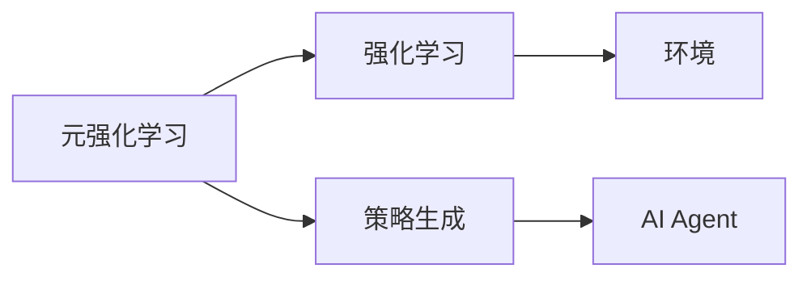
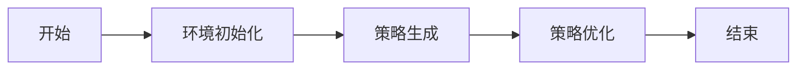

                 

# 基于元强化学习的AI Agent策略生成

> 关键词：元强化学习，AI Agent，策略生成，强化学习，算法实现

> 摘要：本文深入探讨了基于元强化学习的AI Agent策略生成技术，从背景、核心概念、算法原理到系统架构、项目实战，逐步展开分析，结合实际案例，详细阐述了如何利用元强化学习快速生成高效策略，为AI Agent在复杂环境中的应用提供理论支持和技术实现。

---

## 第一部分: 元强化学习与AI Agent概述

### 第1章: 元强化学习的背景与问题背景

#### 1.1 元强化学习的背景
- **问题背景**：AI Agent需要在复杂动态环境中做出决策，传统强化学习（RL）需要从零开始学习，效率低。
- **定义**：元强化学习（Meta Reinforcement Learning）是通过学习策略生成的方法，能够快速适应新环境。
- **特点**：高效性、环境适应性、知识复用性。

#### 1.2 元强化学习与传统强化学习的对比
| 特性                | 强化学习                | 元强化学习             |
|---------------------|------------------------|-----------------------|
| 学习目标            | 具体环境的策略          | 通用策略生成器        |
| 适应性              | 单一环境               | 多环境快速适应         |
| 知识复用性           | 无                     | 高                     |

#### 1.3 AI Agent的策略生成问题
- **问题描述**：AI Agent需要在未知环境中生成有效策略，传统RL无法快速适应新任务。
- **解决方案**：利用元强化学习，通过学习策略生成器快速生成适应新环境的策略。
- **边界与外延**：元强化学习适用于多任务学习，其外延包括多智能体协作、实时策略生成。

#### 1.4 元强化学习的核心要素
- **元知识库**：存储多种策略模式和经验。
- **策略生成器**：根据环境信息生成具体策略。
- **适应机制**：动态调整策略以适应新环境。

### 第2章: 元强化学习的核心概念与联系

#### 2.1 元强化学习的原理
- **基本框架**：通过学习策略生成器，快速适应新环境。
- **数学模型**：定义策略生成的数学公式，解释其工作原理。
- **算法流程**：从环境初始化到策略生成的步骤。

#### 2.2 元强化学习的核心概念
- **策略生成**：生成适应新环境的策略。
- **元学习**：学习如何生成策略。
- **环境适应性**：快速适应不同环境。

#### 2.3 元强化学习的ER实体关系图

### 第3章: 元强化学习的算法原理

#### 3.1 元强化学习的数学模型
- **状态空间**：定义环境中的状态。
- **动作空间**：定义可能的动作。
- **奖励函数**：定义环境对动作的反馈。

#### 3.2 元强化学习的算法流程

#### 3.3 元强化学习的算法实现
- **Python代码示例**：实现一个简单的元强化学习算法。
- **代码解读**：解释每一步的作用和实现细节。

---

## 第二部分: 元强化学习的系统分析与架构设计

### 第4章: 元强化学习的系统分析

#### 4.1 问题场景介绍
- **环境描述**：动态、未知的环境。
- **系统目标**：快速生成适应环境的策略。

#### 4.2 系统功能设计
- **领域模型**：定义系统的功能模块。
- **架构图**：展示各模块之间的关系。

#### 4.3 系统架构设计
- **系统架构图**：展示AI Agent的架构。
- **接口设计**：定义系统与其他模块的接口。
- **交互序列图**：展示系统与环境的交互过程。

### 第5章: 元强化学习的项目实战

#### 5.1 项目介绍
- **项目目标**：实现一个基于元强化学习的AI Agent。
- **环境安装**：安装必要的库和工具。

#### 5.2 核心实现
- **Python代码实现**：详细实现元强化学习算法。
- **代码解读**：解释代码的每一步。

#### 5.3 实际案例分析
- **案例分析**：分析一个实际案例，展示策略生成的效果。
- **实验结果**：展示实验结果并进行分析。

---

## 第三部分: 高级主题与拓展

### 第6章: 元强化学习的高级主题

#### 6.1 多智能体协作
- **多智能体协作的策略生成**：如何在多智能体环境中应用元强化学习。
- **案例分析**：分析一个多智能体协作的案例。

#### 6.2 实时策略生成
- **实时策略生成的实现**：如何实现实时策略生成。
- **优化策略生成效率**：优化策略生成的效率和效果。

#### 6.3 元强化学习的鲁棒性优化
- **鲁棒性优化方法**：如何提高元强化学习的鲁棒性。
- **优化策略生成的稳定性**：优化策略生成的稳定性和一致性。

### 第7章: 总结与展望

#### 7.1 总结
- **核心内容回顾**：回顾全文的核心内容和主要观点。
- **最佳实践**：总结最佳实践经验和教训。
- **小结**：总结全文，强调元强化学习的重要性和应用前景。

#### 7.2 展望
- **未来研究方向**：展望未来的研究方向和挑战。
- **潜在应用领域**：探讨元强化学习的潜在应用领域。

---

## 作者：AI天才研究院 & 禅与计算机程序设计艺术

---

通过本文，读者可以全面了解基于元强化学习的AI Agent策略生成技术，从理论到实践，逐步掌握如何利用元强化学习快速生成高效策略，为AI Agent在复杂环境中的应用提供坚实的技术支持。

