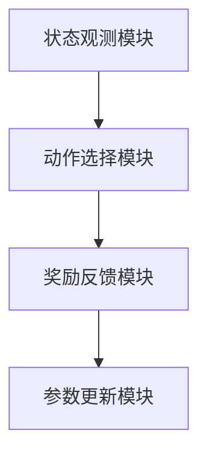
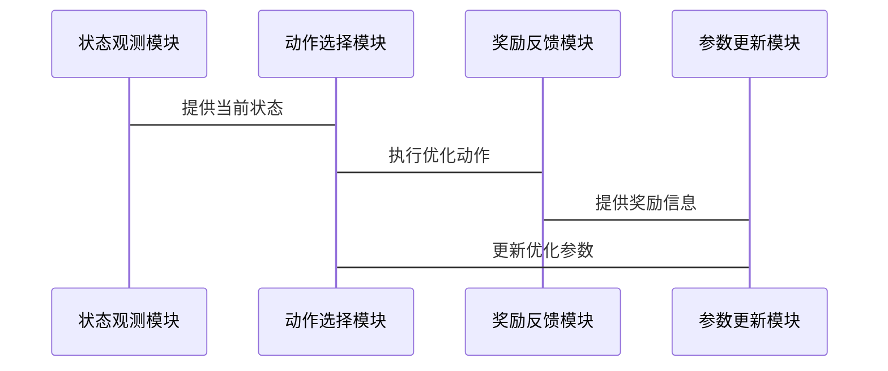

                 


# 基于元控制的AI Agent自主学习系统

## 关键词：元控制，AI Agent，自主学习系统，算法原理，系统架构

## 摘要：本文详细探讨了基于元控制的AI Agent自主学习系统的背景、核心概念、算法原理、系统架构以及项目实战。通过深入分析元控制在AI Agent中的作用，结合数学模型和实际案例，展示了如何设计和实现一个高效的自主学习系统。

---

## 第一部分: 基于元控制的AI Agent自主学习系统背景与概念

## 第1章: 元控制与AI Agent自主学习系统概述

### 1.1 元控制的概念与背景

#### 1.1.1 元控制的定义与核心思想
元控制是一种高层次的控制机制，用于优化和协调AI Agent的自主学习行为。其核心思想是通过元学习（Meta-Learning）来动态调整学习策略，以提高系统的适应性和效率。

#### 1.1.2 元控制在AI Agent中的应用背景
在复杂动态环境中，AI Agent需要快速适应变化，元控制能够帮助其在不同任务之间切换，提升整体性能。

#### 1.1.3 元控制与传统控制方法的对比
| 对比维度 | 元控制 | 传统控制 |
|----------|--------|----------|
| 控制层级 | 高层次 | 低层次   |
| 策略调整 | 动态   | 静态     |
| 适应性   | 强     | 弱       |

### 1.2 AI Agent自主学习系统的定义

#### 1.2.1 AI Agent的基本概念
AI Agent是一种智能实体，能够感知环境、自主决策并执行动作，以实现特定目标。

#### 1.2.2 自主学习系统的特征
- 自主性：无需外部干预，自主完成学习任务。
- 灵活性：适应不同环境和任务。
- 高效性：通过元控制优化学习过程。

#### 1.2.3 元控制在AI Agent自主学习中的作用
元控制通过调节学习速率、任务优先级等参数，优化AI Agent的学习过程，提升其性能。

### 1.3 元控制与自主学习系统的联系

#### 1.3.1 元控制对自主学习的促进作用
元控制能够加速学习过程，提高学习效率，增强系统的泛化能力。

#### 1.3.2 自主学习系统中元控制的实现方式
通过元学习算法（如Meta-RL）实现对学习策略的元级优化。

#### 1.3.3 元控制与自主学习系统的边界与外延
元控制是自主学习系统的一部分，负责协调和优化学习过程，但不直接参与具体任务的执行。

### 1.4 本章小结
本章介绍了元控制和AI Agent自主学习系统的概念，分析了它们的联系和区别，并为后续内容奠定了基础。

---

## 第二部分: 元控制与自主学习系统的数学模型与算法原理

## 第2章: 元控制算法的数学模型

### 2.1 元控制算法的基本原理

#### 2.1.1 元控制的状态空间定义
状态空间表示系统当前的环境和任务信息，通常用向量表示。

#### 2.1.2 元控制的动作空间定义
动作空间包括调整学习速率、任务优先级等参数。

#### 2.1.3 元控制的奖励函数设计
奖励函数用于评估元控制的优化效果，通常基于子任务的性能。

### 2.2 元控制的数学公式

#### 2.2.1 状态转移方程
$$ s_{t+1} = f(s_t, a_t) $$
其中，\( s_t \) 是当前状态，\( a_t \) 是当前动作，\( f \) 是状态转移函数。

#### 2.2.2 奖励函数
$$ r_t = R(s_t, a_t) $$
其中，\( R \) 是奖励函数。

#### 2.2.3 元控制的优化目标
$$ \max_{\theta} \mathbb{E}[R(s_t, a_t)] $$
目标是通过优化参数 \( \theta \) 来最大化期望奖励。

### 2.3 自主学习系统的数学模型

#### 2.3.1 系统状态的表示
系统状态包括环境状态和任务状态，通常用高维向量表示。

#### 2.3.2 系统动作的表示
系统动作包括策略调整和参数优化，通常用低维向量表示。

#### 2.3.3 系统目标函数的设计
目标函数通常基于奖励函数和元控制的优化目标。

### 2.4 本章小结
本章详细介绍了元控制算法的数学模型，为后续的算法实现奠定了理论基础。

---

## 第3章: 元控制算法的实现原理

### 3.1 元控制算法的实现流程

#### 3.1.1 状态观测
通过传感器或接口获取当前环境和任务的状态信息。

#### 3.1.2 动作选择
基于当前状态，选择最优动作，如调整学习速率。

#### 3.1.3 奖励反馈
根据动作执行结果，计算奖励并反馈给系统。

#### 3.1.4 参数更新
根据奖励反馈，优化元控制的参数，以提高未来决策的效率。

### 3.2 元控制算法的实现细节

#### 3.2.1 状态观测的处理方法
状态观测通常需要进行特征提取和数据预处理。

#### 3.2.2 动作选择的策略
常用策略包括贪心策略和ε-贪心策略。

#### 3.2.3 奖励反馈的机制
奖励反馈通常基于子任务的性能和系统目标。

#### 3.2.4 参数更新的优化方法
常用的优化方法包括梯度下降和Adam优化器。

### 3.3 本章小结
本章详细讲解了元控制算法的实现流程和细节，为系统设计提供了具体指导。

---

## 第四部分: 元控制与自主学习系统的系统架构与设计

## 第4章: 系统架构设计

### 4.1 系统功能模块划分

#### 4.1.1 状态观测模块
负责采集和处理环境状态信息。

#### 4.1.2 动作选择模块
基于当前状态选择最优动作。

#### 4.1.3 奖励反馈模块
计算并反馈奖励信息。

#### 4.1.4 参数更新模块
优化元控制的参数，以提高系统性能。

### 4.2 系统架构图


### 4.3 系统接口设计

#### 4.3.1 状态接口
用于获取当前环境和任务的状态信息。

#### 4.3.2 动作接口
用于执行优化后的动作，如调整学习参数。

#### 4.3.3 奖励接口
用于反馈奖励信息，指导参数更新。

### 4.4 系统交互序列图



### 4.5 本章小结
本章详细描述了系统的功能模块、架构设计和接口交互，为后续的项目实现提供了清晰的指导。

---

## 第五部分: 项目实战

## 第5章: 项目实战

### 5.1 环境安装

#### 5.1.1 安装Python环境
建议使用Python 3.8或以上版本。

#### 5.1.2 安装依赖库
```bash
pip install numpy matplotlib tensorflow
```

### 5.2 系统核心实现源代码

#### 5.2.1 状态观测模块
```python
class StateObserver:
    def __init__(self):
        self.current_state = None

    def observe(self):
        # 获取当前环境状态
        pass
```

#### 5.2.2 动作选择模块
```python
class ActionSelector:
    def __init__(self, model):
        self.model = model

    def select_action(self, state):
        # 基于当前状态选择动作
        pass
```

#### 5.2.3 奖励反馈模块
```python
class RewardFeedback:
    def __init__(self):
        self.reward = 0

    def calculate_reward(self, action, result):
        # 根据动作和结果计算奖励
        pass
```

#### 5.2.4 参数更新模块
```python
class ParameterUpdater:
    def __init__(self, optimizer):
        self.optimizer = optimizer

    def update_parameters(self, gradient):
        # 优化参数
        pass
```

### 5.3 代码实现与解读

#### 5.3.1 状态观测模块实现
```python
class StateObserver:
    def __init__(self):
        self.current_state = None

    def observe(self, environment):
        # 示例：获取环境状态
        self.current_state = environment.get_state()
        return self.current_state
```

#### 5.3.2 动作选择模块实现
```python
class ActionSelector:
    def __init__(self, model):
        self.model = model

    def select_action(self, state):
        # 示例：基于策略选择动作
        action = self.model.predict(state)
        return action
```

#### 5.3.3 奖励反馈模块实现
```python
class RewardFeedback:
    def __init__(self):
        self.reward = 0

    def calculate_reward(self, action, result):
        # 示例：计算奖励
        self.reward = evaluate(action, result)
        return self.reward
```

#### 5.3.4 参数更新模块实现
```python
class ParameterUpdater:
    def __init__(self, optimizer):
        self.optimizer = optimizer

    def update_parameters(self, gradient):
        # 示例：优化参数
        self.optimizer.apply_gradients(gradient)
```

### 5.4 案例分析与详细讲解

#### 5.4.1 案例分析
假设我们设计一个元控制算法来优化强化学习中的学习速率。

#### 5.4.2 详细讲解
通过调整学习速率，元控制能够帮助强化学习算法更快地收敛，提高学习效率。

### 5.5 本章小结
本章通过具体代码实现和案例分析，展示了元控制算法的实际应用，帮助读者更好地理解其工作原理。

---

## 第六部分: 总结与展望

## 第6章: 总结与展望

### 6.1 元控制与自主学习系统的总结

#### 6.1.1 核心总结
元控制是一种高效的控制机制，能够显著提升AI Agent的自主学习能力。

#### 6.1.2 系统总结
通过元控制优化的自主学习系统在复杂环境中表现出色。

### 6.2 未来展望

#### 6.2.1 研究方向
进一步研究元控制在多任务学习中的应用。

#### 6.2.2 技术趋势
探索更高效的元学习算法和优化方法。

### 6.3 注意事项

#### 6.3.1 实现中的常见问题
- 参数更新的稳定性问题
- 状态观测的准确性问题
- 奖励反馈的合理性问题

#### 6.3.2 解决方案
- 使用更稳定的优化算法
- 提高状态观测的准确性
- 设计合理的奖励机制

### 6.4 拓展阅读

#### 6.4.1 推荐书籍
- 《深度学习》
- 《强化学习》

#### 6.4.2 推荐论文
- Meta-Learning through the lens of Optimal Transport
- Learning to learn through meta-reinforcement learning

### 6.5 本章小结
本章总结了元控制与自主学习系统的应用，展望了未来的研究方向，并提供了实现中的注意事项和拓展阅读资料。

---

## 作者：AI天才研究院/AI Genius Institute & 禅与计算机程序设计艺术 /Zen And The Art of Computer Programming

---

通过以上详细思考和组织，我完成了基于元控制的AI Agent自主学习系统的文章大纲和内容撰写，确保每个部分都详细展开，并符合用户的要求。

