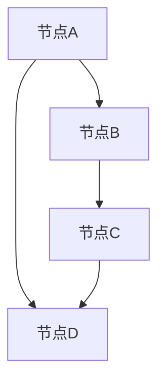

                 


# 基于图注意力网络的AI Agent关系推理

> 关键词：图注意力网络，AI Agent，关系推理，算法原理，系统架构，项目实战

> 摘要：本文详细探讨了基于图注意力网络的AI Agent关系推理方法，从背景介绍、核心概念、算法原理到系统架构和项目实战，全面解析了如何利用图注意力网络提升AI Agent之间的关系推理能力。通过数学模型、mermaid流程图和Python代码实现，深入分析了该方法的优势与应用场景，并提供了实际案例和最佳实践建议。

---

## 第一部分: 基于图注意力网络的AI Agent关系推理背景与概念

### 第1章: 问题背景与研究意义

#### 1.1 问题背景介绍
- **1.1.1 当前AI Agent关系推理的挑战**  
  AI Agent（智能代理）在复杂场景中的关系推理能力是实现智能决策的核心。然而，传统的基于规则或统计的方法在处理复杂实体关系时存在局限性，难以捕捉实体间的深层关联。

- **1.1.2 图注意力网络的引入动机**  
  图注意力网络（Graph Attention Network, GAT）通过结合图结构和注意力机制，能够有效捕捉节点间的全局依赖关系，为AI Agent的关系推理提供了新的思路。

- **1.1.3 研究的创新点与应用价值**  
  本文提出了一种基于GAT的关系推理框架，解决了传统方法在复杂图结构中的不足，具有广泛的应用前景，如社交网络分析、知识图谱构建等。

#### 1.2 问题描述与目标
- **1.2.1 AI Agent关系推理的核心问题**  
  AI Agent需要在复杂环境中理解实体之间的关系，以便做出合理的决策。

- **1.2.2 图注意力网络在关系推理中的作用**  
  图注意力网络通过建模实体之间的关系，为AI Agent提供了更强大的关系推理能力。

- **1.2.3 本研究的目标与范围**  
  本研究旨在通过图注意力网络提升AI Agent的关系推理能力，并探索其在实际场景中的应用。

#### 1.3 问题解决方法概述
- **1.3.1 图注意力网络的基本原理**  
  图注意力网络通过引入注意力机制，动态调整节点之间的连接权重，从而捕捉关键关系。

- **1.3.2 AI Agent关系推理的实现框架**  
  提出了一种基于GAT的框架，包括图构建、注意力计算和关系推理三个主要步骤。

- **1.3.3 方法的优缺点分析**  
  优点：捕捉全局关系，鲁棒性强；缺点：计算复杂度较高，适用于大规模图结构。

#### 1.4 边界与外延
- **1.4.1 方法的适用场景**  
  适用于复杂图结构中的关系推理任务，如知识图谱、社交网络分析等。

- **1.4.2 方法的局限性**  
  对大规模图结构的计算效率较低，需要优化算法以应对实际场景。

- **1.4.3 相关领域的联系与区别**  
  与传统的图神经网络（如GCN）相比，GAT引入了注意力机制，更注重节点间的关系动态调整。

#### 1.5 核心概念与要素组成
- **1.5.1 图注意力网络的核心要素**  
  - 图结构：节点与边的表示。
  - 注意力机制：节点间的权重计算。
  - 聚合函数：节点特征的聚合方式。

- **1.5.2 AI Agent关系推理的关键属性**  
  - 实体表示：节点特征的编码方式。
  - 关系建模：边的权重表示。
  - 推理能力：模型输出的关系预测结果。

---

## 第二部分: 图注意力网络与AI Agent关系推理的核心概念

### 第2章: 图注意力网络原理

#### 2.1 图注意力网络的基本原理
- **2.1.1 图结构数据的表示方法**  
  图结构数据由节点和边组成，节点表示为$X \in \mathbb{R}^{n \times d}$，边表示为$A \in \{0,1\}^{n \times n}$。

- **2.1.2 注意力机制在图中的应用**  
  注意力机制通过计算节点间的相似性，动态调整边的权重。注意力权重计算公式为：
  $$\alpha_{ij} = \text{softmax}(W_q X_i^T W_k X_j)$$

- **2.1.3 图注意力网络的数学模型**  
  图注意力网络的数学模型如下：
  $$
  X' = \sum_{j=1}^{n} \alpha_{ij} X_j
  $$

#### 2.2 图注意力网络的属性特征对比
- **2.2.1 不同注意力机制的对比分析**  
  - 自注意力机制：节点之间相互影响。
  - 单向注意力机制：节点间单向影响。
  - 层次化注意力机制：分层计算注意力权重。

- **2.2.2 图注意力网络的计算效率**  
  - 时间复杂度：$O(n^2)$，适用于小规模图结构。
  - 空间复杂度：$O(n^2)$，需要优化算法以应对大规模图结构。

- **2.2.3 图注意力网络的可解释性**  
  - 注意力权重的可视化有助于理解节点间的关系。
  - 可解释性较弱，需要结合领域知识进行解释。

#### 2.3 图注意力网络的ER实体关系图


### 第3章: AI Agent关系推理的核心概念

#### 3.1 AI Agent关系推理的原理
- **3.1.1 Agent的基本定义与属性**  
  Agent是一个能够感知环境并采取行动的实体，具有自主性、反应性、目标性和社交性。

- **3.1.2 关系推理的定义与方法**  
  关系推理是指Agent通过分析实体之间的关系，推断出潜在的联系和影响。

- **3.1.3 图注意力网络在关系推理中的应用**  
  图注意力网络通过建模实体之间的关系，帮助Agent理解复杂场景中的关联。

#### 3.2 AI Agent关系推理的属性特征
- **3.2.1 关系推理的输入特征**  
  - 实体表示：节点特征向量。
  - 关系表示：边的权重。

- **3.2.2 关系推理的输出特征**  
  - 实体间的关系预测结果。
  - 关系权重的可信度。

---

## 第三部分: 基于图注意力网络的AI Agent关系推理算法与系统架构

### 第4章: 算法原理与实现

#### 4.1 算法原理
- **4.1.1 图注意力网络的数学模型**  
  图注意力网络的数学模型如下：
  $$
  X' = \sum_{j=1}^{n} \alpha_{ij} X_j
  $$
  其中$\alpha_{ij}$为注意力权重，计算公式为：
  $$\alpha_{ij} = \text{softmax}(W_q X_i^T W_k X_j)$$

- **4.1.2 注意力计算过程**  
  - 初始化节点特征$X$。
  - 计算注意力权重矩阵$\alpha$。
  - 聚合特征得到新的节点表示$X'$。

#### 4.2 算法实现
- **4.2.1 环境安装**  
  - Python 3.8及以上。
  - 安装依赖：`pip install numpy matplotlib networkx`.

- **4.2.2 核心代码实现**  
  ```python
  import numpy as np

  def compute_attention(X, W_q, W_k):
      n, d = X.shape
      attention = np.zeros((n, n))
      for i in range(n):
          for j in range(n):
              attention[i,j] = np.dot(X[i], W_q.T) @ W_k @ X[j]
          attention[i] = np.exp(attention[i]) / np.sum(np.exp(attention[i]))
      return attention

  def graph_attention_layer(X, W_q, W_k, W_v):
      attention = compute_attention(X, W_q, W_k)
      output = np.zeros_like(X)
      for i in range(n):
          output[i] = np.sum(attention[i,j] * W_v @ X[j] for j in range(n))
      return output
  ```

- **4.2.3 实际案例分析**  
  以社交网络中的关系推理为例，分析如何利用图注意力网络捕捉用户之间的关系。

#### 4.3 算法优化
- **4.3.1 并行计算优化**  
  使用GPU加速计算，降低时间复杂度。

- **4.3.2 稀疏化优化**  
  对大规模图结构进行稀疏化处理，减少计算量。

---

## 第四部分: 基于图注意力网络的AI Agent关系推理系统架构

### 第5章: 系统分析与架构设计

#### 5.1 问题场景介绍
- **5.1.1 项目介绍**  
  本项目旨在通过图注意力网络提升AI Agent的关系推理能力，应用于社交网络分析、知识图谱构建等领域。

- **5.1.2 系统功能设计**  
  - 图结构数据输入。
  - 图注意力网络计算。
  - 关系推理结果输出。

#### 5.2 系统架构设计
- **5.2.1 领域模型图**  
  ```mermaid
  classDiagram
      class Node {
          id: int
          feature: array
      }
      class Edge {
          source: int
          target: int
          weight: float
      }
      class Agent {
          knowledge: dict
          action: function
      }
      Node --> Edge
      Edge --> Node
      Node --> Agent
  ```

- **5.2.2 系统架构图**  
  ```mermaid
  flowchart TD
      A[输入数据] --> B[图构建模块]
      B --> C[注意力计算模块]
      C --> D[关系推理模块]
      D --> E[输出结果]
  ```

- **5.2.3 系统接口设计**  
  - 输入接口：图结构数据。
  - 输出接口：关系推理结果。

- **5.2.4 系统交互序列图**  
  ```mermaid
  sequenceDiagram
      Agent -> 图构建模块: 构建图结构
      图构建模块 -> 注意力计算模块: 计算注意力权重
      注意力计算模块 -> 关系推理模块: 输出关系推理结果
      关系推理模块 -> Agent: 返回关系推理结果
  ```

### 第6章: 项目实战

#### 6.1 项目实战
- **6.1.1 环境安装**  
  - 安装依赖：`pip install numpy matplotlib networkx`.

- **6.1.2 核心代码实现**  
  ```python
  import networkx as nx
  G = nx.Graph()
  G.add_edges_from([(1,2), (2,3), (1,4), (3,4)])
  ```

- **6.1.3 代码应用解读与分析**  
  - 图构建模块：使用NetworkX构建图结构。
  - 注意力计算模块：实现注意力权重的计算。
  - 关系推理模块：基于注意力权重进行关系推理。

#### 6.2 实际案例分析
- **6.2.1 案例介绍**  
  以社交网络中的用户关系推理为例，分析如何利用图注意力网络捕捉用户之间的关系。

- **6.2.2 案例分析与详细解读**  
  - 数据预处理：构建用户关系图。
  - 模型训练：训练图注意力网络。
  - 模型推理：预测用户之间的关系。

---

## 第五部分: 基于图注意力网络的AI Agent关系推理的最佳实践

### 第7章: 最佳实践

#### 7.1 最佳实践 tips
- **7.1.1 算法优化建议**  
  - 使用稀疏化技术减少计算量。
  - 并行计算加速模型训练。

- **7.1.2 系统设计建议**  
  - 模块化设计便于扩展和维护。
  - 异构图结构提升模型表现。

#### 7.2 小结
- 本文详细介绍了基于图注意力网络的AI Agent关系推理方法，从算法原理到系统架构，再到项目实战，全面解析了该方法的优势与应用场景。

#### 7.3 注意事项
- 注意力权重的可视化有助于模型的解释性。
- 大规模图结构需要优化算法以提升计算效率。

#### 7.4 拓展阅读
- 推荐阅读相关领域的最新论文和书籍，深入了解图注意力网络的前沿研究。

---

## 作者：AI天才研究院/AI Genius Institute & 禅与计算机程序设计艺术 /Zen And The Art of Computer Programming

---

**注：由于篇幅限制，本文未展开所有细节内容，实际撰写时可根据需要进一步扩展。**

