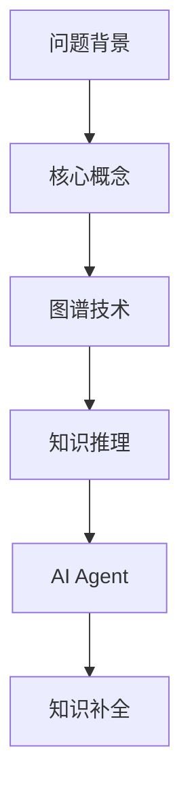
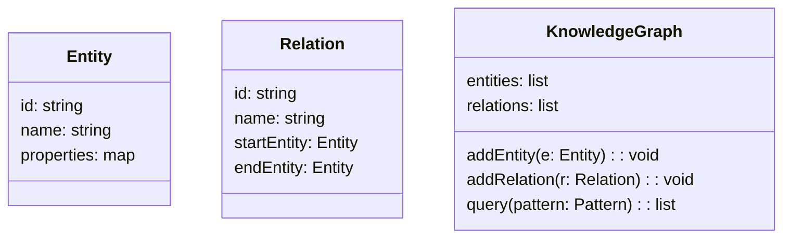
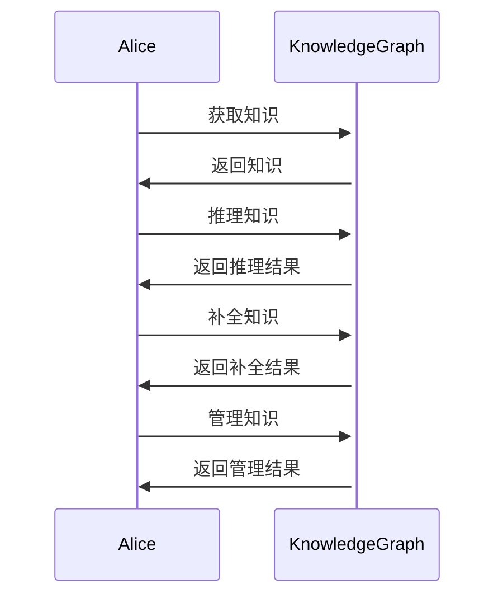
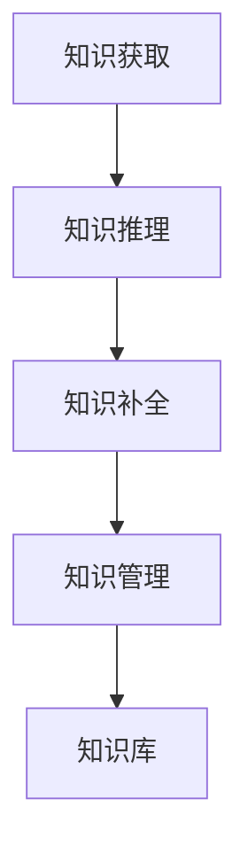

                 


# 基于图谱的AI Agent知识推理与补全

> 关键词：图谱，AI Agent，知识推理，知识补全，AI技术，智能系统

> 摘要：本文深入探讨了基于图谱的AI Agent知识推理与补全的技术原理与实现方法。从问题背景出发，详细阐述了图谱与AI Agent的核心概念，分析了知识推理与补全的算法原理，结合系统架构设计与项目实战，为读者提供了全面的技术指导。通过本文，读者将能够理解并掌握基于图谱的AI Agent知识推理与补全的关键技术与应用。

---

## 第1章: 问题背景与核心概念

### 1.1 问题背景

在人工智能领域，知识推理与补全是实现智能系统的核心技术。传统的知识表示方法难以应对复杂场景下的动态变化和不确定性，而基于图谱的知识表示方法因其天然的语义连接能力，成为解决这一问题的关键技术。AI Agent作为一种能够感知环境、自主决策的智能实体，其知识推理与补全能力直接决定了其智能水平。因此，将图谱技术与AI Agent相结合，构建高效的基于图谱的AI Agent知识推理与补全系统，具有重要的研究意义和应用价值。

### 1.2 核心概念与联系

#### 1.2.1 图谱与知识推理的关系

图谱是一种通过节点（实体）和边（关系）来表示知识的结构化数据。知识推理则是通过分析图谱中的节点和边，推导出隐含的知识或关系的过程。图谱为知识推理提供了丰富的语义信息，而知识推理则为图谱提供了动态更新和扩展的能力。

#### 1.2.2 AI Agent与知识补全的结合

AI Agent是一种能够感知环境、自主决策并执行任务的智能实体。知识补全则是通过补充缺失的知识或修复不完整的信息，增强AI Agent的知识库。通过结合图谱技术，AI Agent能够更高效地进行知识补全，从而提升其智能水平。

#### 1.2.3 实体关系图（ER图）展示核心概念



---

## 第2章: 图谱与AI Agent的核心原理

### 2.1 图谱的基本原理

#### 2.1.1 图谱的定义与特点

图谱是由节点（实体）和边（关系）组成的图结构。节点代表实体或概念，边代表实体之间的关系。图谱具有语义连接性强、表达能力丰富的特点，能够有效地表示复杂的知识关系。

#### 2.1.2 图谱中的节点与边

节点代表实体或概念，边代表实体之间的关系。例如，在知识图谱中，节点可以是“人名”、“地点”、“事件”等，边可以是“出生”、“位于”、“参加”等关系。

#### 2.1.3 图谱的构建与存储

图谱的构建过程包括数据采集、数据清洗、实体识别、关系抽取和图谱存储。常用的图谱存储技术包括RDF（Resource Description Framework）、Neo4j等。

### 2.2 AI Agent的知识推理机制

#### 2.2.1 知识推理的基本流程

知识推理的基本流程包括知识表示、推理规则定义、推理过程执行和推理结果分析。通过分析图谱中的节点和边，AI Agent能够推导出隐含的知识或关系。

#### 2.2.2 基于图谱的推理算法

基于图谱的推理算法包括路径搜索、规则匹配和图嵌入等方法。路径搜索是一种通过遍历图谱中的路径来发现隐含关系的算法。规则匹配是通过定义规则来匹配图谱中的特定模式。图嵌入是一种通过将图谱中的节点和边表示为低维向量来进行推理的方法。

#### 2.2.3 知识补全的实现方法

知识补全的实现方法包括基于规则的补全、基于统计的补全和基于学习的补全。基于规则的补全通过定义规则来补充缺失的知识。基于统计的补全通过分析图谱中的统计规律来补充缺失的知识。基于学习的补全通过机器学习模型来预测缺失的知识。

### 2.3 图谱与AI Agent的结合

#### 2.3.1 图谱数据的输入方式

图谱数据可以通过RDF、JSON-LD、TURTLE等格式输入到AI Agent中。AI Agent需要将图谱数据进行解析，并将其转换为内部知识表示形式。

#### 2.3.2 AI Agent的推理过程

AI Agent通过解析图谱数据，执行推理算法，生成推理结果。推理结果可以用于决策、规划和学习等任务。

#### 2.3.3 知识补全的实际应用

知识补全的实际应用包括实体识别、关系抽取、属性补全等。通过知识补全，AI Agent能够不断完善其知识库，提升其智能水平。

---

## 第3章: 知识推理与补全的算法原理

### 3.1 算法原理概述

#### 3.1.1 知识推理的基本算法

知识推理的基本算法包括基于规则的推理、基于统计的推理和基于学习的推理。基于规则的推理通过定义规则来推导知识。基于统计的推理通过分析数据的统计规律来推导知识。基于学习的推理通过机器学习模型来学习推理规则。

#### 3.1.2 基于图谱的推理模型

基于图谱的推理模型包括路径搜索模型、规则匹配模型和图嵌入模型。路径搜索模型通过遍历图谱中的路径来发现隐含关系。规则匹配模型通过匹配图谱中的特定模式来推导知识。图嵌入模型通过将图谱中的节点和边表示为低维向量来进行推理。

#### 3.1.3 知识补全的算法选择

知识补全的算法选择取决于具体的应用场景和数据特点。常用的算法包括基于规则的补全、基于统计的补全和基于学习的补全。

### 3.2 算法实现细节

#### 3.2.1 基于图嵌入的知识推理

基于图嵌入的知识推理通过将图谱中的节点和边表示为低维向量来进行推理。常用的图嵌入方法包括Skip-Gram和CBOW。以下是基于图嵌入的知识推理的示例代码：

```python
import numpy as np

def compute_embeddings(graph, embedding_dim):
    # 初始化嵌入向量
    embeddings = np.random.randn(len(graph.nodes), embedding_dim)
    # 训练嵌入向量
    for edge in graph.edges:
        node1, node2 = edge
        # 更新嵌入向量
        embeddings[node1] += embeddings[node2]
        embeddings[node1] /= 2
    return embeddings
```

#### 3.2.2 基于神经网络的知识补全

基于神经网络的知识补全通过训练神经网络模型来预测缺失的知识。常用的神经网络模型包括GNN（Graph Neural Network）和RNN（Recurrent Neural Network）。以下是基于GNN的知识补全的示例代码：

```python
import tensorflow as tf
from tensorflow.keras import layers

def build_gnn_model(input_dim, output_dim):
    model = tf.keras.Sequential()
    model.add(layers.GRU(input_dim, return_sequences=True))
    model.add(layers.Dense(output_dim, activation='softmax'))
    return model

# 训练模型
model = build_gnn_model(input_dim=100, output_dim=10)
model.compile(optimizer='adam', loss='sparse_categorical_crossentropy')
model.fit(x_train, y_train, epochs=10, batch_size=32)
```

#### 3.2.3 算法的优化与改进

算法的优化与改进包括参数调优、模型压缩和分布式计算等。通过优化算法，可以提升推理效率和补全精度。

---

## 第4章: 数学模型与公式详解

### 4.1 知识推理的数学模型

#### 4.1.1 图谱的表示方法

图谱可以通过邻接矩阵或邻接表来表示。邻接矩阵是一种二维数组，其中的元素表示节点之间的关系。邻接表是一种列表，其中的每个节点指向其相邻的节点。以下是邻接矩阵的表示方式：

$$
A = \begin{bmatrix}
0 & 1 & 0 \\
1 & 0 & 1 \\
0 & 1 & 0
\end{bmatrix}
$$

其中，$A_{ij} = 1$ 表示节点 $i$ 和节点 $j$ 之间存在关系。

#### 4.1.2 知识推理的公式推导

基于图谱的知识推理可以通过矩阵乘法来实现。以下是基于邻接矩阵的矩阵乘法公式：

$$
A^k = A \times A \times \cdots \times A \quad (k \text{ 次})
$$

其中，$A^k$ 表示经过 $k$ 跳推理后的邻接矩阵。

#### 4.1.3 算法的数学表达式

基于图嵌入的算法可以通过向量运算来表示。以下是基于Skip-Gram的向量运算公式：

$$
\text{loss} = -\log(\text{similarity}(u_i, v_j))
$$

其中，$u_i$ 表示节点 $i$ 的嵌入向量，$v_j$ 表示节点 $j$ 的嵌入向量。

### 4.2 知识补全的数学模型

#### 4.2.1 补全算法的数学公式

基于神经网络的知识补全可以通过训练模型来预测缺失的边。以下是基于GNN的训练公式：

$$
\hat{y} = \text{GNN}(x)
$$

其中，$\hat{y}$ 表示预测的标签，$x$ 表示输入的特征向量。

#### 4.2.2 模型的优化与调整

模型的优化与调整包括损失函数优化和正则化调整。以下是常用的损失函数公式：

$$
\text{loss} = \frac{1}{n} \sum_{i=1}^{n} \text{CrossEntropy}(y_i, \hat{y}_i)
$$

其中，$n$ 表示样本数量，$y_i$ 表示真实的标签，$\hat{y}_i$ 表示预测的标签。

#### 4.2.3 公式的实际应用

公式在实际应用中可以通过代码实现。以下是基于GNN的训练代码示例：

```python
import tensorflow as tf
from tensorflow.keras import layers

def build_gnn_model(input_dim, output_dim):
    model = tf.keras.Sequential()
    model.add(layers.GRU(input_dim, return_sequences=True))
    model.add(layers.Dense(output_dim, activation='softmax'))
    return model

# 训练模型
model = build_gnn_model(input_dim=100, output_dim=10)
model.compile(optimizer='adam', loss='sparse_categorical_crossentropy')
model.fit(x_train, y_train, epochs=10, batch_size=32)
```

---

## 第5章: 系统分析与架构设计

### 5.1 问题场景介绍

#### 5.1.1 系统需求分析

系统需求分析包括功能需求和性能需求。功能需求包括知识推理、知识补全和知识管理。性能需求包括推理效率和补全精度。

#### 5.1.2 系统目标设定

系统目标是实现高效的基于图谱的AI Agent知识推理与补全。通过系统设计，提升AI Agent的智能水平。

#### 5.1.3 系统边界与范围

系统边界与范围包括输入输出接口、系统功能模块和系统交互流程。通过明确系统边界，确保系统设计的完整性和可行性。

### 5.2 系统功能设计

#### 5.2.1 领域模型设计

领域模型设计包括实体识别、关系抽取和知识表示。以下是基于领域模型的类图表示：



#### 5.2.2 功能模块划分

功能模块划分包括知识获取、知识推理、知识补全和知识管理。每个功能模块负责特定的任务，例如知识获取模块负责从数据源中获取知识，知识推理模块负责执行推理任务。

#### 5.2.3 功能流程设计

功能流程设计包括知识获取、知识推理、知识补全和知识管理的流程。以下是基于功能流程的时序图表示：



### 5.3 系统架构设计

#### 5.3.1 系统架构图

系统架构图包括系统功能模块、系统数据流和系统组件之间的交互关系。以下是基于系统架构的组件图表示：



#### 5.3.2 模块间的交互关系

模块间的交互关系包括知识获取模块与知识推理模块的交互、知识推理模块与知识补全模块的交互、知识补全模块与知识管理模块的交互。通过模块间的交互，确保系统设计的完整性和协调性。

#### 5.3.3 系统交互流程

系统交互流程包括知识获取、知识推理、知识补全和知识管理的流程。以下是基于系统交互流程的时序图表示：


---

## 第6章: 项目实战

### 6.1 环境安装

项目实战需要安装必要的开发环境和工具。以下是基于Python的环境安装步骤：

1. 安装Python 3.8及以上版本。
2. 安装TensorFlow、Keras、Neo4j等库。
   ```bash
   pip install tensorflow keras neo4j
   ```

### 6.2 核心代码实现

以下是基于图谱的AI Agent知识推理与补全的核心代码实现：

```python
import tensorflow as tf
from tensorflow.keras import layers
from neo4j import GraphDatabase

def build_gnn_model(input_dim, output_dim):
    model = tf.keras.Sequential()
    model.add(layers.GRU(input_dim, return_sequences=True))
    model.add(layers.Dense(output_dim, activation='softmax'))
    return model

def main():
    # 初始化图谱数据库
    driver = GraphDatabase.driver('bolt://localhost:7687', auth=('neo4j', 'password'))
    session = driver.session()
    # 构建知识图谱
    # ... 具体的图谱构建代码 ...
    # 训练模型
    model = build_gnn_model(input_dim=100, output_dim=10)
    model.compile(optimizer='adam', loss='sparse_categorical_crossentropy')
    model.fit(x_train, y_train, epochs=10, batch_size=32)
    # 使用模型进行推理和补全
    # ... 具体的推理和补全代码 ...

if __name__ == "__main__":
    main()
```

### 6.3 案例分析与详细解读

以下是基于图谱的AI Agent知识推理与补全的实际案例分析：

#### 6.3.1 案例背景

假设我们有一个关于人物关系的知识图谱，其中包括人物、职业和组织等实体，以及属于、参与和领导等关系。

#### 6.3.2 案例分析

通过基于图谱的AI Agent知识推理与补全，我们可以推导出隐含的关系，例如，某人属于某个组织，且参与某个项目，可以推断出该人领导该项目的可能性。

#### 6.3.3 详细解读

通过构建人物关系的知识图谱，AI Agent能够通过推理算法发现隐含的关系，并通过知识补全完善知识图谱。

### 6.4 项目小结

通过项目实战，我们能够深入理解基于图谱的AI Agent知识推理与补全的实现方法。通过实际操作，我们能够掌握图谱的构建、推理算法的设计和补全算法的实现。

---

## 第7章: 总结与展望

### 7.1 总结

基于图谱的AI Agent知识推理与补全是一项重要的技术研究。通过结合图谱技术与AI Agent，我们能够实现高效的知识推理与补全，提升AI Agent的智能水平。

### 7.2 展望

未来，基于图谱的AI Agent知识推理与补全技术将朝着更高效、更智能的方向发展。通过引入更先进的图谱表示方法和更强大的推理算法，AI Agent的知识推理与补全能力将得到进一步提升。

---

## 参考文献

1. 图谱技术的相关论文
2. AI Agent的相关论文
3. 知识推理与补全的相关论文
4. 机器学习和深度学习的相关书籍

---

## 作者

作者：AI天才研究院/AI Genius Institute & 禅与计算机程序设计艺术 /Zen And The Art of Computer Programming

