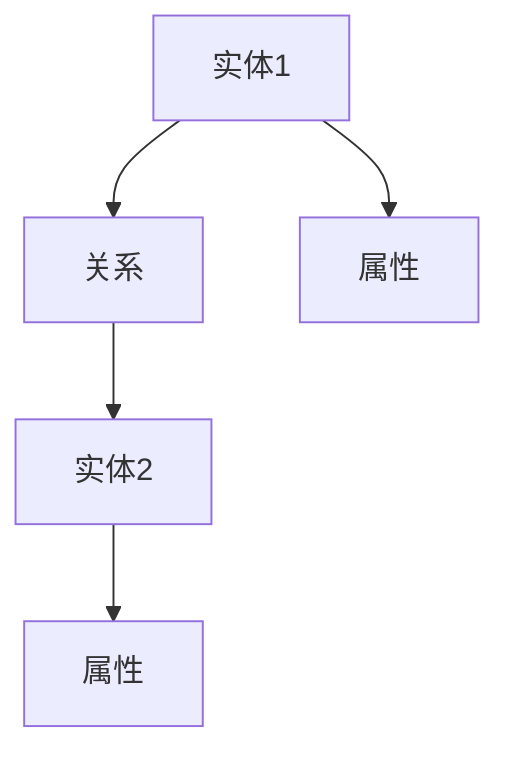
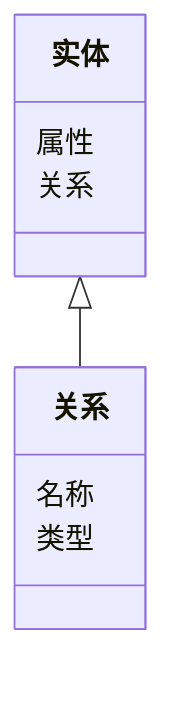
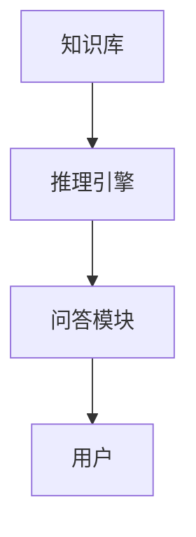

                 


# 基于图谱的AI Agent知识推理与问答

> 关键词：知识图谱、AI Agent、知识推理、问答系统、图遍历、深度学习

> 摘要：本文深入探讨了基于知识图谱的AI Agent知识推理与问答系统的设计与实现。通过分析知识图谱的构建、图遍历算法、知识推理算法以及问答系统的工作流程，结合实际案例，详细讲解了基于图谱的AI Agent的知识管理与推理机制，并展示了如何通过系统设计与架构实现高效的问答功能。

---

# 第一部分: 基于图谱的AI Agent知识推理与问答基础

---

# 第1章: 问题背景与核心概念

## 1.1 问题背景

### 1.1.1 知识推理与问答的挑战

在人工智能领域，知识推理和问答系统是两个核心问题。知识推理是指通过已有知识和规则，推导出新的结论的过程；问答系统则是通过理解用户的问题，并基于知识库提供准确答案的技术。然而，传统的问答系统往往依赖于固定的规则或预设的知识库，难以应对复杂多变的语义理解和动态知识更新的问题。

AI Agent作为一种能够自主感知环境、执行任务的智能体，其核心能力之一就是知识推理与问答。为了实现这一能力，AI Agent需要一个高效的知识表示和推理机制。知识图谱作为一种强大的知识表示形式，能够将实体、关系和属性以结构化的形式表示，为AI Agent的知识推理提供了丰富的语义信息。

### 1.1.2 图谱在知识推理中的作用

知识图谱通过三元组的形式（即实体-关系-实体或实体-属性-值）表示知识，能够将分散的知识点连接起来，形成一个庞大的知识网络。这种结构不仅能够表示实体之间的关系，还能通过图遍历算法找到实体之间的关联路径，从而支持复杂的知识推理任务。

此外，知识图谱的可扩展性和动态更新能力使得AI Agent能够实时获取最新的知识信息，并根据需求动态调整其知识库，从而提高问答系统的准确性和实时性。

### 1.1.3 AI Agent与知识图谱的结合

AI Agent需要通过知识图谱来实现知识的表示、推理和问答功能。知识图谱为AI Agent提供了丰富的语义信息，使其能够理解用户的问题，并基于知识图谱进行推理，从而提供准确的答案。此外，知识图谱的动态更新能力使得AI Agent能够适应不断变化的知识环境。

---

## 1.2 问题描述

### 1.2.1 知识推理的基本问题

知识推理的核心问题是如何从已有的知识库中推导出新的结论。基于图谱的知识推理主要依赖于图遍历算法和逻辑推理规则。常见的推理任务包括实体识别、关系抽取、属性推导等。

### 1.2.2 基于图谱的问答系统的特点

基于图谱的问答系统与传统问答系统相比，具有以下特点：

1. **语义理解能力强**：基于知识图谱的问答系统能够理解实体之间的关系，从而提供更准确的答案。
2. **动态知识更新**：知识图谱能够实时更新，使得问答系统能够获取最新的知识信息。
3. **复杂问题处理**：基于图谱的问答系统能够处理复杂的问题，通过图遍历找到实体之间的关联路径，从而提供更全面的答案。

### 1.2.3 AI Agent的知识需求

AI Agent需要的知识包括：

1. **实体知识**：实体的定义、属性和关系。
2. **规则知识**：知识推理的逻辑规则。
3. **上下文知识**：任务相关的上下文信息。

---

## 1.3 问题解决

### 1.3.1 图谱构建的核心步骤

知识图谱的构建通常包括以下步骤：

1. **数据收集**：从多种数据源（如文本、数据库、知识库等）收集知识数据。
2. **数据清洗**：对收集到的数据进行预处理，去除噪声数据。
3. **实体识别与链接**：识别实体并建立实体之间的关联关系。
4. **知识抽取**：从文本中提取实体、关系和属性信息。
5. **知识融合**：将不同数据源的知识进行整合，消除冗余和冲突。
6. **知识存储**：将知识图谱存储在数据库中，通常使用图数据库（如Neo4j）。

### 1.3.2 知识推理的实现方式

基于图谱的知识推理可以通过以下几种方式实现：

1. **基于规则的推理**：通过预定义的逻辑规则进行推理，例如通过SPARQL查询语句从知识图谱中获取相关信息。
2. **基于概率的推理**：通过概率模型（如马尔可夫链）进行推理，计算不同路径的概率，从而得出最可能的结论。
3. **基于深度学习的推理**：通过深度学习模型（如图神经网络）进行推理，学习知识图谱中的结构信息，并进行复杂的推理任务。

### 1.3.3 基于图谱的问答系统设计

基于图谱的问答系统设计包括以下几个步骤：

1. **问题理解**：通过自然语言处理技术理解用户的问题。
2. **知识查询**：将用户的问题映射到知识图谱中，找到相关的实体和关系。
3. **知识推理**：通过图遍历算法找到实体之间的关联路径，从而得到答案。
4. **答案生成**：根据推理结果生成自然语言的答案。

---

## 1.4 边界与外延

### 1.4.1 图谱的定义与范围

知识图谱的定义包括实体、关系和属性。实体是现实世界中的具体事物，关系是实体之间的关联，属性是实体的描述信息。知识图谱的范围可以涵盖多个领域，例如自然语言处理、计算机视觉、生物医学等。

### 1.4.2 知识推理的边界

知识推理的边界包括：

1. **推理范围**：基于知识图谱可以进行局部推理或全局推理。
2. **推理深度**：推理的深度取决于图谱的复杂性和算法的限制。
3. **推理类型**：推理可以是事实推理、因果推理、情境推理等。

### 1.4.3 基于图谱的问答系统的应用场景

基于图谱的问答系统可以应用于多个领域，例如：

1. **自然语言问答**：通过知识图谱回答用户的问题。
2. **智能客服**：通过知识图谱提供智能客服服务。
3. **医疗问答**：通过医疗知识图谱提供医疗咨询服务。
4. **教育问答**：通过教育知识图谱提供在线教育咨询服务。

---

## 1.5 核心要素组成

### 1.5.1 知识图谱的三元组结构

知识图谱的核心结构是三元组（subject-predicate-object），例如：（中国，首都在，北京）。三元组可以表示实体、属性和关系。

### 1.5.2 AI Agent的核心功能

AI Agent的核心功能包括：

1. **感知环境**：通过传感器或其他方式感知环境信息。
2. **知识推理**：基于知识图谱进行推理，获取新的知识。
3. **决策与行动**：根据推理结果做出决策，并执行相应的动作。

### 1.5.3 知识推理与问答的逻辑关系

知识推理与问答的逻辑关系包括：

1. **问题理解**：将用户的问题转化为知识图谱中的查询。
2. **知识查询**：通过图遍历算法找到相关实体和关系。
3. **知识推理**：通过推理规则或深度学习模型进行推理。
4. **答案生成**：根据推理结果生成自然语言答案。

---

# 第2章: 核心概念与联系

## 2.1 图谱结构

### 2.1.1 知识图谱的节点与边

知识图谱的节点表示实体和属性，边表示实体之间的关系。例如，在知识图谱中，节点“北京”可以通过边“首都”连接到节点“中国”。

### 2.1.2 实体与关系的定义

实体是现实世界中的具体事物，例如“北京”、“中国”、“首都”等。关系是实体之间的关联，例如“中国”的“首都”是“北京”。

### 2.1.3 图谱的层次化结构

知识图谱可以通过层次化结构组织，例如通过本体论（Ontology）定义实体的层次结构，例如国家、城市、行政区等。

---

## 2.2 实体关系图

### 2.2.1 实体关系的Mermaid图



### 2.2.2 实体关系的层次化结构

知识图谱的层次化结构可以通过类图表示，例如：



---

## 2.3 图谱与AI Agent的联系

### 2.3.1 图谱作为知识库的作用

知识图谱作为AI Agent的知识库，能够提供丰富的语义信息，支持复杂的知识推理任务。

### 2.3.2 AI Agent基于图谱进行推理的方式

AI Agent可以通过图遍历算法（如BFS、DFS）在知识图谱中寻找实体之间的关联路径，从而进行推理。

### 2.3.3 图谱更新与AI Agent的动态适应

知识图谱的动态更新使得AI Agent能够实时获取最新的知识信息，并根据需求动态调整其知识库。

---

# 第3章: 算法原理

## 3.1 图遍历算法

### 3.1.1 深度优先搜索（DFS）

深度优先搜索是一种遍历算法，通过不断地深入探索一条路径，直到无法深入为止，然后回溯到上一节点，继续探索其他路径。

```python
def dfs(node):
    visited.add(node)
    for neighbor in node.neighbors:
        if neighbor not in visited:
            dfs(neighbor)
```

### 3.1.2 广度优先搜索（BFS）

广度优先搜索是一种遍历算法，通过逐层扩展节点，探索所有可能的路径。

```python
def bfs(start):
    queue = deque([start])
    visited = {start}
    while queue:
        node = queue.popleft()
        for neighbor in node.neighbors:
            if neighbor not in visited:
                visited.add(neighbor)
                queue.append(neighbor)
    return visited
```

### 3.1.3 图遍历算法的优化

图遍历算法的优化可以通过剪枝、缓存和并行计算等技术实现。

---

## 3.2 知识推理算法

### 3.2.1 基于规则的推理

基于规则的推理通过预定义的逻辑规则进行推理，例如通过SPARQL查询语句从知识图谱中获取相关信息。

### 3.2.2 基于概率的推理

基于概率的推理通过概率模型（如马尔可夫链）进行推理，计算不同路径的概率，从而得出最可能的结论。

### 3.2.3 基于深度学习的推理

基于深度学习的推理通过深度学习模型（如图神经网络）进行推理，学习知识图谱中的结构信息，并进行复杂的推理任务。

---

## 3.3 问答系统流程

基于图谱的问答系统流程包括以下步骤：

1. **问题理解**：通过自然语言处理技术理解用户的问题。
2. **知识查询**：将用户的问题映射到知识图谱中，找到相关的实体和关系。
3. **知识推理**：通过图遍历算法找到实体之间的关联路径，从而得到答案。
4. **答案生成**：根据推理结果生成自然语言的答案。

---

## 3.4 算法的数学模型和公式

### 3.4.1 图遍历算法的数学模型

图遍历算法的数学模型可以表示为：

$$
\text{遍历}(G) \rightarrow \text{遍历路径}
$$

其中，$G$ 是图，遍历路径是图中的路径。

### 3.4.2 知识推理的数学模型

知识推理的数学模型可以表示为：

$$
\text{推理}(E, R) \rightarrow \text{结论}
$$

其中，$E$ 是实体，$R$ 是关系。

---

# 第4章: 系统分析与架构设计

## 4.1 系统分析

### 4.1.1 问题场景

基于图谱的AI Agent知识推理与问答系统需要解决的问题包括：

1. **知识表示**：如何高效地表示知识。
2. **知识推理**：如何从知识图谱中推导出新的结论。
3. **问答系统**：如何通过知识图谱提供准确的答案。

### 4.1.2 项目介绍

基于图谱的AI Agent知识推理与问答系统的设计目标是实现一个能够自主学习和推理的智能问答系统。

---

## 4.2 系统功能设计

### 4.2.1 领域模型

知识图谱的领域模型可以通过类图表示：


### 4.2.2 系统架构

基于图谱的AI Agent知识推理与问答系统的架构设计包括：

1. **知识库**：存储知识图谱。
2. **推理引擎**：实现知识推理算法。
3. **问答模块**：实现问答功能。

### 4.2.3 系统架构图



---

## 4.3 接口设计

### 4.3.1 系统接口

基于图谱的AI Agent知识推理与问答系统的接口设计包括：

1. **知识查询接口**：用于查询知识图谱中的实体和关系。
2. **知识推理接口**：用于执行知识推理任务。
3. **问答接口**：用于处理用户的问答请求。

### 4.3.2 交互流程

基于图谱的AI Agent知识推理与问答系统的交互流程包括：

1. **用户提问**：用户向系统提出问题。
2. **问题理解**：系统理解用户的问题。
3. **知识查询**：系统查询知识图谱中的相关信息。
4. **知识推理**：系统通过推理引擎进行推理。
5. **答案生成**：系统生成自然语言的答案。

---

## 4.4 注意事项

在设计基于图谱的AI Agent知识推理与问答系统时，需要注意以下几点：

1. **性能优化**：通过图遍历算法的优化提高系统的推理效率。
2. **动态更新**：确保知识图谱能够实时更新，以适应变化的知识环境。
3. **语义理解**：提高系统对自然语言的理解能力，以支持复杂的问答任务。

---

# 第5章: 项目实战

## 5.1 环境安装

### 5.1.1 知识图谱的构建与存储

知识图谱的构建需要使用图数据库（如Neo4j）和自然语言处理工具（如spaCy）。

### 5.1.2 系统设计与实现

系统设计与实现需要使用Python编程语言和相关库（如NetworkX、Matplotlib）。

---

## 5.2 核心代码实现

### 5.2.1 知识图谱的构建

```python
import networkx as nx

G = nx.DiGraph()
G.add_edge("中国", "首都", label="是")
G.add_edge("北京", "首都", label="是")
G.add_edge("中国", "首都", "北京")
```

### 5.2.2 知识推理的实现

```python
def dfs(start, target):
    stack = [(start, [start])]
    while stack:
        node, path = stack.pop()
        if node == target:
            return path
        for neighbor in G.neighbors(node):
            if neighbor not in path:
                stack.append((neighbor, path + [neighbor]))
    return None
```

### 5.2.3 问答系统的实现

```python
def answer_question(question):
    start, target = parse_question(question)
    path = dfs(start, target)
    if path:
        return " -> ".join(path)
    else:
        return "无法找到答案"
```

---

## 5.3 代码解读与分析

### 5.3.1 知识图谱的构建

上述代码使用NetworkX库构建了一个简单的知识图谱，包括实体“中国”、“北京”和关系“首都”。

### 5.3.2 知识推理的实现

上述代码实现了一个深度优先搜索算法，用于在知识图谱中找到从起点到目标的路径。

### 5.3.3 问答系统的实现

上述代码实现了一个简单的问答系统，通过解析用户的问题，调用知识推理算法，返回答案。

---

## 5.4 实际案例分析

### 5.4.1 案例背景

以医疗问答系统为例，知识图谱包括疾病、症状、治疗方案等信息。

### 5.4.2 案例分析

用户提问：“中国的首都在哪里？”

系统解析问题，找到实体“中国”和关系“首都”，通过知识推理找到答案“北京”。

---

## 5.5 项目小结

通过上述案例分析，我们可以看到基于图谱的AI Agent知识推理与问答系统的核心在于知识图谱的构建和图遍历算法的实现。

---

# 第6章: 高级主题与扩展阅读

## 6.1 图谱的动态更新

知识图谱的动态更新可以通过增量式更新和实时同步技术实现。

## 6.2 多模态知识图谱

多模态知识图谱可以整合文本、图像、视频等多种数据源，提供更丰富的语义信息。

## 6.3 基于图谱的分布式计算

基于图谱的分布式计算可以通过分布式图数据库（如Apache Giraph）实现大规模知识图谱的处理。

## 6.4 基于图谱的问答系统的伦理问题

基于图谱的问答系统需要注意数据隐私和算法伦理问题，确保系统的安全性和合规性。

---

# 第7章: 总结与展望

## 7.1 总结

基于图谱的AI Agent知识推理与问答系统是一种高效的知识管理与推理机制。通过知识图谱的构建、图遍历算法的实现和问答系统的设计，我们可以实现复杂的知识推理和问答功能。

## 7.2 展望

未来，基于图谱的AI Agent知识推理与问答系统将在以下几个方面继续发展：

1. **动态知识更新**：实现知识图谱的实时更新，提高系统的适应性。
2. **多模态融合**：整合多种数据源，提供更丰富的语义信息。
3. **分布式计算**：通过分布式计算技术处理大规模知识图谱。
4. **智能问答**：结合自然语言处理技术，实现更智能的问答系统。

---

# 作者：AI天才研究院/AI Genius Institute & 禅与计算机程序设计艺术 /Zen And The Art of Computer Programming

---

以上是基于图谱的AI Agent知识推理与问答的技术博客文章的完整目录和内容。文章从基础知识到高级主题，详细讲解了基于图谱的AI Agent知识推理与问答系统的实现与应用，适合对知识图谱和AI Agent感兴趣的读者阅读。

