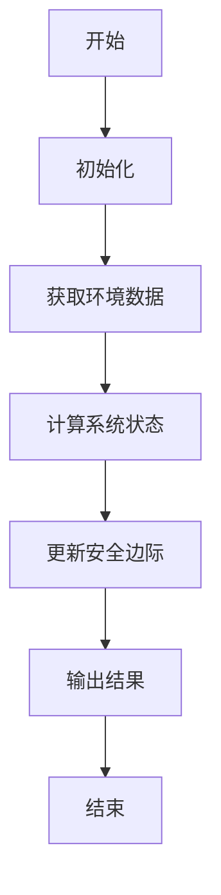
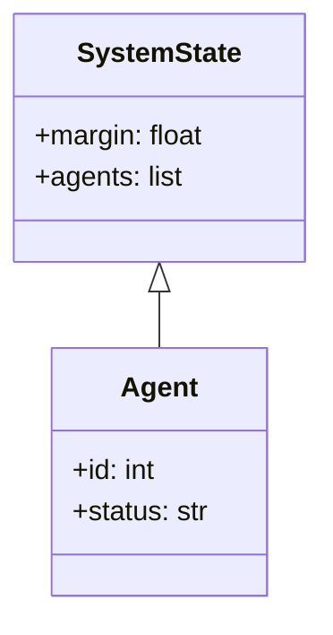
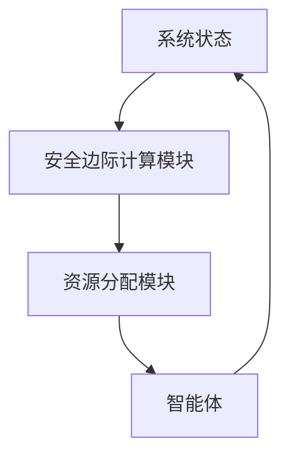
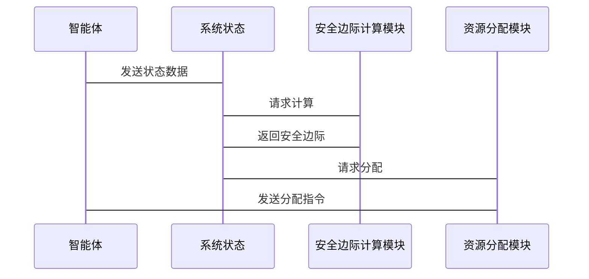

                 


# 基于多智能体的动态安全边际计算模型

> 关键词：多智能体系统, 动态安全边际, 计算模型, 算法原理, 系统架构, 项目实战

> 摘要：本文深入探讨了基于多智能体的动态安全边际计算模型的构建与应用，从核心概念、算法原理到系统架构、项目实战，全面解析了该模型在复杂动态环境下的安全计算方法，为多智能体系统的安全性优化提供了理论依据和实践指导。

---

# 第1章 多智能体系统与动态安全边际计算模型概述

## 1.1 多智能体系统的基本概念

### 1.1.1 多智能体系统的定义

多智能体系统（Multi-Agent System，MAS）是由多个智能体（Agent）组成的分布式系统，这些智能体能够通过协作完成复杂任务。每个智能体都有一定的自主性、反应性和社会性，能够感知环境、做出决策并与其他智能体交互。

### 1.1.2 多智能体系统的组成与特点

- **组成**：由多个智能体、环境、通信机制和协作协议组成。
- **特点**：
  - 分布式：智能体独立运行，通过通信协作。
  - 动态性：环境和任务动态变化，智能体需实时调整。
  - 社会性：智能体之间通过协商、合作和竞争完成任务。

### 1.1.3 多智能体系统的应用领域

- 智能交通管理
- 自动化制造
- 智能电网
- 机器人协作
- 分布式计算

## 1.2 动态安全边际计算模型的定义

### 1.2.1 安全边际的定义与计算方法

安全边际是指系统在正常运行与发生故障之间的裕度。动态安全边际则是在动态环境下的实时计算，确保系统在变化中的安全性。

### 1.2.2 动态安全边际的特性

- 实时性：快速响应环境变化。
- 自适应性：根据系统状态动态调整。
- 精准性：准确计算安全范围。

### 1.2.3 动态安全边际计算模型的重要性

在多智能体系统中，动态安全边际计算模型能够实时评估系统安全状态，避免系统崩溃或故障。

## 1.3 多智能体与动态安全边际计算模型的关系

### 1.3.1 多智能体系统中的安全边际问题

- 智能体之间的协作可能导致资源过度分配。
- 环境变化可能导致系统安全裕度不足。

### 1.3.2 动态安全边际计算模型在多智能体系统中的作用

- 实时监控系统状态。
- 分配资源，避免冲突。
- 优化协作策略。

### 1.3.3 模型的适用范围与边界

适用于动态环境下的多智能体协作系统，边界包括系统崩溃、资源枯竭等情况。

## 1.4 本章小结

本章介绍了多智能体系统的基本概念、动态安全边际计算模型的定义及其重要性，为后续内容奠定了基础。

---

# 第2章 核心概念与联系

## 2.1 多智能体系统的核心概念

### 2.1.1 智能体的定义与分类

- **定义**：智能体是具有自主性、反应性和社会性的实体。
- **分类**：
  - 按智能水平：反应式、认知式。
  - 按行为方式：移动式、固定式。

### 2.1.2 智能体之间的交互与协作

- **交互方式**：直接通信、消息传递。
- **协作机制**：任务分配、协商、协调。

### 2.1.3 智能体的决策机制

- **反应式决策**：基于当前感知做出决策。
- **认知式决策**：结合知识库和推理机制做出决策。

## 2.2 动态安全边际计算模型的核心概念

### 2.2.1 安全边际的动态变化

- 系统状态变化导致安全边际变化。
- 动态计算需要实时更新。

### 2.2.2 动态计算的数学模型

数学模型描述安全边际随时间的变化：
$$ S(t) = S(t-1) + \Delta S $$

### 2.2.3 模型的实时更新机制

- 传感器数据输入。
- 状态评估。
- 边界计算。

## 2.3 多智能体与动态安全边际计算模型的联系

### 2.3.1 多智能体系统中安全边际的影响因素

- 智能体数量。
- 环境变化。
- 协作策略。

### 2.3.2 动态计算模型对多智能体协作的优化作用

- 实时调整协作策略。
- 避免资源冲突。
- 提高系统安全性。

### 2.3.3 模型的可扩展性与可适应性

- 模型可扩展到大规模智能体系统。
- 能够适应不同环境变化。

## 2.4 核心概念对比分析

### 2.4.1 多智能体系统与传统单智能体系统的对比

| 特性 | 多智能体系统 | 单智能体系统 |
|------|--------------|--------------|
| 独立性 | 高           | 低           |
| 协作性 | 强           | 无           |

### 2.4.2 动态计算模型与静态模型的对比

| 特性 | 动态计算模型 | 静态模型 |
|------|--------------|----------|
| 实时性 | 高           | 低       |
| 灵活性 | 强           | 无       |

## 2.5 本章小结

本章分析了多智能体系统和动态安全边际计算模型的核心概念及其联系，为后续算法设计奠定了基础。

---

# 第3章 动态安全边际计算模型的算法原理

## 3.1 算法概述

### 3.1.1 算法的基本思想

基于多智能体系统的实时状态，动态调整安全边际。

### 3.1.2 算法的输入输出

- 输入：系统状态、环境参数。
- 输出：安全边际值。

## 3.2 算法流程

### 3.2.1 初始状态的设置

- 设置初始安全边际值。
- 初始化智能体状态。

### 3.2.2 动态更新的步骤

1. 获取环境数据。
2. 计算系统状态。
3. 更新安全边际。

### 3.2.3 安全边际的计算方法

公式：
$$ S(t) = S(t-1) + \Delta S $$

### 3.2.4 边界条件处理

- 当 $S(t) < 0$，触发警报。
- 当 $S(t) > 1$，调整资源分配。

## 3.3 算法实现的数学模型

### 3.3.1 模型的数学表达

数学模型：
$$ S(t) = \alpha \cdot S(t-1) + (1-\alpha) \cdot \Delta S $$

### 3.3.2 算法流程图



## 3.4 算法实现的Python代码示例

```python
def dynamic_margin_calculation(initial_margin, delta_margin):
    margin = initial_margin
    while True:
        margin = alpha * margin + (1 - alpha) * delta_margin
        if margin < 0:
            raise Warning("安全边际不足")
        yield margin
```

## 3.5 本章小结

本章详细讲解了动态安全边际计算模型的算法原理，包括流程、数学模型和代码实现。

---

# 第4章 系统分析与架构设计方案

## 4.1 问题场景介绍

### 4.1.1 系统需求

- 实时监控多智能体系统状态。
- 动态调整安全边际。

### 4.1.2 问题分析

- 系统状态动态变化。
- 智能体协作可能导致资源冲突。

## 4.2 系统功能设计

### 4.2.1 功能模块划分

- 数据采集模块。
- 状态评估模块。
- 安全边际计算模块。
- 资源分配模块。

### 4.2.2 领域模型类图



## 4.3 系统架构设计

### 4.3.1 系统架构图



### 4.3.2 系统接口设计

- `get_margin()`：获取当前安全边际。
- `update_state()`：更新系统状态。

## 4.4 系统交互序列图



## 4.5 本章小结

本章通过系统分析与架构设计，明确了系统各部分的功能与交互方式，为后续实现提供了指导。

---

# 第5章 项目实战

## 5.1 环境安装与配置

- 安装Python和相关库（如numpy、matplotlib）。
- 配置开发环境。

## 5.2 核心代码实现

### 5.2.1 系统状态数据采集

```python
import numpy as np

class SystemState:
    def __init__(self, agents):
        self.agents = agents
        self.margin = 0.5
```

### 5.2.2 安全边际计算模块

```python
class MarginCalculator:
    def __init__(self, alpha=0.9):
        self.alpha = alpha

    def calculate(self, current_margin, delta_margin):
        return self.alpha * current_margin + (1 - self.alpha) * delta_margin
```

### 5.2.3 资源分配模块

```python
class ResourceAllocator:
    def allocate(self, agents, margin):
        for agent in agents:
            agent.status = "active"
```

## 5.3 实际案例分析

### 5.3.1 案例背景

假设一个包含5个智能体的系统，初始安全边际为0.5。

### 5.3.2 案例实现

```python
agents = [Agent(id=i) for i in range(5)]
state = SystemState(agents)
calculator = MarginCalculator()
allocator = ResourceAllocator()

for _ in range(10):
    delta_margin = np.random.uniform(0, 0.2)
    new_margin = calculator.calculate(state.margin, delta_margin)
    state.margin = new_margin
    allocator.allocate(agents, new_margin)
```

### 5.3.3 案例分析与结果展示

- 随着迭代进行，安全边际逐渐趋近于新的平衡点。
- 智能体状态更新，资源分配合理。

## 5.4 项目总结

本章通过实际案例展示了动态安全边际计算模型的应用，验证了模型的有效性。

---

# 第6章 总结与展望

## 6.1 总结

本文详细探讨了基于多智能体的动态安全边际计算模型的构建与应用，从理论到实践，全面解析了该模型的优势与实现方法。

## 6.2 展望

未来研究方向包括：
- 更复杂的动态环境适应。
- 更高效的计算方法。
- 更广泛的应用领域探索。

## 6.3 最佳实践 Tips

- 定期更新模型参数以适应环境变化。
- 合理选择智能体协作策略。
- 及时监控系统状态，预防潜在风险。

## 6.4 小结

动态安全边际计算模型在多智能体系统中具有重要价值，未来将进一步优化与扩展。

---

# 作者：AI天才研究院 & 禅与计算机程序设计艺术

---

以上是《基于多智能体的动态安全边际计算模型》的完整目录大纲和文章内容，涵盖从基础概念到实际应用的各个方面，旨在为读者提供全面而深入的技术解析。

