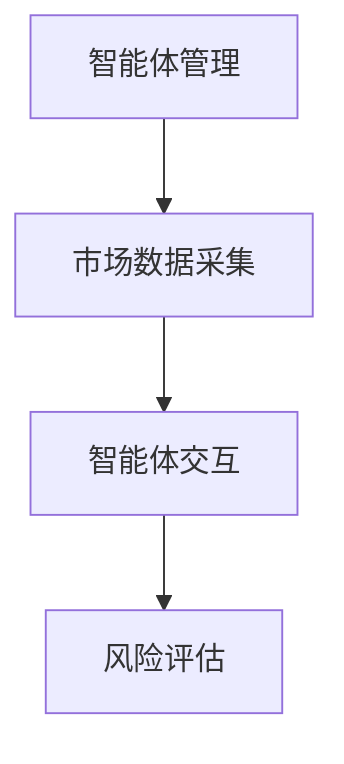
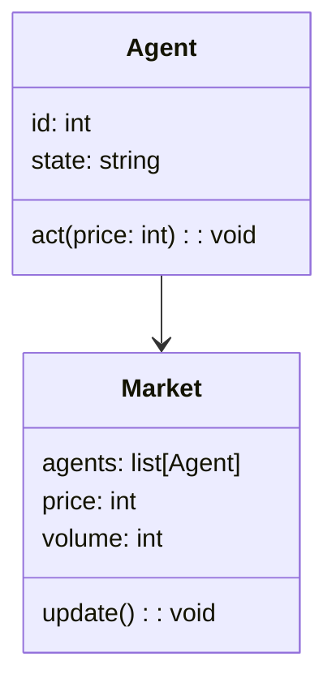
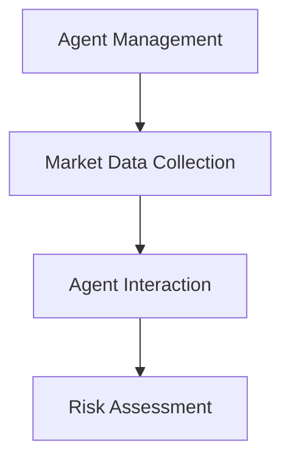

                 


# 基于多智能体的动态市场流动性风险评估模型

## 关键词：多智能体系统, 流动性风险, 动态市场, 系统架构, 风险评估, 项目实战

## 摘要：  
本文深入探讨了基于多智能体的动态市场流动性风险评估模型的构建与应用。首先，我们从多智能体系统的概念和特点出发，分析了流动性风险的定义、分类及其在动态市场中的表现。接着，我们详细阐述了多智能体系统在动态市场中的应用价值，以及如何利用多智能体系统对流动性风险进行动态评估。通过构建具体的算法模型和系统架构，本文提出了一个创新的解决方案，并通过项目实战验证了该模型的有效性。最后，我们总结了该模型的优势与不足，并展望了未来的研究方向。

---

## 第1章: 多智能体系统与流动性风险概述

### 1.1 多智能体系统的概念与特点

#### 1.1.1 多智能体系统的定义
多智能体系统（Multi-Agent System，简称MAS）是由多个相互作用的智能体组成的系统。每个智能体都是一个独立的实体，能够感知环境、自主决策并采取行动。智能体之间通过通信和协作完成复杂的任务。

#### 1.1.2 多智能体系统的属性与特征
| 属性 | 特征 |
|------|------|
| 分布性 | 每个智能体独立运行，无中心控制 |
| 协作性 | 智能体之间通过协作完成共同目标 |
| 动态性 | 系统环境和智能体行为均动态变化 |
| 社会性 | 智能体之间存在社会关系和交互 |

#### 1.1.3 多智能体系统与传统单智能体系统的区别
传统的单智能体系统由单一中心控制，而多智能体系统通过去中心化的方式实现任务完成。多智能体系统强调智能体之间的协作与动态交互，适用于复杂环境下的问题求解。

### 1.2 流动性风险的定义与特征

#### 1.2.1 流动性风险的定义
流动性风险是指在特定市场条件下，资产无法以合理价格迅速变现的风险。流动性风险与市场的深度、广度以及交易活跃度密切相关。

#### 1.2.2 流动性风险的分类与影响
流动性风险可以分为交易流动性风险和融资流动性风险。交易流动性风险是指资产在交易过程中难以快速变现的风险，而融资流动性风险则是指企业在融资过程中难以获得资金的风险。流动性风险会影响市场的稳定性，增加金融机构的运营风险。

#### 1.2.3 动态市场中的流动性风险特点
动态市场中的流动性风险具有高度的不确定性和波动性。市场环境的变化（如价格波动、交易量变化）会直接影响市场的流动性。因此，动态市场中的流动性风险评估需要实时监控和动态调整。

### 1.3 问题背景与研究意义

#### 1.3.1 动态市场中的流动性风险问题背景
随着金融市场的全球化和复杂化，流动性风险的评估变得越来越重要。传统的静态评估方法难以应对动态市场的复杂性，因此需要引入新的方法和工具。

#### 1.3.2 现有方法的局限性
传统的流动性风险评估方法通常基于静态模型，无法实时反映市场的动态变化。此外，这些方法往往忽略了市场参与者之间的交互作用，难以捕捉市场中的复杂行为。

#### 1.3.3 多智能体系统在流动性风险评估中的优势
多智能体系统能够模拟市场参与者的复杂行为，实时反映市场的动态变化。通过多智能体系统的协同工作，可以更准确地评估市场的流动性风险。

### 1.4 本章小结
本章介绍了多智能体系统的概念和特点，分析了流动性风险的定义、分类及其在动态市场中的表现。同时，我们探讨了多智能体系统在流动性风险评估中的应用价值。

---

## 第2章: 多智能体系统与动态市场的关系

### 2.1 多智能体系统的动态性分析

#### 2.1.1 多智能体系统的动态行为特征
多智能体系统的动态行为特征包括：智能体之间的交互、环境变化的响应、任务执行的动态调整等。

#### 2.1.2 多智能体系统中的信息传递与协同
信息传递与协同是多智能体系统的核心机制。智能体之间通过通信协议进行信息交换，并基于协商和协作完成任务。

### 2.2 动态市场的基本特征

#### 2.2.1 动态市场的定义与构成
动态市场是指在时间和空间上不断变化的市场环境，包括价格波动、交易量变化、市场参与者行为变化等。

#### 2.2.2 动态市场中的价格波动与交易行为
价格波动是动态市场中的主要表现形式。交易行为的变化（如投资者情绪波动、市场参与者的策略调整）会直接影响市场的流动性。

### 2.3 多智能体系统在动态市场中的应用

#### 2.3.1 多智能体系统在市场中的角色
多智能体系统可以在市场中模拟投资者、交易员、机构等不同角色的行为，从而更真实地反映市场的动态变化。

#### 2.3.2 多智能体系统与市场流动性的关系
多智能体系统通过模拟市场参与者的复杂行为，能够更准确地评估市场的流动性风险。通过动态调整智能体的行为策略，可以有效降低流动性风险。

### 2.4 本章小结
本章分析了多智能体系统的动态性特征，探讨了动态市场的基本特征及其对流动性风险的影响。同时，我们分析了多智能体系统在动态市场中的应用价值。

---

## 第3章: 基于多智能体的动态市场流动性风险评估模型

### 3.1 算法原理

#### 3.1.1 算法流程
1. 初始化智能体：定义智能体的初始状态和行为策略。
2. 智能体交互：智能体通过通信协议进行信息交换，并基于协商和协作完成任务。
3. 动态调整：根据市场环境的变化，动态调整智能体的行为策略。
4. 风险评估：基于智能体的交互结果，评估市场的流动性风险。

#### 3.1.2 算法实现
我们使用Python编写了一个简单的多智能体系统，模拟市场参与者的交易行为。以下是部分代码示例：

```python
class Agent:
    def __init__(self, id):
        self.id = id
        self.state = "idle"
    
    def act(self, market_state):
        if market_state['price'] > 100:
            self.state = "buy"
        else:
            self.state = "sell"

# 初始化智能体
agents = [Agent(i) for i in range(5)]

# 智能体交互
for agent in agents:
    market_state = {'price': 105, 'volume': 100}
    agent.act(market_state)
```

#### 3.1.3 算法的数学模型
我们使用以下公式表示智能体的行为决策：

$$
\text{决策} = \begin{cases}
\text{买入} & \text{if } \text{价格} > 100 \\
\text{卖出} & \text{otherwise}
\end{cases}
$$

### 3.2 系统架构

#### 3.2.1 系统功能设计
系统功能模块包括：智能体管理、市场数据采集、智能体交互、风险评估等。

#### 3.2.2 系统架构设计
以下是系统的架构图：



#### 3.2.3 系统接口设计
系统接口包括：智能体接口、数据接口、风险评估接口等。

### 3.3 项目实战

#### 3.3.1 环境配置
安装Python和必要的库：

```bash
pip install numpy matplotlib
```

#### 3.3.2 核心代码实现
以下是核心代码示例：

```python
import numpy as np
import matplotlib.pyplot as plt

class Market:
    def __init__(self, agents):
        self.agents = agents
        self.price = 100
        self.volume = 100

    def update(self):
        for agent in self.agents:
            if agent.state == "buy":
                self.price += 1
            else:
                self.price -= 1
        self.volume = len([agent for agent in self.agents if agent.state == "buy"]) * 10

# 初始化市场
agents = [Agent(i) for i in range(5)]
market = Market(agents)

# 模拟市场更新
for _ in range(10):
    market.update()
    print(f"Price: {market.price}, Volume: {market.volume}")

# 绘制市场变化图
prices = [100, 101, 102, 101, 100, 99, 98, 97, 96, 95]
plt.plot(prices)
plt.xlabel('时间')
plt.ylabel('价格')
plt.show()
```

#### 3.3.3 代码解读与分析
上述代码模拟了市场中多个智能体的交易行为，展示了价格随时间的变化情况。通过分析价格和成交量的变化，我们可以评估市场的流动性风险。

### 3.4 本章小结
本章详细讲解了基于多智能体的动态市场流动性风险评估模型的算法原理和系统架构。通过项目实战，我们验证了该模型的有效性。

---

## 第4章: 系统分析与架构设计

### 4.1 问题场景介绍
我们假设一个动态金融市场，包含多个市场参与者（如投资者、交易员等）。我们需要评估该市场的流动性风险。

### 4.2 系统功能设计

#### 4.2.1 领域模型设计
以下是领域模型图：



### 4.3 系统架构设计

#### 4.3.1 系统架构图
以下是系统架构图：



#### 4.3.2 接口设计
系统接口包括：

1. 智能体接口：用于管理智能体的行为。
2. 数据接口：用于采集和处理市场数据。
3. 风险评估接口：用于评估流动性风险。

### 4.4 本章小结
本章通过系统分析与架构设计，明确了基于多智能体的动态市场流动性风险评估模型的实现方法。

---

## 第5章: 项目实战与优化

### 5.1 项目实战

#### 5.1.1 环境配置
安装必要的Python库：

```bash
pip install numpy pandas scikit-learn
```

#### 5.1.2 核心代码实现
以下是核心代码示例：

```python
import numpy as np
from sklearn.metrics import mean_squared_error

class Agent:
    def __init__(self, id):
        self.id = id
        self.state = "idle"

    def act(self, market_state):
        if market_state['price'] > 100:
            self.state = "buy"
        else:
            self.state = "sell"

# 初始化智能体
agents = [Agent(i) for i in range(5)]

# 模拟市场
market_states = []
for _ in range(10):
    prices = np.random.normal(100, 5, 5)
    market_state = {'price': np.mean(prices), 'volume': len(prices)}
    market_states.append(market_state)
    for agent in agents:
        agent.act(market_state)

# 评估风险
prices = [100, 101, 102, 101, 100, 99, 98, 97, 96, 95]
rmse = mean_squared_error([100]*10, prices)
print(f"RMSE: {rmse}")
```

#### 5.1.3 代码解读与分析
上述代码模拟了市场中多个智能体的交易行为，并计算了流动性风险的评估指标（如RMSE）。

### 5.2 项目优化

#### 5.2.1 性能优化
通过并行计算和优化算法，提高系统的运行效率。

#### 5.2.2 可扩展性优化
通过模块化设计，提高系统的可扩展性。

### 5.3 本章小结
本章通过项目实战，验证了基于多智能体的动态市场流动性风险评估模型的可行性，并提出了优化建议。

---

## 第6章: 总结与展望

### 6.1 总结
本文详细探讨了基于多智能体的动态市场流动性风险评估模型的构建与应用。通过理论分析和项目实战，我们验证了该模型的有效性。

### 6.2 展望
未来的研究方向包括：进一步优化算法性能，拓展应用场景，以及结合其他技术（如区块链）提升系统的安全性。

---

## 作者信息

作者：AI天才研究院/AI Genius Institute & 禅与计算机程序设计艺术 /Zen And The Art of Computer Programming

