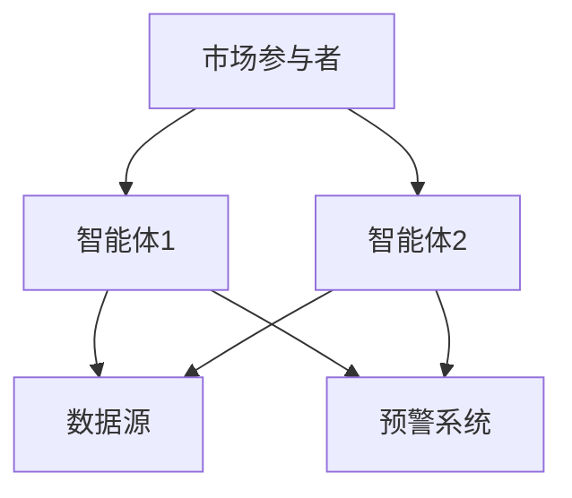
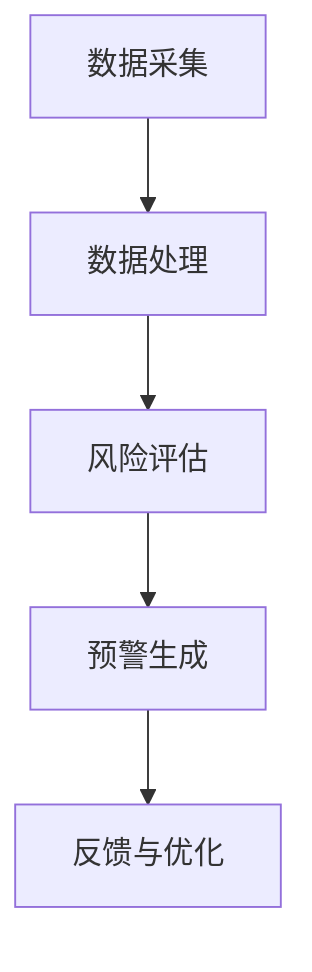
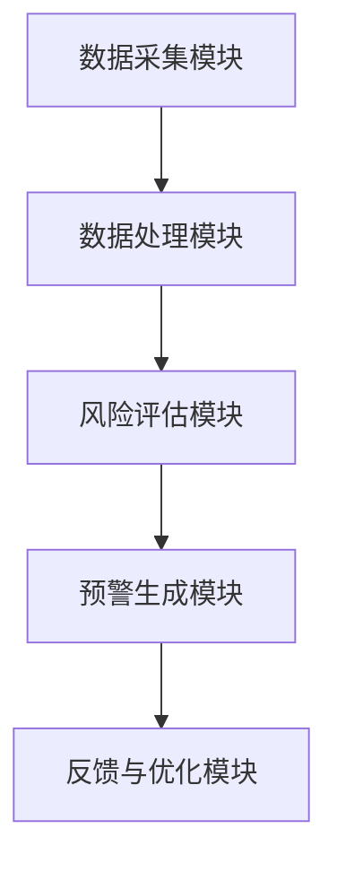
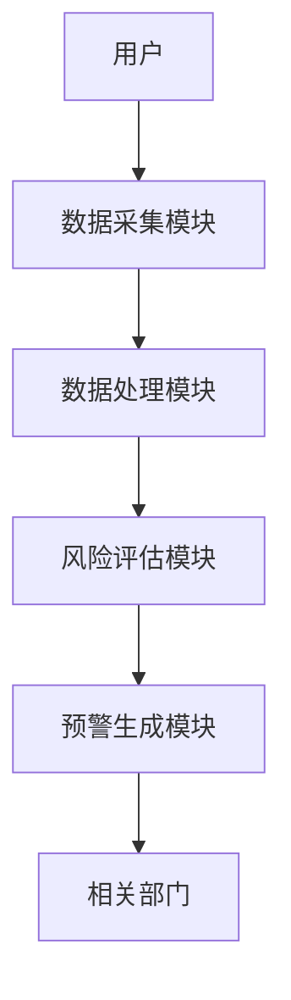

                 


# 基于多智能体的动态市场流动性风险预警系统

> 关键词：多智能体系统、流动性风险、金融市场、风险预警、分布式计算、协同算法

> 摘要：本文介绍了一种基于多智能体的动态市场流动性风险预警系统，通过分析市场参与者的多智能体协同，构建实时动态的风险评估模型，实现对市场流动性风险的预警与干预。文章详细讲解了系统的架构设计、算法实现、项目实战，并通过案例分析展示了系统的实际应用效果。

---

# 第一部分: 多智能体系统与流动性风险预警基础

## 第1章: 背景介绍

### 1.1 问题背景

#### 1.1.1 金融市场中的流动性风险
流动性风险是指在金融市场中，资产难以以合理价格迅速变现的风险。例如，当市场出现剧烈波动时，某些资产可能无法在短时间内找到买家，导致价格大幅下跌，造成损失。流动性风险是金融市场中的核心风险之一，影响着市场的稳定运行。

#### 1.1.2 多智能体系统在金融领域的应用前景
随着金融市场复杂性的增加，传统的单一智能体（如单一算法或模型）难以应对市场中的复杂动态。多智能体系统（Multi-Agent System, MAS）通过多个智能体的协同工作，能够更好地捕捉市场动态，提供实时的风险评估和预警。多智能体系统在金融领域的应用前景广阔，尤其是在流动性风险管理方面。

#### 1.1.3 现有解决方案的局限性
传统的流动性风险预警系统通常基于单一模型或算法，难以实时捕捉市场中的多维度信息。例如，传统系统可能仅依赖历史数据进行预测，无法动态调整模型参数或应对市场的突发变化。此外，传统系统在处理高频交易、市场参与者行为等复杂因素时表现有限。

### 1.2 问题描述

#### 1.2.1 流动性风险的定义与特征
流动性风险的核心特征包括：
- **动态性**：市场环境不断变化，流动性风险也随之波动。
- **复杂性**：涉及多个市场参与者和多种资产类型。
- **突发性**：流动性危机可能在短时间内迅速恶化。

#### 1.2.2 多智能体系统在流动性风险管理中的作用
多智能体系统通过分布式计算和协同工作，能够实时分析市场数据，捕捉潜在风险点，并提供预警。例如，多个智能体可以分别关注不同的市场指标（如交易量、价格波动、订单簿深度等），并通过协同计算得出整体的流动性风险评估。

#### 1.2.3 动态市场环境下的挑战
在动态市场中，流动性风险的变化速度极快，传统的静态模型难以应对。多智能体系统需要具备高度的实时性和适应性，能够在短时间内调整策略，应对市场的突发变化。

### 1.3 问题解决

#### 1.3.1 多智能体系统的解决方案
通过引入多个智能体，分别负责不同的市场指标和数据源，实现对市场流动性的全面监控。例如，智能体A负责分析交易量数据，智能体B负责分析价格波动，智能体C负责分析订单簿深度，通过协同计算得出综合流动性风险评估。

#### 1.3.2 动态市场中的流动性风险预警方法
动态市场中的流动性风险预警需要实时数据处理和快速响应。多智能体系统能够通过分布式计算，快速整合市场数据，分析潜在风险，并向相关部门发出预警。

#### 1.3.3 系统设计的核心目标与原则
- **核心目标**：实时监测市场流动性，提前预警潜在风险。
- **设计原则**：
  1. 分布式计算：多个智能体协同工作。
  2. 实时性：快速响应市场变化。
  3. 可扩展性：支持不同规模的市场环境。

### 1.4 边界与外延

#### 1.4.1 系统的边界条件
- 系统仅关注流动性风险，不涉及信用风险或其他类型的风险。
- 系统适用于高频交易环境，但不处理低频交易数据。

#### 1.4.2 相关领域的区别与联系
- **区别**：与信用风险预警系统相比，流动性风险预警更关注市场的即时动态。
- **联系**：流动性风险可能影响信用风险，因此两者之间存在一定的关联性。

#### 1.4.3 系统的适用范围与限制
- **适用范围**：适用于股票、债券等标准化资产的交易市场。
- **限制**：不适用于场外市场或非标准化资产。

### 1.5 核心要素组成

#### 1.5.1 多智能体系统的构成要素
- **智能体**：多个独立的智能体，负责不同的市场指标。
- **通信机制**：智能体之间的信息交换渠道。
- **协同算法**：智能体协同工作的规则和方法。

#### 1.5.2 流动性风险预警的关键指标
- **交易量**：市场的交易活跃程度。
- **价格波动**：资产价格的波动情况。
- **订单簿深度**：市场深度和订单流动性。

#### 1.5.3 系统的整体架构与模块划分
- **数据采集模块**：收集市场数据。
- **数据处理模块**：对数据进行清洗和预处理。
- **风险评估模块**：通过多智能体协同计算，评估流动性风险。
- **预警生成模块**：根据评估结果，生成预警信息。

---

## 第2章: 多智能体系统的核心原理

### 2.1 多智能体系统的基本原理

#### 2.1.1 多智能体系统的定义与特征
多智能体系统是由多个智能体组成的分布式系统，每个智能体具有一定的自主性、反应性和协作能力。多智能体系统的特点包括：
- **分布式**：智能体独立工作，通过通信协作。
- **自主性**：每个智能体能够自主决策。
- **反应性**：能够实时感知环境变化并做出响应。
- **协作性**：通过协作完成共同目标。

#### 2.1.2 多智能体系统与单智能体系统的对比
| 对比维度 | 多智能体系统 | 单智能体系统 |
|----------|--------------|--------------|
| 系统结构 | 分布式        | 集中式       |
| 能源效率 | 较低          | 较高          |
| 可扩展性 | 高            | 低            |
| 容错性   | 高            | 低            |

#### 2.1.3 多智能体系统在流动性风险预警中的应用
多智能体系统通过分布式计算和协作，能够实时分析市场数据，捕捉潜在风险点。例如，多个智能体可以分别关注不同的市场指标，并通过协同计算得出综合的流动性风险评估。

### 2.2 多智能体系统在流动性风险预警中的应用

#### 2.2.1 多智能体系统如何捕捉市场动态
通过分布式计算和实时数据处理，多智能体系统能够快速捕捉市场动态。例如，智能体A负责分析交易量数据，智能体B负责分析价格波动，智能体C负责分析订单簿深度。

#### 2.2.2 多智能体系统如何预测流动性风险
通过协同计算，多智能体系统能够整合不同市场的信息，预测潜在的流动性风险。例如，当多个智能体同时检测到交易量骤减、价格大幅波动时，系统会触发流动性风险预警。

#### 2.2.3 动态市场中的挑战与解决方案
在动态市场中，流动性风险的变化速度极快，传统的静态模型难以应对。多智能体系统通过分布式计算和实时响应，能够快速调整策略，应对市场的突发变化。

### 2.3 实体关系与流程图

#### 2.3.1 多智能体系统的实体关系图


#### 2.3.2 流动性风险预警流程图


---

## 第3章: 多智能体协同算法

### 3.1 多智能体协同的基本原理

#### 3.1.1 分布式计算与协同机制
多智能体系统通过分布式计算，实现多个智能体的协同工作。每个智能体负责一部分数据的处理和分析，并通过通信机制将结果传递给其他智能体。

#### 3.1.2 多智能体系统中的信息交换与协调
智能体之间的信息交换可以通过多种方式实现，例如通过消息传递、共享内存等。信息的协调和整合是实现协同计算的关键。

#### 3.1.3 协同算法的核心思想
协同算法的核心思想是通过多个智能体的协作，实现对复杂问题的分布式求解。例如，在流动性风险预警中，多个智能体分别负责不同的市场指标，通过协同计算得出综合的流动性风险评估。

### 3.2 多智能体协同算法的数学模型

#### 3.2.1 分布式计算模型
分布式计算模型可以表示为：
$$
f(x) = \sum_{i=1}^{n} f_i(x_i)
$$
其中，$x$ 表示输入数据，$x_i$ 表示第 $i$ 个智能体处理的数据，$f_i$ 表示第 $i$ 个智能体的计算函数。

#### 3.2.2 协作机制的数学表达
协作机制可以通过以下公式表示：
$$
y = \argmax_{y_i} \sum_{i=1}^{n} y_i
$$
其中，$y_i$ 表示第 $i$ 个智能体的输出，$y$ 表示最终的协同结果。

#### 3.2.3 实际案例分析
例如，在流动性风险预警中，多个智能体分别分析不同的市场指标（如交易量、价格波动等），通过协同计算得出综合的流动性风险评估。假设智能体1分析交易量数据，智能体2分析价格波动数据，最终通过协同计算得出整体的流动性风险评估。

### 3.3 算法实现的详细步骤

#### 3.3.1 数据采集与预处理
- 从多个数据源（如交易所、市场数据供应商）采集实时数据。
- 对数据进行清洗和预处理，确保数据的准确性和完整性。

#### 3.3.2 分配任务给智能体
- 根据智能体的职责，将数据分配给不同的智能体进行处理。
- 每个智能体负责一部分数据的分析和计算。

#### 3.3.3 协同计算与整合
- 智能体之间通过通信机制交换数据和结果。
- 将多个智能体的计算结果整合，得出最终的流动性风险评估。

#### 3.3.4 预警生成与反馈
- 根据综合评估结果，生成流动性风险预警。
- 反馈预警信息给相关部门或系统，采取相应的措施。

---

## 第4章: 系统分析与架构设计

### 4.1 系统架构设计

#### 4.1.1 系统整体架构图


#### 4.1.2 功能模块设计
- **数据采集模块**：负责从多个数据源采集实时数据。
- **数据处理模块**：对数据进行清洗、转换和预处理。
- **风险评估模块**：通过多智能体协同计算，评估流动性风险。
- **预警生成模块**：根据评估结果，生成预警信息。
- **反馈与优化模块**：根据预警结果，优化系统参数和策略。

#### 4.1.3 系统架构设计的细节
系统架构设计需要考虑以下几个方面：
- **可扩展性**：支持不同规模的市场环境。
- **实时性**：确保系统的实时响应。
- **容错性**：能够处理智能体的故障和失败。

### 4.2 系统接口设计

#### 4.2.1 系统接口定义
- **数据接口**：与数据源（如交易所）的接口。
- **预警接口**：与相关部门或系统的接口。
- **用户接口**：供用户查看预警信息和系统状态。

#### 4.2.2 接口交互流程
1. 数据采集模块通过数据接口从数据源获取实时数据。
2. 数据处理模块对数据进行清洗和预处理。
3. 风险评估模块通过协同计算，评估流动性风险。
4. 预警生成模块根据评估结果，生成预警信息。
5. 预警信息通过预警接口传递给相关部门或系统。

### 4.3 系统交互设计

#### 4.3.1 系统交互流程图


#### 4.3.2 交互机制的详细说明
- **用户交互**：用户可以通过用户接口查看预警信息和系统状态。
- **系统内部交互**：智能体之间通过通信机制交换数据和结果。

---

## 第5章: 项目实战

### 5.1 项目环境与配置

#### 5.1.1 系统环境
- **硬件环境**：需要高性能的计算资源，支持分布式计算。
- **软件环境**：需要安装相关的开发工具和库（如Python、分布式计算框架等）。

#### 5.1.2 数据源配置
- 数据来源：可以从真实的交易所获取数据，或者使用模拟数据。
- 数据格式：通常为CSV或JSON格式。

### 5.2 系统核心实现

#### 5.2.1 核心代码实现
以下是一个简单的多智能体协同算法的Python实现：
```python
import threading

class Agent:
    def __init__(self, id, data_source):
        self.id = id
        self.data_source = data_source
        self.result = None

    def process_data(self):
        # 处理数据并计算结果
        data = self.data_source.get_data()
        self.result = self.calculate(data)

    def calculate(self, data):
        # 示例计算
        return sum(data)

def main():
    # 初始化数据源
    data_source = DataSource()
    # 创建多个智能体
    agents = [Agent(i, data_source) for i in range(5)]
    # 启动智能体
    for agent in agents:
        thread = threading.Thread(target=agent.process_data)
        thread.start()
    # 等待所有智能体完成计算
    for agent in agents:
        agent.result = agent.calculate(data_source.get_data())
    # 整合结果
    total = sum(agent.result for agent in agents)
    print(f"Total: {total}")

if __name__ == "__main__":
    main()
```

#### 5.2.2 代码应用解读与分析
上述代码实现了多个智能体的协同计算。每个智能体从数据源获取数据，进行计算，并将结果传递给其他智能体。最终，所有智能体的结果整合，得出最终的计算结果。

### 5.3 实际案例分析

#### 5.3.1 案例背景
假设我们有一个股票交易市场，多个智能体分别负责分析不同的市场指标（如交易量、价格波动等）。

#### 5.3.2 案例分析
在实际案例中，智能体1分析交易量数据，智能体2分析价格波动数据，智能体3分析订单簿深度数据。通过协同计算，系统能够综合评估市场的流动性风险，并在风险较高的情况下发出预警。

### 5.4 项目小结

#### 5.4.1 项目成果
- 实现了一个基于多智能体的流动性风险预警系统。
- 系统能够实时监测市场数据，评估流动性风险，并发出预警。

#### 5.4.2 项目经验总结
- 多智能体系统的分布式计算能够提高系统的实时性和可扩展性。
- 系统的设计需要考虑容错性和可维护性。

---

## 第6章: 总结

### 6.1 内容回顾

#### 6.1.1 文章核心内容
本文介绍了基于多智能体的动态市场流动性风险预警系统，详细讲解了系统的架构设计、算法实现、项目实战等内容。

#### 6.1.2 系统设计的核心要点
- 多智能体系统的分布式计算和协同工作。
- 实时数据处理和快速响应。

### 6.2 未来展望

#### 6.2.1 系统优化方向
- 提高系统的实时性和响应速度。
- 增强系统的容错性和可扩展性。

#### 6.2.2 新的挑战与机遇
- 新型金融工具的出现带来了新的挑战。
- 人工智能技术的进一步发展为系统优化提供了新的机遇。

### 6.3 最佳实践 Tips

#### 6.3.1 系统设计中的注意事项
- 确保系统的实时性和响应速度。
- 处理好智能体之间的通信和协作。

#### 6.3.2 项目实施中的注意事项
- 确保数据源的可靠性和数据质量。
- 处理好智能体的分布式计算和任务分配。

### 6.4 作者小结

#### 6.4.1 总结
本文详细介绍了基于多智能体的动态市场流动性风险预警系统，通过理论分析和实际案例，展示了系统的应用价值和优势。

#### 6.4.2 作者观点
多智能体系统在金融市场中的应用前景广阔，尤其是在流动性风险管理方面。未来的研究可以进一步探索多智能体系统的优化和扩展，以应对更复杂和动态的市场环境。

---

# 作者：AI天才研究院 & 禅与计算机程序设计艺术

---

**摘要**：本文介绍了基于多智能体的动态市场流动性风险预警系统，通过分析市场参与者的多智能体协同，构建实时动态的风险评估模型，实现对市场流动性风险的预警与干预。文章详细讲解了系统的架构设计、算法实现、项目实战，并通过案例分析展示了系统的实际应用效果。

