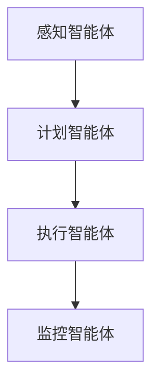

                 


# 基于多智能体的自动化产业升级趋势识别

## 关键词：多智能体系统，自动化产业升级，趋势识别，智能体协作，系统架构设计

## 摘要：  
随着技术的进步，多智能体系统（MAS，Multi-Agent System）在自动化产业升级中的应用日益广泛。本文将详细探讨如何利用多智能体系统来识别和推动自动化产业升级的趋势。通过分析多智能体系统的原理、算法、系统架构以及实际案例，本文为读者提供一个全面的视角，帮助理解多智能体系统如何在产业升级中发挥作用。

---

## 第1章: 问题背景与描述

### 1.1 问题背景
#### 1.1.1 当前产业升级的核心挑战
产业升级是企业发展的永恒主题，但随着市场竞争的加剧和技术的快速迭代，传统的产业升级模式已难以应对以下挑战：
- **效率瓶颈**：传统的人工操作和单点自动化难以覆盖整个生产链。
- **灵活性不足**：单一系统难以适应复杂多变的市场环境。
- **数据孤岛**：各部门之间缺乏有效的数据共享和协同。

#### 1.1.2 多智能体系统的优势
多智能体系统通过分布式的智能体协作，能够实现以下目标：
- 提高系统的灵活性和适应性。
- 实现跨部门的数据共享与协同。
- 优化资源分配和流程效率。

#### 1.1.3 问题解决思路
通过引入多智能体系统，可以将产业升级的各个部分分解为多个智能体的任务，利用智能体之间的协作来实现整体优化。

---

## 第2章: 多智能体系统的核心原理

### 2.1 多智能体系统的定义与特征
多智能体系统由多个具有自主性、反应性、协作性和社会性的智能体组成，这些智能体能够通过通信和协作完成复杂的任务。

#### 智能体的核心特征
- **自主性**：智能体能够自主决策。
- **反应性**：智能体能够感知环境并实时调整行为。
- **协作性**：智能体之间能够通过通信协作完成任务。
- **社会性**：智能体能够遵守一定的社会规范和伦理。

### 2.2 多智能体系统的协作机制
智能体之间的协作可以通过以下几种方式实现：
- **直接通信**：智能体之间通过消息传递进行实时协作。
- **间接协作**：通过共享知识库或中间件实现间接协作。
- **任务分配**：通过任务分配算法将任务分配给合适的智能体。

---

## 第3章: 多智能体系统在产业升级中的应用

### 3.1 多智能体系统在自动化生产中的应用
#### 案例分析：智能工厂中的多智能体系统
- **智能体角色**：
  - 感知智能体：负责收集生产环境数据。
  - 计划智能体：负责制定生产计划。
  - 执行智能体：负责具体任务的执行。
- **协作流程**：
  1. 感知智能体收集生产环境数据。
  2. 计划智能体根据数据制定生产计划。
  3. 执行智能体按照计划执行任务。
  4. 各智能体实时通信，调整计划以应对突发情况。

#### 代码示例：简单多智能体协作流程
```python
# 感知智能体
class PerceptionAgent:
    def __init__(self):
        self.data = None

    def collect_data(self):
        # 模拟数据收集
        self.data = {"temperature": 25, "humidity": 60}

# 计划智能体
class PlanningAgent:
    def __init__(self):
        self.data = None
        self.plan = None

    def make_plan(self, data):
        if data["temperature"] < 20:
            self.plan = "调整加热设备"
        else:
            self.plan = "维持当前状态"

# 执行智能体
class ExecutionAgent:
    def __init__(self):
        self.current_task = None

    def execute_task(self, task):
        print(f"执行任务：{task}")
```

---

## 第4章: 基于多智能体的产业升级趋势识别

### 4.1 产业升级趋势的识别方法
#### 数据驱动的多智能体协作
通过多智能体系统的协作，可以实时分析生产数据，识别潜在的优化点和趋势。

#### 案例分析：智能物流中的趋势识别
- **智能体角色**：
  - 路径规划智能体：负责优化货物运输路径。
  - 调度智能体：负责协调运输工具的调度。
  - 监控智能体：负责实时监控货物运输状态。

#### 代码示例：路径优化算法
```python
# 路径规划智能体
class PathPlanningAgent:
    def __init__(self):
        self.graph = None

    def plan_path(self, start, end):
        # 简单的路径规划算法
        if start == end:
            return []
        return [start, end]
```

---

## 第5章: 系统架构设计与实现

### 5.1 系统架构设计
#### 5.1.1 系统功能设计
- **数据采集**：智能体收集生产环境数据。
- **任务分配**：智能体根据数据分配任务。
- **协作执行**：智能体协作完成任务。
- **监控与反馈**：实时监控任务执行情况并反馈。

#### 5.1.2 系统架构图


### 5.2 系统接口设计
- **通信接口**：智能体之间的通信接口。
- **数据接口**：智能体与数据源的接口。
- **控制接口**：用户对智能体的控制接口。

---

## 第6章: 项目实战与案例分析

### 6.1 项目实战
#### 6.1.1 环境安装
- 安装必要的依赖：
  ```bash
  pip install python-multiprocessing
  pip install mermaid
  ```

#### 6.1.2 核心代码实现
```python
# 多智能体协作实现
class Agent:
    def __init__(self, name):
        self.name = name
        self.tasks = []

    def receive_task(self, task):
        self.tasks.append(task)

    def execute_task(self):
        for task in self.tasks:
            print(f"{self.name} 执行任务：{task}")

# 多智能体协作流程
if __name__ == "__main__":
    agent1 = Agent("感知智能体")
    agent2 = Agent("计划智能体")
    agent3 = Agent("执行智能体")

    agent1.receive_task("收集数据")
    agent2.receive_task("制定计划")
    agent3.receive_task("执行计划")

    agent1.execute_task()
    agent2.execute_task()
    agent3.execute_task()
```

#### 6.1.3 案例分析
- **案例**：智能工厂中的多智能体协作。
- **分析**：通过多智能体系统的协作，实现了生产过程的优化，提高了效率和灵活性。

---

## 第7章: 最佳实践与小结

### 7.1 最佳实践
- **模块化设计**：将系统分解为多个模块，便于管理和维护。
- **实时监控**：实时监控系统的运行状态，及时发现和解决问题。
- **持续优化**：根据反馈不断优化系统性能。

### 7.2 小结
多智能体系统在自动化产业升级中的应用前景广阔，通过合理设计和实现，可以显著提升企业的竞争力。

---

## 注意事项
- 确保智能体之间的通信安全可靠。
- 定期维护和更新系统，以应对新的挑战。
- 注意数据隐私和安全问题。

---

## 拓展阅读
- 《Multi-Agent Systems: Algorithmic, Complexity Theoretic, and Economic Aspects》
- 《Agent-Oriented Software Engineering》

---

## 作者：AI天才研究院 & 禅与计算机程序设计艺术

---

以上是《基于多智能体的自动化产业升级趋势识别》的技术博客文章的完整内容，涵盖了从背景介绍到项目实战的各个方面，结合理论与实践，详细分析了多智能体系统在产业升级中的应用与实现。

