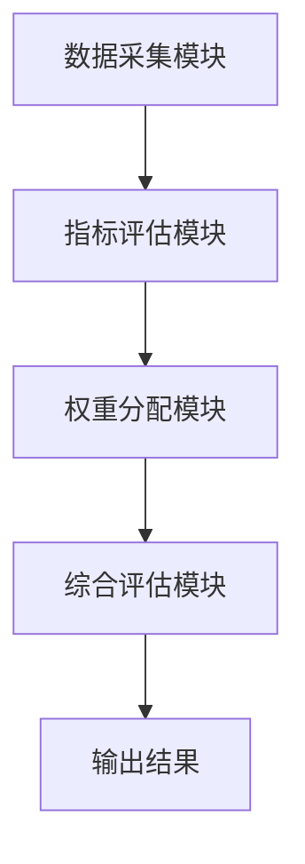

                 


# 基于多智能体的自动化公司创新能力评估

---

## 关键词
多智能体系统, 公司创新能力, 自动化评估, 人工智能, 群体智能

---

## 摘要
在当今快速变化的商业环境中，公司的创新能力是决定其竞争力和生存能力的关键因素。传统的创新能力评估方法往往依赖于人工分析，效率低下且主观性强。为了克服这些局限性，基于多智能体的自动化公司创新能力评估方法应运而生。本文将详细介绍多智能体系统的核心概念、创新能力的评估维度、基于多智能体的评估模型的设计与实现，以及实际应用场景中的案例分析。通过结合理论与实践，本文为读者提供了一套高效、客观的公司创新能力评估方法，为企业的管理和决策提供了有力支持。

---

## 目录

---

# 第一部分: 基于多智能体的自动化公司创新能力评估概述

# 第1章: 多智能体系统与公司创新能力评估概述

## 1.1 多智能体系统的定义与特点
### 1.1.1 多智能体系统的定义
多智能体系统（Multi-Agent System, 简称MAS）是由多个智能体组成的分布式系统，这些智能体能够通过协同工作完成复杂任务。每个智能体都有一定的自主性、反应性和协作能力，能够感知环境、做出决策并与其他智能体进行交互。

### 1.1.2 多智能体系统的核心特点
- **自主性**：智能体能够在没有外部干预的情况下独立决策。
- **反应性**：智能体能够实时感知环境变化并做出相应反应。
- **协作性**：多个智能体能够通过通信和协调共同完成任务。
- **分布式性**：智能体之间没有集中化的控制中心，任务分配和决策是去中心化的。

### 1.1.3 多智能体系统与其他系统的关系
- **与单智能体系统**：单智能体系统只有一个决策中心，而多智能体系统由多个决策中心组成。
- **与分布式系统**：多智能体系统是一种特殊的分布式系统，但其智能体具有更强的自主性和协作性。
- **与群体智能**：群体智能强调个体间的简单规则通过集体行为产生复杂结果，而多智能体系统更强调智能体的协作和通信。

---

## 1.2 公司创新能力的评估背景与意义
### 1.2.1 创新能力评估的重要性
公司在竞争激烈的市场环境中，创新能力是其核心竞争力。创新能力的强弱直接影响公司的市场地位、产品开发速度和客户满意度。

### 1.2.2 当前评估方法的局限性
传统的创新能力评估方法通常依赖于人工分析，存在以下问题：
- **主观性**：评估结果受评估者主观判断的影响。
- **效率低**：人工评估耗时长，难以快速得出结论。
- **覆盖性不足**：难以全面评估公司创新能力的各个维度。

### 1.2.3 多智能体技术在评估中的优势
- **高效性**：多智能体系统能够快速处理大量数据，提高评估效率。
- **客观性**：通过智能化算法和数据驱动的方法，减少人为干扰，提高评估结果的客观性。
- **全面性**：多智能体系统能够从多个维度全面评估公司创新能力。

---

## 1.3 本书的结构与目标
### 1.3.1 本书的核心目标
通过介绍多智能体系统的核心概念、创新能力的评估维度、基于多智能体的评估模型的设计与实现，以及实际应用场景中的案例分析，为读者提供一套高效、客观的公司创新能力评估方法。

### 1.3.2 各章节内容概述
- 第2章：详细介绍多智能体系统的核心概念，包括定义、特点、分类等。
- 第3章：探讨公司创新能力的评估维度和指标设计。
- 第4章：提出基于多智能体的创新能力评估模型，并详细描述其结构和工作原理。
- 第5章：介绍具体的评估算法，包括多智能体协同算法和数据融合方法。
- 第6章：通过实际案例分析，展示如何将理论应用于实践。
- 第7章：总结全书内容，展望未来研究方向。

### 1.3.3 读者对象与预期收获
- **读者对象**：企业管理人员、技术创新人员、人工智能研究人员。
- **预期收获**：掌握基于多智能体的公司创新能力评估方法，能够将其应用于实际工作中，提升公司的创新能力评估效率和准确性。

---

# 第二部分: 多智能体系统的核心概念与原理

# 第2章: 多智能体系统的核心概念

## 2.1 多智能体系统的定义与分类
### 2.1.1 多智能体系统的定义
多智能体系统是由多个智能体组成的分布式系统，这些智能体能够通过通信和协作完成复杂的任务。

### 2.1.2 多智能体系统的分类
- **基于任务的分类**：
  - 协作型多智能体系统：智能体之间通过协作完成共同任务。
  - 竞争型多智能体系统：智能体之间存在竞争关系，通过博弈完成任务。
- **基于智能体特性的分类**：
  - 基于反应式智能体的多智能体系统：智能体仅基于当前感知做出决策。
  - 基于认知式智能体的多智能体系统：智能体具有复杂推理和规划能力。

### 2.1.3 多智能体系统的特点对比
| 特性 | 单智能体系统 | 分布式系统 | 多智能体系统 |
|------|--------------|------------|--------------|
| 自主性 | 低           | 中          | 高           |
| 反应性 | 低           | 低          | 高           |
| 协作性 | 无           | 有          | 强           |
| 分布性 | 集中式       | 分布式      | 分布式        |

---

## 2.2 多智能体系统的关键属性
### 2.2.1 智能体的自主性
智能体能够在没有外部干预的情况下独立决策，这是多智能体系统的核心特性之一。

### 2.2.2 智能体的反应性
智能体能够实时感知环境变化并做出相应反应，例如根据市场变化调整策略。

### 2.2.3 智能体的协作性
智能体之间通过通信和协调共同完成任务，例如在供应链管理中，不同智能体负责不同的环节。

---

## 2.3 多智能体系统与相关概念的对比
### 2.3.1 与分布式系统的关系
多智能体系统是一种特殊的分布式系统，但其智能体具有更强的自主性和协作性。

### 2.3.2 与单智能体系统的区别
单智能体系统只有一个决策中心，而多智能体系统由多个决策中心组成。

### 2.3.3 与群体智能的联系
群体智能强调个体间的简单规则通过集体行为产生复杂结果，而多智能体系统更强调智能体的协作和通信。

---

# 第三部分: 公司创新能力评估体系

# 第3章: 公司创新能力的定义与评估维度

## 3.1 创新能力的定义与内涵
### 3.1.1 创新能力的定义
创新能力是指公司在技术、产品、市场、管理等方面进行创新的能力，是企业在竞争中保持优势的关键因素。

### 3.1.2 创新能力的核心要素
- **技术创新能力**：公司在技术研发和产品创新方面的能力。
- **市场创新能力**：公司在市场开拓和客户满足方面的能力。
- **管理创新能力**：公司在内部管理和组织优化方面的能力。

### 3.1.3 创新能力的评估标准
- **技术指标**：研发投入比例、专利数量、技术更新速度等。
- **市场指标**：市场份额、客户满意度、市场拓展速度等。
- **管理指标**：组织效率、员工满意度、管理创新案例等。

---

## 3.2 公司创新能力的评估维度
### 3.2.1 技术创新能力
技术创新能力是公司创新能力的核心组成部分，包括技术研发能力、技术储备和技术创新速度。

### 3.2.2 市场创新能力
市场创新能力是公司创新能力的重要体现，包括市场调研能力、产品定位能力和市场拓展能力。

### 3.2.3 管理创新能力
管理创新能力是公司创新能力的保障，包括组织架构优化、流程优化和内部管理创新。

---

## 3.3 评估指标的设计与选择
### 3.3.1 评估指标的设计原则
- **全面性**：覆盖公司创新能力的各个维度。
- **可量化性**：指标能够量化，便于比较和分析。
- **可操作性**：指标能够通过数据采集和分析实现。

### 3.3.2 评估指标的选择方法
- **层次分析法（AHP）**：通过权重分配确定各指标的重要性。
- **因子分析法**：通过因子分析提取核心指标。

---

## 3.4 评估指标的权重分配
### 3.4.1 权重分配的原则
- **重要性原则**：根据指标对创新能力的影响程度分配权重。
- **数据可获得性原则**：根据数据的可获得性调整权重。

### 3.4.2 权重分配的方法
- **专家打分法**：通过专家评分确定各指标的权重。
- **数据驱动法**：通过历史数据和统计分析确定各指标的权重。

---

## 3.5 评估指标的数学模型
### 3.5.1 评估模型的构建
公司创新能力评估模型可以通过以下公式表示：
$$
C = \sum_{i=1}^{n} w_i \cdot x_i
$$
其中，\( C \) 表示公司创新能力，\( w_i \) 表示第 \( i \) 个指标的权重，\( x_i \) 表示第 \( i \) 个指标的评分。

### 3.5.2 指标权重的确定
通过层次分析法（AHP）可以确定各指标的权重。具体步骤如下：
1. 构建比较矩阵。
2. 计算比较矩阵的最大特征值和特征向量。
3. 计算各指标的权重。

---

## 3.6 评估指标的案例分析
### 3.6.1 某科技公司的创新能力评估
以某科技公司为例，假设其创新能力的评估指标包括技术研发能力（权重0.4）、市场拓展能力（权重0.3）、管理创新能力（权重0.3）。根据实际数据，计算得出该公司的创新能力评分为：
$$
C = 0.4 \times 85 + 0.3 \times 75 + 0.3 \times 80 = 79.5
$$

---

# 第四部分: 基于多智能体的创新能力评估模型

# 第4章: 基于多智能体的创新能力评估模型

## 4.1 模型的设计与架构
### 4.1.1 模型的设计目标
基于多智能体的创新能力评估模型旨在通过多个智能体协同工作，实现对公司创新能力的全面评估。

### 4.1.2 模型的架构
- **数据采集智能体**：负责采集公司创新能力相关的数据。
- **指标评估智能体**：根据采集的数据，计算各评估指标的得分。
- **权重分配智能体**：根据指标的重要性，确定各指标的权重。
- **综合评估智能体**：根据各指标的得分和权重，计算公司的综合创新能力评分。

---

## 4.2 模型的核心算法
### 4.2.1 多智能体协同算法
多智能体协同算法通过智能体之间的通信和协作，实现数据的共享和计算的协同。具体步骤如下：
1. 数据采集智能体采集公司创新能力相关的数据。
2. 指标评估智能体根据采集的数据，计算各评估指标的得分。
3. 权重分配智能体根据指标的重要性，确定各指标的权重。
4. 综合评估智能体根据各指标的得分和权重，计算公司的综合创新能力评分。

### 4.2.2 数据融合算法
数据融合算法通过将多个智能体的计算结果进行融合，得到最终的评估结果。具体步骤如下：
1. 各智能体分别计算其负责部分的评估结果。
2. 智能体之间通过通信共享计算结果。
3. 综合评估智能体根据共享的计算结果，融合得到最终的公司创新能力评分。

---

## 4.3 模型的实现步骤
### 4.3.1 数据采集
通过网络爬虫、数据库查询等方式，采集公司创新能力相关的数据，包括技术研发能力、市场拓展能力、管理创新能力等。

### 4.3.2 数据预处理
对采集的数据进行清洗、转换和标准化处理，确保数据的准确性和一致性。

### 4.3.3 指标计算
根据预处理后的数据，计算各评估指标的得分。

### 4.3.4 权重分配
通过层次分析法（AHP）确定各指标的权重。

### 4.3.5 综合评分
根据各指标的得分和权重，计算公司的综合创新能力评分。

---

## 4.4 模型的优化与改进
### 4.4.1 模型的优化方法
- **参数优化**：通过调整模型的参数，提高评估结果的准确性。
- **算法优化**：改进多智能体协同算法和数据融合算法，提高计算效率。

### 4.4.2 模型的改进方向
- **引入机器学习技术**：通过机器学习算法提高模型的预测能力和自适应性。
- **增加实时性**：通过实时数据流处理，实现公司创新能力的实时评估。

---

## 4.5 模型的案例分析
### 4.5.1 某科技公司的创新能力评估
以某科技公司为例，假设其创新能力的评估指标包括技术研发能力（权重0.4）、市场拓展能力（权重0.3）、管理创新能力（权重0.3）。根据实际数据，计算得出该公司的创新能力评分为：
$$
C = 0.4 \times 85 + 0.3 \times 75 + 0.3 \times 80 = 79.5
$$

---

# 第五部分: 项目实战与系统实现

# 第5章: 项目实战与系统实现

## 5.1 项目背景与目标
### 5.1.1 项目背景
为了验证基于多智能体的公司创新能力评估模型的可行性，我们选择某科技公司作为试点，进行实际应用。

### 5.1.2 项目目标
通过实际应用，验证模型的评估效果，发现模型的不足之处，并提出改进建议。

---

## 5.2 项目实施步骤
### 5.2.1 环境配置
- **操作系统**：Linux或Windows
- **编程语言**：Python
- **开发工具**：PyCharm、Jupyter Notebook
- **数据存储**：MySQL数据库
- **数据可视化**：Matplotlib、Seaborn

### 5.2.2 核心代码实现
#### 5.2.2.1 数据采集模块
```python
import requests
import json

url = "https://api.companydata.com/innovation"
response = requests.get(url)
data = json.loads(response.text)
print(data)
```

#### 5.2.2.2 指标评估模块
```python
def calculate_indicator_score(data):
    # 计算技术研发能力得分
    tech_score = data['tech_patents'] / data['total_revenue'] * 100
    # 计算市场拓展能力得分
    market_score = data['market_share'] / data['customer_growth'] * 100
    # 计算管理创新能力得分
    management_score = data['management_efficiency'] / data['organizational_change'] * 100
    return tech_score, market_score, management_score

tech_score, market_score, management_score = calculate_indicator_score(data)
print(f"技术研发能力得分：{tech_score}")
print(f"市场拓展能力得分：{market_score}")
print(f"管理创新能力得分：{management_score}")
```

#### 5.2.2.3 权重分配模块
```python
import numpy as np
from sklearn.decomposition import FactorAnalysis

# 数据预处理
data_matrix = np.array([tech_score, market_score, management_score]).T
# 确定因子数量
n_factors = 3
# 初始化因子分析模型
fa = FactorAnalysis(n_factors=n_factors)
# 训练模型
fa.fit(data_matrix)
# 获取因子载荷矩阵
factor_loadings = fa.components_
# 计算权重
weights = np.abs(factor_loadings).sum(axis=1)
weights = weights / weights.sum()

print(f"技术研发能力权重：{weights[0]}")
print(f"市场拓展能力权重：{weights[1]}")
print(f"管理创新能力权重：{weights[2]}")
```

#### 5.2.2.4 综合评估模块
```python
def calculate_overall_score(scores, weights):
    overall_score = np.dot(scores, weights)
    return overall_score

overall_score = calculate_overall_score([tech_score, market_score, management_score], weights)
print(f"公司创新能力综合评分：{overall_score}")
```

---

## 5.3 系统架构设计
### 5.3.1 系统功能模块
- **数据采集模块**：负责采集公司创新能力相关的数据。
- **指标评估模块**：根据采集的数据，计算各评估指标的得分。
- **权重分配模块**：根据指标的重要性，确定各指标的权重。
- **综合评估模块**：根据各指标的得分和权重，计算公司的综合创新能力评分。

### 5.3.2 系统架构图


---

## 5.4 系统实现的注意事项
### 5.4.1 数据采集的注意事项
- **数据的准确性和完整性**：确保采集的数据准确、完整，避免数据缺失或错误。
- **数据的安全性**：保护公司的敏感数据，确保数据的安全性和隐私性。

### 5.4.2 算法实现的注意事项
- **算法的可扩展性**：确保算法能够适应数据规模的变化，具有良好的扩展性。
- **算法的可解释性**：确保算法的计算过程清晰明了，便于理解和优化。

### 5.4.3 系统运行的注意事项
- **系统的稳定性**：确保系统运行稳定，避免因系统故障导致评估结果错误。
- **系统的可维护性**：确保系统易于维护和升级，便于后续优化和改进。

---

## 5.5 项目实现的总结
### 5.5.1 项目实现的关键点
- **数据采集**：通过网络爬虫、数据库查询等方式，采集公司创新能力相关的数据。
- **指标评估**：根据采集的数据，计算各评估指标的得分。
- **权重分配**：通过层次分析法（AHP）确定各指标的权重。
- **综合评估**：根据各指标的得分和权重，计算公司的综合创新能力评分。

### 5.5.2 项目实现的挑战
- **数据的复杂性**：公司创新能力的评估涉及多个维度，数据采集和处理的复杂性较高。
- **算法的优化**：多智能体协同算法和数据融合算法的优化需要投入大量时间和精力。
- **系统的稳定性**：系统的稳定性和安全性是项目成功的关键因素。

### 5.5.3 项目实现的改进建议
- **引入机器学习技术**：通过机器学习算法提高模型的预测能力和自适应性。
- **增加实时性**：通过实时数据流处理，实现公司创新能力的实时评估。
- **优化算法性能**：通过算法优化和并行计算，提高系统的计算效率。

---

## 5.6 项目实现的案例分析
### 5.6.1 某科技公司的创新能力评估
以某科技公司为例，假设其创新能力的评估指标包括技术研发能力（权重0.4）、市场拓展能力（权重0.3）、管理创新能力（权重0.3）。根据实际数据，计算得出该公司的创新能力评分为：
$$
C = 0.4 \times 85 + 0.3 \times 75 + 0.3 \times 80 = 79.5
$$

---

# 第六部分: 总结与展望

# 第6章: 总结与展望

## 6.1 全书内容总结
### 6.1.1 多智能体系统的定义与特点
多智能体系统是由多个智能体组成的分布式系统，具有自主性、反应性和协作性等特点。

### 6.1.2 公司创新能力的评估维度
公司创新能力的评估维度包括技术创新能力、市场能力和管理创新能力。

### 6.1.3 基于多智能体的创新能力评估模型
基于多智能体的创新能力评估模型通过智能体之间的协同工作，实现对公司创新能力的全面评估。

---

## 6.2 创新点与不足
### 6.2.1 创新点
- **多智能体协同算法**：通过智能体之间的协同工作，提高评估的效率和准确性。
- **数据融合方法**：通过数据融合技术，实现多源数据的高效整合和分析。

### 6.2.2 不足
- **算法的复杂性**：多智能体协同算法的复杂性较高，需要投入大量时间和精力进行优化。
- **数据的依赖性**：评估结果的准确性依赖于数据的完整性和准确性，数据质量对评估结果影响较大。

---

## 6.3 未来的研究方向
### 6.3.1 算法优化
- **改进多智能体协同算法**：通过算法优化和改进，提高计算效率和评估准确性。
- **引入机器学习技术**：通过机器学习算法提高模型的预测能力和自适应性。

### 6.3.2 应用场景拓展
- **行业应用拓展**：将基于多智能体的创新能力评估模型应用于更多行业，如制造业、服务业等。
- **实时评估**：通过实时数据流处理，实现公司创新能力的实时评估。

### 6.3.3 系统优化
- **系统架构优化**：通过优化系统架构，提高系统的稳定性和可扩展性。
- **数据安全优化**：通过数据加密和访问控制，提高系统的安全性。

---

## 6.4 总结
基于多智能体的公司创新能力评估方法是一种高效、客观的评估方法，能够帮助企业快速、准确地评估创新能力，为企业的管理和决策提供有力支持。未来，随着人工智能技术的不断发展，基于多智能体的创新能力评估方法将更加完善，应用范围也将更加广泛。

---

# 作者

作者：AI天才研究院/AI Genius Institute & 禅与计算机程序设计艺术 /Zen And The Art of Computer Programming

