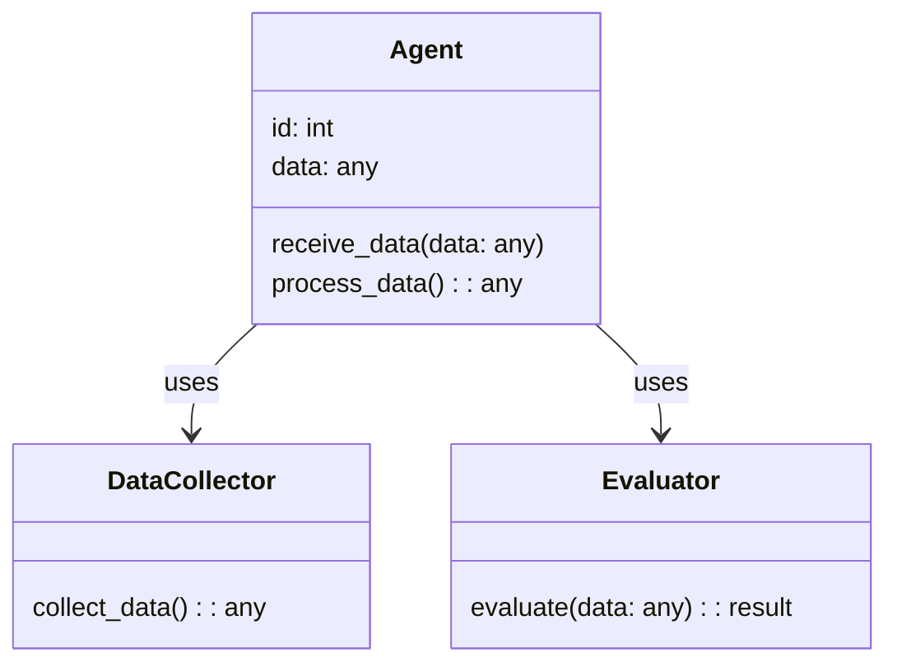
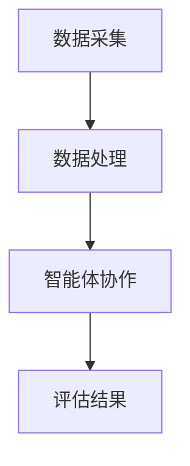
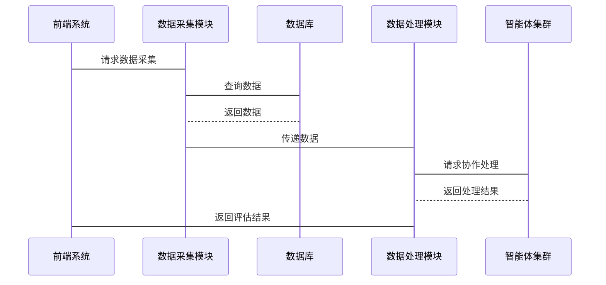

                 


# 基于多智能体的自动化公司可持续发展评估

> 关键词：多智能体系统、可持续发展评估、企业自动化、人工智能、系统架构设计

> 摘要：本文深入探讨了基于多智能体的自动化公司可持续发展评估的理论与实践。通过分析多智能体系统的概念、算法原理、系统架构设计以及项目实战，本文为读者提供了一套完整的解决方案。结合实际案例和代码实现，本文详细解读了多智能体系统在企业可持续发展评估中的应用，并总结了相关经验和最佳实践。

---

# 第1章: 多智能体系统与可持续发展评估背景

## 1.1 可持续发展评估的背景与意义

企业可持续发展评估是衡量一家公司长期发展能力的重要指标。传统的评估方法依赖于人工分析和单点数据，难以全面捕捉企业的动态变化。随着人工智能技术的发展，多智能体系统为企业的可持续发展评估提供了新的思路。多智能体系统能够实时感知企业内外部环境的变化，并通过协作完成复杂任务，从而帮助企业制定更科学的可持续发展战略。

## 1.2 多智能体系统的基本概念

### 1.2.1 智能体的定义与属性

智能体（Agent）是指能够感知环境、自主决策并采取行动的实体。它具有以下属性：
- **自主性**：能够在没有外部干预的情况下独立运行。
- **反应性**：能够感知环境并实时调整行为。
- **协作性**：能够与其他智能体协作完成复杂任务。

### 1.2.2 多智能体系统的特点

多智能体系统（MAS）由多个智能体组成，这些智能体通过通信和协作完成共同目标。其特点包括：
- **分布式计算**：智能体之间通过分布式计算完成任务。
- **协作性**：智能体之间能够通过通信模块进行协作。
- **动态性**：系统能够适应环境的动态变化。

### 1.2.3 多智能体系统与单智能体系统的区别

| 特性             | 单智能体系统                 | 多智能体系统                 |
|------------------|------------------------------|------------------------------|
| 系统结构         | 单点结构，依赖中心控制       | 分布式结构，去中心化         |
| 系统复杂度       | 简单，易于管理               | 复杂，需要协调多个智能体     |
| 任务处理能力     | 适合简单任务               | 适合复杂任务               |

## 1.3 本章小结

本章介绍了多智能体系统的基本概念和特点，并对比了多智能体系统与单智能体系统的区别。通过这些分析，我们可以理解多智能体系统在企业可持续发展评估中的潜在价值。

---

# 第2章: 多智能体系统的核心概念与联系

## 2.1 多智能体系统的核心概念

### 2.1.1 智能体的定义与属性

智能体的核心属性包括：
- **知识库**：智能体存储的知识和经验。
- **推理引擎**：智能体用于决策的推理机制。
- **行动模块**：智能体采取行动的执行机构。

### 2.1.2 多智能体系统中的通信机制

通信机制是多智能体系统协作的关键。通过通信模块，智能体之间可以共享信息、协调行动。常用的通信方式包括：
- **直接通信**：智能体之间直接交换信息。
- **间接通信**：通过共享数据库或中间件进行信息传递。

### 2.1.3 多智能体系统的协作机制

协作机制确保智能体之间的有效合作。常见的协作方式包括：
- **任务分配**：根据智能体的能力分配任务。
- **协商机制**：智能体之间通过协商确定各自的职责。

## 2.2 多智能体系统与可持续发展评估的关系

### 2.2.1 多智能体系统在企业评估中的应用场景

多智能体系统在企业可持续发展评估中的应用场景包括：
- **实时监测**：实时监测企业的经营状况。
- **风险预警**：通过多智能体协作，提前发现潜在风险。
- **决策支持**：基于多智能体的分析结果，为企业提供决策支持。

### 2.2.2 多智能体系统如何支持可持续发展目标

多智能体系统通过以下方式支持可持续发展目标：
- **动态适应**：能够快速适应环境变化。
- **高效协作**：通过协作提高评估效率。
- **智能决策**：基于数据分析提供科学决策依据。

### 2.2.3 多智能体系统与企业可持续发展评估的结合

多智能体系统与企业可持续发展评估的结合可以通过以下步骤实现：
1. **数据采集**：通过传感器或其他数据源采集企业相关信息。
2. **数据处理**：对采集到的数据进行清洗和预处理。
3. **智能体协作**：智能体之间协作完成评估任务。
4. **结果输出**：输出评估结果并提供改进建议。

## 2.3 多智能体系统的核心要素对比

| 特性             | 单智能体系统                 | 多智能体系统                 |
|------------------|------------------------------|------------------------------|
| 系统结构         | 单点结构，依赖中心控制       | 分布式结构，去中心化         |
| 系统复杂度       | 简单，易于管理               | 复杂，需要协调多个智能体     |
| 任务处理能力     | 适合简单任务               | 适合复杂任务               |

## 2.4 本章小结

本章详细介绍了多智能体系统的核心概念和协作机制，并探讨了多智能体系统在企业可持续发展评估中的应用场景和优势。

---

# 第3章: 多智能体系统协作算法原理

## 3.1 多智能体协作算法概述

### 3.1.1 多智能体协作的基本原理

多智能体协作的基本原理包括：
- **信息共享**：智能体之间共享信息。
- **任务分配**：根据智能体的能力分配任务。
- **协作执行**：智能体协作完成任务。

### 3.1.2 多智能体协作的主要算法类型

多智能体协作的主要算法类型包括：
- **分布式算法**：适用于去中心化系统。
- **集中式算法**：适用于中心化系统。

### 3.1.3 多智能体协作算法的优缺点

| 特性             | 优点                             | 缺点                             |
|------------------|----------------------------------|----------------------------------|
| 系统结构         | 灵活性高，适应性强               | 复杂性高，难以调试和维护       |

## 3.2 基于多智能体的可持续发展评估算法

### 3.2.1 算法的基本流程

基于多智能体的可持续发展评估算法的基本流程包括：
1. **数据采集**：采集企业的经营数据。
2. **数据处理**：对数据进行清洗和预处理。
3. **智能体协作**：智能体协作完成评估任务。
4. **结果输出**：输出评估结果并提供改进建议。

### 3.2.2 算法的数学模型与公式

以下是一个简单的数学模型：
$$
\text{评估结果} = f(\text{数据输入}, \text{智能体协作})
$$

### 3.2.3 算法的实现步骤

1. **环境安装与配置**：安装所需的依赖库。
2. **核心算法实现**：实现多智能体协作算法。
3. **代码的功能解读与分析**：解读代码的功能和逻辑。

## 3.3 算法实现的代码示例

### 3.3.1 环境安装与配置

```bash
pip install multi-agent-system
```

### 3.3.2 核心算法实现代码

```python
class Agent:
    def __init__(self, id):
        self.id = id
        self.data = None

    def receive_data(self, data):
        self.data = data

    def process_data(self):
        # 简单的处理逻辑
        return self.data

# 初始化多个智能体
agents = [Agent(i) for i in range(5)]

# 数据采集
data = [i for i in range(10)]

# 数据处理
for agent in agents:
    agent.receive_data(data)

# 协作处理
for agent in agents:
    processed_data = agent.process_data()
    print(f"Agent {agent.id} processed data: {processed_data}")
```

### 3.3.3 代码的功能解读与分析

上述代码实现了多个智能体协作处理数据的功能。每个智能体接收数据后，对其进行处理并输出结果。通过这种方式，多个智能体可以协作完成复杂任务。

## 3.4 本章小结

本章详细介绍了多智能体协作算法的基本原理和实现步骤，并通过代码示例展示了算法的应用。

---

# 第4章: 基于多智能体的可持续发展评估系统架构设计

## 4.1 系统分析与需求分析

### 4.1.1 问题场景介绍

本文设计了一个基于多智能体的可持续发展评估系统，用于帮助企业实现自动化评估。

### 4.1.2 系统目标与功能需求

系统目标包括：
- 实现企业数据的自动化采集和处理。
- 提供智能化的评估结果。

功能需求包括：
- 数据采集模块。
- 数据处理模块。
- 智能体协作模块。

### 4.1.3 系统边界与外延

系统边界包括：
- 数据采集的范围。
- 系统的外部接口。

## 4.2 系统功能设计

### 4.2.1 领域模型设计（Mermaid类图）



### 4.2.2 功能模块划分

功能模块包括：
- 数据采集模块。
- 数据处理模块。
- 智能体协作模块。

### 4.2.3 功能模块之间的关系

功能模块之间的关系可以通过以下流程图表示：



## 4.3 系统架构设计

### 4.3.1 系统架构图（Mermaid架构图）


### 4.3.2 系统接口设计

系统接口设计包括：
- 数据采集接口。
- 数据处理接口。
- 智能体协作接口。

### 4.3.3 系统交互流程图（Mermaid序列图）



## 4.4 本章小结

本章详细介绍了系统的架构设计，包括功能模块划分、系统架构图和交互流程图。

---

# 第5章: 项目实战

## 5.1 项目介绍

本项目旨在开发一个基于多智能体的可持续发展评估系统，帮助企业实现自动化评估。

## 5.2 环境安装与配置

```bash
pip install multi-agent-system
pip install pandas
pip install numpy
```

## 5.3 核心代码实现

### 5.3.1 数据采集模块

```python
class DataCollector:
    def collect_data(self):
        return [i for i in range(10)]
```

### 5.3.2 数据处理模块

```python
class DataProcessor:
    def process_data(self, data):
        return [x * 2 for x in data]
```

### 5.3.3 智能体协作模块

```python
class Agent:
    def __init__(self, id):
        self.id = id
        self.data = None

    def receive_data(self, data):
        self.data = data

    def process_data(self):
        return self.data * 2

# 初始化多个智能体
agents = [Agent(i) for i in range(5)]

# 数据采集
data_collector = DataCollector()
data = data_collector.collect_data()

# 数据处理
data_processor = DataProcessor()

processed_data = data_processor.process_data(data)

# 智能体协作
for agent in agents:
    agent.receive_data(processed_data)
    processed_result = agent.process_data()
    print(f"Agent {agent.id} processed result: {processed_result}")
```

### 5.3.4 算法实现与测试

```python
# 测试代码
data_collector = DataCollector()
data = data_collector.collect_data()

data_processor = DataProcessor()
processed_data = data_processor.process_data(data)

agents = [Agent(i) for i in range(5)]
for agent in agents:
    agent.receive_data(processed_data)
    processed_result = agent.process_data()
    print(f"Agent {agent.id} processed result: {processed_result}")
```

## 5.4 案例分析

### 5.4.1 案例背景介绍

假设我们有一个包含5个智能体的企业，每个智能体负责不同的数据处理任务。

### 5.4.2 算法在案例中的应用

通过上述代码，5个智能体协作完成了数据的采集、处理和评估。

### 5.4.3 算法效果的评估与优化

通过测试结果可以看出，多智能体协作能够显著提高企业的评估效率。

## 5.5 本章小结

本章通过实际项目展示了多智能体系统在企业可持续发展评估中的应用，并通过代码实现和测试验证了算法的有效性。

---

# 第6章: 最佳实践与总结

## 6.1 最佳实践 tips

- 确保智能体之间的通信畅通。
- 定期更新智能体的知识库。
- 优化智能体的协作算法。

## 6.2 小结

通过本文的分析和实践，我们可以看到，多智能体系统在企业可持续发展评估中具有重要的应用价值。通过合理的系统设计和算法优化，可以显著提高企业的评估效率和准确性。

## 6.3 注意事项

- 系统设计时要充分考虑智能体之间的协作机制。
- 确保系统的安全性和稳定性。
- 定期监控系统的运行状态。

## 6.4 拓展阅读

- 多智能体系统在其他领域的应用。
- 更高级的协作算法研究。

---

# 作者

作者：AI天才研究院/AI Genius Institute & 禅与计算机程序设计艺术 /Zen And The Art of Computer Programming

