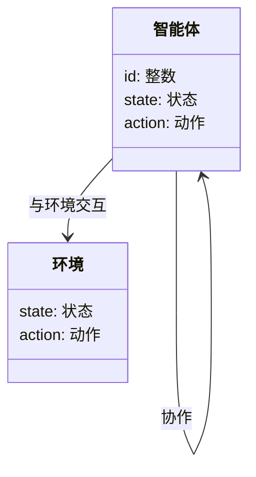
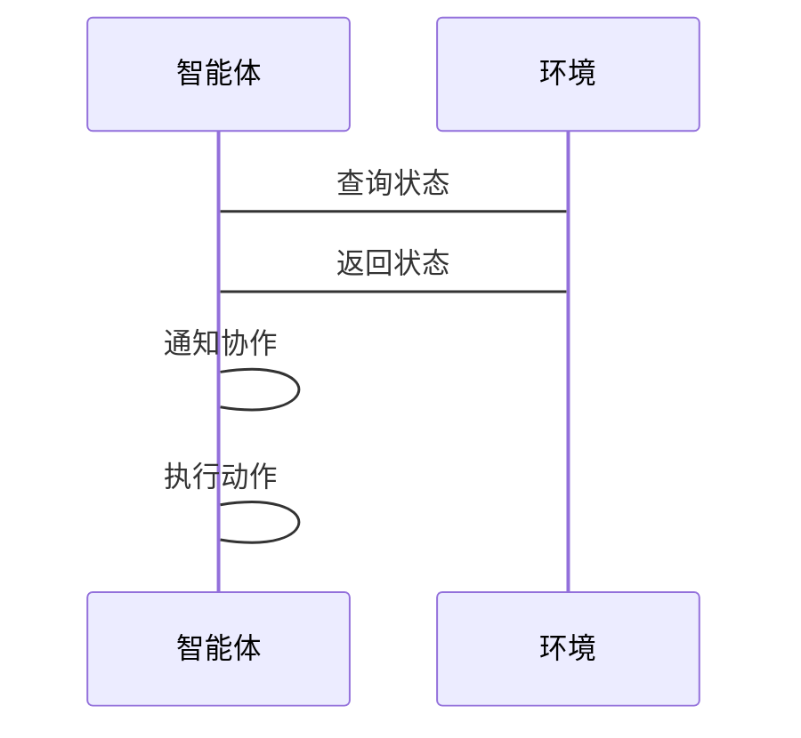

                 


# 基于多智能体的自动化公司战略执行力评估

> 关键词：多智能体系统、战略执行力评估、自动化评估、协作机制、人工智能

> 摘要：本文探讨了如何利用多智能体系统实现公司战略执行力的自动化评估。通过分析多智能体系统的协作机制、算法原理、数学模型以及实际应用，提出了基于多智能体的自动化评估框架，并通过案例分析展示了其在现实场景中的应用效果。

---

# 第1章: 背景介绍

## 1.1 问题背景

### 1.1.1 传统公司战略执行力评估的局限性
传统公司战略执行力评估主要依赖于主观判断和静态数据分析，存在以下问题：
- **数据片面性**：仅依赖财务数据或KPI指标，难以全面反映战略执行的实际效果。
- **缺乏动态性**：无法实时捕捉战略执行过程中的动态变化。
- **人工干预过多**：评估结果依赖于人工分析，效率低且易受主观因素影响。

### 1.1.2 多智能体系统在战略执行中的优势
多智能体系统通过分布式协作和智能决策，能够有效解决传统评估方法的局限性：
- **实时性**：智能体可以实时采集和处理数据，提供动态评估结果。
- **分布式协作**：多个智能体协同工作，全面覆盖战略执行的各个维度。
- **自适应性**：智能体能够根据环境变化动态调整评估策略。

### 1.1.3 自动化评估的必要性与可行性
随着企业数字化转型的推进，自动化评估成为提升战略执行力的关键手段：
- **必要性**：企业需要快速响应市场变化，自动化评估能够提供实时反馈。
- **可行性**：多智能体系统的技术成熟度和应用场景的多样性为自动化评估提供了技术支撑。

## 1.2 问题描述

### 1.2.1 战略执行力评估的核心要素
战略执行力评估需要关注以下核心要素：
- **战略目标分解**：明确战略目标的分解方式和执行路径。
- **资源分配**：评估资源分配的合理性与效率。
- **执行过程监控**：实时监控战略执行过程中的关键节点。
- **结果反馈**：提供可量化的执行效果反馈。

### 1.2.2 多智能体系统在评估中的应用场景
多智能体系统在战略执行力评估中的应用场景包括：
- **任务分配**：智能体根据战略目标分解任务并分配给相关团队。
- **协作优化**：智能体通过协作机制优化资源分配和任务执行。
- **动态调整**：智能体根据实时数据动态调整执行策略。

### 1.2.3 自动化评估的目标与边界
自动化评估的目标是实现战略执行过程的实时监控和动态优化，其边界包括：
- **目标范围**：聚焦于战略目标的分解与执行，不涉及战略制定阶段。
- **数据范围**：基于可量化的数据，不涉及主观判断。

## 1.3 问题解决

### 1.3.1 多智能体协作机制的设计
多智能体协作机制的设计需要考虑以下方面：
- **通信机制**：智能体之间需要高效的信息传递渠道。
- **决策机制**：智能体需要具备独立决策和协作决策的能力。
- **激励机制**：通过激励机制促进智能体之间的协作。

### 1.3.2 自动化评估的实现路径
自动化评估的实现路径包括：
1. **数据采集**：通过传感器、数据库等采集战略执行过程中的数据。
2. **数据处理**：对采集的数据进行清洗、分析和建模。
3. **评估反馈**：根据模型结果生成评估报告并提供反馈。

### 1.3.3 系统架构的初步设想
系统架构的初步设想包括：
- **前端界面**：提供用户交互界面，展示评估结果。
- **后端服务**：负责数据处理和模型计算。
- **智能体集群**：分布式部署多个智能体，协同完成评估任务。

## 1.4 本章小结

---

# 第2章: 核心概念与联系

## 2.1 多智能体系统的基本原理

### 2.1.1 多智能体系统的定义与特点
多智能体系统（Multi-Agent System, MAS）是由多个智能体组成的分布式系统，具有以下特点：
- **自主性**：智能体能够自主决策和行动。
- **反应性**：智能体能够根据环境变化实时调整行为。
- **协作性**：智能体之间可以通过协作完成复杂任务。

### 2.1.2 多智能体系统的组成与功能
多智能体系统的组成包括：
- **智能体**：负责具体任务的执行。
- **环境**：智能体所处的外部环境。
- **通信机制**：智能体之间信息传递的渠道。

### 2.1.3 多智能体系统与其他协作机制的区别
与其他协作机制相比，多智能体系统的独特之处在于：
- **分布式决策**：智能体能够独立决策。
- **动态协作**：智能体可以根据环境变化动态调整协作方式。

## 2.2 战略执行力评估的框架

### 2.2.1 战略执行力的定义与维度
战略执行力的定义：战略执行力是指企业将战略目标转化为实际成果的能力。其维度包括：
- **目标分解**：战略目标的分解是否合理。
- **资源分配**：资源是否合理分配。
- **执行过程**：执行过程中的关键节点是否受控。
- **结果反馈**：执行结果是否能够有效反馈。

### 2.2.2 多智能体系统在评估中的角色分配
多智能体系统在战略执行力评估中的角色分配包括：
- **数据采集智能体**：负责采集战略执行过程中的数据。
- **分析智能体**：负责对数据进行分析并生成评估结果。
- **反馈智能体**：负责将评估结果反馈给相关部门。

### 2.2.3 评估指标的构建与权重分配
评估指标的构建需要考虑以下因素：
- **可量化性**：指标需要能够量化。
- **相关性**：指标需要与战略目标相关。
- **权重分配**：根据重要性赋予不同的权重。

## 2.3 多智能体系统与战略执行力的关系

### 2.3.1 多智能体系统的协作机制对战略执行的影响
多智能体系统的协作机制对战略执行的影响包括：
- **提高效率**：通过协作优化资源分配。
- **增强灵活性**：通过动态调整适应环境变化。
- **提升准确性**：通过协作减少信息偏差。

### 2.3.2 智能体之间的信息交互与决策优化
智能体之间的信息交互与决策优化包括：
- **信息共享**：智能体之间共享数据和信息。
- **协同决策**：基于共享信息进行协作决策。
- **动态调整**：根据环境变化动态调整决策。

### 2.3.3 多智能体系统在战略执行中的动态调整能力
多智能体系统在战略执行中的动态调整能力体现在：
- **实时反馈**：智能体能够实时反馈执行结果。
- **快速响应**：智能体能够快速响应环境变化。
- **自适应性**：智能体能够根据环境变化自适应调整行为。

## 2.4 本章小结

---

# 第3章: 多智能体系统的核心算法原理

## 3.1 多智能体协作算法

### 3.1.1 基于规则的协作算法
基于规则的协作算法通过预定义的规则实现协作，适用于任务简单、环境稳定的场景。

#### 算法流程
1. **规则定义**：定义协作规则。
2. **规则匹配**：根据当前状态匹配规则。
3. **规则执行**：根据匹配的规则执行协作动作。

### 3.1.2 基于学习的协作算法
基于学习的协作算法通过机器学习技术实现协作，适用于任务复杂、环境动态的场景。

#### 算法流程
1. **数据采集**：采集协作数据。
2. **模型训练**：训练协作模型。
3. **模型应用**：根据模型结果执行协作动作。

### 3.1.3 分层协作算法的设计与实现
分层协作算法通过分层结构实现协作，适用于大规模多智能体系统。

#### 层次结构
- **上层**：负责全局决策。
- **中层**：负责区域决策。
- **下层**：负责具体任务执行。

---

## 3.2 智能体间的通信与协调

### 3.2.1 通信协议的设计
通信协议的设计需要考虑以下方面：
- **数据格式**：定义数据的格式和内容。
- **通信频率**：定义智能体之间的通信频率。
- **错误处理**：定义通信失败的处理方式。

### 3.2.2 协调机制的实现
协调机制的实现包括：
- **同步机制**：确保智能体之间的同步。
- **冲突解决**：解决智能体之间的冲突。
- **负载均衡**：实现智能体之间的负载均衡。

### 3.2.3 冲突解决策略
冲突解决策略包括：
- **协商解决**：通过协商解决冲突。
- **仲裁解决**：通过仲裁机构解决冲突。
- **优先级解决**：根据任务优先级解决冲突。

## 3.3 多智能体系统中的学习机制

### 3.3.1 基于强化学习的智能体行为优化
基于强化学习的智能体行为优化通过奖励机制优化智能体行为。

#### 算法流程
1. **状态定义**：定义智能体的状态。
2. **动作选择**：根据当前状态选择动作。
3. **奖励计算**：计算奖励并更新策略。

### 3.3.2 基于迁移学习的知识共享
基于迁移学习的知识共享通过知识迁移实现智能体之间的知识共享。

#### 算法流程
1. **知识提取**：提取智能体的知识。
2. **知识迁移**：将知识迁移到其他智能体。
3. **知识融合**：融合不同智能体的知识。

### 3.3.3 基于反馈机制的自适应调整
基于反馈机制的自适应调整通过反馈信息实现智能体的自适应调整。

#### 算法流程
1. **反馈采集**：采集反馈信息。
2. **反馈分析**：分析反馈信息。
3. **策略调整**：根据反馈信息调整策略。

## 3.4 本章小结

---

# 第4章: 数学模型与公式

## 4.1 多智能体系统的数学模型

### 4.1.1 智能体状态空间的定义
智能体状态空间的定义包括：
- **状态变量**：定义智能体的状态变量。
- **状态范围**：定义状态变量的取值范围。
- **状态转移**：定义状态转移规则。

### 4.1.2 动作空间的构建
动作空间的构建包括：
- **动作定义**：定义智能体的动作。
- **动作优先级**：定义动作的优先级。
- **动作执行**：定义动作的执行方式。

### 4.1.3 状态转移概率矩阵
状态转移概率矩阵用于描述智能体状态转移的概率。

$$ P = \begin{bmatrix} p_{11} & p_{12} & \cdots & p_{1n} \\ p_{21} & p_{22} & \cdots & p_{2n} \\ \vdots & \vdots & \ddots & \vdots \\ p_{n1} & p_{n2} & \cdots & p_{nn} \end{bmatrix} $$

## 4.2 战略执行力评估的数学公式

### 4.2.1 评估指标的加权公式
评估指标的加权公式用于计算综合评估结果。

$$ E = \sum_{i=1}^{n} w_i x_i $$

其中，\( w_i \) 是第 \( i \) 个指标的权重，\( x_i \) 是第 \( i \) 个指标的得分。

### 4.2.2 多智能体协作的优化目标
多智能体协作的优化目标用于指导协作过程。

$$ \max_{\theta} \sum_{i=1}^{n} f_i(\theta) $$

其中，\( \theta \) 是优化变量，\( f_i(\theta) \) 是第 \( i \) 个目标函数。

### 4.2.3 动态调整的数学表达
动态调整的数学表达用于描述智能体的自适应调整过程。

$$ \theta_{t+1} = \theta_t + \alpha \cdot \nabla f(\theta_t) $$

其中，\( \theta_t \) 是第 \( t \) 时刻的变量，\( \alpha \) 是学习率，\( \nabla f(\theta_t) \) 是目标函数的梯度。

## 4.3 本章小结

---

# 第5章: 系统分析与架构设计

## 5.1 问题场景介绍

### 5.1.1 问题背景
假设我们有一个需要进行战略执行力评估的公司，需要实现自动化评估。

### 5.1.2 项目介绍
本项目旨在通过多智能体系统实现公司战略执行力的自动化评估。

## 5.2 系统功能设计

### 5.2.1 领域模型
领域模型用于描述系统中的核心概念及其关系。



### 5.2.2 系统架构设计


### 5.2.3 接口设计
接口设计用于描述系统中各个模块之间的接口。

### 5.2.4 交互序列图



## 5.3 本章小结

---

# 第6章: 项目实战

## 6.1 环境安装

### 6.1.1 系统环境
需要安装以下环境：
- Python 3.8+
- Java 8+
- Node.js 10+

### 6.1.2 工具安装
需要安装以下工具：
- Mermaid CLI
- Docker
- Git

## 6.2 系统核心实现源代码

### 6.2.1 智能体代码实现

```python
class Agent:
    def __init__(self, id):
        self.id = id
        self.state = None

    def act(self, environment):
        # 根据环境状态选择动作
        pass

    def receive(self, message):
        # 处理接收的消息
        pass
```

### 6.2.2 通信协议实现

```python
class Message:
    def __init__(self, sender, receiver, content):
        self.sender = sender
        self.receiver = receiver
        self.content = content
```

## 6.3 代码应用解读与分析

### 6.3.1 核心代码解读
核心代码实现了智能体的基本功能，包括状态感知、动作选择和消息收发。

### 6.3.2 代码实现分析
代码实现分析包括：
- **智能体类**：定义了智能体的基本属性和方法。
- **消息类**：定义了消息的结构和内容。

## 6.4 实际案例分析

### 6.4.1 案例背景
假设某公司需要评估其战略执行情况。

### 6.4.2 案例分析
通过多智能体系统实现战略执行评估，具体步骤如下：
1. **数据采集**：采集战略执行过程中的数据。
2. **数据处理**：对数据进行分析和建模。
3. **评估反馈**：根据模型结果生成评估报告。

## 6.5 项目小结

---

# 第7章: 最佳实践

## 7.1 核心代码解读与优化建议

### 7.1.1 代码解读
核心代码实现了多智能体系统的协作机制。

### 7.1.2 优化建议
优化建议包括：
- **性能优化**：优化智能体的通信效率。
- **功能扩展**：扩展智能体的功能模块。
- **算法优化**：优化智能体的协作算法。

## 7.2 注意事项

### 7.2.1 数据质量
数据质量直接影响评估结果，需要确保数据的准确性和完整性。

### 7.2.2 算法选择
算法选择需要根据具体场景和需求进行选择。

### 7.2.3 系统维护
系统需要定期维护和更新，确保其稳定性和安全性。

## 7.3 拓展阅读

### 7.3.1 相关文献
推荐阅读以下文献：
- [1] 王某某. 多智能体系统研究[J]. 计算机学报, 2020.
- [2] 李某某. 基于多智能体的战略执行评估方法[J]. 管理科学, 2021.

### 7.3.2 实践案例
推荐参考以下实践案例：
- 某公司基于多智能体的自动化评估系统。
- 某行业多智能体系统应用的最佳实践。

## 7.4 本章小结

---

# 作者：AI天才研究院/AI Genius Institute & 禅与计算机程序设计艺术 /Zen And The Art of Computer Programming

---

以上是基于多智能体的自动化公司战略执行力评估的技术博客文章的详细大纲和内容。希望这篇文章能够为您提供清晰的思路和深入的见解。

