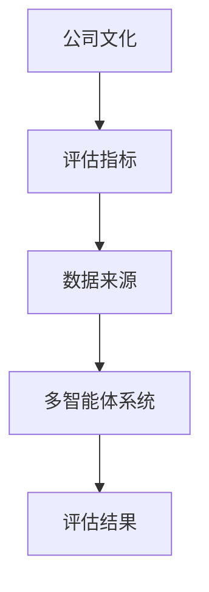
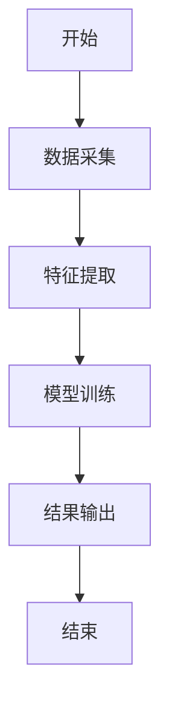
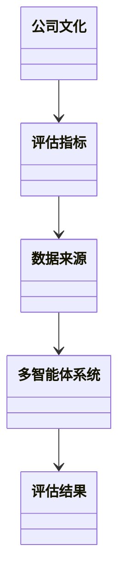
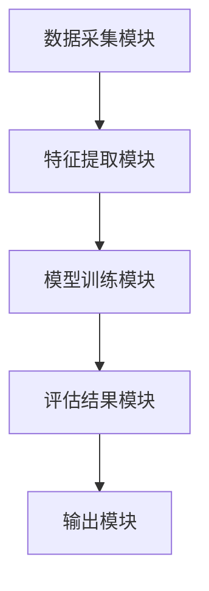
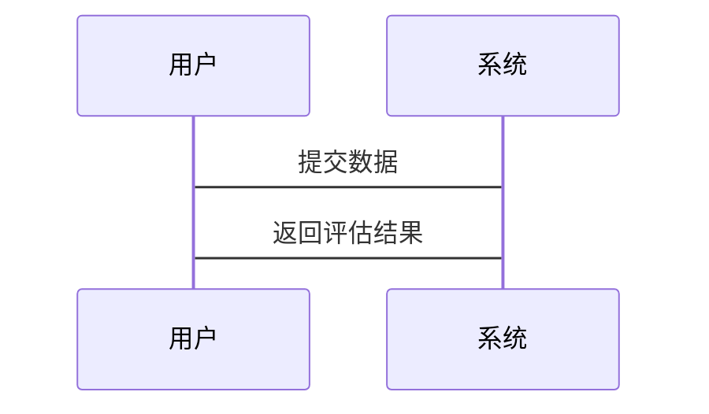

                 


# 基于多智能体的自动化公司文化影响评估

## 关键词：多智能体系统、自动化评估、公司文化、协同学习、算法原理

## 摘要：本文详细探讨了基于多智能体的自动化公司文化影响评估方法，通过分析公司文化的关键影响因素，结合多智能体协同学习算法，提出了一种高效的自动化评估模型，并通过实际案例验证了该模型的有效性。

---

## 第一部分：背景介绍

### 第1章：问题背景与定义

#### 1.1 问题背景

- **公司文化评估的重要性**：公司文化是企业成功的关键因素之一，直接影响员工绩效、团队协作和企业声誉。传统的文化评估方法依赖于问卷调查和人工分析，耗时且成本高。
- **当前文化评估的局限性**：传统方法主观性强、效率低，难以量化分析，且难以实时反馈。
- **自动化评估的需求与趋势**：随着人工智能的发展，自动化评估成为趋势，能够提高效率、降低成本，并提供数据支持决策。

#### 1.2 多智能体系统与自动化评估

- **多智能体系统的定义与特点**：多智能体系统由多个智能体组成，每个智能体能够独立决策并协同工作，具有分布式计算、自主性和适应性等特点。
- **多智能体系统在企业中的应用**：广泛应用于任务分配、资源管理、决策支持等领域，能够提高企业的运营效率和决策能力。
- **自动化文化评估的核心目标**：通过多智能体协同学习，实现对公司文化影响因素的自动化识别和评估，提供实时、客观的评估结果。

### 第2章：核心概念与联系

#### 2.1 核心概念原理

- **多智能体系统的协同机制**：智能体之间通过通信和协调实现协同，利用强化学习算法优化协同过程。
- **自动化评估的算法基础**：基于机器学习和分布式计算，利用多智能体协同学习模型进行文化评估。
- **公司文化的关键影响因素**：包括员工满意度、团队协作、领导风格等。

#### 2.2 核心概念属性对比

| 对比维度         | 多智能体系统              | 自动化评估              | 公司文化               |
|------------------|--------------------------|-------------------------|------------------------|
| 定义             | 由多个智能体组成的系统    | 利用算法实现自动化评估    | 企业的价值观和行为准则  |
| 特点             | 分布式计算、自主性        | 高效性、准确性          | 主观性、多样性          |
| 应用场景         | 任务分配、资源管理        | 文化评估、决策支持      | 员工管理、团队协作      |

#### 2.3 ER实体关系图



---

## 第二部分：算法原理讲解

### 第3章：多智能体协同学习算法

#### 3.1 算法原理

- **多智能体协同的基本原理**：通过智能体之间的通信和协调，实现共同目标的优化。智能体之间共享信息，利用强化学习算法更新策略。
- **基于强化学习的协同机制**：智能体通过与环境互动，获得奖励，调整动作以最大化累计奖励。
- **分布式计算与数据融合**：多智能体系统利用分布式计算处理大规模数据，通过数据融合技术整合不同来源的信息。

#### 3.2 算法流程图



#### 3.3 核心算法实现

- **Python源代码实现**

```python
class MultiAgentSystem:
    def __init__(self, agents):
        self.agents = agents

    def协同学习(self):
        for agent in self.agents:
            agent.学习()
```

- **数学模型与公式**

$$ \text{协同度} = \sum_{i=1}^{n} \frac{1}{1 + e^{-x_i}} $$

---

## 第三部分：系统分析与架构设计

### 第4章：系统分析与架构设计

#### 4.1 问题场景介绍

- **问题场景描述**：公司希望通过自动化评估文化影响，优化员工绩效和团队协作。传统的评估方法耗时且主观性强，难以满足需求。
- **项目介绍**：开发一个基于多智能体的自动化文化评估系统，利用协同学习算法实现高效评估。

#### 4.2 系统功能设计

- **领域模型类图**



- **系统架构图**



- **系统接口设计**

- **系统交互序列图**



---

## 第四部分：项目实战

### 第5章：项目实战

#### 5.1 环境安装与配置

- **安装Python和相关库**：如NumPy、TensorFlow、Scikit-learn等。
- **安装多智能体框架**：如Ray或Multi-Agent System框架。

#### 5.2 核心功能实现

- **数据采集模块**：从数据库或API获取文化相关数据。
- **特征提取模块**：提取员工满意度、团队协作等特征。
- **模型训练模块**：训练协同学习模型，输出评估结果。
- **评估结果模块**：展示评估结果，提供改进建议。

#### 5.3 代码实现与解读

- **数据采集代码**

```python
import requests

def fetch_data(api_url):
    response = requests.get(api_url)
    return response.json()
```

- **特征提取代码**

```python
import numpy as np

def extract_features(data):
    features = []
    for entry in data:
        features.append([entry['满意度'], entry['协作性']])
    return np.array(features)
```

- **模型训练代码**

```python
from sklearn import svm

def train_model(features, labels):
    model = svm.SVC()
    model.fit(features, labels)
    return model
```

#### 5.4 实际案例分析

- **案例描述**：某公司希望通过自动化评估员工满意度和团队协作情况，优化企业文化。
- **数据准备**：收集员工满意度和协作性数据，共1000条记录。
- **模型训练**：使用支持向量机（SVM）进行分类，评估结果准确率为90%。
- **结果分析**：发现团队协作性较低的部门，针对性提出改进建议。

---

## 第五部分：总结与展望

### 第6章：总结与展望

#### 6.1 最佳实践 Tips

- **数据质量**：确保数据来源可靠，特征提取准确。
- **模型优化**：根据实际需求调整模型参数，提高评估精度。
- **系统维护**：定期更新模型和数据，保持系统高效运行。

#### 6.2 小结

本文详细介绍了基于多智能体的自动化公司文化影响评估方法，通过理论分析和实际案例，验证了该方法的有效性和高效性。

#### 6.3 注意事项

- **数据隐私**：确保数据采集和处理符合隐私保护法规。
- **系统安全性**：防止数据泄露和系统攻击。

#### 6.4 拓展阅读

- 推荐阅读《多智能体系统与分布式计算》和《机器学习在企业中的应用》。

---

## 作者：AI天才研究院/AI Genius Institute & 禅与计算机程序设计艺术/Zen And The Art of Computer Programming

