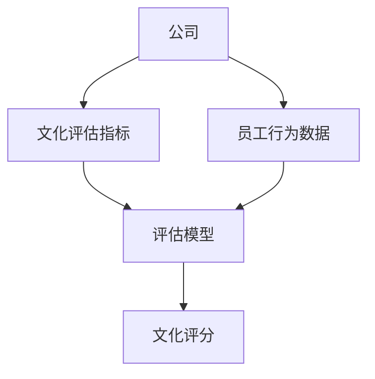
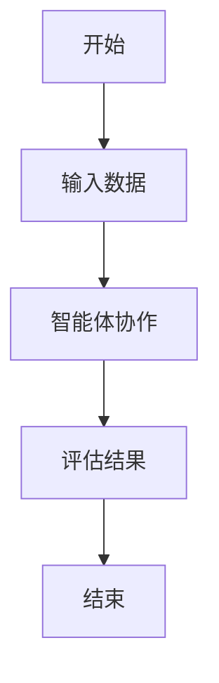
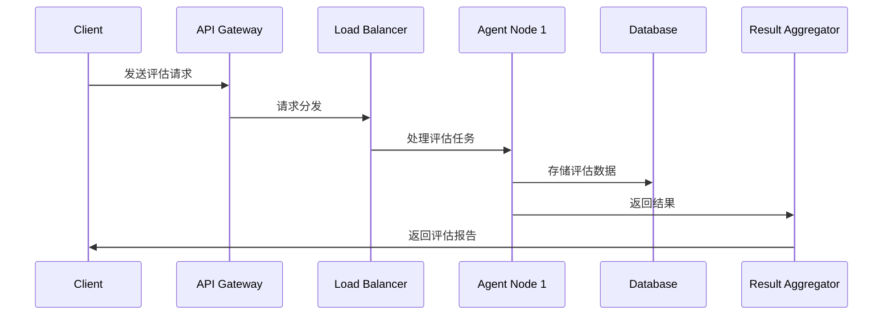

                 


# 基于多智能体的自动化公司文化评估

## 关键词：
- 多智能体系统
- 公司文化评估
- 自动化
- 人工智能
- 系统架构

## 摘要：
本文将探讨如何利用多智能体系统来实现公司文化的自动化评估。通过分析多智能体系统的原理、算法、架构设计和实际案例，展示其在提升文化评估效率和准确性的优势。

---

# 第一部分: 基于多智能体的公司文化评估背景与概念

## 第1章: 问题背景与描述

### 1.1 问题背景
- **公司文化评估的重要性**：文化是公司成功的关键因素，传统的评估方法耗时且主观。
- **现有文化评估方法的局限性**：依赖人工判断，难以量化和自动化。
- **多智能体技术的应用潜力**：利用智能体协作处理复杂文化数据。

### 1.2 问题描述
- **公司文化评估的核心要素**：包括员工行为、价值观、管理风格等。
- **多智能体系统在文化评估中的角色**：通过协作智能体分析和评估文化要素。
- **系统边界与外延**：明确系统的输入和输出范围，避免功能溢出。

### 1.3 问题解决与目标设定
- **多智能体系统如何解决文化评估问题**：通过协作智能体提高评估的客观性和效率。
- **系统目标与功能定位**：设计一个多智能体系统，实现文化评估的自动化和高精度。
- **解决方案的可行性分析**：评估现有技术是否成熟，数据是否可获取。

### 1.4 核心概念与结构
- **多智能体系统的基本结构**：由多个智能体组成，具备协作和通信能力。
- **公司文化评估的核心要素**：员工反馈、领导风格、组织氛围等。
- **系统功能模块的组成与关系**：数据采集、分析、评估、反馈等模块的协作。

## 第2章: 多智能体系统的核心概念与联系

### 2.1 多智能体系统原理
- **多智能体系统的定义与特征**：多个智能体协作完成任务，具备自主性和响应性。
- **智能体的基本属性与功能**：目标驱动、反应式、通信能力。
- **多智能体系统的协作机制**：任务分配、协调、冲突解决。

### 2.2 核心概念对比分析
- **多智能体与单智能体的对比**：多智能体在复杂任务中的优势。
- **不同协作机制的优缺点**：集中式 vs. 分布式协作。
- **系统复杂度与智能体数量的关系**：适量智能体数量提升系统性能。

### 2.3 ER实体关系图架构


---

# 第二部分: 多智能体文化评估算法原理

## 第3章: 多智能体文化评估算法原理

### 3.1 算法原理概述
- **系统输入与输出**：输入公司数据，输出文化评估结果。
- **算法的基本流程**：数据采集、智能体协作分析、评估结果生成。
- **算法的核心思想**：利用多智能体协作，提高评估的全面性和准确性。

### 3.2 算法流程图


### 3.3 数学模型与公式
- **智能体协作模型**：
  $$f(x) = \sum_{i=1}^{n} a_i x_i$$
  其中，\(a_i\)为权重，\(x_i\)为输入特征。
- **评估模型**：
  $$g(x) = \prod_{i=1}^{m} (1 - \epsilon_i)$$
  其中，\(\epsilon_i\)为误差项。

### 3.4 算法实现与代码示例
```python
import numpy as np

def multi_agent_assessment(data_points):
    agents = [Agent(i) for i in range(5)]  # 初始化5个智能体
    results = [agent.assess(data_points) for agent in agents]
    return np.mean(results)

class Agent:
    def __init__(self, id):
        self.id = id
    
    def assess(self, data):
        # 简单的评估逻辑，实际可根据需求扩展
        return sum(data) / len(data)
```

---

# 第三部分: 系统分析与架构设计方案

## 第4章: 系统分析与架构设计

### 4.1 问题场景介绍
- **目标公司**：希望通过多智能体系统实现自动化文化评估。
- **问题场景**：公司需要快速、准确地评估文化状况，优化管理。

### 4.2 系统功能设计
- **领域模型**：
  ```mermaid
  classDiagram
  class Company {
      - name: string
      - culture_data: list
  }
  class Agent {
      - id: int
      - assessment: float
  }
  Company --> Agent: 分配评估任务
  ```

### 4.3 系统架构设计
- **架构图**：
  ```mermaid
  architecture
  Client --> API Gateway: 发送评估请求
  API Gateway --> Load Balancer: 分发请求
  Load Balancer --> Agent Nodes: 处理评估任务
  Agent Nodes --> Database: 存储结果
  Database --> Result Aggregator: 综合结果
  Result Aggregator --> Client: 返回评估报告
  ```

### 4.4 系统接口设计
- **输入接口**：接收公司数据和评估请求。
- **输出接口**：返回文化评估报告和改进建议。

### 4.5 系统交互流程


---

# 第四部分: 项目实战

## 第5章: 项目实战

### 5.1 环境安装
- **Python环境**：安装Python 3.8以上。
- **依赖安装**：
  ```bash
  pip install numpy
  pip install matplotlib
  pip install scikit-learn
  ```

### 5.2 系统核心实现
- **数据预处理**：清洗和标准化公司文化数据。
- **智能体协作实现**：编写智能体类，实现协作评估逻辑。

### 5.3 代码实现
```python
import numpy as np
from sklearn.metrics import accuracy_score

class MultiAgentSystem:
    def __init__(self, num_agents):
        self.agents = [Agent(i) for i in range(num_agents)]
    
    def assess_culture(self, data):
        assessments = [agent.assess(data) for agent in self.agents]
        return np.mean(assessments)

class Agent:
    def __init__(self, id):
        self.id = id
    
    def assess(self, data):
        return sum(data) / len(data)

# 示例用法
system = MultiAgentSystem(5)
data = [7, 8, 6, 9, 5]  # 示例文化评分数据
result = system.assess_culture(data)
print(f"文化评估结果：{result}")
```

### 5.4 案例分析
- **数据输入**：一家中型科技公司的员工满意度数据。
- **评估过程**：5个智能体协作分析数据，生成文化评分。
- **结果分析**：评估结果为7.8，说明公司文化整体良好，但有改进空间。

### 5.5 项目小结
- **项目总结**：多智能体系统在文化评估中的优势。
- **经验与教训**：协作机制设计的关键性，数据质量的重要性。

---

# 第五部分: 总结与展望

## 第6章: 总结与展望

### 6.1 最佳实践 tips
- **数据收集**：确保数据的多样性和代表性。
- **智能体协作**：优化协作机制，提高评估效率。

### 6.2 小结
- 多智能体系统为公司文化评估提供了新的思路，通过协作智能体实现自动化、高精度的评估。

### 6.3 注意事项
- 数据隐私保护，确保员工信息的安全。
- 系统维护与更新，适应公司文化的变化。

### 6.4 拓展阅读
- 推荐阅读《Multi-Agent Systems in Organizational Culture Analysis》。

---

# 作者：AI天才研究院/AI Genius Institute & 禅与计算机程序设计艺术 /Zen And The Art of Computer Programming

