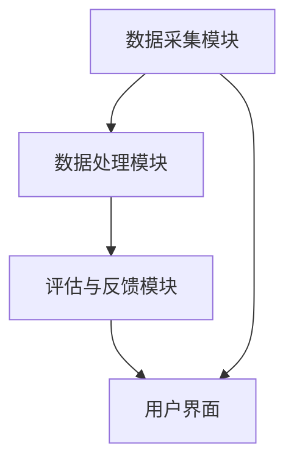

                 


# 基于多智能体的自动化公司文化评估系统

> 关键词：多智能体系统，自动化公司文化评估，分布式计算，系统架构，企业文化评估

> 摘要：本文详细探讨了如何利用多智能体系统实现公司文化的自动化评估。通过分析公司文化评估的背景与挑战，阐述了多智能体系统的原理及其在评估中的应用，介绍了系统的算法原理、架构设计和项目实现，最后总结了最佳实践和未来发展方向。

---

## 第1章: 公司文化评估的背景与挑战

### 1.1 公司文化评估的重要性

#### 1.1.1 企业文化对组织的影响

公司文化是企业成功的核心驱动力之一。它不仅影响员工的工作态度和行为，还直接影响企业的凝聚力、创新能力和市场竞争力。良好的企业文化能够提升员工满意度，降低 turnover 率，从而为企业创造更大的价值。

#### 1.1.2 传统企业文化评估的局限性

传统的企业文化评估通常依赖于问卷调查、访谈和数据分析，这种方法存在以下问题：

- **主观性**：问卷调查的结果容易受到员工主观因素的影响，难以保证数据的客观性。
- **低效性**：传统评估方法通常需要大量的人工参与，效率低下，且难以实时更新。
- **不连续性**：评估结果通常是静态的，无法反映企业的动态变化。

#### 1.1.3 自动化评估的必要性

随着技术的进步，企业对实时、动态的文化评估需求日益增加。自动化评估能够提供实时数据支持，帮助企业及时发现和解决问题，从而提升管理效率。

---

### 1.2 多智能体系统的基本概念

#### 1.2.1 多智能体系统的定义

多智能体系统（Multi-Agent System, MAS）是由多个智能体（Agent）组成的分布式系统，这些智能体能够通过协作完成特定任务。每个智能体都具有一定的自主性、反应性和协作性。

#### 1.2.2 多智能体系统的分类与特点

多智能体系统可以根据不同的标准进行分类：

- **按智能体的智能水平**：分为反应式智能体和认知式智能体。
- **按智能体的协作方式**：分为分布式协作和集中式协作。
- **按应用领域**：分为经济、社会和工程领域等。

多智能体系统的特点包括：

- **分布式性**：智能体分布在不同的位置，能够独立运行。
- **协作性**：智能体之间通过通信和协作完成共同目标。
- **动态性**：系统能够适应环境的变化。

#### 1.2.3 多智能体系统与传统评估方法的对比

| 对比维度 | 多智能体系统 | 传统评估方法 |
|----------|--------------|----------------|
| 自主性    | 高           | 低             |
| 协作性    | 强           | 弱             |
| 及时性    | 高           | 低             |
| 灵活性    | 高           | 低             |

---

## 第2章: 多智能体系统的核心原理

### 2.1 多智能体系统的核心概念

#### 2.1.1 智能体的定义与属性

智能体是一个能够感知环境并采取行动以实现目标的实体。其主要属性包括：

- **自主性**：智能体能够自主决策。
- **反应性**：智能体能够实时感知环境并做出反应。
- **协作性**：智能体能够与其他智能体协作完成任务。

#### 2.1.2 多智能体系统的协作机制

多智能体系统的协作机制包括：

- **通信机制**：智能体之间通过通信协议交换信息。
- **协商机制**：智能体之间通过协商分配任务。
- **协调机制**：智能体之间通过协调确保任务的顺利进行。

#### 2.1.3 多智能体系统的通信协议

通信协议是智能体之间交互的基础，常见的通信协议包括：

- **基于消息的通信**：智能体通过消息传递信息。
- **基于服务的通信**：智能体通过服务接口进行交互。

---

### 2.2 多智能体系统的结构与功能

#### 2.2.1 分层架构

多智能体系统的架构通常分为以下层次：

- **物理层**：智能体的物理实现。
- **逻辑层**：智能体的行为逻辑。
- **协作层**：智能体之间的协作机制。

#### 2.2.2 智能体的协作流程

协作流程包括以下步骤：

1. **任务分配**：智能体根据任务需求分配协作任务。
2. **信息共享**：智能体之间共享必要的信息。
3. **任务执行**：智能体根据分配的任务执行操作。
4. **结果反馈**：智能体将执行结果反馈给其他智能体。

#### 2.2.3 系统的可扩展性与灵活性

多智能体系统的可扩展性主要体现在：

- **模块化设计**：系统模块化设计，便于扩展。
- **动态调整**：系统能够根据需求动态调整智能体的数量和功能。

---

## 第3章: 多智能体系统在企业文化评估中的应用

### 3.1 企业文化评估的多维度分析

#### 3.1.1 企业文化的关键维度

企业文化的关键维度包括：

- **企业价值观**：企业的核心价值理念。
- **企业目标**：企业的长期发展目标。
- **企业行为规范**：企业的行为准则。

#### 3.1.2 多智能体系统如何处理多维度数据

多智能体系统通过以下方式处理多维度数据：

- **分布式数据采集**：智能体分别采集不同维度的数据。
- **数据融合**：智能体将采集的数据进行融合，形成综合评估结果。

#### 3.1.3 数据的实时采集与处理

多智能体系统能够实时采集和处理数据，确保评估结果的及时性和准确性。

---

### 3.2 多智能体系统的评估流程

#### 3.2.1 数据采集与预处理

数据采集包括：

- **员工反馈数据**：员工对企业文化的评价。
- **绩效数据**：企业的绩效指标。

数据预处理包括：

- **数据清洗**：去除无效数据。
- **数据转换**：将数据转换为适合分析的形式。

#### 3.2.2 数据分析与评估

数据分析包括：

- **统计分析**：对数据进行统计分析，发现趋势和规律。
- **机器学习**：利用机器学习算法对数据进行深度分析。

#### 3.2.3 结果的可视化与反馈

评估结果可以通过以下方式进行反馈：

- **可视化报告**：将评估结果以图表形式展示。
- **实时反馈**：通过实时通信将评估结果反馈给相关部门。

---

## 第4章: 多智能体系统的算法原理

### 4.1 分布式计算与多智能体协作

#### 4.1.1 分布式计算的基本原理

分布式计算是指多个计算节点协作完成计算任务。其基本原理包括：

- **任务分解**：将任务分解为多个子任务。
- **任务分配**：将子任务分配给不同的节点。
- **任务执行**：各节点独立执行分配的任务。
- **结果汇总**：将各节点的结果汇总，形成最终结果。

#### 4.1.2 多智能体协作的算法实现

多智能体协作的算法实现包括：

- **基于一致性算法**：如拜占庭容错算法。
- **基于分布式共识算法**：如RAFT算法。

#### 4.1.3 分布式计算中的同步与异步处理

同步处理是指各节点在完成任务后才继续执行下一步，异步处理则允许各节点并行执行任务。

---

### 4.2 多智能体系统的通信机制

#### 4.2.1 通信协议的设计

通信协议的设计包括：

- **消息格式**：定义消息的结构和格式。
- **通信频率**：定义智能体之间的通信频率。

#### 4.2.2 数据传输的可靠性与安全性

数据传输的可靠性可以通过以下方式实现：

- **冗余传输**：通过多次传输确保数据的可靠性。
- **错误检测**：通过校验码检测数据传输中的错误。

数据传输的安全性可以通过加密技术实现。

#### 4.2.3 通信效率的优化

通信效率的优化包括：

- **减少消息数量**：通过优化算法减少不必要的消息传输。
- **优化消息格式**：通过压缩技术减少消息的传输量。

---

## 第5章: 系统架构与设计

### 5.1 系统整体架构

系统整体架构包括：

- **数据采集模块**：负责采集企业文化评估相关的数据。
- **数据处理模块**：负责对数据进行清洗、转换和分析。
- **评估与反馈模块**：负责生成评估结果并反馈给相关部门。

### 5.2 系统功能设计

#### 5.2.1 数据采集模块

数据采集模块的功能包括：

- **数据采集**：通过多种方式采集数据。
- **数据预处理**：对采集的数据进行初步处理。

#### 5.2.2 数据处理模块

数据处理模块的功能包括：

- **数据分析**：对数据进行统计分析和机器学习分析。
- **数据存储**：将数据存储在数据库中。

#### 5.2.3 评估与反馈模块

评估与反馈模块的功能包括：

- **结果生成**：根据分析结果生成评估报告。
- **结果反馈**：将评估结果反馈给相关部门。

### 5.3 系统架构图（Mermaid）



---

## 第6章: 项目实战与实现

### 6.1 环境搭建与配置

项目实战需要以下环境：

- **编程语言**：Python 3.8+
- **框架**：Django 或 Flask
- **数据库**：MySQL 或 PostgreSQL
- **工具**：Jupyter Notebook 或 VS Code

### 6.2 系统核心实现源代码

以下是系统核心代码示例：

```python
import requests
import json

class Agent:
    def __init__(self, id):
        self.id = id
        self.data = []
    
    def collect_data(self):
        response = requests.get(f"http://localhost:8000/api/{self.id}")
        self.data = json.loads(response.text)
    
    def process_data(self):
        # 数据处理逻辑
        pass

# 初始化智能体
agent1 = Agent(1)
agent1.collect_data()
agent1.process_data()
```

### 6.3 代码应用解读与分析

上述代码示例展示了智能体的数据采集和处理过程。智能体通过 REST API 从服务器获取数据，并对其进行处理。实际应用中，可以根据具体需求扩展功能。

---

## 第7章: 最佳实践与总结

### 7.1 小结

多智能体系统能够有效提升公司文化评估的效率和准确性。通过分布式计算和协作机制，系统能够实时采集和处理数据，为企业提供及时的反馈。

### 7.2 注意事项

在实际应用中，需要注意以下几点：

- **数据安全**：确保数据的安全性和隐私性。
- **系统稳定性**：确保系统的稳定性和可扩展性。
- **用户体验**：提供良好的用户体验，确保用户能够方便地使用系统。

### 7.3 拓展阅读

- **相关书籍**：《Multi-Agent Systems: Algorithmic, Complexity, and Synthesis》
- **技术博客**：深入探讨多智能体系统的实现细节。

---

## 作者信息

作者：AI天才研究院/AI Genius Institute & 禅与计算机程序设计艺术 /Zen And The Art of Computer Programming

---

以上是基于多智能体的自动化公司文化评估系统的技术博客文章的完整目录和内容大纲。

