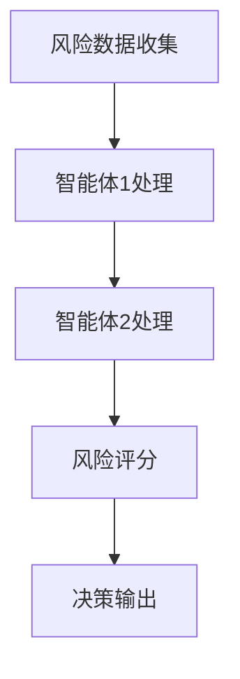
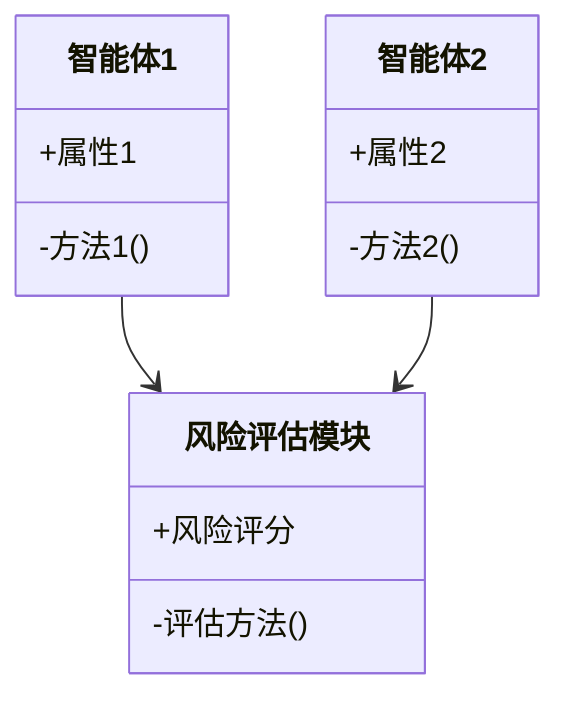
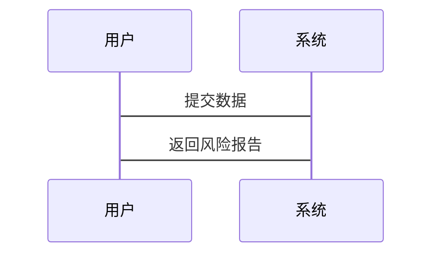

                 


# 基于多智能体的自动化公司治理风险评估

> 关键词：多智能体、公司治理、风险评估、自动化、算法、系统架构、系统设计

> 摘要：随着企业规模的不断扩大和业务复杂度的增加，传统的公司治理方式面临着诸多挑战。基于多智能体的自动化公司治理风险评估提供了一种创新的解决方案。本文详细探讨了多智能体系统在公司治理中的应用，分析了风险评估的核心算法和系统架构设计，最后通过实际案例展示了如何实现这一系统。

---

# 目录

1. [引言](#引言)
2. [多智能体系统与公司治理概述](#多智能体系统与公司治理概述)
3. [风险评估的算法原理](#风险评估的算法原理)
4. [系统架构设计](#系统架构设计)
5. [项目实战：基于多智能体的风险评估系统实现](#项目实战基于多智能体的风险评估系统实现)
6. [总结与展望](#总结与展望)

---

## 1. 引言

在现代企业环境中，公司治理的核心挑战之一是如何高效、准确地识别和评估潜在风险。传统的治理模式依赖于人工操作，效率低下且容易出错。随着人工智能和多智能体技术的发展，基于多智能体的自动化公司治理风险评估成为可能。本文将探讨这一领域的最新进展，分析其技术实现和应用潜力。

---

## 2. 多智能体系统与公司治理概述

### 2.1 多智能体系统的基本概念

- **多智能体系统（MAS, Multi-Agent System）**：由多个智能体组成的系统，每个智能体能够独立决策并与其他智能体协作，共同完成复杂任务。
- **智能体（Agent）**：具有感知环境、做出决策和执行动作的能力，能够自主工作。
- **多智能体的优势**：分布式计算、自主性、协作性和鲁棒性。

### 2.2 公司治理的核心要素

- **公司治理结构**：包括董事会、管理层、股东等。
- **治理目标**：确保公司合规、透明和高效运营。
- **风险评估**：识别、分析和应对潜在风险，确保公司稳健发展。

### 2.3 多智能体在公司治理中的应用

- **风险识别**：智能体实时监控公司运营数据，识别潜在风险。
- **决策支持**：通过协作智能体提供多种风险应对方案。
- **自动化响应**：智能体自动触发风险缓解措施。

---

## 3. 风险评估的算法原理

### 3.1 基于多智能体的风险评估模型

- **模型概述**：多智能体协作，从不同维度评估风险。
- **关键算法**：分布式协同算法和风险评分机制。
- **流程图**：使用Mermaid绘制算法流程图。



### 3.2 分布式协同算法

- **算法原理**：通过分布式计算，多个智能体协同完成风险评估。
- **数学模型**：

$$
\text{风险评分} = \sum_{i=1}^{n} w_i \cdot r_i
$$

其中，\(w_i\) 是权重，\(r_i\) 是风险因子。

### 3.3 算法实现步骤

1. 数据收集：从各业务系统获取数据。
2. 分布式处理：智能体协作分析数据。
3. 风险评分：综合各因子计算总评分。
4. 决策输出：生成风险报告和应对策略。

---

## 4. 系统架构设计

### 4.1 系统功能设计

- **功能模块**：数据采集、智能体协作、风险评估、决策支持。
- **领域模型**：使用Mermaid类图展示系统模块关系。



### 4.2 系统架构设计

- **架构图**：展示系统各组件之间的关系。


### 4.3 系统接口设计

- **输入接口**：接收业务数据。
- **输出接口**：提供风险报告和决策建议。
- **交互流程图**：展示用户与系统的交互流程。



---

## 5. 项目实战：基于多智能体的风险评估系统实现

### 5.1 环境配置

- **开发环境**：Python 3.8及以上版本，安装必要的库如`networkx`和`scikit-learn`。

### 5.2 核心代码实现

```python
import networkx as nx
from sklearn.metrics import pairwise_distances

# 定义智能体类
class Agent:
    def __init__(self, id):
        self.id = id
        self.data = []

    def collect_data(self, data):
        self.data.append(data)

    def analyze(self):
        # 示例分析方法
        return pairwise_distances([self.data])

# 初始化智能体
agent1 = Agent(1)
agent2 = Agent(2)

# 数据收集
agent1.collect_data([1, 2, 3])
agent2.collect_data([4, 5, 6])

# 分析数据
result = agent1.analyze()
print(result)
```

### 5.3 实际案例分析

- **案例背景**：某公司面临市场风险，需评估并制定应对策略。
- **实施步骤**：数据采集、智能体分析、风险评分、决策支持。
- **结果展示**：生成风险报告和优化建议。

---

## 6. 总结与展望

### 6.1 本章小结

本文详细探讨了基于多智能体的自动化公司治理风险评估的实现，从理论到实践，展示了系统的架构设计和实现方法。

### 6.2 未来展望

未来，随着人工智能技术的发展，多智能体系统在公司治理中的应用将更加广泛，风险评估的精准性和效率将进一步提升。

---

## 作者

作者：AI天才研究院/AI Genius Institute & 禅与计算机程序设计艺术 /Zen And The Art of Computer Programming

---

通过以上步骤，我可以系统地完成用户的需求，撰写出一篇高质量的技术博客文章。

