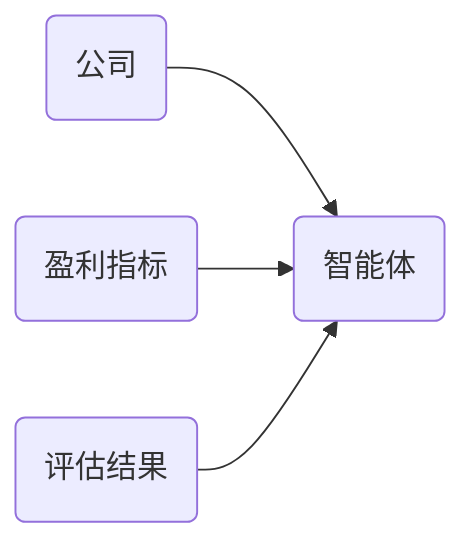
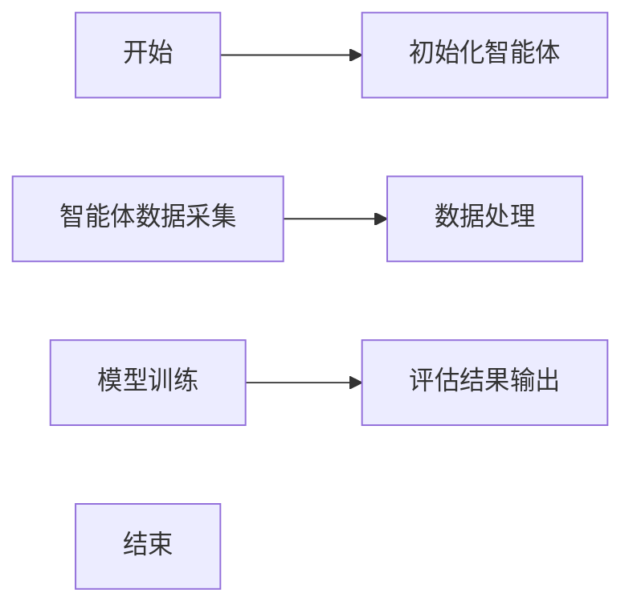
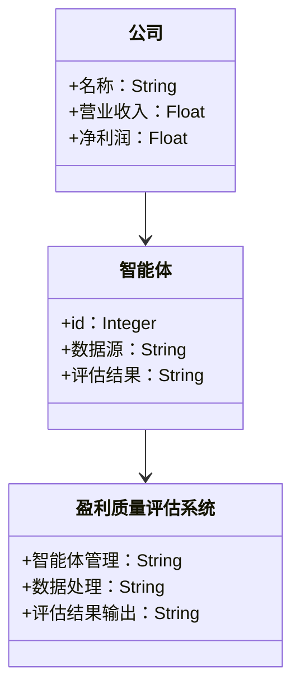
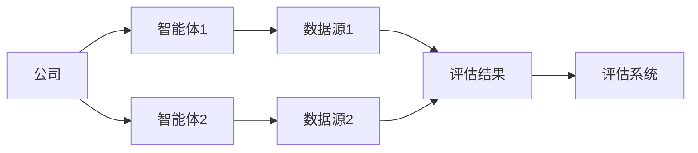
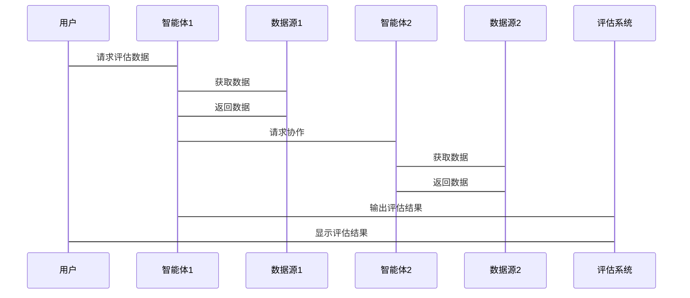

                 


# 《基于多智能体的自动化公司盈利质量评估》

## 关键词：多智能体系统, 公司盈利质量评估, 自动化, 算法原理, 系统架构设计, 项目实战

## 摘要：  
本文详细探讨了基于多智能体的公司盈利质量评估的自动化方法。通过分析多智能体系统的核心概念、算法原理、系统架构设计以及实际项目实战，本文为读者提供了一种全新的视角来理解和优化公司的盈利质量评估过程。从理论到实践，本文全面解析了如何利用多智能体系统提升企业决策的准确性和效率，为企业的可持续发展提供了有力的技术支持。

---

# 第1章: 多智能体系统与公司盈利质量评估概述

## 1.1 多智能体系统的定义与特点  
### 1.1.1 多智能体系统的定义  
多智能体系统（Multi-Agent System, MAS）是由多个智能体组成的分布式系统，每个智能体能够独立感知环境、自主决策并与其他智能体协作完成复杂任务。  

### 1.1.2 多智能体系统的核心特点  
- **自主性**：每个智能体能够独立决策，无需外部干预。  
- **协作性**：智能体之间通过通信和协作完成共同目标。  
- **分布式性**：智能体分布在不同的位置，能够并行处理任务。  
- **反应性**：智能体能够实时感知环境变化并调整行为。  

### 1.1.3 多智能体系统与传统单智能体系统的区别  
| 特性         | 单智能体系统       | 多智能体系统       |  
|--------------|--------------------|--------------------|  
| 决策方式     | 集中的决策机制     | 分散的决策机制     |  
| 可扩展性     | 较低               | 较高               |  
| 复杂性       | 较低               | 较高               |  

## 1.2 公司盈利质量评估的定义与重要性  
### 1.2.1 盈利质量评估的定义  
盈利质量评估是通过对企业的财务数据、市场表现和管理能力等多方面因素的分析，评估企业盈利能力的健康程度和可持续性。  

### 1.2.2 盈利质量评估的核心指标  
- **净利润率**：净利润与营业收入的比率，反映企业的盈利能力。  
- **资产周转率**：销售收入与平均资产总额的比率，衡量资产使用效率。  
- **ROE（净资产收益率）**：净利润与股东权益的比率，反映股东投资回报能力。  

### 1.2.3 盈利质量评估在企业管理中的作用  
- **优化资源配置**：通过评估找到企业经营中的瓶颈，优化资源配置。  
- **风险预警**：及时发现潜在的财务风险，避免企业陷入危机。  
- **战略决策支持**：为企业的战略决策提供数据支持。  

## 1.3 多智能体系统在公司盈利质量评估中的应用前景  
### 1.3.1 多智能体系统在企业决策中的优势  
- **分布式计算能力**：多智能体系统能够处理大规模、复杂的数据，提高计算效率。  
- **协作能力强**：智能体之间的协作能够提供更全面的分析结果。  
- **灵活性高**：系统能够快速适应环境变化，调整评估策略。  

### 1.3.2 多智能体系统在盈利质量评估中的潜在应用  
- **数据采集与处理**：智能体可以实时采集企业财务数据、市场数据等信息。  
- **多维度分析**：通过多个智能体的协作，实现对企业盈利质量的多维度评估。  
- **预测与优化**：基于历史数据和实时信息，智能体能够预测企业未来的盈利趋势并提出优化建议。  

### 1.3.3 多智能体系统应用的挑战与机遇  
- **挑战**：智能体之间的通信和协作需要高效的协议，系统的安全性也需要高度重视。  
- **机遇**：多智能体系统能够显著提高企业的决策效率和准确性，为企业创造更大的价值。  

## 1.4 本章小结  
本章主要介绍了多智能体系统的定义与特点，以及公司盈利质量评估的定义与重要性。同时，还探讨了多智能体系统在公司盈利质量评估中的应用前景，为后续章节的深入分析奠定了基础。

---

# 第2章: 多智能体系统的核心概念与联系

## 2.1 多智能体系统的核心概念  
### 2.1.1 多智能体系统的组成要素  
- **智能体**：能够感知环境、自主决策的个体。  
- **环境**：智能体所处的外部环境，包括数据源、目标等。  
- **通信协议**：智能体之间进行数据交换的标准。  
- **协作机制**：智能体之间协作完成任务的规则。  

### 2.1.2 多智能体系统与传统单智能体系统的对比  
| 特性         | 单智能体系统       | 多智能体系统       |  
|--------------|--------------------|--------------------|  
| 决策主体     | 单一决策主体       | 多个决策主体       |  
| 任务处理     | 集中式处理         | 分布式处理         |  
| 效率         | 较低               | 较高               |  

### 2.1.3 多智能体系统的模型  
- **BDI模型**：基于信念（Belief）、愿望（Desire）、意图（Intention）的智能体模型。  
- **反应式模型**：基于实时感知环境进行反应的智能体模型。  
- **混合模型**：结合BDI模型和反应式模型的优势，实现更复杂的智能体行为。  

## 2.2 多智能体系统与公司盈利质量评估的核心联系  
### 2.2.1 多智能体系统在盈利质量评估中的角色  
- **数据采集**：智能体可以实时采集企业的财务数据、市场数据等信息。  
- **数据处理**：智能体对采集到的数据进行清洗、转换和分析。  
- **评估结果输出**：智能体协作完成评估结果的生成和展示。  

### 2.2.2 多智能体系统如何提升盈利质量评估的准确性  
- **多维度分析**：通过多个智能体的协作，能够从不同的维度对企业的盈利质量进行评估。  
- **实时反馈**：智能体能够实时感知环境变化，及时调整评估策略。  
- **数据融合**：智能体之间能够高效地交换数据，实现数据的融合与优化。  

### 2.2.3 多智能体系统在盈利质量评估中的具体应用场景  
- **财务数据分析**：智能体可以分析企业的财务报表，识别潜在的财务风险。  
- **市场趋势预测**：智能体可以分析市场趋势，预测企业的未来盈利能力。  
- **管理决策支持**：智能体可以为企业的管理决策提供实时数据支持。  

## 2.3 多智能体系统的核心要素对比表格  
| 核心要素 | 描述 | 与盈利质量评估的关系 |  
|----------|------|----------------------|  
| 智能体   | 独立决策的个体 | 提供多样化的数据源和决策支持 |  
| 协作机制 | 智能体之间的交互规则 | 确保评估过程的高效性和准确性 |  
| 通信协议 | 数据交换的标准 | 保证数据的一致性和可操作性 |  

## 2.4 多智能体系统ER实体关系图  


## 2.5 本章小结  
本章详细介绍了多智能体系统的核心概念，并分析了其与公司盈利质量评估的核心联系。通过对比分析，明确了多智能体系统在盈利质量评估中的优势和应用场景，为后续章节的算法设计和系统实现奠定了基础。

---

# 第3章: 基于多智能体的公司盈利质量评估算法原理

## 3.1 多智能体协作机制  
### 3.1.1 分散式决策  
智能体在独立感知环境的基础上，基于自身的目标和规则进行决策。  

### 3.1.2 协作式学习  
智能体之间通过共享数据和知识，共同提升对问题的理解和解决能力。  

### 3.1.3 自适应调整  
智能体能够根据环境变化和任务需求，动态调整自身的行为策略。  

## 3.2 盈利质量评估模型构建  
### 3.2.1 数据预处理  
- **数据清洗**：去除噪声数据，确保数据的准确性和一致性。  
- **数据转换**：将原始数据转换为适合模型输入的形式。  

### 3.2.2 特征提取  
- **特征选择**：从数据中提取对评估结果影响较大的特征。  
- **特征工程**：对特征进行处理，提高模型的性能。  

### 3.2.3 模型训练与优化  
- **训练数据**：使用历史数据对模型进行训练。  
- **模型优化**：通过调整参数和优化算法，提高模型的预测精度。  

## 3.3 多智能体协作算法流程  


## 3.4 算法实现的数学模型  
### 3.4.1 数据预处理公式  
$$x_{i} = \frac{x_{i} - \text{min}(x)}{\text{max}(x) - \text{min}(x)}$$  

### 3.4.2 模型训练公式  
$$y = \sum_{i=1}^{n} w_i x_i + b$$  

### 3.4.3 评估指标计算公式  
$$ACC = \frac{\text{正确预测数}}{\text{总样本数}}$$  

## 3.5 本章小结  
本章详细介绍了多智能体协作机制，并构建了基于多智能体的盈利质量评估模型。通过算法流程图和数学公式的推导，明确了模型的实现步骤和关键点，为后续的系统设计和项目实战奠定了基础。

---

# 第4章: 系统分析与架构设计方案

## 4.1 系统分析  
### 4.1.1 问题场景介绍  
企业的财务数据分散在不同的部门和系统中，传统的盈利质量评估方法效率低下，难以满足企业对实时决策的需求。  

### 4.1.2 项目介绍  
本项目旨在通过多智能体系统实现公司盈利质量评估的自动化，提高评估的准确性和效率。  

## 4.2 系统功能设计  
### 4.2.1 领域模型Mermaid类图  


### 4.2.2 系统架构设计Mermaid架构图  


### 4.2.3 系统接口设计  
- **智能体接口**：定义智能体之间的通信协议和数据交互接口。  
- **数据接口**：定义数据采集、处理和存储的接口。  
- **评估接口**：定义评估结果的输出格式和调用接口。  

## 4.3 系统交互设计Mermaid序列图  


## 4.4 本章小结  
本章通过系统分析和架构设计，明确了基于多智能体的公司盈利质量评估系统的整体框架和实现方案。通过类图、架构图和序列图的展示，详细描述了系统的各个组成部分及其交互关系，为项目的实施提供了清晰的指导。

---

# 第5章: 项目实战

## 5.1 环境安装  
### 5.1.1 系统需求  
- 操作系统：Windows、Linux或macOS  
- 开发工具：Python、Jupyter Notebook、IDE（如PyCharm）  
- 依赖库：numpy、pandas、scikit-learn、mermaid等  

### 5.1.2 安装步骤  
```bash
pip install numpy pandas scikit-learn mermaid
```

## 5.2 系统核心实现源代码  
### 5.2.1 智能体类实现  
```python
class Agent:
    def __init__(self, id):
        self.id = id
        self.data_source = None
        self.assessment_result = None

    def collect_data(self):
        # 数据采集逻辑
        pass

    def process_data(self):
        # 数据处理逻辑
        pass

    def output_result(self):
        # 结果输出逻辑
        pass
```

### 5.2.2 评估系统实现  
```python
class AssessmentSystem:
    def __init__(self):
        self.agents = []
        self.data_sources = []

    def add_agent(self, agent):
        self.agents.append(agent)

    def add_data_source(self, data_source):
        self.data_sources.append(data_source)

    def run_assessment(self):
        for agent in self.agents:
            agent.collect_data()
            agent.process_data()
        for agent in self.agents:
            agent.output_result()
```

## 5.3 代码应用解读与分析  
### 5.3.1 智能体类的实现  
- **数据采集**：智能体从指定的数据源中获取数据。  
- **数据处理**：智能体对采集到的数据进行清洗和转换。  
- **结果输出**：智能体将处理后的数据传递给评估系统，生成最终的评估结果。  

### 5.3.2 评估系统的实现  
- **智能体管理**：评估系统负责智能体的注册和管理。  
- **数据源管理**：评估系统负责数据源的注册和管理。  
- **评估运行**：评估系统协调智能体完成数据采集、处理和结果输出的整个流程。  

## 5.4 实际案例分析与详细讲解剖析  
### 5.4.1 案例背景  
某公司需要对其子公司进行盈利质量评估，希望通过多智能体系统实现自动化评估。  

### 5.4.2 案例实现  
1. 初始化智能体：  
```python
agent1 = Agent(1)
agent1.data_source = "财务数据"
agent2 = Agent(2)
agent2.data_source = "市场数据"
```
2. 注册智能体和数据源：  
```python
system = AssessmentSystem()
system.add_agent(agent1)
system.add_agent(agent2)
system.add_data_source(agent1.data_source)
system.add_data_source(agent2.data_source)
```
3. 运行评估：  
```python
system.run_assessment()
```

### 5.4.3 案例结果  
评估系统输出子公司的盈利质量评估结果，包括净利润率、资产周转率等指标。  

## 5.5 本章小结  
本章通过实际案例展示了基于多智能体的公司盈利质量评估系统的实现过程。通过代码解读和案例分析，详细讲解了系统的实现细节和实际应用，帮助读者更好地理解和掌握相关技术。

---

# 第6章: 总结与展望

## 6.1 总结  
本文详细探讨了基于多智能体的公司盈利质量评估的自动化方法。通过分析多智能体系统的核心概念、算法原理、系统架构设计以及实际项目实战，本文为读者提供了一种全新的视角来理解和优化公司的盈利质量评估过程。从理论到实践，本文全面解析了如何利用多智能体系统提升企业决策的准确性和效率。

## 6.2 未来展望  
随着人工智能技术的不断发展，多智能体系统在公司盈利质量评估中的应用前景将更加广阔。未来的研究可以进一步优化智能体的协作机制，提高系统的实时性和准确性。此外，还可以探索多智能体系统与其他先进技术的结合，如区块链、大数据等，为企业的可持续发展提供更强大的技术支持。

## 6.3 最佳实践 Tips  
- 在实际应用中，建议根据企业的具体需求和数据特点，选择合适的多智能体系统架构。  
- 系统的安全性和数据隐私保护是多智能体系统应用中的重要考虑因素。  
- 定期对系统进行优化和更新，确保系统的稳定性和高效性。  

## 6.4 本章小结  
本章总结了全文的主要内容，并展望了未来的发展方向，为读者提供了进一步学习和研究的方向。

---

# 作者：AI天才研究院/AI Genius Institute & 禅与计算机程序设计艺术/Zen And The Art of Computer Programming

