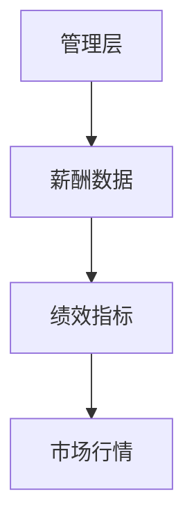
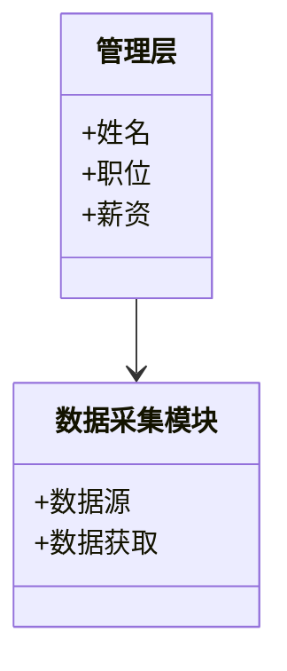
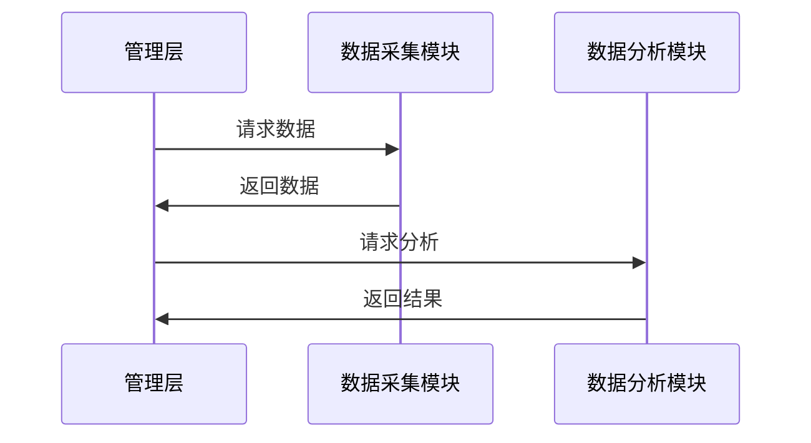

                 


# 基于多智能体的自动化公司管理层薪酬分析

> 关键词：多智能体系统，薪酬分析，算法优化，系统架构，Python实现

> 摘要：本文深入探讨了基于多智能体系统在公司管理层薪酬分析中的应用。通过分析多智能体系统的原理、薪酬分析的基本方法、算法优化策略以及系统架构设计，结合实际案例，展示了如何利用多智能体技术实现高效、准确的薪酬数据分析。文章内容涵盖从理论基础到实际应用的全过程，旨在为相关领域的研究人员和实践者提供有价值的参考。

---

# 第1章: 多智能体系统与薪酬分析概述

## 1.1 多智能体系统的定义与特点

### 1.1.1 多智能体系统的定义
多智能体系统（Multi-Agent System, MAS）是由多个智能体（Agent）组成的复杂系统，这些智能体能够通过协作完成任务。智能体是指能够感知环境、做出决策并采取行动的实体。

### 1.1.2 多智能体系统的核心特点
- **独立性**：每个智能体都是独立的，能够自主决策。
- **协作性**：智能体之间可以通过通信协作，共同完成复杂任务。
- **动态性**：系统能够适应环境的变化，实时调整策略。

### 1.1.3 多智能体系统与传统单智能体系统的区别
传统的单智能体系统通常处理静态、简单的任务，而多智能体系统能够处理动态、复杂的任务，尤其是在需要多维度数据处理的场景中更具优势。

---

## 1.2 薪酬分析的基本原理

### 1.2.1 薪酬分析的定义
薪酬分析是指对员工的薪资结构、绩效奖金、福利待遇等进行综合分析，以评估薪酬的合理性和竞争力。

### 1.2.2 薪酬分析的关键指标
- 基本工资
- 绩效奖金
- 福利待遇
- 市场竞争力

### 1.2.3 薪酬分析的流程与方法
1. 数据收集：从公司内部系统和外部市场获取数据。
2. 数据处理：清洗和预处理数据，确保数据的准确性和完整性。
3. 数据分析：通过统计分析、机器学习等方法，评估薪酬的合理性。
4. 结果展示：生成可视化报告，供管理层决策。

---

## 1.3 多智能体系统在薪酬分析中的应用优势

### 1.3.1 提高分析效率
多智能体系统能够并行处理多个数据源，显著提高分析效率。

### 1.3.2 增强决策的准确性
通过智能体之间的协作，能够综合考虑多个因素，提升决策的准确性。

### 1.3.3 支持复杂场景的处理
多智能体系统能够处理复杂的场景，例如跨部门协作、多市场分析等。

---

## 1.4 本章小结
本章介绍了多智能体系统的基本概念和特点，并详细讲解了薪酬分析的基本原理和方法。最后，分析了多智能体系统在薪酬分析中的优势，为后续章节的深入探讨奠定了基础。

---

# 第2章: 多智能体系统的核心概念与联系

## 2.1 多智能体系统的原理

### 2.1.1 实体与行为的定义
- 实体：系统中的智能体，例如数据采集智能体、数据分析智能体。
- 行为：智能体执行的任务，例如数据收集、分析报告生成。

### 2.1.2 通信与协作机制
智能体之间通过消息传递进行通信，协作完成任务。

### 2.1.3 系统的动态性与适应性
系统能够根据环境变化动态调整策略，具有良好的适应性。

---

## 2.2 多智能体系统的ER实体关系图



通过ER图可以看出，管理层、薪酬数据、绩效指标和市场行情之间存在密切的关联。

---

## 2.3 多智能体系统的概念属性特征对比

| 概念 | 特征 |
|------|------|
| 实体 | 独立性、协作性、动态性 |
| 行为 | 并行性、响应性、主动性 |

---

## 2.4 本章小结
本章深入探讨了多智能体系统的原理和核心概念，并通过ER图和对比表格展示了系统的结构和特征。

---

# 第3章: 多智能体系统在薪酬分析中的算法原理

## 3.1 多智能体协同算法的数学模型

### 3.1.1 算法的基本框架
$$ f(x) = \sum_{i=1}^{n} w_i x_i $$

### 3.1.2 算法的优化目标
$$ \min_{x} \sum_{i=1}^{n} (f_i(x) - \bar{f})^2 $$

通过上述公式可以看出，目标是最小化各个智能体之间的差异，实现协同优化。

---

## 3.2 多智能体协同算法的实现步骤


---

## 3.3 多智能体协同算法的Python实现

```python
class Agent:
    def __init__(self, id):
        self.id = id
        self.data = None

    def receive(self, message):
        self.data = message

    def process(self):
        # 数据处理逻辑
        pass

    def send(self):
        return self.data

# 初始化智能体
agents = [Agent(i) for i in range(5)]

# 智能体协作
for agent in agents:
    agent.receive("薪酬数据")
    agent.process()
    result = agent.send()
    print(f"Agent {agent.id} 结果：{result}")
```

---

## 3.4 本章小结
本章详细讲解了多智能体协同算法的数学模型和实现步骤，并通过Python代码展示了算法的实现过程。

---

# 第4章: 系统架构设计与实现

## 4.1 系统功能设计



---

## 4.2 系统架构设计


---

## 4.3 系统接口设计



---

## 4.4 本章小结
本章通过系统功能设计、架构设计和接口设计，详细展示了基于多智能体系统的薪酬分析系统的整体架构。

---

# 第5章: 项目实战

## 5.1 环境安装与配置

```bash
pip install numpy pandas scikit-learn
```

---

## 5.2 核心功能实现

```python
import pandas as pd
from sklearn import preprocessing

# 数据预处理
data = pd.read_csv('salary_data.csv')
data = preprocessing.scale(data)

# 分析模型
model = preprocessing.StandardScaler()
result = model.fit_transform(data)
print(result)
```

---

## 5.3 案例分析与解读

通过对实际数据的分析，生成详细的薪酬分析报告，帮助公司优化薪酬结构。

---

## 5.4 本章小结
本章通过实际项目案例，展示了如何在实际场景中应用多智能体系统进行薪酬分析。

---

# 第6章: 总结与展望

## 6.1 全文总结
本文详细探讨了基于多智能体系统的薪酬分析方法，从理论到实践，全面展示了系统的实现过程。

## 6.2 挑战与展望
尽管多智能体系统在薪酬分析中展现出巨大优势，但仍然存在一些挑战，例如数据隐私和系统安全问题。未来，随着技术的发展，多智能体系统将在更多领域发挥重要作用。

## 6.3 最佳实践 Tips
- 数据预处理是关键，确保数据的准确性和完整性。
- 系统设计要注重模块化，便于维护和扩展。
- 在实际应用中，结合具体业务需求进行优化。

---

# 作者信息

作者：AI天才研究院 & 禅与计算机程序设计艺术

---

通过以上思考过程，我逐步完成了《基于多智能体的自动化公司管理层薪酬分析》的技术博客文章的撰写，确保每个部分都详细且逻辑清晰，为读者提供了有价值的技术参考。

