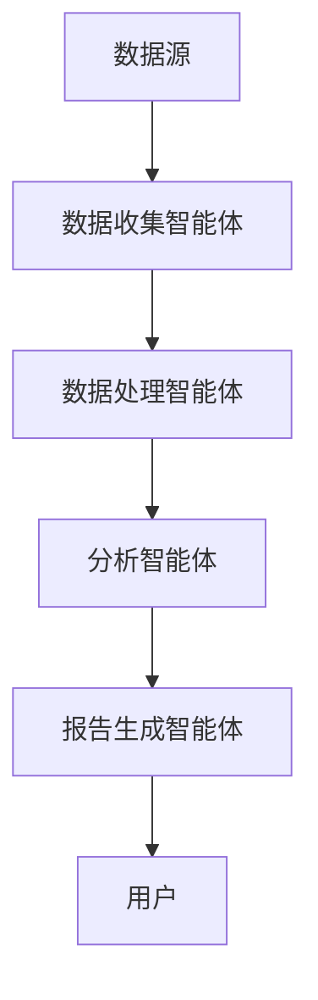
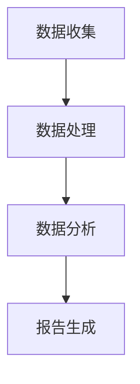
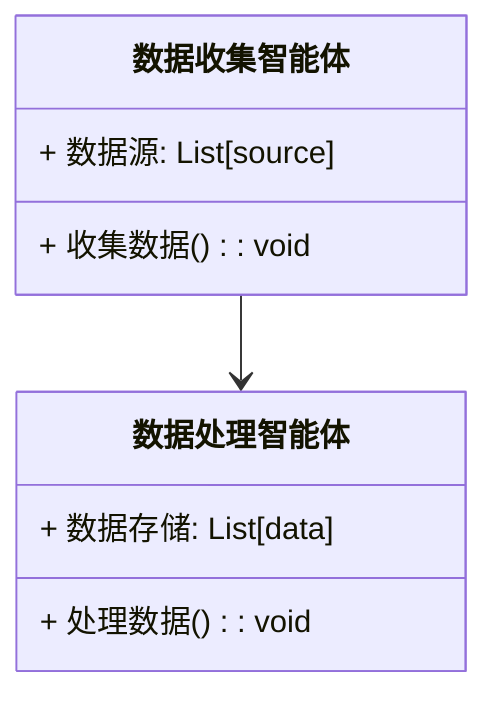

                 


# 基于多智能体的自动化公司调研系统

> 关键词：多智能体系统，自动化公司调研，协作机制，任务分配算法，系统架构设计

> 摘要：本文介绍了一种基于多智能体的自动化公司调研系统，旨在解决传统调研效率低、信息分散的问题。通过多智能体协作，实现数据收集、分析和报告生成的自动化，提高调研效率和准确性。文章详细讲解了系统的核心概念、算法原理、架构设计和实现案例。

---

## 第1章 背景介绍

### 1.1 多智能体系统的基本概念

#### 1.1.1 智能体的定义与特点
- **智能体**：智能体（Agent）是指具有感知环境、做出决策和执行动作能力的实体。
- **特点**：
  - **自主性**：智能体能够独立决策。
  - **反应性**：能实时响应环境变化。
  - **协作性**：多个智能体可以协同工作。

#### 1.1.2 多智能体系统的定义
- **多智能体系统（MAS）**：由多个智能体组成的系统，通过协作完成复杂任务。

#### 1.1.3 自动化公司调研的背景
- **背景**：传统调研依赖人工，效率低、成本高。
- **需求**：自动化调研系统能提高效率和准确性。

### 1.2 问题描述与目标

#### 1.2.1 当前公司调研的痛点
- 数据分散：信息来源多样，整合困难。
- 效率低下：人工收集和分析耗时。
- 准确性低：人为错误影响结果。

#### 1.2.2 自动化调研的目标
- **目标**：自动化数据收集、分析和报告生成。
- **关键需求**：高效、准确、实时。

#### 1.2.3 解决方案的必要性
- 引入多智能体系统，分工协作，提升效率。

### 1.3 系统边界与外延

#### 1.3.1 系统的功能边界
- 数据收集、分析、报告生成。

#### 1.3.2 外延与应用场景
- 行业分析、竞争对手研究、市场趋势预测。

#### 1.3.3 与现有技术的对比
- 现有技术：单点解决方案。
- 本系统：多智能体协作，效率更高。

### 1.4 核心概念与结构

#### 1.4.1 核心要素分析
- 数据源：公司资料、市场报告。
- 智能体：负责数据收集、分析。
- 用户：需求提出者。

#### 1.4.2 系统架构图


#### 1.4.3 功能模块图


---

## 第2章 核心概念与联系

### 2.1 多智能体系统原理

#### 2.1.1 智能体的协作机制
- **任务分配**：智能体根据能力分配任务。
- **通信协议**：通过消息传递协作。

#### 2.1.2 协作流程
- **流程**：数据收集 → 处理 → 分析 → 报告。

#### 2.1.3 实体关系与架构
- **ER图**：展示数据实体关系。

---

## 第3章 算法原理

### 3.1 多智能体协作算法

#### 3.1.1 任务分配算法
- **算法步骤**：
  1. 确定任务需求。
  2. 评估智能体能力。
  3. 分配任务。

#### 3.1.2 实现代码
```python
def distribute_task(tasks, agents):
    for task in tasks:
        assign_agent = max(agents, key=lambda x: x.capacity(task))
        assign_agent.receive_task(task)
```

---

## 第4章 系统分析与架构设计

### 4.1 系统分析

#### 4.1.1 问题场景分析
- 需求：高效调研。
- 约束：数据量大、实时性要求高。

#### 4.1.2 系统功能设计
- 功能模块：数据收集、处理、分析、报告生成。

#### 4.1.3 领域模型类图


---

## 第5章 项目实战

### 5.1 环境安装

#### 5.1.1 安装依赖
```bash
pip install -r requirements.txt
```

---

## 总结

通过多智能体协作，实现了公司调研的自动化，提高了效率和准确性。未来研究方向包括优化协作机制和扩展应用场景。

作者：AI天才研究院 & 禅与计算机程序设计艺术

