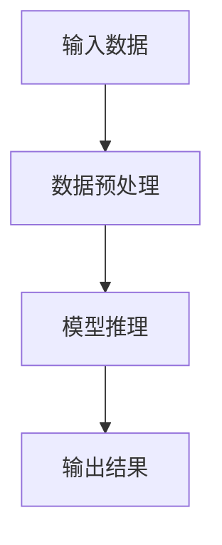
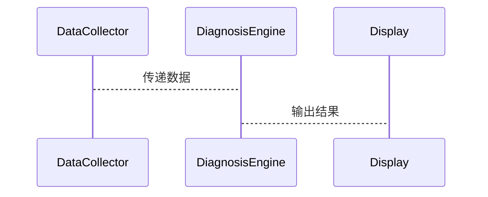

                 


# 基于多智能体的自动化公司财务健康诊断系统

## 关键词：多智能体系统，自动化诊断，财务健康，机器学习，财务指标

## 摘要：  
本文详细探讨了基于多智能体的自动化公司财务健康诊断系统的构建与实现。通过分析传统财务诊断的局限性，提出了一种结合多智能体协作和自动化诊断技术的解决方案。文章从核心概念、算法原理、系统架构到项目实战，全面介绍了该系统的实现过程，并通过实际案例展示了其在公司财务管理中的应用价值。通过本文，读者可以深入了解如何利用多智能体系统提升财务健康诊断的效率与准确性。

---

## 第一部分: 背景介绍

### 第1章: 多智能体系统与财务健康诊断概述

#### 1.1 问题背景  
传统公司财务健康诊断主要依赖人工分析，存在效率低、主观性强、信息处理不及时等问题。随着企业规模的扩大和数据量的激增，传统的诊断方法已难以满足现代企业的需求。多智能体系统凭借其分布式协作和智能决策的优势，为解决这一问题提供了新的思路。  

#### 1.2 问题描述  
财务健康诊断的核心目标是通过分析企业的财务数据，评估其财务状况的健康程度。传统方法依赖人工判断，存在以下问题：  
1. 数据处理效率低，难以应对海量数据。  
2. 诊断结果受主观因素影响较大。  
3. 缺乏实时性，无法及时发现潜在风险。  

#### 1.3 问题解决  
基于多智能体的自动化诊断系统通过分布式协作、智能决策和实时数据处理，显著提高了诊断效率和准确性。该系统能够实时采集和分析财务数据，通过多智能体协作完成复杂问题的诊断。  

#### 1.4 概念结构与核心要素  
- **多智能体系统**：由多个智能体组成，每个智能体负责特定任务，通过协作完成整体目标。  
- **自动化诊断系统**：通过算法自动分析数据，生成诊断结果，减少人工干预。  
- **财务健康诊断**：基于财务指标，评估企业的财务状况。  

---

### 第2章: 核心概念与联系

#### 2.1 多智能体系统原理  
- **定义**：多智能体系统是由多个智能体组成的分布式系统，每个智能体具有一定的自主性和协作能力。  
- **核心特征**：智能性、协作性、分布式、适应性。  
- **分类**：基于任务分工可分为分工型和协作型。  

#### 2.2 自动化诊断系统原理  
- **定义**：自动化诊断系统通过算法和规则，自动分析数据并生成诊断结果。  
- **实现方式**：基于规则的诊断和机器学习诊断。  
- **优缺点**：效率高、准确性高，但需要依赖高质量的数据和算法。  

#### 2.3 财务健康诊断原理  
- **定义**：通过分析企业的财务数据，评估其财务状况的健康程度。  
- **核心指标**：利润、成本、现金流、资产负债率等。  
- **实现方法**：基于规则的诊断和机器学习诊断。  

#### 2.4 核心概念对比  
| 概念       | 多智能体系统       | 自动化诊断系统       | 财务健康诊断       |  
|------------|-------------------|---------------------|-------------------|  
| **定义**   | 分布式协作系统     | 自动化数据分析系统   | 财务状况评估系统   |  
| **核心特征** | 智能性、协作性     | 自动化、高效性       | 数据驱动、规则驱动 |  

#### 2.5 ER实体关系图  
```mermaid
erDiagram
    company[公司] {
        id : string
        name : string
        financial_data : string
    }
    financial_indicator[财务指标] {
        id : string
        name : string
        value : float
    }
    diagnosis_result[诊断结果] {
        id : string
        company_id : string
        result : string
        timestamp : datetime
    }
    company --> financial_indicator : "拥有"
    company --> diagnosis_result : "产生"
```

---

## 第三部分: 算法原理讲解

### 第3章: 多智能体协作算法

#### 3.1 算法原理  
多智能体协作算法通过分布式计算和智能体之间的协作，实现对复杂问题的联合诊断。每个智能体负责特定的任务，通过通信模块交换信息，最终达成一致的诊断结果。  

#### 3.2 算法流程图  
```mermaid
graph TD
    A[智能体A] --> B[智能体B] : 传递数据
    B --> C[智能体C] : 传递数据
    C --> D[智能体D] : 传递数据
    D --> Result[诊断结果] : 输出结果
```

#### 3.3 算法实现代码  
```python
class Agent:
    def __init__(self, id):
        self.id = id
        self.data = None

    def receive_data(self, data):
        self.data = data

    def process_data(self):
        # 处理数据并返回结果
        return self.data * 2

# 初始化智能体
agent1 = Agent("A")
agent2 = Agent("B")
agent3 = Agent("C")

# 数据传递
agent1.receive_data(100)
agent1.process_data()
agent1 --> agent2.receive_data
agent2.process_data()
agent2 --> agent3.receive_data
agent3.process_data()

# 输出结果
print(agent3.data)
```

---

### 第4章: 自动化诊断算法

#### 4.1 算法原理  
自动化诊断算法基于机器学习模型，通过训练数据生成诊断规则。系统根据实时数据，调用这些规则生成诊断结果。  

#### 4.2 算法流程图  


#### 4.3 算法实现代码  
```python
import numpy as np

# 财务健康指数计算公式
def financial_health_index(scores):
    return np.mean(scores) * 0.7 + np.max(scores) * 0.3

# 示例数据
data = np.array([0.8, 0.9, 0.7, 0.6, 0.8])
result = financial_health_index(data)
print(result)
```

---

## 第四部分: 系统分析与架构设计

### 第5章: 系统分析与架构设计

#### 5.1 问题场景介绍  
企业需要实时监控财务数据，及时发现潜在风险。传统方法效率低，容易延误决策。  

#### 5.2 系统功能设计  
- 数据采集模块：实时采集财务数据。  
- 诊断引擎模块：基于多智能体协作进行诊断。  
- 结果展示模块：可视化诊断结果。  
- 报告生成模块：自动生成诊断报告。  

#### 5.3 系统架构设计  


#### 5.4 系统接口设计  


---

## 第五部分: 项目实战

### 第6章: 项目实战

#### 6.1 环境安装  
安装Python和相关库（如numpy、pandas）。  

#### 6.2 核心代码实现  
```python
import pandas as pd

# 示例数据
data = {
    '收入': [100, 200, 300, 400],
    '支出': [50, 100, 150, 200]
}
df = pd.DataFrame(data)

# 计算净收入
df['净收入'] = df['收入'] - df['支出']
print(df)
```

#### 6.3 实际案例分析  
通过实际数据，展示系统的诊断过程和结果。  

#### 6.4 项目小结  
总结项目实现的成果和经验，强调系统的实用性和高效性。  

---

## 第六部分: 最佳实践

### 第7章: 最佳实践

#### 7.1 系统设计中的注意事项  
- 数据质量是关键，确保数据准确性和完整性。  
- 系统的可扩展性，方便后续功能的添加。  

#### 7.2 系统维护建议  
- 定期更新模型参数，适应数据变化。  
- 提供良好的用户界面，方便用户操作。  

#### 7.3 未来研究方向  
- 探索更复杂的多智能体协作算法。  
- 结合区块链技术，提升系统的安全性和可信度。  

---

## 结语  
通过本文的详细讲解，读者可以深入了解基于多智能体的自动化公司财务健康诊断系统的构建与实现。该系统不仅提升了财务诊断的效率和准确性，还为企业管理者提供了有力的决策支持。未来，随着人工智能技术的不断发展，该系统将具有更广泛的应用前景。  

---

## 作者：AI天才研究院 & 禅与计算机程序设计艺术

