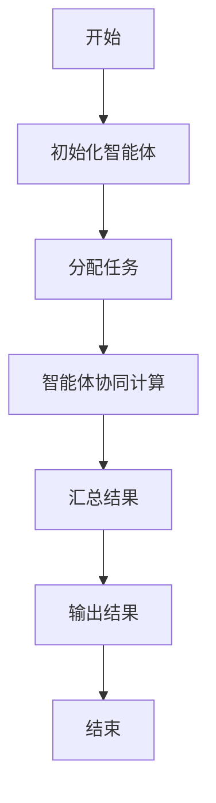
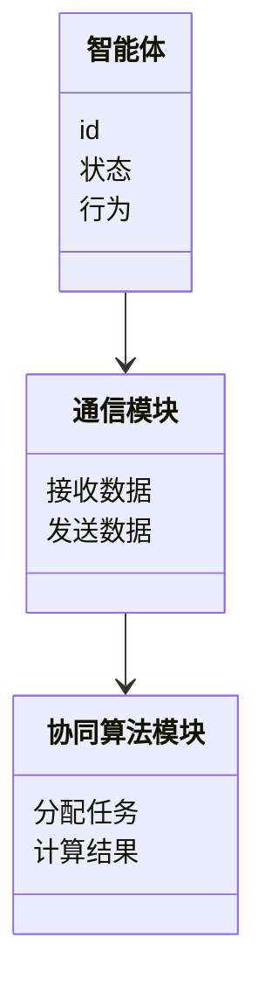
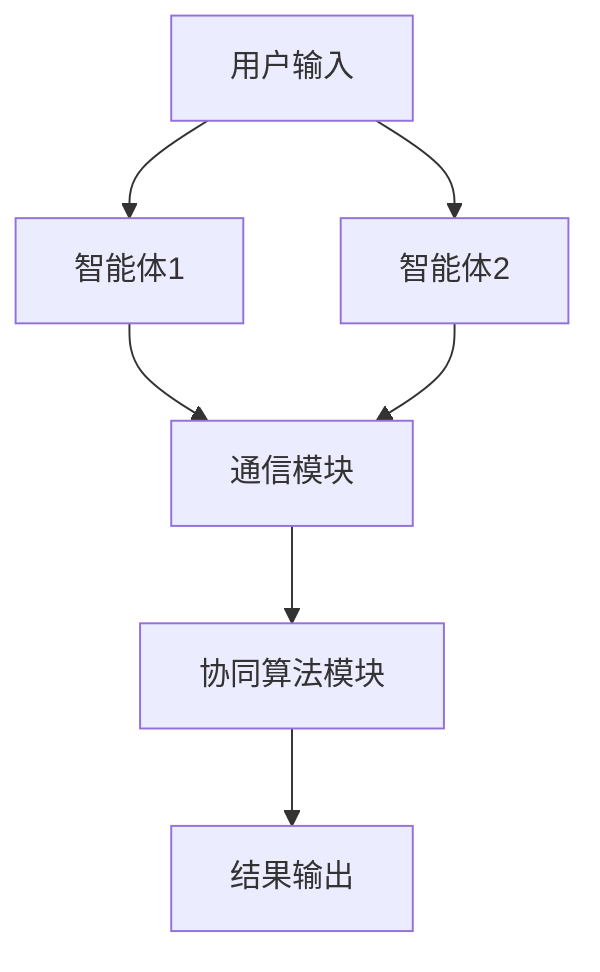

                 


```markdown
# 基于多智能体的自动化公司财务压力测试系统

## 关键词：多智能体系统，财务压力测试，自动化，风险管理，人工智能，协同决策，系统架构

## 摘要：  
本文详细探讨了基于多智能体的自动化公司财务压力测试系统的构建与应用。通过分析财务压力测试的核心需求，结合多智能体系统的协同优势，提出了创新的解决方案。文章从理论到实践，系统性地阐述了多智能体系统的算法原理、系统架构设计、项目实现及实际案例分析，为公司财务管理领域的智能化发展提供了新的思路。

---

## 第一部分：背景与概念

### 第1章：财务压力测试的背景与意义

#### 1.1 什么是财务压力测试
- **定义**：财务压力测试是指在假设极端市场条件下，评估公司财务状况和应对能力的过程。
- **目的**：识别潜在风险，确保公司在不利环境下的稳健运营。
- **分类**：市场风险测试、信用风险测试、流动性风险测试等。

#### 1.2 多智能体系统在财务压力测试中的应用
- **多智能体系统的定义**：由多个独立但协同工作的智能体组成的系统，具备分布式计算和自主决策的特点。
- **优势**：通过模拟复杂市场环境，提供实时、动态的财务压力测试结果。
- **作用**：模拟多种极端情况，优化公司财务策略。

---

### 第2章：多智能体系统的核心概念

#### 2.1 多智能体系统的构成要素
- **智能体**：具有感知环境和自主决策能力的实体。
- **通信机制**：智能体之间的信息传递方式。
- **协同算法**：确保智能体高效协作的核心算法。

#### 2.2 多智能体系统的交互机制
- **通信协议**：定义智能体间的数据交换规则。
- **信息共享**：通过共享数据提高决策的准确性。
- **动态调整**：根据实时数据动态优化系统行为。

---

## 第二部分：算法原理

### 第3章：多智能体系统的协同算法

#### 3.1 分布式计算与多智能体协同
- **分布式计算**：任务分解到多个节点，提高计算效率。
- **协同算法框架**：采用基于消息传递的算法，实现智能体间的协同。

#### 3.2 多智能体系统的通信协议
- **协议设计原则**：确保高效、可靠的数据传输。
- **协议实现**：使用特定的数据结构和接口，实现智能体间的通信。

---

### 第4章：数学模型与公式

#### 4.1 多智能体系统的数学模型
- **损失分布算法**：评估不同市场条件下的损失情况。
- **公式示例**：$$L = \sum_{i=1}^{n} w_i \times l_i$$
  其中，\( L \) 为总损失，\( w_i \) 为权重，\( l_i \) 为单个智能体的损失。

#### 4.2 算法流程图


---

## 第三部分：系统架构设计

### 第5章：系统架构设计

#### 5.1 领域模型设计


#### 5.2 系统架构图


---

## 第四部分：项目实战

### 第6章：环境安装与核心代码实现

#### 6.1 环境安装
- 安装Python和相关库（如numpy、pandas）。
- 配置多智能体通信环境。

#### 6.2 核心代码实现
```python
class Agent:
    def __init__(self, id):
        self.id = id
        self.state = 0

    def receive(self, message):
        # 处理消息并更新状态
        self.state += message.value
        return self.state

    def send(self, message):
        # 发送消息到通信模块
        pass
```

#### 6.3 案例分析
- 模拟极端市场波动，评估公司财务状况。
- 使用协同算法优化压力测试结果。

---

## 第五部分：总结与展望

### 第7章：系统实现与优化

#### 7.1 总结
- 多智能体系统在财务压力测试中的优势。
- 实际应用中的挑战与解决方案。

#### 7.2 未来展望
- 探索更高效的协同算法。
- 结合大数据和机器学习，提升系统性能。

---

## 小结与注意事项

- **最佳实践**：定期更新系统模型，确保其适应市场变化。
- **注意事项**：确保通信模块的高效性，避免数据拥堵。
- **拓展阅读**：深入学习多智能体系统的通信协议和协同算法。

---

## 作者信息

作者：AI天才研究院/AI Genius Institute & 禅与计算机程序设计艺术 /Zen And The Art of Computer Programming
```

