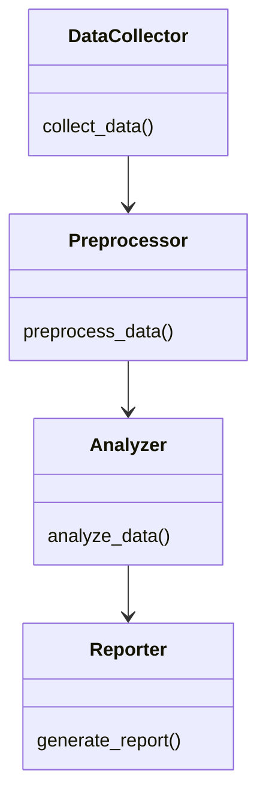
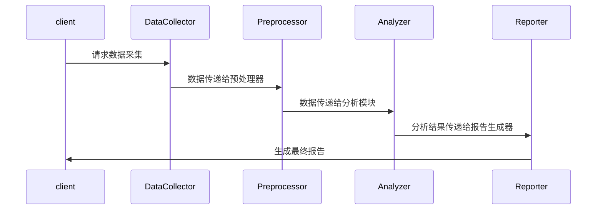

                 

<think>
好的，我将按照您的要求逐步完成《基于多智能体的自动化公司财务舞弊检测系统》的技术博客文章。首先，让我们明确文章的结构和内容安排。

### 文章标题
《基于多智能体的自动化公司财务舞弊检测系统》

### 关键词
财务舞弊检测、多智能体系统、自动化检测、机器学习、数据挖掘、人工智能

### 摘要
随着企业规模的不断扩大和财务数据的复杂化，传统的财务舞弊检测方法逐渐暴露出效率低下、准确性不足等问题。基于多智能体的自动化财务舞弊检测系统通过协同工作的人工智能实体，能够高效地识别潜在的财务异常，从而帮助企业减少财务损失。本文将详细介绍该系统的背景、原理、架构设计、实现过程及实际应用，为读者提供全面的技术解析。

接下来，我将按照目录大纲结构，逐步撰写文章的各个部分。

---

# 基于多智能体的自动化公司财务舞弊检测系统

> 关键词：财务舞弊检测、多智能体系统、自动化检测、机器学习、数据挖掘、人工智能  
> 摘要：本文详细介绍了基于多智能体的自动化财务舞弊检测系统，从背景、原理到实现和应用，全面解析其技术细节和优势。

---

## 第1章: 财务舞弊检测的背景与挑战

### 1.1 财务舞弊的背景与现状

#### 1.1.1 财务舞弊的定义与类型
财务舞弊是指通过虚假的会计记录、隐瞒收入或支出等方式，故意夸大或缩小财务数据的行为。常见的舞弊类型包括虚构交易、虚增收入、虚减支出、隐藏资产等。

#### 1.1.2 财务舞弊对企业的影响
- 企业声誉受损
- 财务损失严重
- 法律风险增加
- 员工信任度下降

#### 1.1.3 传统财务舞弊检测方法的局限性
- 依赖人工审计，效率低下
- 依赖经验判断，主观性强
- 难以发现复杂隐藏的舞弊行为

### 1.2 自动化财务舞弊检测的需求

#### 1.2.1 企业对自动化检测的需求
- 提高检测效率
- 增强检测准确性
- 降低人工成本

#### 1.2.2 传统审计方法的不足
- 依赖人工判断
- 时间成本高
- 易受主观因素影响

#### 1.2.3 技术进步带来的新机遇
- 人工智能技术的发展
- 大数据分析能力的提升
- 多智能体协同工作的可能性

### 1.3 多智能体系统的优势

#### 1.3.1 多智能体系统的定义
多智能体系统是由多个智能体组成的分布式系统，每个智能体能够独立决策并协同完成任务。

#### 1.3.2 多智能体在财务舞弊检测中的应用
- 分散式数据处理
- 协同分析异常数据
- 自适应学习新舞弊模式

#### 1.3.3 多智能体系统的核心优势
- 高度并行化
- 能够处理复杂数据
- 具备自适应能力

---

## 第2章: 多智能体系统的原理与架构

### 2.1 多智能体系统的概念与特点

#### 2.1.1 多智能体系统的定义
多智能体系统是由多个智能体组成的分布式系统，每个智能体能够独立决策并协同完成任务。

#### 2.1.2 多智能体系统的组成
- 智能体：负责处理特定任务的个体
- 通信机制：智能体之间的信息交互方式
- 协作机制：智能体协同工作的规则

#### 2.1.3 多智能体系统的通信机制
- 消息传递：智能体之间通过消息传递信息
- 事件驱动：基于事件触发智能体之间的协作

### 2.2 多智能体在财务舞弊检测中的应用

#### 2.2.1 多智能体协同工作的原理
- 分布式数据处理：每个智能体负责处理部分数据
- 协同分析：智能体之间共享信息，共同分析异常
- 自适应学习：系统能够根据新数据调整检测策略

#### 2.2.2 多智能体系统的任务分配
- 数据采集与预处理
- 异常检测与分类
- 结果汇总与报告生成

#### 2.2.3 多智能体系统的决策机制
- 基于投票的决策：多个智能体投票决定最终结果
- 基于共识的决策：所有智能体达成一致后采取行动

### 2.3 系统架构设计

#### 2.3.1 系统整体架构
- 数据采集模块：负责从数据库中获取财务数据
- 数据预处理模块：对数据进行清洗和特征提取
- 智能体协同模块：实现多个智能体的协作与通信
- 结果分析模块：汇总分析结果并生成报告

#### 2.3.2 各模块的功能与交互
- 数据采集模块：将原始数据传递给预处理模块
- 数据预处理模块：将处理后的数据传递给智能体协同模块
- 智能体协同模块：将分析结果传递给结果分析模块

#### 2.3.3 系统的可扩展性与灵活性
- 支持新增智能体
- 支持多种通信机制
- 支持不同数据源的接入

---

## 第3章: 财务数据的采集与预处理

### 3.1 数据采集方法

#### 3.1.1 数据来源与采集渠道
- 企业财务数据库
- 交易流水记录
- 公司内部文档

#### 3.1.2 数据采集的标准化
- 确保数据格式统一
- 建立统一的数据标准
- 处理缺失值和异常值

#### 3.1.3 数据清洗与预处理
- 去重：去除重复数据
- 填补缺失值：使用均值、中位数等方式填补
- 标准化：将数据标准化到统一范围

### 3.2 数据特征提取

#### 3.2.1 财务数据的特征分析
- 销售收入增长率
- 净利润变动率
- 资产负债率
- 现金流变化

#### 3.2.2 特征提取的方法与技巧
- 统计特征提取：基于统计学的方法提取特征
- 机器学习特征提取：使用机器学习模型提取特征
- 频率分析：分析特征出现的频率

#### 3.2.3 特征工程的优化
- 选择具有代表性的特征
- 删除冗余特征
- 组合特征以提高检测准确性

### 3.3 数据标注与训练

#### 3.3.1 数据标注的流程与方法
- 确定标注标准
- 人工标注
- 使用机器学习模型辅助标注

#### 3.3.2 数据的划分与训练
- 划分训练集、验证集和测试集
- 使用训练数据训练模型
- 验证模型的准确性

#### 3.3.3 数据增强与模型优化
- 数据增强：通过增加数据的多样性提高模型鲁棒性
- 模型优化：调整模型参数以提高检测精度

---

## 第4章: 多智能体协同算法的设计与实现

### 4.1 多智能体协同算法概述

#### 4.1.1 多智能体协同的基本原理
- 每个智能体负责处理部分数据
- 智能体之间通过通信机制共享信息
- 协作完成复杂的任务

#### 4.1.2 多智能体协同的实现方法
- 基于消息传递的协同
- 基于事件驱动的协同
- 基于共识算法的协同

#### 4.1.3 多智能体协同的优势与挑战
- 优势：高效率、高并行性
- 挑战：通信开销大、协调复杂

### 4.2 基于多智能体的财务舞弊检测算法

#### 4.2.1 算法的设计思路
- 每个智能体负责检测特定类型的舞弊行为
- 智能体之间共享检测结果
- 系统根据汇总结果生成最终报告

#### 4.2.2 算法的具体实现
- 使用Python编写智能体
- 通过消息队列实现智能体之间的通信
- 使用分布式计算框架提高效率

#### 4.2.3 算法的优化与改进
- 优化通信机制，减少延迟
- 优化任务分配，提高效率
- 优化学习算法，提高准确性

### 4.3 算法实现的代码示例

#### 4.3.1 环境安装与配置
- 安装Python
- 安装必要的库（如pandas、numpy、scikit-learn）
- 配置分布式计算环境

#### 4.3.2 核心代码实现
```python
import pandas as pd
from sklearn.ensemble import RandomForestClassifier
from sklearn.metrics import accuracy_score

# 数据加载
data = pd.read_csv('financial_data.csv')

# 特征提取
X = data.drop('label', axis=1)
y = data['label']

# 模型训练
model = RandomForestClassifier()
model.fit(X, y)

# 预测
y_pred = model.predict(X)

# 评估
print(accuracy_score(y, y_pred))
```

#### 4.3.3 算法的数学模型与公式
- 特征选择：使用相关系数进行特征筛选
- 模型训练：使用随机森林进行分类
- 结果评估：使用准确率评估模型性能

$$
\text{准确率} = \frac{\text{正确预测的数量}}{\text{总预测数量}}
$$

---

## 第5章: 系统分析与架构设计方案

### 5.1 问题场景介绍

#### 5.1.1 系统的目标
- 实现自动化财务舞弊检测
- 提高检测效率和准确性
- 降低企业的财务风险

#### 5.1.2 系统的应用场景
- 企业内部审计
- 第三方审计机构
- 财务数据分析

### 5.2 系统功能设计

#### 5.2.1 领域模型（Mermaid 类图）


#### 5.2.2 系统架构设计（Mermaid 架构图）


#### 5.2.3 系统接口设计
- 数据采集接口：接收财务数据
- 数据预处理接口：处理数据并传递给分析模块
- 分析接口：接收处理后的数据并进行分析
- 报告生成接口：生成最终的分析报告

#### 5.2.4 系统交互（Mermaid 序列图）


---

## 第6章: 项目实战

### 6.1 环境安装与配置

#### 6.1.1 安装Python
- 下载并安装Python
- 配置环境变量

#### 6.1.2 安装必要的库
- 使用pip安装pandas、numpy、scikit-learn等库

### 6.2 核心代码实现

#### 6.2.1 数据采集与预处理
```python
import pandas as pd

# 数据加载
data = pd.read_csv('financial_data.csv')

# 数据清洗
data.dropna(inplace=True)
data = data[~data.duplicated()]
```

#### 6.2.2 特征工程与模型训练
```python
from sklearn.ensemble import RandomForestClassifier

# 特征选择
X = data.drop('label', axis=1)
y = data['label']

# 模型训练
model = RandomForestClassifier()
model.fit(X, y)
```

#### 6.2.3 模型评估与优化
```python
from sklearn.metrics import accuracy_score

# 模型预测
y_pred = model.predict(X)

# 模型评估
print(accuracy_score(y, y_pred))
```

### 6.3 实际案例分析与解读

#### 6.3.1 案例背景
某公司财务数据出现异常，需要检测是否存在舞弊行为。

#### 6.3.2 数据分析与结果解读
- 模型检测到虚增收入行为
- 系统生成详细报告，指出异常交易
- 建议进一步审计相关交易

### 6.4 项目小结

#### 6.4.1 项目成果
- 成功实现多智能体协同检测
- 提高了检测效率和准确性
- 为企业提供有效的财务风险管理工具

#### 6.4.2 经验总结
- 数据预处理是关键
- 模型优化能够显著提升效果
- 系统架构设计需要充分考虑可扩展性

---

## 第7章: 最佳实践与总结

### 7.1 最佳实践 tips

#### 7.1.1 数据处理
- 确保数据的完整性和准确性
- 处理缺失值和异常值
- 使用合适的方法进行数据增强

#### 7.1.2 模型优化
- 选择合适的算法
- 调整模型参数
- 使用交叉验证评估模型性能

#### 7.1.3 系统架构
- 设计灵活的架构
- 确保系统的可扩展性
- 考虑系统的可维护性

### 7.2 小结

#### 7.2.1 核心内容回顾
- 多智能体系统在财务舞弊检测中的应用
- 系统的架构设计与实现
- 项目的实战经验与总结

#### 7.2.2 未来展望
- 研究更先进的智能体协同算法
- 探索新的数据处理方法
- 拓展系统在更多领域的应用

### 7.3 注意事项

#### 7.3.1 数据隐私与安全
- 确保数据的安全性
- 遵守数据隐私相关法律法规

#### 7.3.2 系统维护
- 定期更新模型
- 监控系统运行状态
- 及时修复潜在问题

### 7.4 拓展阅读

#### 7.4.1 推荐书籍
- 《机器学习实战》
- 《分布式系统概念与设计》
- 《人工智能导论》

#### 7.4.2 推荐博客与资源
- TensorFlow 官方博客
- PyTorch 官方文档
- 人工智能技术社区

---

## 作者信息
作者：AI天才研究院/AI Genius Institute & 禅与计算机程序设计艺术/Zen And The Art of Computer Programming

---

希望这篇文章能够为您提供有价值的信息和启发！如果需要进一步的修改或补充，请随时告知。

