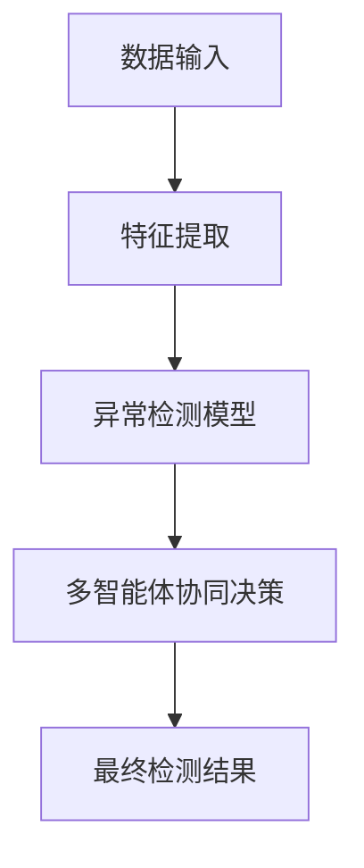
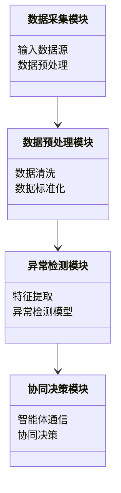

                 


# 基于多智能体的自动化公司财务造假检测系统

> 关键词：多智能体，财务造假检测，自动化检测系统，异常检测，协同检测

> 摘要：本文提出了一种基于多智能体的自动化公司财务造假检测系统，通过分析财务数据中的异常模式，利用多智能体协同工作的优势，实现对财务造假行为的高效识别和预警。本文详细探讨了系统的设计原理、算法实现、系统架构以及实际应用场景，为企业的财务风险管理提供了新的技术思路。

---

## 第一部分: 财务造假检测的背景与问题背景

### 第1章: 财务造假的现状与挑战

#### 1.1 财务造假的定义与表现形式
财务造假是指企业在财务报表或其他财务资料中，通过虚构、篡改或隐瞒事实，以达到误导利益相关者的目的。常见的财务造假形式包括虚增收入、隐瞒债务、虚减成本等。

#### 1.2 财务造假对企业和社会的危害
- **对企业**：财务造假会损害企业的信用，导致投资者和合作伙伴的流失，甚至引发法律风险。
- **对社会**：财务造假会破坏市场秩序，影响经济健康发展，损害公众利益。

#### 1.3 传统财务造假检测方法的局限性
传统的财务造假检测方法主要依赖人工审查和简单的财务指标分析，存在以下问题：
- **效率低**：人工审查耗时长，成本高。
- **准确性差**：依赖经验判断，容易受到主观因素影响。
- **覆盖面有限**：难以发现复杂、隐蔽的造假行为。

### 第2章: 多智能体技术的引入

#### 2.1 多智能体系统的基本原理
多智能体系统（Multi-Agent System, MAS）是由多个智能体（Agent）组成的分布式系统，智能体能够通过通信和协作完成复杂的任务。多智能体系统具有以下特点：
- **分布性**：多个智能体独立运行，协同完成任务。
- **智能性**：每个智能体具有一定的感知和决策能力。
- **协作性**：智能体之间可以通过通信和协作提高整体效率。

#### 2.2 多智能体技术在财务检测中的优势
- **高效性**：多智能体可以并行处理大量数据，提高检测效率。
- **准确性**：通过多个智能体的协同工作，可以降低误判率。
- **适应性**：智能体可以根据数据变化动态调整检测策略。

#### 2.3 自动化检测系统的需求与目标
自动化财务造假检测系统的目标是通过多智能体协同工作，实现对财务数据的实时监控和异常检测，帮助企业在第一时间发现和预警财务造假行为。

---

## 第二部分: 多智能体与财务造假检测的核心概念

### 第3章: 多智能体与财务检测的核心概念

#### 3.1 多智能体协同检测的基本流程
多智能体协同检测的基本流程包括以下几个步骤：
1. **数据采集**：从企业财务系统中获取相关数据。
2. **数据预处理**：对数据进行清洗和标准化处理。
3. **异常检测**：通过多个智能体的协同工作，识别数据中的异常模式。
4. **协同决策**：智能体之间通过通信和协作，形成最终的检测结果。

#### 3.2 多智能体协同检测的算法原理
- **分布式计算**：通过分布式计算技术，提高数据处理效率。
- **协同学习**：多个智能体共享知识和经验，提高检测准确性。
- **动态调整**：根据数据变化，动态调整检测策略。

#### 3.3 本章小结
本章介绍了多智能体协同检测的基本概念和核心流程，为后续的算法实现奠定了基础。

---

## 第三部分: 多智能体协同检测的算法原理

### 第4章: 基于多智能体的异常检测算法

#### 4.1 异常检测的基本原理
异常检测是指通过分析数据，识别出与正常数据模式不符的异常数据。在财务检测中，异常数据可能代表财务造假行为。

#### 4.2 基于多智能体的异常检测算法
- **分布式异常检测**：通过多个智能体分别检测数据的不同部分，最终汇总形成检测结果。
- **协同学习算法**：智能体之间共享检测结果，通过协同学习提高检测准确率。

#### 4.3 算法流程图（使用 mermaid）


#### 4.4 数学模型与公式
异常检测模型可以表示为：
$$ y = f(x) + \epsilon $$
其中，$x$ 是输入数据，$y$ 是输出结果，$f(x)$ 是模型函数，$\epsilon$ 是异常值。

---

## 第四部分: 系统架构与设计方案

### 第5章: 系统总体架构

#### 5.1 系统功能模块划分
- **数据采集模块**：负责从财务系统中获取数据。
- **数据预处理模块**：对数据进行清洗和标准化处理。
- **异常检测模块**：通过多智能体协同工作，识别异常数据。
- **协同决策模块**：智能体之间通信和协作，形成最终检测结果。

#### 5.2 系统架构图（使用 mermaid）


---

## 第五部分: 项目实战与应用

### 第6章: 项目实战

#### 6.1 环境安装与配置
- **Python 3.8+**
- **TensorFlow或PyTorch**
- **Flask或Django（用于Web界面）**

#### 6.2 系统核心实现源代码
```python
# 多智能体协同检测算法实现
import numpy as np
from sklearn.cluster import KMeans

class Agent:
    def __init__(self, data):
        self.data = data
        self.model = KMeans(n_clusters=2)
    
    def detect_anomaly(self):
        self.model.fit(self.data)
        return self.model.labels_

# 协同决策模块
class CoordinatedDecision:
    def __init__(self, agents):
        self.agents = agents
    
    def make_decision(self):
        results = [agent.detect_anomaly() for agent in self.agents]
        return np.mean(results)
```

#### 6.3 实际案例分析
通过实际案例分析，验证系统的检测效果。例如，分析某企业的财务数据，发现异常交易模式，识别潜在的财务造假行为。

---

## 第六部分: 最佳实践与总结

### 第7章: 最佳实践与总结

#### 7.1 小结
本文提出了一种基于多智能体的自动化公司财务造假检测系统，通过多智能体协同工作，实现了对财务数据的高效检测和预警。

#### 7.2 注意事项
- 数据质量和完整性是检测系统的关键，需要确保数据预处理的准确性。
- 系统的可扩展性需要考虑企业的数据规模和复杂性。

#### 7.3 拓展阅读
- 《多智能体系统与分布式计算》
- 《异常检测算法与应用》

---

## 作者：AI天才研究院 & 禅与计算机程序设计艺术

---

以上是基于多智能体的自动化公司财务造假检测系统的详细内容，通过系统化的分析和设计，本文为企业的财务风险管理提供了一种高效、可靠的解决方案。

