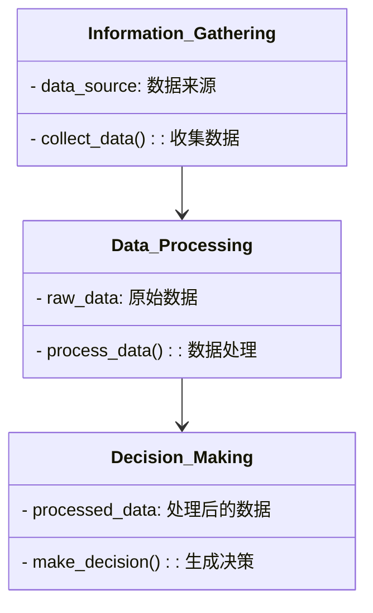
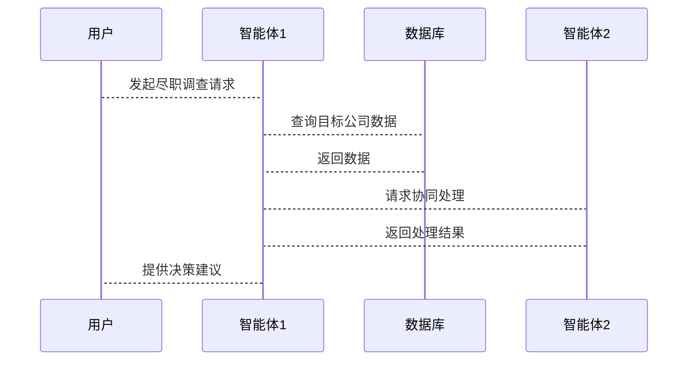

                 


# 基于多智能体的自动化尽职调查系统在价值投资中的应用

> 关键词：多智能体系统、自动化尽职调查、价值投资、协同算法、系统架构

> 摘要：本文探讨了基于多智能体的自动化尽职调查系统在价值投资中的应用。通过分析多智能体系统的原理，提出了一种创新的自动化尽职调查方法，利用多智能体协同算法优化投资决策流程，解决了传统尽职调查中的效率低下和信息不对称问题。本文还详细介绍了系统的架构设计和实现方案，为价值投资领域提供了新的思路。

---

# 第1章: 多智能体系统与尽职调查的背景介绍

## 1.1 问题背景与痛点分析

### 1.1.1 传统尽职调查的痛点
传统的尽职调查过程通常依赖于人工操作，存在以下问题：
- **效率低下**：人工收集和分析信息的速度较慢，尤其是在处理大量数据时。
- **信息不全**：由于人为疏忽，可能导致某些关键信息被遗漏。
- **成本高昂**：需要投入大量的人力和时间，增加了企业的运营成本。
- **主观性**：人为判断可能受到主观因素的影响，导致决策失误。

### 1.1.2 价值投资中的信息不对称问题
在价值投资中，投资者需要依赖高质量的信息来评估潜在投资目标的价值。然而，信息的不对称性使得投资者难以获取全面、准确的数据，从而影响投资决策的准确性。

### 1.1.3 自动化尽职调查的必要性
为了提高效率、降低成本并减少人为错误，自动化尽职调查系统应运而生。通过引入多智能体系统，可以实现信息的自动收集、分析和决策支持。

## 1.2 问题描述与目标
本文的目标是设计一个基于多智能体的自动化尽职调查系统，旨在：
- 提高尽职调查的效率和准确性。
- 解决传统尽职调查中的信息不对称问题。
- 为价值投资者提供更加可靠的投资决策支持。

## 1.3 核心概念与系统组成
### 1.3.1 多智能体系统的定义与特点
- **定义**：多智能体系统是指由多个相互作用的智能体组成的系统，每个智能体具有一定的自主性、反应性和协作性。
- **特点**：
  - 分布式：智能体之间独立运行，协同完成任务。
  - 协作性：智能体之间通过通信和协作完成共同目标。
  - 适应性：能够根据环境变化调整自身行为。

### 1.3.2 尽职调查的核心要素
- **信息收集**：收集目标公司的财务数据、市场信息等。
- **数据分析**：对收集到的信息进行处理和分析。
- **风险评估**：评估投资目标的风险和潜在收益。

### 1.3.3 系统组成与功能模块
- **信息采集模块**：负责从多个数据源采集信息。
- **数据处理模块**：对采集的数据进行清洗、转换和分析。
- **智能决策模块**：基于数据分析结果，生成决策建议。
- **通信模块**：实现智能体之间的信息交互。

## 1.4 本章小结
本章介绍了多智能体系统与尽职调查的背景，分析了传统尽职调查的痛点，并提出了基于多智能体的自动化尽职调查系统的必要性和目标。接下来，将深入探讨多智能体系统在尽职调查中的核心概念和应用。

---

# 第2章: 多智能体系统与自动化尽职调查的核心概念

## 2.1 多智能体系统的原理

### 2.1.1 多智能体系统的定义
多智能体系统是由多个智能体组成的系统，这些智能体通过协同工作完成特定任务。每个智能体都有自己的目标和行为规则，能够独立决策并与其他智能体进行通信。

### 2.1.2 多智能体系统的核心特征
- **自主性**：智能体能够自主决策，无需外部干预。
- **反应性**：智能体能够根据环境变化调整自身行为。
- **协作性**：智能体之间能够通过通信和协作完成共同目标。
- **分布式**：智能体分布在网络中，各自独立运行。

### 2.1.3 多智能体系统与单智能体系统的对比
| 特性 | 单智能体系统 | 多智能体系统 |
|------|--------------|--------------|
| 自主性 | 较低         | 高           |
| 反应性 | 较低         | 高           |
| 协作性 | 无           | 有           |
| 分布式 | 集中式       | 分布式       |

## 2.2 尽职调查的自动化流程

### 2.2.1 尽职调查的基本流程
- **信息收集**：从多个数据源收集目标公司的信息。
- **数据分析**：对收集到的数据进行处理和分析。
- **风险评估**：评估目标公司的风险和潜在收益。
- **决策支持**：基于分析结果提供投资建议。

### 2.2.2 自动化尽职调查的关键步骤
- **数据采集**：自动从数据库、互联网等来源获取信息。
- **数据清洗**：去除无效数据，确保数据质量。
- **数据分析**：利用算法对数据进行深度分析。
- **决策生成**：基于分析结果生成投资建议。

### 2.2.3 自动化与人工尽职调查的对比
| 特性 | 自动化尽职调查 | 人工尽职调查 |
|------|----------------|---------------|
| 效率 | 高             | 较低          |
| 准确性 | 高             | 中等          |
| 成本 | 低             | 高            |
| 信息量 | 全面           | 可能遗漏      |

## 2.3 多智能体系统在尽职调查中的应用

### 2.3.1 多智能体协同的基本原理
多智能体协同是指多个智能体通过通信和协作完成共同任务。每个智能体负责特定的任务模块，通过信息共享实现整体目标。

### 2.3.2 多智能体在尽职调查中的角色分配
- **数据采集智能体**：负责从不同数据源获取信息。
- **数据分析智能体**：对数据进行清洗、转换和分析。
- **决策支持智能体**：基于分析结果生成投资建议。
- **通信协调智能体**：负责智能体之间的信息传递和协调。

### 2.3.3 多智能体协同的优势与挑战
- **优势**：
  - 提高效率：多个智能体协同工作，加快数据处理速度。
  - 增强准确性：通过多个智能体的协作，减少人为错误。
- **挑战**：
  - 通信延迟：智能体之间的通信可能引入延迟。
  - 协同复杂性：需要设计高效的协同算法。

## 2.4 本章小结
本章详细介绍了多智能体系统的原理及其在尽职调查中的应用，分析了自动化尽职调查的关键步骤和优势。接下来，将深入探讨基于多智能体的自动化尽职调查系统的算法原理。

---

# 第3章: 基于多智能体的自动化尽职调查系统算法原理

## 3.1 多智能体协同算法概述

### 3.1.1 多智能体协同的基本算法
多智能体协同算法包括一致性算法和博弈论算法两类。一致性算法用于实现智能体之间的状态同步，而博弈论算法用于实现智能体之间的决策优化。

### 3.1.2 一致性算法
一致性算法的目标是让所有智能体达成一致的状态。常用的一致性算法包括：
- **Paxos算法**：用于分布式系统中的共识问题。
- **Raft算法**：一种更易理解的共识算法。

### 3.1.3 博弈论算法
博弈论算法用于多个智能体之间的决策优化。常用的方法包括：
- **纳什均衡**：一种稳定的决策状态，使得每个智能体都无法通过单方面改变策略而提高自身收益。
- **囚徒困境**：一种博弈论模型，用于分析智能体之间的合作与背叛问题。

## 3.2 多智能体协同算法的数学模型

### 3.2.1 一致性算法的数学模型
一致性算法的核心是通过智能体之间的通信，使所有智能体的状态达到一致。假设我们有一个由N个智能体组成的系统，每个智能体的状态表示为 \( s_i \)，目标是使所有智能体的状态 \( s_1, s_2, \dots, s_N \) 达到一致。

数学模型如下：
$$ \forall i, j \in \{1, 2, \dots, N\}, s_i = s_j $$

### 3.2.2 博弈论模型在多智能体决策中的应用
在博弈论模型中，智能体之间的决策可以通过纳什均衡来优化。假设我们有两个智能体A和B，分别选择策略 \( a \) 和 \( b \)。如果策略组合 \( (a, b) \) 是纳什均衡，则对于任何其他策略 \( a' \) 或 \( b' \)，智能体A和B都不会改变当前策略以提高自身收益。

数学模型如下：
$$ \text{如果 } a \text{ 是A的最佳策略在B选择 } b \text{ 的情况下，且同样对于B来说，} b \text{ 是最佳策略在A选择 } a \text{ 的情况下，则 } (a, b) \text{ 是纳什均衡} $$

## 3.3 算法实现与代码示例

### 3.3.1 环境安装与配置
为了实现多智能体协同算法，我们需要安装以下工具和库：
- **Python**：用于编程。
- **numpy**：用于数值计算。
- **networkx**：用于网络图的绘制。

### 3.3.2 多智能体协同算法的Python实现
以下是基于一致性算法的Python实现示例：

```python
import numpy as np
import networkx as nx

class MultiAgentSystem:
    def __init__(self, num_agents):
        self.num_agents = num_agents
        self.states = np.random.rand(num_agents)  # 初始化智能体状态

    def reach_consensus(self, max_iter=100, threshold=1e-6):
        for _ in range(max_iter):
            new_states = []
            for i in range(self.num_agents):
                # 假设每个智能体只与前一个智能体通信
                if i == 0:
                    new_state = self.states[i]
                else:
                    new_state = (self.states[i-1] + self.states[i])/2
                new_states.append(new_state)
            # 检查是否收敛
            if np.std(new_states) < threshold:
                self.states = new_states
                break
            self.states = new_states
        return self.states

# 示例
mas = MultiAgentSystem(5)
states = mas.reach_consensus()
print(states)
```

### 3.3.3 代码解读与优化建议
上述代码实现了基于一致性算法的多智能体系统，通过迭代计算使所有智能体的状态达到一致。代码的主要部分包括：
1. **初始化**：创建多个智能体，并随机初始化它们的状态。
2. **一致性计算**：通过迭代计算使所有智能体的状态逐步趋同。
3. **收敛判断**：当状态的标准差小于阈值时，认为系统已经收敛。

优化建议：
- 使用更高效的算法（如Raft算法）来提高一致性计算的效率。
- 增加通信策略，如让每个智能体与多个其他智能体通信以减少收敛时间。

## 3.4 本章小结
本章详细介绍了多智能体协同算法的原理，并通过Python代码展示了算法的实现。接下来，将探讨系统的架构设计和实现方案。

---

# 第4章: 系统分析与架构设计

## 4.1 系统应用场景
基于多智能体的自动化尽职调查系统主要应用于价值投资领域，特别是在以下几个场景中：
- **股票投资**：对目标公司的财务数据进行分析，评估其投资价值。
- **风险评估**：识别潜在投资目标中的风险因素。
- **市场分析**：对市场趋势进行预测和分析。

## 4.2 系统功能设计

### 4.2.1 领域模型设计
以下是系统的领域模型设计图：



### 4.2.2 系统架构设计
以下是系统的架构设计图：

```mermaid
containerDiagram
    container Database {
        数据存储
    }
    container Agent_1 {
        智能体1
    }
    container Agent_2 {
        智能体2
    }
    container Agent_3 {
        智能体3
    }
    Database --> Agent_1
    Database --> Agent_2
    Database --> Agent_3
```

### 4.2.3 系统接口设计
系统的接口设计包括：
- 数据接口：与数据库和其他数据源的接口。
- 通信接口：智能体之间的通信接口。
- 用户接口：供用户输入指令和查看结果的接口。

### 4.2.4 系统交互流程
以下是系统的交互流程图：



## 4.3 本章小结
本章分析了系统的应用场景，并详细设计了系统的功能模块、架构和交互流程。接下来，将通过实际案例展示系统的实现和应用。

---

# 第5章: 项目实战

## 5.1 环境搭建与核心代码实现

### 5.1.1 环境安装
安装所需的库：
```bash
pip install numpy pandas matplotlib networkx
```

### 5.1.2 核心代码实现
以下是系统的实现代码：

```python
import numpy as np
import networkx as nx
import matplotlib.pyplot as plt

class Agent:
    def __init__(self, id):
        self.id = id
        self.data = None

    def collect_data(self, data_source):
        self.data = data_source.get_data()

    def process_data(self):
        if self.data is not None:
            return self.data.mean()
        else:
            return 0

class DataSource:
    def __init__(self):
        self.data = np.random.rand(100, 5)  # 示例数据

    def get_data(self):
        return self.data

# 初始化系统
agents = [Agent(i) for i in range(3)]
data_source = DataSource()

# 数据采集
for agent in agents:
    agent.collect_data(data_source)

# 数据处理与协同
for agent in agents:
    print(f"Agent {agent.id} 的数据处理结果：{agent.process_data()}")

# 可视化
G = nx.Graph()
G.add_nodes_from([agent.id for agent in agents])
nx.draw(G, node_size=500, node_color='blue')
plt.show()
```

### 5.1.3 代码解读
- **Agent类**：表示一个多智能体，具有数据采集和处理功能。
- **DataSource类**：提供数据源，生成随机数据。
- **主程序**：初始化多个智能体，调用数据采集和处理功能，并可视化智能体的网络结构。

## 5.2 案例分析与实际应用

### 5.2.1 案例分析
假设我们有一个价值投资案例，目标是评估某家科技公司的投资价值。通过系统的实现，我们可以自动化地收集和分析该公司的财务数据、市场表现等信息，生成投资建议。

### 5.2.2 实际应用
在实际应用中，系统可以实时监控市场动态，自动调整投资策略。例如：
- 当目标公司的财务数据出现异常时，系统会自动发出警报。
- 根据市场趋势，系统会调整投资组合，优化投资收益。

## 5.3 系统优化与改进

### 5.3.1 性能优化
- 使用更高效的算法，如分布式一致性算法，提高系统的计算效率。
- 增加缓存机制，减少数据重复处理。

### 5.3.2 功能扩展
- 增加风险预警功能，实时监控投资风险。
- 支持多语言接口，方便不同用户的使用。

## 5.4 本章小结
本章通过实际案例展示了系统的实现和应用，并提出了优化和改进的建议。接下来，将总结全文并展望未来的发展方向。

---

# 第6章: 总结与展望

## 6.1 总结
本文探讨了基于多智能体的自动化尽职调查系统在价值投资中的应用。通过分析多智能体系统的原理，提出了自动化尽职调查的方法，并详细介绍了系统的算法原理、架构设计和实现方案。通过实际案例展示了系统的应用，并提出了优化建议。

## 6.2 应用价值与未来展望
基于多智能体的自动化尽职调查系统在价值投资中的应用具有重要意义。它不仅可以提高尽职调查的效率和准确性，还可以降低投资成本，为投资者提供更加可靠的投资决策支持。未来，随着人工智能和大数据技术的不断发展，多智能体系统将在价值投资领域发挥更大的作用。

---

# 作者：AI天才研究院/AI Genius Institute & 禅与计算机程序设计艺术 /Zen And The Art of Computer Programming

