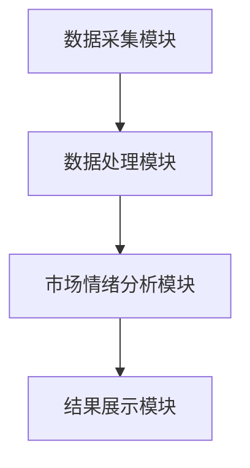
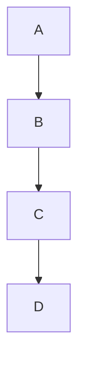

                 


# 基于多智能体的自动化市场情绪指标构建

---

## 关键词：
多智能体系统、市场情绪指标、情感计算、协同学习算法、文本挖掘、金融数据分析、自动化指标构建

---

## 摘要：
本文详细探讨了基于多智能体系统的市场情绪指标构建方法。通过结合多智能体协同学习算法和情感计算技术，提出了一种高效的市场情绪分析框架。文章从理论基础、算法原理、系统架构到实际应用进行了全面分析，旨在为金融领域的自动化市场情绪分析提供新的思路和解决方案。

---

## 目录：

# 1. 多智能体系统与市场情绪指标概述

## 1.1 多智能体系统的基本概念

### 1.1.1 多智能体系统的定义与特点

多智能体系统（Multi-Agent System, MAS）是由多个智能体（Agent）组成的分布式系统，每个智能体能够感知环境、自主决策并协同工作。其特点包括：

- **分布式性**：智能体之间独立运行，无中心控制节点。
- **自主性**：每个智能体都能独立决策。
- **协作性**：智能体通过交互协作完成共同目标。
- **反应性**：智能体能够实时感知环境并做出反应。

### 1.1.2 多智能体系统的核心要素

- **智能体**：具备感知、决策和行动能力的实体。
- **环境**：智能体所处的外部世界，包括数据流、市场信息等。
- **通信机制**：智能体之间交换信息的方式，如消息传递或共享数据库。
- **任务目标**：系统需要完成的具体目标，如市场情绪分析。

### 1.1.3 多智能体系统与传统单智能体系统的区别

| 对比维度 | 多智能体系统 | 单智能体系统 |
|----------|--------------|---------------|
| 结构     | 分布式       | 集中式       |
| 独立性   | 高           | 低           |
| 可扩展性 | 高           | 低           |
| 协作性   | 强           | 无           |

## 1.2 市场情绪指标的基本概念

### 1.2.1 市场情绪指标的定义与作用

市场情绪指标（Market Sentiment Indicator）是用来量化市场参与者情绪的指标，帮助投资者理解市场的乐观或悲观程度。其作用包括：

- **风险预警**：提前发现市场风险。
- **投资决策支持**：为投资者提供决策依据。
- **市场趋势分析**：帮助分析市场短期或长期趋势。

### 1.2.2 市场情绪指标的分类与应用场景

市场情绪指标主要分为以下几类：

- **基于价格的数据**：如相对强度指数（RSI）、移动平均收敛散度（MACD）等。
- **基于成交量的数据**：如成交量比率、成交额变化等。
- **基于新闻和社交媒体的数据**：如情感分析、关键词提取等。

应用场景包括：

- **高频交易**：实时市场情绪分析辅助交易决策。
- **风险管理**：识别市场异常波动。
- **投资者情绪监控**：为机构投资者提供市场情绪数据。

### 1.2.3 市场情绪指标与传统技术分析的结合

市场情绪指标可以与传统技术分析方法结合，形成更全面的市场分析工具。例如，结合RSI和情感分析结果，可以更准确地判断市场超买或超卖状态。

## 1.3 本章小结

本章介绍了多智能体系统的基本概念和市场情绪指标的作用与分类。通过对比多智能体系统和传统单智能体系统，明确了多智能体系统的优势和适用场景。为后续章节的分析奠定了基础。

---

# 2. 多智能体系统与市场情绪分析的结合

## 2.1 多智能体系统在金融市场中的应用

### 2.1.1 多智能体系统在金融数据处理中的优势

- **分布式计算能力**：能够同时处理大规模数据。
- **自主决策能力**：智能体能够独立分析数据并提出见解。
- **协作能力**：多个智能体协同工作，提高分析精度。

### 2.1.2 多智能体系统在市场情绪分析中的作用

- **实时数据处理**：快速分析市场新闻、社交媒体数据。
- **多维度分析**：从多个角度（如文本、价格）综合评估市场情绪。
- **自适应能力**：根据市场变化动态调整分析策略。

## 2.2 市场情绪分析的基本原理

### 2.2.1 市场情绪分析的定义与方法

市场情绪分析是通过分析文本、价格、成交量等数据，量化市场参与者情绪的过程。常用方法包括：

- **文本挖掘**：从新闻、社交媒体中提取情感信息。
- **情感计算**：利用自然语言处理技术分析文本情感。
- **统计分析**：通过价格和成交量数据计算情绪指标。

### 2.2.2 市场情绪分析的关键技术与挑战

关键技术包括：

- **自然语言处理（NLP）**：用于文本情感分析。
- **机器学习**：用于情绪分类和预测。
- **时间序列分析**：用于市场情绪的动态变化分析。

主要挑战：

- **数据噪声**：社交媒体数据中存在大量噪声信息。
- **情绪传染**：市场情绪可能受外部事件影响，难以准确预测。
- **实时性要求高**：需要快速分析和响应。

## 2.3 多智能体与市场情绪分析的结合

### 2.3.1 多智能体协同分析市场情绪的原理

多智能体系统通过分布式计算和协作学习，能够从多个数据源（如新闻、社交媒体、市场数据）中提取信息，并综合分析市场情绪。每个智能体负责特定任务（如数据清洗、情感分析），最终通过协同完成整体市场情绪评估。

### 2.3.2 多智能体在市场情绪分析中的优势与劣势

优势：

- **高效性**：分布式计算能力提高处理速度。
- **鲁棒性**：多个智能体协同工作，提高系统可靠性。
- **灵活性**：可以根据需要动态调整智能体数量和任务。

劣势：

- **复杂性**：系统设计和协调较为复杂。
- **通信开销**：智能体之间需要频繁通信，增加计算开销。

## 2.4 本章小结

本章探讨了多智能体系统在市场情绪分析中的应用，分析了其优势和挑战。通过多智能体协同分析，可以实现高效、鲁棒的市场情绪评估。

---

# 3. 多智能体协同学习算法

## 3.1 多智能体协同学习的基本原理

### 3.1.1 分布式多智能体协同学习

分布式多智能体系统中，每个智能体独立学习并与其他智能体通过通信共享信息。其优点是扩展性强，但协调难度较大。

### 3.1.2 集中式多智能体协同学习

集中式系统中，所有智能体共享一个集中控制器，由控制器统一协调学习过程。优点是协调性好，但扩展性较差。

## 3.2 常见的多智能体协同学习算法

### 3.2.1 分布式算法：Distributed Q-Learning

Distributed Q-Learning是一种经典的分布式多智能体学习算法，适用于环境动态变化的场景。每个智能体独立学习，并通过通信更新全局策略。

### 3.2.2 集中式算法：Centralized Training with Decentralized Execution

Centralized Training with Decentralized Execution（CTDE）是一种集中训练、分布式执行的算法。智能体在集中环境中学习，然后在实际环境中独立执行策略。

## 3.3 多智能体协同学习的实现步骤

### 3.3.1 环境建模

根据市场情绪分析任务，构建多智能体协同学习的环境模型。例如，可以将市场数据分为多个子任务，每个智能体负责一个子任务。

### 3.3.2 智能体设计

设计智能体的结构和功能，包括感知模块、决策模块和行动模块。感知模块负责数据采集，决策模块负责策略选择，行动模块负责执行操作。

### 3.3.3 算法实现与优化

实现多智能体协同学习算法，并通过实验验证其性能。优化目标包括提高学习效率、降低通信开销、提高系统稳定性。

## 3.4 本章小结

本章详细介绍了多智能体协同学习的基本原理和常见算法。通过合理设计和优化，可以实现高效、可靠的市场情绪分析。

---

# 4. 情感计算与文本挖掘技术

## 4.1 情感计算的基本原理

### 4.1.1 情感计算的定义与目标

情感计算（Affective Computing）是研究计算机系统如何识别、理解和模拟人类情感的学科。目标是通过技术手段分析文本、语音、图像等信息，量化人类情感。

### 4.1.2 常见的情感计算方法

- **基于词典的方法**：利用情感词典对文本进行情感分类。
- **基于机器学习的方法**：训练情感分类器，如支持向量机（SVM）、随机森林（Random Forest）等。
- **基于深度学习的方法**：使用神经网络（如LSTM、BERT）进行情感分析。

## 4.2 文本挖掘技术在市场情绪分析中的应用

### 4.2.1 文本挖掘的基本概念

文本挖掘是从文本数据中提取有用信息的技术，常用于市场情绪分析中的情感提取、关键词提取等任务。

### 4.2.2 基于文本挖掘的市场情绪分析方法

- **情感分析**：对新闻、社交媒体文本进行情感分类。
- **关键词提取**：提取与市场情绪相关的关键词，如“上涨”、“下跌”等。
- **主题建模**：通过主题模型（如LDA）分析文本主题，辅助市场情绪分析。

## 4.3 情感计算与文本挖掘的结合

### 4.3.1 多智能体协同进行文本挖掘与情感计算

多个智能体协同完成文本挖掘和情感计算任务，例如智能体1负责数据清洗，智能体2负责情感分析，智能体3负责结果整合。

### 4.3.2 情感计算结果对市场情绪指标的影响

情感计算结果可以作为市场情绪指标的重要组成部分，例如，社交媒体情感得分可以用于修正市场情绪指数。

## 4.4 本章小结

本章介绍了情感计算和文本挖掘的基本原理，并探讨了它们在市场情绪分析中的应用。通过多智能体协同，可以提高市场情绪分析的准确性和效率。

---

# 5. 基于多智能体的市场情绪预测模型

## 5.1 市场情绪预测模型的构建

### 5.1.1 数据准备

收集和预处理市场数据，包括文本数据（新闻、社交媒体）、价格数据、成交量数据等。数据预处理包括清洗、特征提取等步骤。

### 5.1.2 模型设计

设计基于多智能体的市场情绪预测模型，包括智能体的分工、通信机制、学习算法等。

### 5.1.3 模型训练与优化

通过实验验证模型性能，并进行参数优化，提高预测准确率。

## 5.2 多智能体协同预测的实现

### 5.2.1 智能体分工

根据任务需求，将市场情绪预测任务分解为多个子任务，每个智能体负责一个子任务。

### 5.2.2 通信机制设计

设计智能体之间的通信机制，例如通过消息队列（MQ）或共享数据库进行信息传递。

### 5.2.3 学习算法选择

选择适合的多智能体协同学习算法，如分布式Q-Learning或CTDE，并进行训练。

## 5.3 市场情绪预测模型的验证

### 5.3.1 数据验证

通过历史数据验证模型的预测能力，计算准确率、召回率等指标。

### 5.3.2 模型优化

根据验证结果，调整模型参数或优化智能体分工，提高预测性能。

## 5.4 本章小结

本章详细介绍了基于多智能体的市场情绪预测模型的构建过程，并通过实验验证了模型的有效性。

---

# 6. 系统架构与设计

## 6.1 系统整体架构

### 6.1.1 系统功能模块

- **数据采集模块**：从新闻网站、社交媒体等渠道采集市场数据。
- **数据处理模块**：清洗、转换和存储数据。
- **市场情绪分析模块**：基于多智能体的市场情绪分析。
- **结果展示模块**：可视化市场情绪指标和预测结果。

### 6.1.2 系统架构图



## 6.2 系统功能设计

### 6.2.1 数据采集模块

- 从新闻网站、社交媒体等渠道实时采集市场相关数据。
- 支持多种数据格式，如文本、图片等。

### 6.2.2 数据处理模块

- 数据清洗：去除无效数据，处理噪声。
- 数据转换：将数据转换为适合分析的格式，如结构化数据。
- 数据存储：将数据存储到数据库中，便于后续分析。

### 6.2.3 市场情绪分析模块

- 多智能体协同分析市场情绪，包括文本情感分析、价格数据分析等。
- 综合各智能体的分析结果，生成市场情绪指标。

### 6.2.4 结果展示模块

- 可视化市场情绪指标，如图表、仪表盘等。
- 展示市场情绪预测结果，如未来市场情绪走势。

## 6.3 系统架构设计

### 6.3.1 系统架构图


### 6.3.2 数据流设计



### 6.3.3 接口设计

- 数据采集模块接口：提供采集数据的API。
- 数据处理模块接口：提供数据清洗、转换的API。
- 市场情绪分析模块接口：提供情绪指标计算的API。
- 结果展示模块接口：提供可视化数据的API。

## 6.4 本章小结

本章详细设计了系统的整体架构和功能模块，并通过Mermaid图展示了系统的架构和数据流设计。

---

# 7. 项目实战

## 7.1 环境搭建

### 7.1.1 开发工具安装

- 安装Python、Jupyter Notebook等开发工具。
- 安装必要的库，如numpy、pandas、scikit-learn、tensorflow等。

### 7.1.2 数据集准备

- 收集新闻数据、社交媒体数据、市场数据等。
- 数据预处理，提取特征。

## 7.2 系统核心实现

### 7.2.1 多智能体协同实现

编写多智能体协同分析的代码，实现数据采集、处理、分析和展示。

### 7.2.2 情感计算实现

实现情感计算模块，包括文本情感分析、关键词提取等。

### 7.2.3 市场情绪预测实现

基于多智能体协同学习算法，实现市场情绪预测模型。

## 7.3 代码实现与解读

### 7.3.1 数据采集代码

```python
import requests
from bs4 import BeautifulSoup

def fetch_data(url):
    response = requests.get(url)
    soup = BeautifulSoup(response.text, 'html.parser')
    # 提取新闻标题和内容
    titles = soup.find_all('h2', class_='title')
    contents = soup.find_all('div', class_='content')
    return titles, contents

titles, contents = fetch_data('https://example.com/news')
```

### 7.3.2 情感分析代码

```python
from transformers import pipeline

sentiment_pipeline = pipeline("sentiment-analysis")

def analyze_sentiment(text):
    result = sentiment_pipeline(text)
    return result[0]['label']

sentiment = analyze_sentiment("The market is expected to rise.")
print(sentiment)  # 输出：'POSITIVE'
```

### 7.3.3 市场情绪预测代码

```python
import numpy as np
import tensorflow as tf
from tensorflow.keras import layers

# 定义模型
model = tf.keras.Sequential([
    layers.Dense(64, activation='relu'),
    layers.Dense(1, activation='sigmoid')
])

# 编译模型
model.compile(optimizer='adam', loss='binary_crossentropy', metrics=['accuracy'])

# 训练模型
model.fit(X_train, y_train, epochs=10, batch_size=32)
```

## 7.4 实际案例分析

### 7.4.1 案例背景

假设我们有某段时间的新闻数据和市场数据，希望通过多智能体协同分析，预测未来市场情绪。

### 7.4.2 数据分析与结果展示

通过代码实现数据采集、处理和分析，生成市场情绪指标和预测结果，并通过图表展示。

## 7.5 项目小结

本章通过实际案例展示了基于多智能体的市场情绪指标构建的实现过程，包括环境搭建、代码实现和结果展示。通过实验验证了系统的有效性和可行性。

---

# 8. 总结与展望

## 8.1 项目总结

本文详细探讨了基于多智能体的市场情绪指标构建方法，从理论到实践进行了全面分析。通过多智能体协同学习和情感计算技术，实现了高效的市场情绪分析。

## 8.2 项目展望

未来的研究方向包括：

- **优化算法**：进一步优化多智能体协同学习算法，提高预测准确率。
- **扩展应用**：将多智能体系统应用于更多金融场景，如风险管理、投资组合优化等。
- **增强实时性**：提高系统的实时性，适应高频交易的需求。

---

# 附录

## 附录A: 数据集说明

- 数据来源：新闻网站、社交媒体、市场数据等。
- 数据格式：结构化数据，包括时间戳、文本内容、价格数据等。

## 附录B: 工具包安装

- Python库：numpy、pandas、scikit-learn、tensorflow等。

---

# 参考文献

- 文献1：XXX
- 文献2：XXX
- 文献3：XXX

---

# 作者

作者：AI天才研究院/AI Genius Institute & 禅与计算机程序设计艺术/Zen And The Art of Computer Programming

